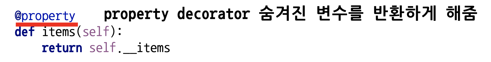
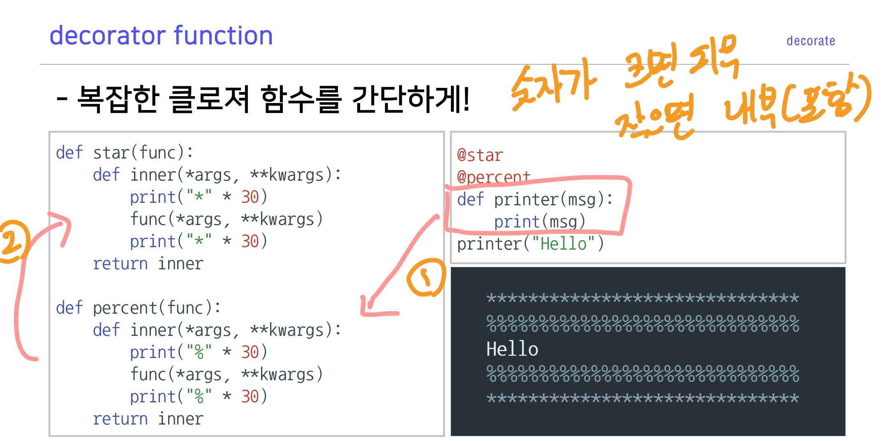
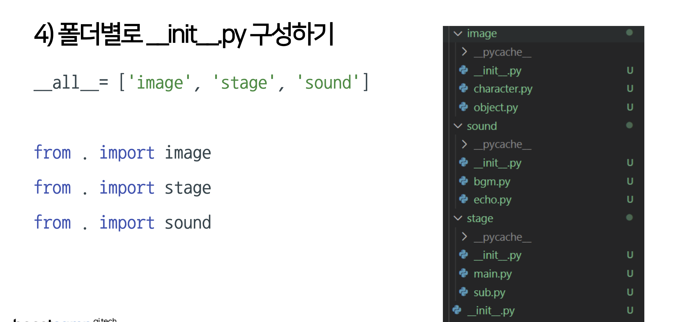

# Day 3 ( Python basic for AI 4강 ~ 5강 / AI Math 7 ~ 9 강)

## 목차 

1. [강의 내용 정리](#1-강의-내용-정리)
2. [과제 수행 과정 / 결과물 정리](#2-과제-수행-과정--결과물-정리)
3. [피어세션 정리](#3-피어세션-정리)
4. [학습 회고](#4-학습-회고)

----

### 1. 강의 내용 정리

* Python basic for AI 4강 ~ 5강
    * 4-1강 : Python Object Oriented Programming
        * OOP(Object Oriented Programming) : 객체지향 프로그램으로 실제 세상을 모델링한다(현실의 특징을 코드에 반영) 라는 철학이 있다.  
         

        * Object in python 
        &nbsp; - &nbsp;class  
        &nbsp;&nbsp;&nbsp;&nbsp; ‣ &nbsp; 객체를 만들기 위한 틀 
        &nbsp;&nbsp;&nbsp;&nbsp; ‣ &nbsp; 속성(Attribute)와 행동(Action)으로 구성이 된다. 
        &nbsp; - &nbsp;instance(객체) : 클래스를 통해서 만들어진 것  
        &nbsp; - &nbsp;클래스 정의 
        &nbsp;&nbsp;&nbsp;&nbsp; ‣ &nbsp; class 클래스 이름(상속받을 class 이름): 
        &nbsp;&nbsp;&nbsp;&nbsp; &nbsp; &nbsp;&nbsp;&nbsp;&nbsp;&nbsp;&nbsp;&nbsp; def __ init __(self): 
        &nbsp;&nbsp;&nbsp;&nbsp;&nbsp;&nbsp;&nbsp; * &nbsp; class의 기본 정의는 위와 같다. 그리고 이때 클래스명은 CamelCase형식으로 지어주면 좋다(함수나 변수는 snake_case로 명명해주면 좋다).
         
        &nbsp;&nbsp;&nbsp;&nbsp; ‣ &nbsp; __ init __ 은 객체 초기화를 위한 함수이다. 
        &nbsp;&nbsp;&nbsp;&nbsp;&nbsp;&nbsp;&nbsp; * &nbsp; __ 은 특수한 예약 함수나 변수 그리고 함수명 변경(맨글링)으로 사용된다.  
        &nbsp;&nbsp;&nbsp;&nbsp;&nbsp;&nbsp;&nbsp; * &nbsp; ex) __ main __, __ add __, __ str __, __ eq __ 등이 있다. [더 자세한 내용은 여기를 참고하기.](https://corikachu.github.io/articles/python/python-magic-method)  
         &nbsp;&nbsp;&nbsp;&nbsp; ‣ &nbsp; method 추가방법은 기존 함수와 같으나 파라미터에 self를 추가해줘야 한다. 이때 self는 생성된 instance 자신을 의미한다. 
         
          

        * OOP 특징 - 상속, 다형성, 가시성 
        &nbsp; - &nbsp;상속  
        &nbsp;&nbsp;&nbsp;&nbsp; ‣ &nbsp; 부모클래스로부터 속성과 메소드를 물려받는 것을 말한다. 
        &nbsp; - &nbsp;다형성  
        &nbsp;&nbsp;&nbsp;&nbsp; ‣ &nbsp; 같은 이름의 메소드의 내부 로직을 다르게 작성 -> 같은 부모의 상속을 받은 클래스 여러개를 만들고 해당 메소드에 다른 로직을 작성하면 각 자식 객체의 인스턴스는 다르게 동작한다. 
        &nbsp; - &nbsp;가시성  
        &nbsp;&nbsp;&nbsp;&nbsp; ‣ &nbsp; 객체의 정보를 볼 수 있는 레벨을 조절하는 것(캡슐화, 정보은닉) 
        &nbsp;&nbsp;&nbsp;&nbsp; ‣ &nbsp; 변수명 앞에 __ 을 해주면 Private 변수로 선언되어 접근하지 못 함 
        &nbsp;&nbsp;&nbsp;&nbsp; ‣ &nbsp; private로 선언된 변수를 반환해주기 위해서 @propoerty라는 데코레이트를 이용하여 반환해준다.  
        &nbsp;&nbsp;&nbsp;&nbsp;&nbsp;&nbsp;&nbsp; * &nbsp; ex) item 메소드를 통해서 반환받기 
        
          

        * decorate를 위해하기 위한 개념들 
        &nbsp; - &nbsp;일급객체 
        &nbsp;&nbsp;&nbsp;&nbsp; ‣ &nbsp; 변수나 데이터 구조에 할당이 가능한 객체 
        &nbsp;&nbsp;&nbsp;&nbsp; ‣ &nbsp; 파라메터로 전달이 가능 + 리턴 값으로 사용 
        &nbsp;&nbsp;&nbsp;&nbsp;&nbsp;&nbsp;&nbsp; * &nbsp; ex) map이나 reduce함수 
        &nbsp; - &nbsp;inner function  
        &nbsp;&nbsp;&nbsp;&nbsp; ‣ &nbsp; 함수 내에 또 다른 함수가 존재 
        &nbsp; - &nbsp;closures 
        &nbsp;&nbsp;&nbsp;&nbsp; ‣ &nbsp; innder function을 return값으로 반환한 것 
        &nbsp;&nbsp;&nbsp;&nbsp;&nbsp;&nbsp;&nbsp; * &nbsp; 궁금한 것 : inner function의 함수와 변수 정보를 어떻게 저장하고 있을까? list와 같이 주소 덩어리? 
        &nbsp;&nbsp;&nbsp;&nbsp;&nbsp;&nbsp;&nbsp; * &nbsp; @(데코레이트)을 이용하면 복잡한 클로져 함수를 간단하게 만들 수 있다(그런데 내눈에는 아직도 복잡해 보인다 ;;). 
        
          

    * 4-2강 : Module and Project
        * Module 
        &nbsp; - &nbsp;프로그램에서 특정 기능을 수행하는 작은 단위(개인적인 생각) 
        &nbsp; - &nbsp;모듈화를 통해서 재사용성을 높일 수 있다.<br 

            
       * 패키지 
        &nbsp; - &nbsp;모듈을 모아놓은 단위, 하나의 프로그램 
        &nbsp;&nbsp;&nbsp;&nbsp;&nbsp;&nbsp;&nbsp; * &nbsp; 패키지 구현시 폴더별로 __ init __ .py 만들고 안에 __ all__ 맨글링으로 사용할 하위 모듈(디렉토리) 이름 리스트와 'from . import 모듈 이름' 넣어준다.  
        &nbsp;&nbsp;&nbsp;&nbsp;&nbsp;&nbsp;&nbsp; * &nbsp; ex) 
        
         

        * 가상환경 
        &nbsp; - &nbsp;프로젝트 진행 시 필요한 패키지만 설치하는 환경  
        &nbsp; - &nbsp;anaconda로 가상환경 만들고 사용하는 법 
        &nbsp;&nbsp;&nbsp;&nbsp; ‣ &nbsp; 생성 : conda create -n 가상환경_이름 파이썬버전 
        &nbsp;&nbsp;&nbsp;&nbsp; ‣ &nbsp; 가상환경 호출 : conda activate 가상환경_이름 
        &nbsp;&nbsp;&nbsp;&nbsp; ‣ &nbsp; 가상환경 해제 : conda deactivate 
          

       
    * 5-1강 : File / Exception / Log Handling
        * Exception - 시퀀스 자료형으로 문자형 data를 메모리에 저장  
        &nbsp; - &nbsp;종류  
        &nbsp;&nbsp;&nbsp;&nbsp; ‣ &nbsp; 예상 가능한 예외 
        &nbsp;&nbsp;&nbsp;&nbsp;&nbsp;&nbsp;&nbsp;&nbsp; - &nbsp; 발생여부를 사전에 인지할 수 있는 예외 
        &nbsp;&nbsp;&nbsp;&nbsp;&nbsp;&nbsp;&nbsp;&nbsp; - &nbsp; 예를 들어서 사용자의 잘못된 입력, 파일 호출 시 파일 없음 등과 같은 상황 
        &nbsp;&nbsp;&nbsp;&nbsp;&nbsp;&nbsp;&nbsp;&nbsp;&nbsp;&nbsp;&nbsp;&nbsp; => &nbsp; 개발자가 if나 except를 통해서 예외처리를 해줘야 한다. 
        &nbsp;&nbsp;&nbsp;&nbsp; ‣ &nbsp; 예상이 불가능한 예외 
        &nbsp;&nbsp;&nbsp;&nbsp;&nbsp;&nbsp;&nbsp;&nbsp; - &nbsp; 인터프리터 과정에서 발생하는 예외, 개발자 실수, 논리적 오류 등 
        &nbsp;&nbsp;&nbsp;&nbsp;&nbsp;&nbsp;&nbsp;&nbsp; - &nbsp; 예를 들어서 리스트의 범위를 넘어가는 index에 접근한다거나 어떤수를 정수 0으로 나누는 행위 
        &nbsp; - &nbsp;예외처리(Exception Handling) 
        &nbsp;&nbsp;&nbsp;&nbsp; ‣ &nbsp; try ~ except 문법 사용 
        &nbsp;&nbsp;&nbsp;&nbsp;&nbsp;&nbsp;&nbsp;&nbsp; - &nbsp; try 범위 안에는 예외 발생 가능한 코드를 넣고 except 범위에는 예외 발생시 대응하는 코드를 넣으면 된다. 이때 (except exception type)과 예외 타입을 정해줄 수 있고 이때는 해당 예외 발생시 예외처리 코드를 수행한다. 
        &nbsp;&nbsp;&nbsp;&nbsp; ‣ &nbsp; try ~ except  ~ else 문법 사용 
        &nbsp;&nbsp;&nbsp;&nbsp;&nbsp;&nbsp;&nbsp;&nbsp; - &nbsp; try ~ except에 else를 추가한 구문으로 예외가 발생하지 않았을 경우 else부분의 코드가 실행된다. 
        &nbsp;&nbsp;&nbsp;&nbsp; ‣ &nbsp; try ~ except  ~ finally 문법 사용 
        &nbsp;&nbsp;&nbsp;&nbsp;&nbsp;&nbsp;&nbsp;&nbsp; - &nbsp; try ~ except에 finally를 추가한 구문으로 예외가 발생여부와 상관없이 실행되는 코드부분이다. 
        &nbsp;&nbsp;&nbsp;&nbsp; ‣ &nbsp; raise 예외 타입 
        &nbsp;&nbsp;&nbsp;&nbsp;&nbsp;&nbsp;&nbsp;&nbsp; - &nbsp; 강제로 exception을 발생. 
        &nbsp;&nbsp;&nbsp;&nbsp; ‣ &nbsp; assert 예외조건 
        &nbsp;&nbsp;&nbsp;&nbsp;&nbsp;&nbsp;&nbsp;&nbsp; - &nbsp; 특정 조건에 만족하지 않을 경우 예외 발생  

        * File Handling 
        &nbsp; - &nbsp;open : 파일 처리를 위한 함수로 읽기/쓰기/추가 모드가 있다.  
        &nbsp;&nbsp;&nbsp;&nbsp; * &nbsp; 일반적으로 open을 하여 사용한 다음 마지막에 close를 통해서 닫아줘야 한다. 이 과정이 귀찮다면 with구문과 함계 open을 사용하면 된다. 
        &nbsp;&nbsp;&nbsp;&nbsp;&nbsp;&nbsp;&nbsp;&nbsp; * &nbsp; with 구문이란 - 주말에 찾아보기 ㅎㅎ 
        &nbsp;&nbsp;&nbsp;&nbsp; ‣ &nbsp; read() : 파일 전체의 데이터를 읽어들인다. 
        &nbsp;&nbsp;&nbsp;&nbsp; ‣ &nbsp; readline() : 파일 1줄을 읽어들인다.(개행전까지) 
        &nbsp;&nbsp;&nbsp;&nbsp; ‣ &nbsp; 쓰기모드 때 encoding 형식을 지정 해줄 수 있다. 
        &nbsp; - &nbsp;Pickle 
        &nbsp;&nbsp;&nbsp;&nbsp; ‣ &nbsp; 파이썬의 객체를 영속화하는 built-in 객체이다. 
        &nbsp;&nbsp;&nbsp;&nbsp;&nbsp;&nbsp;&nbsp;&nbsp; * &nbsp; RCE(Remote Code Execute)공격이 가능하므로 인터넷으로 모르는 사람의 pickle을 다운받을때 조심하도록 해야 한다. 
        &nbsp;&nbsp;&nbsp;&nbsp;&nbsp;&nbsp;&nbsp;&nbsp;[pickle_취약점](https://watchout31337.tistory.com/167) 
          

        * Logging Handling 
        &nbsp; - &nbsp;로그를 남기는 이유  
        &nbsp;&nbsp;&nbsp;&nbsp; ‣ &nbsp; 프로그램이 실행되는 동안 일어나는 정보를 기록함으로써 문제 발생시 참고할 수 있는 자료로 유용하게 쓰일 수 있다. 
        &nbsp;&nbsp;&nbsp;&nbsp; ‣ &nbsp; 로그 기록은 실행시점에 남겨야 하는 기록과 개발시점에서 남겨야하는 기록으로 나눠진다. 
        &nbsp; - &nbsp;로그 레벨  
        &nbsp;&nbsp;&nbsp;&nbsp; ‣ &nbsp; DEBUG -> INFO -> WARNING -> ERROR -> CRITICAL 순서대로 레벨이 낮아진다(낮을수록 유저도 알아야하는 정보에 가깝다). 
        &nbsp;&nbsp;&nbsp;&nbsp; ‣ &nbsp; logging.StreamHandler는 log level이 warning으로 설정이 되어있다. 
        &nbsp;&nbsp;&nbsp;&nbsp; ‣ &nbsp; 셋팅된 레벨이하의 로그들을 출력해 준다. 아래의 예시는 기본레벨 셋팅으로 되어있다. 
        
        {: width="50" height="50"}
        
          

        * Tuple - 값의 변경이 불가능한 리스트 
        &nbsp; - &nbsp;(&nbsp;)을 이용하여 선언  
        &nbsp; - &nbsp;사용하는 이유 -> 사용자의 실수에 의한 에러를 사전에 방지하기 위해서   

        * Set - 값의 순서없이 저장, 중복 불허하는 자료형. 
        &nbsp; - &nbsp;set() 혹은 {}를 통해서 선언할 수 있다.  
        &nbsp; - &nbsp;합집합, 교지합, 차집합 등의 집합연산이 가능  
         

        * Dictionary - 데이터를 key와 value의 쌍으로 저장하는 방식 
        &nbsp; - &nbsp;key값을 활용하여 데이터(value)값을 관리한다.  
        &nbsp; - &nbsp;{key : value}로 선언을 한다.  
        &nbsp;&nbsp;&nbsp;&nbsp; ‣ &nbsp; values() : value정보를 담고 있는 객체 
        &nbsp;&nbsp;&nbsp;&nbsp; ‣ &nbsp; keys() : key정보를 담고 있는 객체  

        * collection - 사용자의 편의성을 위해 제공되는 여러 모듈의 집합 
        &nbsp; - &nbsp;deque : stack과 queue 자료구조를 지원, list보다 효율적이다.  
        &nbsp; - &nbsp;Counter :  시퀀스 데이터의 원소들을 각 원소와 원소의 총 개수로 표현하는 dictionary를 반환 
        &nbsp;&nbsp;&nbsp;&nbsp; ‣ &nbsp; word counter의 기능으로 활용할 수 있다.  
        &nbsp; - &nbsp;OrderedDict : Dictinary와 달리, 데이터를 입력한 순서대로 반환함(과거에는 그랬으나 현재는 기본 Dictionary로 이것을 보장해준다.)  
        &nbsp; - &nbsp;defaultdict :  Dictionary type의 기본 값을 지정하여 신규값 생성시 활용할 수 있는 자료구조 
        &nbsp;&nbsp;&nbsp;&nbsp; ‣ &nbsp; Text mining접근법 - Vector Space Model에 유용하게 사용될 수 있다.  
        &nbsp; - &nbsp;namedtuple :  Tuple 형태의 data를 이름을 지정하여 선언하게 도와주는 자료구조 
        &nbsp;&nbsp;&nbsp;&nbsp; ‣ &nbsp; pop() : 가장 마지막 원소를 꺼낸다. 
        &nbsp;&nbsp;&nbsp;&nbsp; ‣ &nbsp; append() : 가장 마지막에 원소를 추가한다.  

    * 5-2강 : Python data handling
        * Pythonic code란? - 파일썬 특유의 문법을 활용한 코드이다. 
        &nbsp; - &nbsp;이것을 배워야 하는 이유는? -> 많은 사람들이 이 방식으로 코드를 작성하기 때문에 해당 코드들을 이해하기 위해서 배워야 한다  

            
        - 인터프리터 언어(프로그램 실행시 기계어로 바꿔줌, os에 상관없이 실행 가능) <-> 컴파일 언어(실행전 어셈과 기계어로 번역해줌, os에 따라 실행이 안 될 수도 있음)
        - 객체 지향
        - 동적 타이핑 언어 - 프로그램 실행시 데이터 타입을 정하는 방식
        - 다양한 라이브러리가 있다.
        
        &nbsp;&nbsp;☆ 파이썬의 유래 : 몬티 파이썬이라는 코메디 그룹에서 이름이 유래되었다. 그리고 여기서 파이썬은 그리스 신화속 괴물 뱀을 말한다.
         

        * split & join - 문자열을 나누거나 합치는데 사용됨 
        &nbsp; - &nbsp;split() : 특정 기준으로 나눠서 list형태로 반환  
        &nbsp; - &nbsp;join() : 특정 기준으로 문자열로 구성된 list의 원소들을 하나의 문자열로 만든다.  
         

        * list comprehension - list를 만들때 일반적인 for문을 활용하여 append하는 것보다 좋은 효율을 지닌 방식. 
        &nbsp; - &nbsp;기본적인 사용 방식 : [x for i in range(len(5))] 
        &nbsp; - &nbsp;특정(기준이 있는)값 필러링하는 방식 : [i for i in range(len(5)) if i % 2 == 0] 
        &nbsp; - &nbsp;삼항식을 이용한 방식 : [i if i % 2 == 0 else i * 2 for i in range(len(5))]  
        &nbsp; - &nbsp;2차원 배열 만들기 : [[x for i in range(len(5)) for _ in range(len(5))]]  
         

        * enumerate & zip  
        &nbsp; - &nbsp;enumerate : list의 원소를 순서대로 추출하는데 이때 번호를 붙여서 추출한다  
        &nbsp; - &nbsp;zip : 2개 이상의 list의 값을 병렬적으로 추출한다.  
         

        * lamda & map & reduce - legacy한 방식이지만 여전히 많이 사용된다. 
        &nbsp; - &nbsp;lambda : C언어에 매크로 함수와 비슷한것 같다.  ex) lambda x, y : x + y   
        &nbsp; - &nbsp;map : 2개 이상의 list에 함수를 적용하는 방식으로 사용된다. ex) map(lambda x, y : x+y, list(1,2,3,4,5), list(1,2,3,4,5)) -> list(2,4,6,8,10)  
        &nbsp; - &nbsp;reduce : 하나의 list에 똑같은 함수를 중첩?해서 적용  ex) reduce(lambda x, y : x + y, list(1,2,3,4,5)) - > 15   
         

        * iterable object - sequence형 자료형에서 데이터를 순서대로 추출하는 객체 
        &nbsp; - &nbsp;iter()을 사용하여 iterator 객체를 생성할 수 있다.  
        &nbsp; - &nbsp;내부적으로 __ inter__ 와 __ next __가 사용된다. 
         

        * generator - iteralbe o 
        &nbsp; - &nbsp;iterable 객체를 특수한 형태로 사용할 수 있도록 해주는 함수 
        &nbsp; - &nbsp;yield 사용시 특정 시점에서 element를 반환. -> 메모리를 효율적으로 사용할 수 있다.  
         

        * asterisk - 값의 순서없이 저장, 중복 불허하는 자료형. 
        &nbsp; - &nbsp;* : 곱셈 연산 
        &nbsp; - &nbsp;*args : 튜플형태의 가변인자 
        &nbsp; - &nbsp;*list() : unpacking 해주는 기능 
        &nbsp; - &nbsp; ** : 제곱연산   
        &nbsp; - &nbsp; **kwargs : dictionary형태의 가변인자(keyward 형태로 인자를 전달함) 
         
   
        
* AI Math 7 ~ 9강
    * 7강 : 동계학 맛보기
        * 지난시간 내용 - 선형모델이 풀지 못하는 문제를 풀기 위해서 비선형모델 신경망이 사용됨 
        

        * 소프트맥스(softmax) : 모델의 출력을 확률로 해석할 수 있게 변환해 주는 연산 
        &nbsp;  - 분류 문제를 풀 때 선형모델과 소프트맥스 함수를 결합하여 사용한다. 
        &nbsp;  - numpy를 이용하여 구현할때 소프트맥스 연산이 지수 함수를 이용한 거라서 오버플로우가 발생할 수 있으므로 이것을 예방할 수 있도록 구현해줘야 한다. 
        &nbsp; &nbsp;☆ 추론을 할 때는 원-핫 벡터를 이용하여 최대값을 가진 주소만 사용하기 때문에 이때는 소프트맥스를 이용하지 않음 

        * 신경망 - 선형모델과 활성함수(activation functiona)를 합성한 함수이다. 
        &nbsp;  ☆ 활성함수에서는 해당 주소?만을 실수 형태의 input으로 받는다. 그러나 소프트맥스는 전체 주소에서 벡터형태로 받는다. 
        &nbsp;  ☆ 활성함수를 거쳐야지 선형을 비선형으로 만들어 줄 수 있다. 그래서 딥러닝에서 매우 중요하다. 
        &nbsp;  - 다층 퍼셉트론 : 신경망이 여러층으로 합성된 함수 
        &nbsp;  - 역전파(backpropagation) <- __이것에 대해서는 좀 더 공부하고 정리하기__  

    * 8강 : 베이즈 통계학 맛보기
        * 딥러닝에서 확률론이 필요한 이유?  
        &nbsp;  - 회귀분석에서 예측오차의 분산을 가장 최소화하는 L2노름을 구하기 위해 
        &nbsp;  - 분류 문제에서는 모델 예측의 불확실성을 최소화하는 교차엔트로피를 유도하기 위해서 
        &nbsp;  __☆ 교차 엔트로피에 대해서 알아보기__
         

        * 확률변수  
        &nbsp;  1. 이산형 - 확률변수가 가질 수 있는 경우의 수를 모두 고려하여 확률을 더해서 모델링한 것 
        &nbsp;  2. 연속형 - 데이터 공간에 정의된 확률변수의 밀도 위에서 적분을 통해 모델링한 것 
        * 조건부 확률 
        &nbsp;  - 데이터에서 추출된 패턴을 기반으로 확률을 해석하는데 사용 
        &nbsp;  - 분류문제에서 softmax(Wφ + b)은 데이터 x로부터 추출된 특징패턴 φ(x)과 가중치행렬 W을 통해 조건부확률 P(y|φ(x)) 을 계산한다. 
        &nbsp;  - 회기문제의 경우, 연속확률분포이므로 조건부기대값을 이용한다. 
        
        * 기대값 : 데이터를 대표하는 통계량 -> 이것을 이용하여 분산, 첨도, 공분산 등을 계산할 수 있다.
        * 몬테가를로 샘플링 : 확률분포를 모를 때 데이터를 이용하여 기대값을 계산하기 위해서 사용되는 방식으로 이산형이든 연속형이든 상관없이 사용할 수 있다. 
        &nbsp;  __☆  이것에 대해서는 좀 더 공부하고 정리하기__  

    * 9강 : CNN 첫걸음
        * 딥러닝에서 확률론이 필요한 이유?  
        &nbsp;  - 회귀분석에서 예측오차의 분산을 가장 최소화하는 L2노름을 구하기 위해 
        &nbsp;  - 분류 문제에서는 모델 예측의 불확실성을 최소화하는 교차엔트로피를 유도하기 위해서 
        &nbsp;  __☆ 교차 엔트로피에 대해서 알아보기__
         

        * 확률변수  
        &nbsp;  1. 이산형 - 확률변수가 가질 수 있는 경우의 수를 모두 고려하여 확률을 더해서 모델링한 것 
        &nbsp;  2. 연속형 - 데이터 공간에 정의된 확률변수의 밀도 위에서 적분을 통해 모델링한 것 
        * 조건부 확률 
        &nbsp;  - 데이터에서 추출된 패턴을 기반으로 확률을 해석하는데 사용 
        &nbsp;  - 분류문제에서 softmax(Wφ + b)은 데이터 x로부터 추출된 특징패턴 φ(x)과 가중치행렬 W을 통해 조건부확률 P(y|φ(x)) 을 계산한다. 
        &nbsp;  - 회기문제의 경우, 연속확률분포이므로 조건부기대값을 이용한다. 
        
        * 기대값 : 데이터를 대표하는 통계량 -> 이것을 이용하여 분산, 첨도, 공분산 등을 계산할 수 있다.
        * 몬테가를로 샘플링 : 확률분포를 모를 때 데이터를 이용하여 기대값을 계산하기 위해서 사용되는 방식으로 이산형이든 연속형이든 상관없이 사용할 수 있다. 
        &nbsp;  __☆  이것에 대해서는 좀 더 공부하고 정리하기__  

  

### 2. 과제 수행 과정 / 결과물 정리
 

#### AI Math 퀴즈 과제 난이도는 어렵지 않아서 다 맞췄으나 공식을 외우고 있지 않거나 제대로 이해 못한게 있어서 퀴즈를 풀 때 강의 pdf를 보면서 풀었다 ㅎㅎ;

 

#### 그리고 선택과제는 아직 풀어보지 못 했지만 다행히 제출을 안 해도 된다 ㅎㅎ

 

#### 그래서 오늘은 내일 피어세션때 다른 캠퍼들에게 도움이 될만한 내용에 대해서 공부를 하고 공유할 생각이다.

  

### 3. 피어세션 정리

 
🔍[이전 질문 리뷰]  
SGD 효율성에 대한 질문 : SGD의 연산량이 GD보다 연산량이 더 많아서 덜 효율적이지 않는가? 
    * 경사하강법의 종류 : BGD, SGD, MSGD(지난 시간에 SGD라고 생각했던 것) 
&nbsp;&nbsp;&nbsp;&nbsp;=> 그러므로 정확한 용어로 사용하면 MSGD의 연산량이 BGD보다 연산량이 더 효율적인가?  
	* 통용적으로 SGD라고 하면 MSGD를 뜻한다. 
iteration : mini_bach를 한 번 학습한 것 
		 * BGD는 mini_bach가 total_data이고 SGD는 1개이고 MSGD에서는 지정한 mini_bach 개수이다. 
epoch : total_data를 한 번 학습을 끝낸 것  
	Answer  
iteration의 횟수는 BGD가 가장 적지만 1 iteration을 하는데 시간이 가장 오래 걸리며 SGD는 1 iteration 당 1개의 데이터만 학습시키므로 1 epoch를 하는데 많은 iteraion이 필요하다. MSGD의 경우는 mini_batch의 수에 따라 1 epoch 당 iteraion의 수를 결정하므로 현실적인 HW성능을 고려할 수 있다는 점에서 효율성이 좋을 것이다.
효율적이려면 가중치 W를 학습시키는 시간의 복잡도가 낮을수록 좋다.  
 iteration당 시간 복잡도  
&nbsp;&nbsp;&nbsp;&nbsp;*(total_data : 데이터의 총 개수, d : 임의의 일부 데이터 사이즈, batch size : 사용자가 저한 mini_batch 크기)  
&nbsp;&nbsp;&nbsp;&nbsp;GD : O( total_data *^2) 
&nbsp;&nbsp;&nbsp;&nbsp;SGD : O(1 * d^2) 
&nbsp;&nbsp;&nbsp;&nbsp;MSGD : O(batch size * d^2 )  
📒[금일 질문 목록]  
왜 Relu가 비선형 함수인가? 
&nbsp;&nbsp;&nbsp;&nbsp;선형함수 특징 
&nbsp;&nbsp;&nbsp;&nbsp;&nbsp;&nbsp;&nbsp;&nbsp;1. 그래프로 그렸을때 직선이어야 한다. 즉, 선이 중간에 꺾이면 안된다.  
&nbsp;&nbsp;&nbsp;&nbsp;&nbsp;&nbsp;&nbsp;&nbsp;2. 매트릭스로 표현할때 표현이 가능해야 한다. 
&nbsp;&nbsp;&nbsp;&nbsp;&nbsp;&nbsp;&nbsp;&nbsp;함수가 중첩이 되더라도 선형이 된다.  
&nbsp;&nbsp;&nbsp;&nbsp;&nbsp;&nbsp;&nbsp;&nbsp;&nbsp;&nbsp;&nbsp;&nbsp;ex) f(x) = ax + b, f(f(x)) = f(ax+b) = a(ax+b) + b = a^2 * x + ab + b
동차성 : f(ax) = a(fx)과 가산성 : f(x1 + x2) = f(x1) + f(x2)을 만족해야 한다.
   
sigmoid와 relu 차이 
&nbsp;&nbsp;&nbsp;&nbsp;1. sigmoid를 많이 사용할 시 , gradient vanishing 현상이 나타날 수 있다.  
&nbsp;&nbsp;&nbsp;&nbsp;2. sigmoid미분시 값이 커질수록 값이 작아지므로 gradient vanishing 현상이 나타날 수 있다.  
&nbsp;&nbsp;&nbsp;&nbsp;3. relu(x의 값이 0 이상일때) 미분값이 1임으로 중첩을 많이 하더라도 gradient vanishing현상이 나타나지 않는다. 
&nbsp;&nbsp;&nbsp;&nbsp;&nbsp;&nbsp;&nbsp;&nbsp;&nbsp;&nbsp;&nbsp;&nbsp;=> 따라서 sigmoid보다 relu가 활성화 함수를 여러 번 중첩을 할 때 좋은 성능을 낸다.  
KL-Divergence  
&nbsp;&nbsp;&nbsp;&nbsp;분산이 다를때 사용한다.  
 
 
📎[멘토링시간 질문 정하기] 
* AI 직무에 학부생이 살아남을 수 있나? 
* AI과정에 통계학에 대한 지식? 얼마나 필요한가? 어떤 곳에 활용될 수 있는가? 
* 박기훈 멘토님의 현재 직무, 하고 계신 일은 무엇인가요? 
* 멘토활동 어떻신가요? 
* 부스트캠프 기간 중에 커리어에 도움이 될만한 활동 추천 내용이 있나요? 
* 멘토활동을 참여하게 된 계기. 
* 네트워킹데이? 커넥팅데이? 
    * 어떤식으로 진행 되었는지, 무엇을 하는지에 대해서  

### 4. 학습 회고

#### AI Math 7강 '통계학 맛보기'가 생각보다 많이 어려웠다. 피어세션때 서로 이야기를 해보니 나뿐만 아니라 다른 사람들도 어려움을 느낀 것 같다. 그러나 개인적인 생각으로 내가 다른 사람들보다 더 이해를 하지 못한 것 같다. 왜 그런가 곰곰히 생각을 해보니 수식에서 사용되는 수학 기호를 잘 모르는 것이 가장 큰것 같다. 그래서 주말에 기본적인 수학 기호들에 대해서 공부를 하고 차근차근 복습을 해야겠다.
 

#### 내일 모더레이터 해야 하는데 오늘 모더레이터를 맡아주신 캠퍼님이 너무 잘해주셔서 부담이 된다 ㅠㅠ 
 

#### 그건 그렇고 오늘 모더레이터 해주신 캠퍼님이 확실히 준비를 많이 하시고 진행도 잘 하셨다. 특히 어제 나온 질문에 대해서 공부하고 ppt로 설명을 해주는데 쉽게쉽게 잘 알려주셨다. 어찌나 몰입이 잘 되던지 시간가는줄 모르고 듣고 있었다. 오늘 나온 질문들도 모더레이터 하신 캠퍼님이 다 설명을 해주셔서 내일 내가 준비해야 될게 없다... 음..., 그래서 강의 내용중에 정규표현식에 관한 부분이 있었는데 이에 대해서 좀 더 자세하게 설명하는 ppt를 만들어야 되나 고민이다. 아니면 다른 주제로 해야 하나.... ㅎㅎ..... 
 

#### 아무튼 오늘도 포기하지 않고 천천히 잘 따라가서 기분이 좋다. 내일도 화이팅~👍

