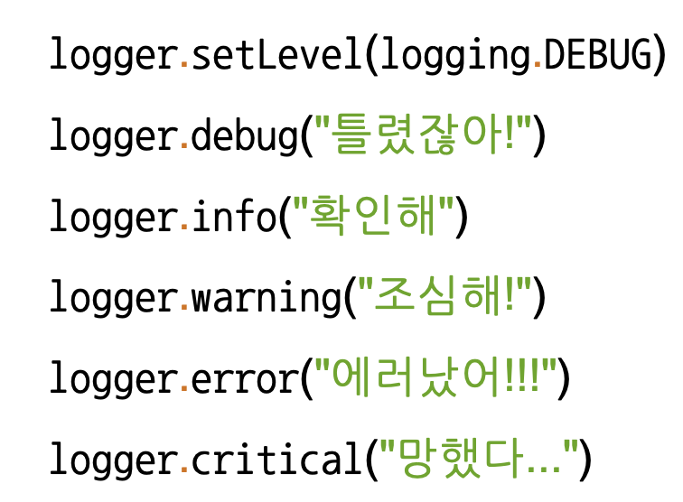

# Day 3 ( Python basic for AI 4강 ~ 5강 / AI Math 7 ~ 9 강)

## 목차 

1. [강의 내용 정리](#1-강의-내용-정리)
2. [과제 수행 과정 / 결과물 정리](#2-과제-수행-과정--결과물-정리)
3. [피어세션 정리](#3-피어세션-정리)
4. [학습 회고](#4-학습-회고)

----

### 1. 강의 내용 정리

* Python basic for AI 4강 ~ 5강
    * 4-1강 : Python Object Oriented Programming
        * OOP(Object Oriented Programming) : 객체지향 프로그램으로 실제 세상을 모델링한다(현실의 특징을 코드에 반영) 라는 철학이 있다.  
         

        * Object in python 
        &nbsp; - &nbsp;class  
        &nbsp;&nbsp;&nbsp;&nbsp; ‣ &nbsp; 객체를 만들기 위한 틀 
        &nbsp;&nbsp;&nbsp;&nbsp; ‣ &nbsp; 속성(Attribute)와 행동(Action)으로 구성이 된다. 
        &nbsp; - &nbsp;instance(객체) : 클래스를 통해서 만들어진 것  
        &nbsp; - &nbsp;클래스 정의 
        &nbsp;&nbsp;&nbsp;&nbsp; ‣ &nbsp; class 클래스 이름(상속받을 class 이름): 
        &nbsp;&nbsp;&nbsp;&nbsp; &nbsp; &nbsp;&nbsp;&nbsp;&nbsp;&nbsp;&nbsp;&nbsp; def __ init __(self): 
        &nbsp;&nbsp;&nbsp;&nbsp;&nbsp;&nbsp;&nbsp; * &nbsp; class의 기본 정의는 위와 같다. 그리고 이때 클래스명은 CamelCase형식으로 지어주면 좋다(함수나 변수는 snake_case로 명명해주면 좋다).
         
        &nbsp;&nbsp;&nbsp;&nbsp; ‣ &nbsp; __ init __ 은 객체 초기화를 위한 함수이다. 
        &nbsp;&nbsp;&nbsp;&nbsp;&nbsp;&nbsp;&nbsp; * &nbsp; __ 은 특수한 예약 함수나 변수 그리고 함수명 변경(맨글링)으로 사용된다.  
        &nbsp;&nbsp;&nbsp;&nbsp;&nbsp;&nbsp;&nbsp; * &nbsp; ex) __ main __, __ add __, __ str __, __ eq __ 등이 있다.  
	&nbsp;&nbsp;&nbsp;&nbsp;&nbsp;&nbsp;&nbsp;&nbsp;&nbsp;[더 자세한 내용은 여기를 참고하기.](https://corikachu.github.io/articles/python/python-magic-method)  
         &nbsp;&nbsp;&nbsp;&nbsp; ‣ &nbsp; method 추가방법은 기존 함수와 같으나 파라미터에 self를 추가해줘야 한다. 이때 self는 생성된 instance 자신을 의미한다.
          
        * OOP 특징 - 상속, 다형성, 가시성 
        &nbsp; - &nbsp;상속  
        &nbsp;&nbsp;&nbsp;&nbsp; ‣ &nbsp; 부모클래스로부터 속성과 메소드를 물려받는 것을 말한다. 
        &nbsp; - &nbsp;다형성  
        &nbsp;&nbsp;&nbsp;&nbsp; ‣ &nbsp; 같은 이름의 메소드의 내부 로직을 다르게 작성 -> 같은 부모의 상속을 받은 클래스 여러개를 만들고 해당 메소드에 다른 로직을 작성하면 각 자식 객체의 인스턴스는 다르게 동작한다. 
        &nbsp; - &nbsp;가시성  
        &nbsp;&nbsp;&nbsp;&nbsp; ‣ &nbsp; 객체의 정보를 볼 수 있는 레벨을 조절하는 것(캡슐화, 정보은닉) 
        &nbsp;&nbsp;&nbsp;&nbsp; ‣ &nbsp; 변수명 앞에 __ 을 해주면 Private 변수로 선언되어 접근하지 못 함 
        &nbsp;&nbsp;&nbsp;&nbsp; ‣ &nbsp; private로 선언된 변수를 반환해주기 위해서 @propoerty라는 데코레이트를 이용하여 반환해준다.  
        &nbsp;&nbsp;&nbsp;&nbsp;&nbsp;&nbsp;&nbsp; * &nbsp; ex) item 메소드를 통해서 반환받기 
        
          
        * decorate를 위해하기 위한 개념들 
        &nbsp; - &nbsp;일급객체 
        &nbsp;&nbsp;&nbsp;&nbsp; ‣ &nbsp; 변수나 데이터 구조에 할당이 가능한 객체 
        &nbsp;&nbsp;&nbsp;&nbsp; ‣ &nbsp; 파라메터로 전달이 가능 + 리턴 값으로 사용 
        &nbsp;&nbsp;&nbsp;&nbsp;&nbsp;&nbsp;&nbsp; * &nbsp; ex) map이나 reduce함수 
        &nbsp; - &nbsp;inner function  
        &nbsp;&nbsp;&nbsp;&nbsp; ‣ &nbsp; 함수 내에 또 다른 함수가 존재 
        &nbsp; - &nbsp;closures 
        &nbsp;&nbsp;&nbsp;&nbsp; ‣ &nbsp; innder function을 return값으로 반환한 것 
        &nbsp;&nbsp;&nbsp;&nbsp;&nbsp;&nbsp;&nbsp; * &nbsp; 궁금한 것 : inner function의 함수와 변수 정보를 어떻게 저장하고 있을까? list와 같이 주소 덩어리? 
        &nbsp;&nbsp;&nbsp;&nbsp;&nbsp;&nbsp;&nbsp; * &nbsp; @(데코레이트)을 이용하면 복잡한 클로져 함수를 간단하게 만들 수 있다(그런데 내눈에는 아직도 복잡해 보인다 ;;). 
        
          

    * 4-2강 : Module and Project
        * Module 
        &nbsp; - &nbsp;프로그램에서 특정 기능을 수행하는 작은 단위(개인적인 생각) 
        &nbsp; - &nbsp;모듈화를 통해서 재사용성을 높일 수 있다.<br 

            
       * 패키지 
        &nbsp; - &nbsp;모듈을 모아놓은 단위, 하나의 프로그램 
        &nbsp;&nbsp;&nbsp;&nbsp;&nbsp;&nbsp;&nbsp; * &nbsp; 패키지 구현시 폴더별로 __ init __ .py 만들고 안에 __ all__ 맨글링으로 사용할 하위 모듈(디렉토리) 이름 리스트와 'from . import 모듈 이름' 넣어준다.  
        &nbsp;&nbsp;&nbsp;&nbsp;&nbsp;&nbsp;&nbsp; * &nbsp; ex) 
        
         

        * 가상환경 
        &nbsp; - &nbsp;프로젝트 진행 시 필요한 패키지만 설치하는 환경  
        &nbsp; - &nbsp;anaconda로 가상환경 만들고 사용하는 법 
        &nbsp;&nbsp;&nbsp;&nbsp; ‣ &nbsp; 생성 : conda create -n 가상환경_이름 파이썬버전 
        &nbsp;&nbsp;&nbsp;&nbsp; ‣ &nbsp; 가상환경 호출 : conda activate 가상환경_이름 
        &nbsp;&nbsp;&nbsp;&nbsp; ‣ &nbsp; 가상환경 해제 : conda deactivate 
          

       
    * 5-1강 : File / Exception / Log Handling
        * Exception - 시퀀스 자료형으로 문자형 data를 메모리에 저장  
        &nbsp; - &nbsp;종류  
        &nbsp;&nbsp;&nbsp;&nbsp; ‣ &nbsp; 예상 가능한 예외 
        &nbsp;&nbsp;&nbsp;&nbsp;&nbsp;&nbsp;&nbsp;&nbsp; - &nbsp; 발생여부를 사전에 인지할 수 있는 예외 
        &nbsp;&nbsp;&nbsp;&nbsp;&nbsp;&nbsp;&nbsp;&nbsp; - &nbsp; 예를 들어서 사용자의 잘못된 입력, 파일 호출 시 파일 없음 등과 같은 상황 
        &nbsp;&nbsp;&nbsp;&nbsp;&nbsp;&nbsp;&nbsp;&nbsp;&nbsp;&nbsp;&nbsp;&nbsp; => &nbsp; 개발자가 if나 except를 통해서 예외처리를 해줘야 한다. 
        &nbsp;&nbsp;&nbsp;&nbsp; ‣ &nbsp; 예상이 불가능한 예외 
        &nbsp;&nbsp;&nbsp;&nbsp;&nbsp;&nbsp;&nbsp;&nbsp; - &nbsp; 인터프리터 과정에서 발생하는 예외, 개발자 실수, 논리적 오류 등 
        &nbsp;&nbsp;&nbsp;&nbsp;&nbsp;&nbsp;&nbsp;&nbsp; - &nbsp; 예를 들어서 리스트의 범위를 넘어가는 index에 접근한다거나 어떤수를 정수 0으로 나누는 행위 
        &nbsp; - &nbsp;예외처리(Exception Handling) 
        &nbsp;&nbsp;&nbsp;&nbsp; ‣ &nbsp; try ~ except 문법 사용 
        &nbsp;&nbsp;&nbsp;&nbsp;&nbsp;&nbsp;&nbsp;&nbsp; - &nbsp; try 범위 안에는 예외 발생 가능한 코드를 넣고 except 범위에는 예외 발생시 대응하는 코드를 넣으면 된다. 이때 (except exception type)과 예외 타입을 정해줄 수 있고 이때는 해당 예외 발생시 예외처리 코드를 수행한다. 
        &nbsp;&nbsp;&nbsp;&nbsp; ‣ &nbsp; try ~ except  ~ else 문법 사용 
        &nbsp;&nbsp;&nbsp;&nbsp;&nbsp;&nbsp;&nbsp;&nbsp; - &nbsp; try ~ except에 else를 추가한 구문으로 예외가 발생하지 않았을 경우 else부분의 코드가 실행된다. 
        &nbsp;&nbsp;&nbsp;&nbsp; ‣ &nbsp; try ~ except  ~ finally 문법 사용 
        &nbsp;&nbsp;&nbsp;&nbsp;&nbsp;&nbsp;&nbsp;&nbsp; - &nbsp; try ~ except에 finally를 추가한 구문으로 예외가 발생여부와 상관없이 실행되는 코드부분이다. 
        &nbsp;&nbsp;&nbsp;&nbsp; ‣ &nbsp; raise 예외 타입 
        &nbsp;&nbsp;&nbsp;&nbsp;&nbsp;&nbsp;&nbsp;&nbsp; - &nbsp; 강제로 exception을 발생. 
        &nbsp;&nbsp;&nbsp;&nbsp; ‣ &nbsp; assert 예외조건 
        &nbsp;&nbsp;&nbsp;&nbsp;&nbsp;&nbsp;&nbsp;&nbsp; - &nbsp; 특정 조건에 만족하지 않을 경우 예외 발생  

        * File Handling 
        &nbsp; - &nbsp;open : 파일 처리를 위한 함수로 읽기/쓰기/추가 모드가 있다.  
        &nbsp;&nbsp;&nbsp;&nbsp; * &nbsp; 일반적으로 open을 하여 사용한 다음 마지막에 close를 통해서 닫아줘야 한다. 이 과정이 귀찮다면 with구문과 함계 open을 사용하면 된다. 
        &nbsp;&nbsp;&nbsp;&nbsp;&nbsp;&nbsp;&nbsp;&nbsp; * &nbsp; with 구문이란 - 주말에 찾아보기 ㅎㅎ 
        &nbsp;&nbsp;&nbsp;&nbsp; ‣ &nbsp; read() : 파일 전체의 데이터를 읽어들인다. 
        &nbsp;&nbsp;&nbsp;&nbsp; ‣ &nbsp; readline() : 파일 1줄을 읽어들인다.(개행전까지) 
        &nbsp;&nbsp;&nbsp;&nbsp; ‣ &nbsp; 쓰기모드 때 encoding 형식을 지정 해줄 수 있다. 
        &nbsp; - &nbsp;Pickle 
        &nbsp;&nbsp;&nbsp;&nbsp; ‣ &nbsp; 파이썬의 객체를 영속화하는 built-in 객체이다. 
        &nbsp;&nbsp;&nbsp;&nbsp;&nbsp;&nbsp;&nbsp;&nbsp; * &nbsp; RCE(Remote Code Execute)공격이 가능하므로 인터넷으로 모르는 사람의 pickle을 다운받을때 조심하도록 해야 한다. 
        &nbsp;&nbsp;&nbsp;&nbsp;&nbsp;&nbsp;&nbsp;&nbsp;[pickle_취약점](https://watchout31337.tistory.com/167) 
          

        * Logging Handling 
        &nbsp; - &nbsp;로그를 남기는 이유  
        &nbsp;&nbsp;&nbsp;&nbsp; ‣ &nbsp; 프로그램이 실행되는 동안 일어나는 정보를 기록함으로써 문제 발생시 참고할 수 있는 자료로 유용하게 쓰일 수 있다. 
        &nbsp;&nbsp;&nbsp;&nbsp; ‣ &nbsp; 로그 기록은 실행시점에 남겨야 하는 기록과 개발시점에서 남겨야하는 기록으로 나눠진다. 
        &nbsp; - &nbsp;로그 레벨  
        &nbsp;&nbsp;&nbsp;&nbsp; ‣ &nbsp; DEBUG -> INFO -> WARNING -> ERROR -> CRITICAL 순서대로 레벨이 낮아진다(낮을수록 유저도 알아야하는 정보에 가깝다). 
        &nbsp;&nbsp;&nbsp;&nbsp; ‣ &nbsp; logging.StreamHandler는 log level이 warning으로 설정이 되어있다. 
        &nbsp;&nbsp;&nbsp;&nbsp; ‣ &nbsp; 셋팅된 레벨이하의 로그들을 출력해 준다. 아래의 예시는 기본레벨 셋팅으로 되어있다. 
        
	

        
      

    * 정보 설정하기(프로그램 옵션 설정하기) 
        &nbsp; - &nbsp;configparser 
        &nbsp;&nbsp;&nbsp;&nbsp; ‣ &nbsp; 프로그램의 실행 설정을 file에 저장한다. 
        &nbsp;&nbsp;&nbsp;&nbsp; ‣ &nbsp; Section, Key, Value값의 형태로 설정된 파일을 사용 
        &nbsp;&nbsp;&nbsp;&nbsp; ‣ &nbsp; 설정파일을 Dict Type으로 호출후 사용 
        &nbsp;&nbsp;&nbsp;&nbsp; ‣ &nbsp; configparser 모듈을 이용한다. 

        * argparser 
        &nbsp;&nbsp;&nbsp;&nbsp; ‣ &nbsp; console창에서 프로그램 실행시 setting정보를 저장한다. 
        &nbsp;&nbsp;&nbsp;&nbsp; ‣ &nbsp; Command-Line Option이라고 부름 
        &nbsp;&nbsp;&nbsp;&nbsp; ‣ &nbsp; argparse 모듈을 사용한다. 
        
          

    * 5-2강 : Python data handling
        * CSV 
        &nbsp; - &nbsp; 쉼표로 구분한 텍스트 파일 
        &nbsp;&nbsp;&nbsp;&nbsp; ‣ &nbsp; csv, pandas 등의 모듈이 있다. pandas모듈을 많이 사용하는 것 같다. 

        * 정규표현식 [정리한 ppt](https://docs.google.com/presentation/d/1UJPMofkHHjDsNvpnZJXrwkDT6122eyo4R4TliGadosY/edit?usp=sharing)
         
        &nbsp; - &nbsp; 파이썬에서 정규표현식을 활용하려면 re 모듈을 사용해야 된다. [re 모듈에 대한 설명 및 예시](https://brownbears.tistory.com/506) 
         

        * XML  
        &nbsp; - &nbsp;데이터의 구조와 의미를 설명  
        &nbsp; - &nbsp;TAG를 사용하여 표시  
         

        * JSON 
        &nbsp; - &nbsp; Java script의 데이터 객체 표현 방식 
        &nbsp; - &nbsp;데이터 용량이 적고, Code로의 전환이 쉽다. 
        &nbsp; - &nbsp;json 사용한다. 
         

        * beautifulsoup 
        &nbsp; - &nbsp;HTML, XML등 마크업 언어 스크랩핑을 위한 패키지  
        &nbsp; - &nbsp;위의 정규표현식 연습할때 이것도 해보려고 시도는 해봤으나 실패 ㅠㅠ 
        &nbsp;&nbsp;&nbsp;&nbsp; ‣ &nbsp; 이유 : ajax 를 get으로 호출한 후 받은 데이터를 해당 사이트에서 만든 javascript 메소드의 인자값으로 넣어주고 거기서 추가로 처리하는 과정이 있다(이 과정에서 자바스크립트 변수의 정보를 html태크로 변형해서 추가해준다.). 여기서 나는 get으로 데이터 받고 해당 데이터를 사이틍에서 만든 메소드를 이용하여 처리하지 못 했다. 그리고 해당 자바스크립트 변수에 접근 및 데이터를 볼 수 없었다(get으로 받은 데이터에서 -> 아마도 get에서 받은 데이터에는 자바스크립트 변수가 담고 있는 정보는 없는듯하다.).  
        &nbsp; - &nbsp; [연습한 코드](./main.py) 
        &nbsp; - &nbsp;참고한 사이트 
        &nbsp;  &nbsp;[ajax 데이터 받아오기](https://fabl1106.github.io/python/2019/04/25/%ED%8C%8C%EC%9D%B4%EC%8D%AC-22.-%EB%8F%99%EC%A0%81%ED%81%AC%EB%A1%A4%EB%A7%81(Ajax,-JSON).html)
        &nbsp; , &nbsp;[beautifulsoup 예시](https://soyoung-new-challenge.tistory.com/22)
         
         
   
        
* AI Math 7 ~ 9강
    * 7강 : 동계학 맛보기
        * 통계적 모데링 - 적절한 가정 위에서 확률분포를 추정하는 것 
        &nbsp;  -  &nbsp; 모수적 방법론 : 데이터가 특정 확률분포를 따른다고 선험적으로 가정한 후 그 분포를 결정하는 모수를 추정하는 방법 
        &nbsp;  -  &nbsp; 비모수 방법론 : 특정 확률분포를 가정하지 않고 데이터에 따라 모델의 구조 및 모수의 개수가 유연하게 바뀐 특성을 이용한 방법론 
        &nbsp;  ☆  &nbsp; 두 방법론의 차이점 : 어떤 가정을 하는지가 가장 큰 차이점이다.  

        * Step 1 : 확률분포 가정하기  
        &nbsp;  - &nbsp; 가정하는 방법 : 데이터(관찰된 데이터) 모양에 따라 다르게 가정을 해야 한다. 
        &nbsp;&nbsp;&nbsp;&nbsp; ‣ &nbsp; 데이터가 2개의 값(0 또는 1)만 가지는 경우 -> 베르누이 분포 
        &nbsp;&nbsp;&nbsp;&nbsp; ‣ &nbsp; 데이터가 n개의 이산적인 값을 가지는 경우 -> 카테고리 분포 
        &nbsp;&nbsp;&nbsp;&nbsp; ‣ &nbsp; 데이터가 [0,1] 사이에서 값을 가지는 경우 -> 베타분포 
        &nbsp;&nbsp;&nbsp;&nbsp; ‣ &nbsp; 데이터가 0 이상의 값을 가지는 경우 -> 감마분포, 로그정규분포 등 
        &nbsp;&nbsp;&nbsp;&nbsp; ‣ &nbsp; 데이터가 실수 전체에서 값을 가지는 경우 -> 정규분포, 라플라스분포 등 
        &nbsp; &nbsp;__☆ 각 분포마다 검정하는 방법들이 있으므로 모수를 추정한 후에는 반드시 검정을 해야 한다.__  

        * Step 2: 데이터로 모수를 추정해보자! 
        &nbsp;  - &nbsp; 데이터의 확률분포를 가정했다면 모수를 추정해볼 수 있다. 
        &nbsp;  - &nbsp; 정규분포의 모수는 평균과 분산으로 이를 추정하는 통계량은 아래 그림과 같습니다. 
          
        &nbsp;&nbsp;&nbsp;&nbsp; * &nbsp; 표본분산을 구할 때 N이 아니라 N-1로 나누는 이유는 불편 추정량을 구하기 위해서이다. 
        &nbsp;  - &nbsp; 통계량의 확률분포를 표집분포(sampling distributions)이라 부르며 표본평균의 표집분포는 N이 커질수록 정규분포를 따른다 -> 이러한 성질을 중심극한정리라고 한다. 이 성질은 모집단(우리가 알고하고 싶은 집단 전체)가 정규분포를 따르지 않아도 성립하며 표본(모집단의 일부, 우리가 얻어온 데이터)이 많을수록 정규분포를 따른다는 의미이다. 
        &nbsp; &nbsp;__☆ 표본분산과 표집분포는 다른 개념이다__ 
        &nbsp;&nbsp;&nbsp;&nbsp; ‣ &nbsp; 표본분포 : 표본의 분포 
        &nbsp;&nbsp;&nbsp;&nbsp; ‣ &nbsp; 표집분포 : 표본평균과 표본분산을 통해서 구한 통계량의 확률분포를 뜻한다.  
        &nbsp;  - &nbsp; 최대가능도 추정법 
        &nbsp;&nbsp;&nbsp;&nbsp; ‣ &nbsp; 표본평균이나 표본분산은 중요한 통계량이지만 확률분포마다 사용하는 모수가 다르므로 적절한 통계량이 달라지게 된다. -> 이를 대체하기 위한 수단이 최대가능도 추정법입니다. 
        &nbsp;&nbsp;&nbsp;&nbsp; ‣ &nbsp; 최대가능도 추정법(Maximum Likelihood Estimation, MLE)이론적으로 가장 가능성이 높은 모수를 추정하는 방법 중 하나입니다. 
         
        &nbsp;&nbsp;&nbsp;&nbsp;&nbsp;&nbsp;&nbsp;&nbsp; ☆ 가능도 함수는 모수 𝜃를 따르는 분포가 X를 관찰할 가능성을 뜻하지만 확률로 해석하면 안된다. -> 𝜃에 따른 대소비교 하는 용도이다. (->??? 뭔 말이지? ) __이 부분 다시 공부하기__  &nbsp;   
        &nbsp;&nbsp;&nbsp;&nbsp; ‣ &nbsp; 데이터 집합 X가 독립적으로 추출되었을 경우 로그가능도를 최적화한다. 
        
        &nbsp;&nbsp;&nbsp;&nbsp; * &nbsp; 위의 수식에서 파이랑 비슷한 기호를 프로덕트라고 부르며 각 요소를 곱한다는 의미이다.  
        &nbsp;&nbsp;&nbsp;&nbsp; ☆ &nbsp; __여기서 의문점 : 왜 로그가능도를 사용하는 것일까?__ 
        &nbsp;&nbsp;&nbsp;&nbsp;&nbsp;&nbsp;&nbsp;&nbsp; 1. &nbsp;로그가능도를 최적화하는 모수 𝜃는 가능도를 최적화하는 MLE가 된다.(<- 왜??? 뭐징???)  __이 부분 다시 공부하기__  
        &nbsp;&nbsp;&nbsp;&nbsp;&nbsp;&nbsp;&nbsp;&nbsp; 2. &nbsp; 데이터의 숫자가 적으면 상관없지만 만일 데이터의 숫자가 수억 단위가 된다면 컴퓨터의 정확도로는 가능도를 계산하는 것은 불가능해집니다. <- __사용 이유__  
        &nbsp;&nbsp;&nbsp;&nbsp;&nbsp;&nbsp;&nbsp;&nbsp; 3. &nbsp; 데이터가 독립일 경우, 로그를 사용하면 가능도의 곱셈을 로그가능도의 덧셈으로 바꿀 수 있기 때문에 컴퓨터로 연산이 가능해진다. (?? 왜 데이터가 독립일 경우 로그가능도의 곱셈을 로그가능도의 덧셈으로 바꿀 수 있지?) __이 부분 다시 공부하기__ 
        &nbsp;&nbsp;&nbsp;&nbsp;&nbsp;&nbsp;&nbsp;&nbsp; 4. &nbsp; 경사하강법으로 가능도를 최적화할 때 미분 연산을 사용하게 되는데, 로그 가능도를 사용하면 연산량을 O(n^2)에서 O(n)으로 줄여줄 수 있다.  
        &nbsp;&nbsp;&nbsp;&nbsp; ‣ &nbsp; 대게의 손실함수의 경우 경사하강법을 사용하므로 음의 로그가능도를 최적화하게 된다(목적식을 최소화한다.). 

        * 최대가능도 추정법 예제 : 정규분포 
        &nbsp;  - &nbsp; 정규분포를 따르는 확률변수 X로부터 독립적인 표본{x1,...,xn)을 얻었을때 최대가능도 추정법을 이용하여 모수를 추정하면? 
        &nbsp;&nbsp;&nbsp;&nbsp; * &nbsp; 독립적인 표본이므로 최대가능도 추정법으로 로그가능도 추정법을 사용할 수 있다. 
        
        위의 식, 즉 로그가능도를 최대화하기 위해서는 로그가능도에 대한 표본평균 미분값과 로그가능도에 대한 표본분산의 미분값이 0이 되면 된다. (?? 왜 표본평균 미분값과 표본분산의 미분값이 0이 되면 가능도는 최대화될까?) __이 부분에 대해서 다시 공부하기__ [참고할 사이트1](https://datascienceschool.net/02%20mathematics/09.02%20%EC%B5%9C%EB%8C%80%EA%B0%80%EB%8A%A5%EB%8F%84%20%EC%B6%94%EC%A0%95%EB%B2%95.html)
          

        * 최대가능도 추정법 예제 : 카테고리 분포(베르누이 사용) 
        &nbsp;  - &nbsp; 카테고리 분포(x: p1,...,pd)를 따르는 확률변수 X로부터 독립적인 표본 {x1,...,xn)을 얻었을 때 최대가능도 추정법을 이용하여 모수를 추정하면? 
        &nbsp;  - &nbsp; 카테고리 분포에서는 모든 p(1~d)를 더하면 1이 되어야 한다. 예를 들어서 주사위를 던져서 1~6이 나올 확률들을 다 더하면 1이 된다.  
          
        &nbsp;  - &nbsp; 위의 식은 아래와 같이 되고 이것은 라그랑주 승수법을 통해 최적화 문제를 풀 수 있다.(? 라그랑주 승수법?? ㅠㅠ 이것 또 뭐지??) __이 부분에 대해서 다시 공부하기__  
          
        &nbsp;  - &nbsp; p와 람다(? 맞나? 사람인처럼 생긴 문자)를 각각 최대가능도에 대해서 미분을 하면 아래와 같이 나온다. 
          

        * 딥러닝에서 최대가능도 사용하기 
        &nbsp;  - &nbsp; 최대가능도 추정법은 기계학습 모델을 학습할 때 사용이 된다. 
        &nbsp;  - &nbsp; 딥러닝 모델의 가중치를 θ = (W(1), ..., W(L)) 라 표기했을 때 분류 문제에서 소프트맥스 벡터는 카테고리분포의 모수 (p1, ..., pK)를 모델링합니다. 
        &nbsp;  - &nbsp;원핫벡터로 표현한 정답레이블 y = (y1, ..., yK) 을 관찰데이터로 이용해 확률분포인 소프트맥스 벡터의 로그가능도를 최적화할 수 있습니다.  
        &nbsp;  - &nbsp; 수식은 아래와 같습니다.
        

        * 확률분포의 거리를 구해보자 
        &nbsp;  - &nbsp; 기계학습에서 사용되는 손실함수들은 모델이 학습하는 확률분포와 데이터에서 관찰되는 확률분포의 거리를 통해 유도합니다. 
        &nbsp;  - &nbsp;데이터공간에 두 개의 확률분포 P(x), Q(x) 가 있을 경우 두 확률분포 사이 의 거리(distance)를 계산할 때 쿨백-리이블러 발산(KL-Divergence)를 많이 사용합니다.  
         

        * KL-Divergence의 식은 다음과 같습니다. [이 부분을 이해하기 위해서 참고한 사이트](https://angeloyeo.github.io/2020/10/27/KL_divergence.html)
          

    * 8강 : 베이즈 통계학 맛보기
        * 조건부 확률  
        &nbsp;  - P(A|B) : 사건 B가 일어난 상황에서 사건 A가 발생활 확률을 의미한다. 
        
        &nbsp;&nbsp;&nbsp;&nbsp; ‣ &nbsp; 이것에 대해서 저희 조 캠퍼님이 벤 다이어그램으로 설명해주실때 사용한 그림입니다. 
        
        &nbsp;&nbsp;&nbsp;&nbsp; ‣ &nbsp; 위의 그림을 통해서 Evidence를 알 수 있습니다. 즉 A와 A의 여사건의 확률과 A가 발생했을때 B가 될 확률, A여사건이 발생했을때 B가 발생할 확률을 알고 있다면 B확률을 알 수 있습니다. 
          

        * 베이즈 정리 : 조건부확률을 이용하여 정보를 갱신하는 방법을 알려준다.  
        &nbsp; * 공식 
        
         
        &nbsp;&nbsp;&nbsp;&nbsp; * 𝜃 : 모델의 모수 
        &nbsp;&nbsp;&nbsp;&nbsp; * 𝐷 : 관찰한 데이터  
        &nbsp;&nbsp;&nbsp;&nbsp; * 사후확률 : 데이터가 주어질 때 이 파라미터가 성립할 확률  
        &nbsp;&nbsp;&nbsp;&nbsp; * 사전확률 : 데이터가 주어지지 않을때 𝜃에 대한 사전에 주어진 확률 
        &nbsp;&nbsp;&nbsp;&nbsp; * 가능도 : 현재 주어진 모수에서 해당 데이터가 관찰될 확률 
        &nbsp;&nbsp;&nbsp;&nbsp; * Evidence : 데이터자체의 분포
          
        &nbsp; * 예제 : COVID의 발병률이 10%로 알려져있다. COVID에 실제로 걸렸을때 검진될 확률은 99%, 실제로 걸리지 않았을 때 오진검진될 확률이 1%라고 할 때, 어떤 사람이 질병에 걸렸다고 검진 결과가 나왔을 때 정말로 COVID에 감여되었을 확률은? 
        &nbsp; -> 아래와 같다.  
          
        &nbsp; - 𝜃 : 발병률, 10% 
        &nbsp; - D : 감여되었을 확률, 우리가 구하고자 하는 목표 
        &nbsp; - ¬ : 부정의 의미(~의 반대 확률) 
        &nbsp; - ¬𝜃 : 발병하지 않았을 확률, 90% 
        &nbsp; - P(D|𝜃) : 코로나 발병이 되었을때 실제 감염되었을 확률, 99%  
        &nbsp; - P(D|¬𝜃) : 발병하지 않았을때 감염되었을 확률 : 1%  
        &nbsp; - P(D)는 위의 벤 다이어그램에서 사건 B를 구한 것처럼 P(𝜃)(발병률) * P(D|𝜃)(발병했을때 감염되었을 확률) + P(¬𝜃)(발병하지 않았을 확률) * P(D|¬𝜃)(발병하지 않았을때 발병할 확률) 입니다.  
        &nbsp; * 베이즈 정리와 조건부 확률을 통해서 다음과 같이 1종 오류, 2종 오류, 민감도(Recall), 오탐도, 특이도, 정밀도(Precision) 등을 알아낼 수 있다. 아래와 그림을 참고하세요.
          
        &nbsp; * 위의 코로나 예제에서 1종오류(발병하지 않았을때 감염되었을 확률)가 오르면 테스트의 정밀도가 떨어진다(P(D)의 확률이 낮아진다).  
        * 베이즈 정리를 통한 정보의 갱신 : 베이즈 정리를 통해 새로운 데이터가 들어왔을 때 왚서 계산한 사후확률을 사전확률로 사용하여 갱신된 사후확률을 계산할 수 있다. 
        &nbsp;&nbsp;&nbsp;&nbsp; ‣ &nbsp; 예제 : 앞서 COVID판정을 받은 사람이 두 번째 검지을 받았을 때도 양성이 나왔을 때 진짜 COVID에 걸렸을 확률은(이때 1종오류가 10%로 변경)? 
            
         &nbsp;&nbsp;&nbsp;&nbsp; ‣ &nbsp; 먼저 첫번째 사후확률을 구해주고 이 확률을 두 번째 사후확률을 구해줄때 P(𝜃)값으로 사용해주면 된다. 
         * 조건부 확률로 인과관계를 알 수 있는가?  
         &nbsp; - 조건부 확률은 유용한 통계적 해석을 제공하지만 인과관계(causality)를 추론할 때 함부로 사용해서는 안된다. 왜냐하면 아래와 같은 상황에서 Z가 T와 R에게 미치는 영향을 제거하지 않으면 가짜 연관성이 나오기 때문이다.  
         

         &nbsp; - 이때 인과관계를 알아내기 위해서 Z가 미치는 영향, 중첩요인의 효과를 제거하고 원인에 해당하는 변수만의 인과관계를 계산해야 한다.  
           
        &nbsp; - 해당 문제에서 신장 결저 크기(Z)가 치료법과 완치에 미치는 영향을 조정 효과를 통해서 제거해 준다. 그러면 아래와 같이 됩니다. 
         ☆ __조정효과에 대한 공식은 잘 몰라서 이건 이번주 말고 나중에 시간나면 그때 알아보기__   
        

    * 9강 : CNN 첫걸음
        * Convolution 연산 이해하기  
        &nbsp;  - Convolution연산은 커널을 입력벡터 상에서 움직여가면서 선형모델과 합성함수가 적용되는 구조입니다. 이때 커널 값은 고정됩니다. 
        &nbsp;  - 아래의 식은 Convolution에 대한 식으로 활성화 함수를 제외한다면 선형변환에 속합니다. 
        

        &nbsp;  - Convolution연산의 수학적인 의미는 신호를 커널을 이용해 국소적으로 증폭 또는 감소시켜서 정보를 추출 또는 필터링하는 것입니다. 아래의 식에서 f는 커널, g는 신호를 뜻합니다.
         
        
        &nbsp;  * CNN에서 하는 연산은 정확히는 cross-correlation이라고 합니다. 
        &nbsp;  * 커널을 정의역 내에서 움직여도 변하지 않고 주어진 신호에 국소적으로 적용합니다. 
        &nbsp;  * Convolution연산은 1차원뿐만 아니라 다차원에서도 계산이 가능하며 데이터의 성격에 따라 사용하는 커널이 달라지지만 각 식에서 커널의 위치는 바뀌지 않는다. 
        
         
         

        * 2차원 convolution 연산 이해하기  
        &nbsp;  아래와 같이 커널과 입력이 주어졌을때 convolution 연산 수행 후 결과는? 
        

        &nbsp;  - 커널과 입력을 성분 곱을 해주고 각 원소를 더해부면 된다. 그 후 오른쪽으로 한칸씩 옮기면서 이와 같은 연산을 반복해준다. 만약 해당 마지막 열에 연산이 다 긑났으면 행을 옮기고 처음 열로 다시 돌아가서 성분곱 후 모든 원소 합 - 연산을 반복해주면 된다. 그러면 나오는 결과의 차원은 입력 크기 - 커널크기 + 1이 된다. 즉 입력(m,n), 커널(i,j)라면 출력(m-i+1, n-j+1)이 된다. 
        &nbsp;  - 채널이 여러개인 2차원 입력의 경우 2차원 convolution을 채널 개수만큼 적용한다고 생각하면 된다. 
         
        
        * convolution 연산의 역전파 이해하기 
        &nbsp;  convolution연산은 커널이 모든 입력데이터에 공통으로 적용되기 때문에 역전파를 계산할 때도 convolution연산이 나오게 됩니다. 
        &nbsp;  - 식은 아래와 같습니다.. 
        
          
        &nbsp;  - 다음과 같은 상황에서 w1에 대한 backpropagation은 각 출력 벡터(o1, o2, o3)*해당 입력의 합 - 1 입니다. 아래의 그림을 참고하세요. <- __이 부분에 대해서 아직 잘 이해가 안 되므로 주말에 다시 공부해야겠다. 아마도 GD에 대해서 제대로 이해하지 못한것 같다.__ 
        

  

### 2. 과제 수행 과정 / 결과물 정리
 

#### AI Math 퀴즈 과제 난이도는 어렵지 않아서 다 맞췄으나 공식을 외우고 있지 않거나 제대로 이해 못한게 있어서 퀴즈를 풀 때 강의 pdf를 보면서 풀었다 ㅎㅎ;

 

#### 그리고 선택과제는 아직 풀어보지 못 했지만 다행히 제출을 안 해도 된다 ㅎㅎ

 

#### 그래서 오늘은 내일 피어세션때 다른 캠퍼들에게 도움이 될만한 내용에 대해서 공부를 하고 공유할 생각이다.

  

### 3. 피어세션 정리

 
🔍[이전 질문 리뷰]  
SGD 효율성에 대한 질문 : SGD의 연산량이 GD보다 연산량이 더 많아서 덜 효율적이지 않는가? 
    * 경사하강법의 종류 : BGD, SGD, MSGD(지난 시간에 SGD라고 생각했던 것) 
&nbsp;&nbsp;&nbsp;&nbsp;=> 그러므로 정확한 용어로 사용하면 MSGD의 연산량이 BGD보다 연산량이 더 효율적인가?  
	* 통용적으로 SGD라고 하면 MSGD를 뜻한다. 
iteration : mini_bach를 한 번 학습한 것 
		 * BGD는 mini_bach가 total_data이고 SGD는 1개이고 MSGD에서는 지정한 mini_bach 개수이다. 
epoch : total_data를 한 번 학습을 끝낸 것  
	Answer  
iteration의 횟수는 BGD가 가장 적지만 1 iteration을 하는데 시간이 가장 오래 걸리며 SGD는 1 iteration 당 1개의 데이터만 학습시키므로 1 epoch를 하는데 많은 iteraion이 필요하다. MSGD의 경우는 mini_batch의 수에 따라 1 epoch 당 iteraion의 수를 결정하므로 현실적인 HW성능을 고려할 수 있다는 점에서 효율성이 좋을 것이다.
효율적이려면 가중치 W를 학습시키는 시간의 복잡도가 낮을수록 좋다.  
 iteration당 시간 복잡도  
&nbsp;&nbsp;&nbsp;&nbsp;*(total_data : 데이터의 총 개수, d : 임의의 일부 데이터 사이즈, batch size : 사용자가 저한 mini_batch 크기)  
&nbsp;&nbsp;&nbsp;&nbsp;GD : O( total_data *^2) 
&nbsp;&nbsp;&nbsp;&nbsp;SGD : O(1 * d^2) 
&nbsp;&nbsp;&nbsp;&nbsp;MSGD : O(batch size * d^2 )  
📒[금일 질문 목록]  
왜 Relu가 비선형 함수인가? 
&nbsp;&nbsp;&nbsp;&nbsp;선형함수 특징 
&nbsp;&nbsp;&nbsp;&nbsp;&nbsp;&nbsp;&nbsp;&nbsp;1. 그래프로 그렸을때 직선이어야 한다. 즉, 선이 중간에 꺾이면 안된다.  
&nbsp;&nbsp;&nbsp;&nbsp;&nbsp;&nbsp;&nbsp;&nbsp;2. 매트릭스로 표현할때 표현이 가능해야 한다. 
&nbsp;&nbsp;&nbsp;&nbsp;&nbsp;&nbsp;&nbsp;&nbsp;함수가 중첩이 되더라도 선형이 된다.  
&nbsp;&nbsp;&nbsp;&nbsp;&nbsp;&nbsp;&nbsp;&nbsp;&nbsp;&nbsp;&nbsp;&nbsp;ex) f(x) = ax + b, f(f(x)) = f(ax+b) = a(ax+b) + b = a^2 * x + ab + b
동차성 : f(ax) = a(fx)과 가산성 : f(x1 + x2) = f(x1) + f(x2)을 만족해야 한다.
   
sigmoid와 relu 차이 
&nbsp;&nbsp;&nbsp;&nbsp;1. sigmoid를 많이 사용할 시 , gradient vanishing 현상이 나타날 수 있다.  
&nbsp;&nbsp;&nbsp;&nbsp;2. sigmoid미분시 값이 커질수록 값이 작아지므로 gradient vanishing 현상이 나타날 수 있다.  
&nbsp;&nbsp;&nbsp;&nbsp;3. relu(x의 값이 0 이상일때) 미분값이 1임으로 중첩을 많이 하더라도 gradient vanishing현상이 나타나지 않는다. 
&nbsp;&nbsp;&nbsp;&nbsp;&nbsp;&nbsp;&nbsp;&nbsp;&nbsp;&nbsp;&nbsp;&nbsp;=> 따라서 sigmoid보다 relu가 활성화 함수를 여러 번 중첩을 할 때 좋은 성능을 낸다.  
KL-Divergence  
&nbsp;&nbsp;&nbsp;&nbsp;분산이 다를때 사용한다.  
 
 
📎[멘토링시간 질문 정하기] 
* AI 직무에 학부생이 살아남을 수 있나? 
* AI과정에 통계학에 대한 지식? 얼마나 필요한가? 어떤 곳에 활용될 수 있는가? 
* 박기훈 멘토님의 현재 직무, 하고 계신 일은 무엇인가요? 
* 멘토활동 어떻신가요? 
* 부스트캠프 기간 중에 커리어에 도움이 될만한 활동 추천 내용이 있나요? 
* 멘토활동을 참여하게 된 계기. 
* 네트워킹데이? 커넥팅데이? 
    * 어떤식으로 진행 되었는지, 무엇을 하는지에 대해서  

### 4. 학습 회고

#### AI Math 7강 '통계학 맛보기'가 생각보다 많이 어려웠다. 피어세션때 서로 이야기를 해보니 나뿐만 아니라 다른 사람들도 어려움을 느낀 것 같다. 그러나 개인적인 생각으로 내가 다른 사람들보다 더 이해를 하지 못한 것 같다. 왜 그런가 곰곰히 생각을 해보니 수식에서 사용되는 수학 기호를 잘 모르는 것이 가장 큰것 같다. 그래서 주말에 기본적인 수학 기호들에 대해서 공부를 하고 차근차근 복습을 해야겠다.
 

#### 내일 모더레이터 해야 하는데 오늘 모더레이터를 맡아주신 캠퍼님이 너무 잘해주셔서 부담이 된다 ㅠㅠ 
 

#### 그건 그렇고 오늘 모더레이터 해주신 캠퍼님이 확실히 준비를 많이 하시고 진행도 잘 하셨다. 특히 어제 나온 질문에 대해서 공부하고 ppt로 설명을 해주는데 쉽게쉽게 잘 알려주셨다. 어찌나 몰입이 잘 되던지 시간가는줄 모르고 듣고 있었다. 오늘 나온 질문들도 모더레이터 하신 캠퍼님이 다 설명을 해주셔서 내일 내가 준비해야 될게 없다... 음..., 그래서 강의 내용중에 정규표현식에 관한 부분이 있었는데 이에 대해서 좀 더 자세하게 설명하는 ppt를 만들어야 되나 고민이다. 아니면 다른 주제로 해야 하나.... ㅎㅎ..... 
 

#### 아무튼 오늘도 포기하지 않고 천천히 잘 따라가서 기분이 좋다. 내일도 화이팅~👍

