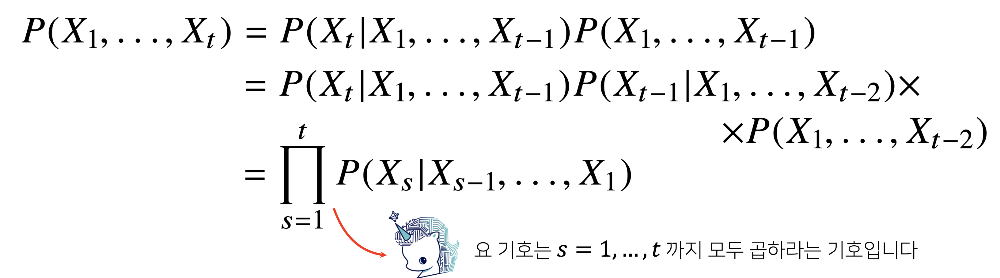
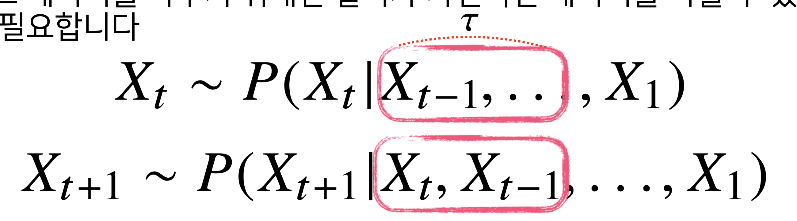
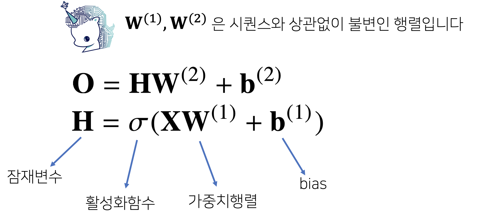
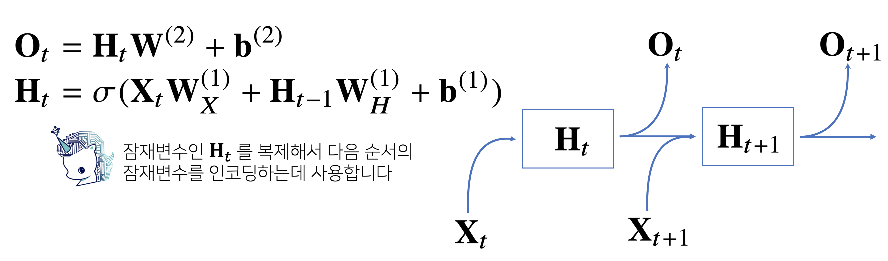

# Day 4 (AI Math 10 강)

## 목차 

1. [강의 내용 정리](#1-강의-내용-정리)
2. [과제 수행 과정 / 결과물 정리](#2-과제-수행-과정--결과물-정리)
3. [피어세션 정리](#3-피어세션-정리)
4. [학습 회고](#4-학습-회고)

----

### 1. 강의 내용 정리

        
* AI Math 10강
    * 시퀀스 데이터란?
        * 소리, 문자열, 주가, 시계열 등의 데이터를 시퀀스 데이터로 분류합니다. 

        * 시퀀스 데이터는 독립동등분포 가정을 잘 위배하기 때문에 순서를 바꾸거나 과저 정보에 손실이 발생하면 데이터의 확률분포도 바뀌게 됩니다. (<- 독립동등분포?? 그게 뭐징? __오늘도 뚠뚠~ 모르는 뚠뚠~ 개념이~ 추가~ 되었다 뚠뚜~__, __구글링을 통해서 알아보고 정리하기__)  

    *  시퀀스 데이터를 어떻게 다뤄야 할까? 
        * 조건부 확률을 통해서 이전 시퀀스의 정보를 가지고 앞으로 발생할 데이터의 확률분포를 다루면 된다. 이때 베이즈 법칙을 이용하면 된다. [베이즈 정리를 까먹었을 시 클릭 - AI Math 8강 참고](../day3/day3.md) 
        * 이전 시퀀스 정보를 구하는 방법 
        
          
        * P(Xt)를 구할때 모든 시퀀스 정보를 가지고 구할 필요는 없습니다. 경우에 따라 필요할 수도 있고 일부만 필요할 수도 있습니다. -> 이런 경우 고정된 길이만큼 이전 시퀀스 정보를 사용합니다. 아래와 같은 모델을 자기회귀모델이라고 부릅니다. (이때 T를 와 비슷하게 생긴 기호를 '타우'라고 부릅니다.)
        
          
        * 위의 모델 비슷한 이전정보(Xt)와 그 이전 정보들(Xt-1 ... X1, Ht <- 잠재변수)을 이용하여 P(Xt+1)의 확률을 구한다
    
    * RNN 이해하기
        * 가장 기본적인 RNN모형은 MLP와 유사한 모양입니다. 
          
        * 위의 모델로는 이전의 정보를 다룰 수 없습니다. 이전 정보를 다루기 위해서는 다음과 같이 이전 Ht-1을 Ht를 구할 때 사용해주면 됩니다. 또 이렇게 구해진 Ht를 Ht+1을 구할 때 사용하고 이런방식을 반복해주면 됩니다. 
          
        * 위에서 Wx(1), W2, Wh(1)은 t에 따라 변하지 않는다. 

    * RNN 역전파
        * RNN의 역전파는 잠재변수의 연결그래프에 따라 순차적으로 계산이 됩니다. 이를 Backpropagation Through Time(BPTT)하고 하며 RNN의 역전파 방법 중 하나입니다.
        * BPTT를 통해 RNN의 가중치행렬의 미분을 계산해보면 아래와 같이 미분의 곱으로 이루어진 항이 계산됩니다.
        * __BPTT를 통해서 RNN의 가중치행렬의 미분을 계산하는 방법에 대해서 아직 미숙한 것 같기 때문에 이것에 대해서 좀더 공부해보기__
        * 시퀀스 길이가 길어지는 경우 BPTT를 통한 역전파 알고리즘의 계산이 불안정해지므로 길이를 끊는 것이 필요합니다. -> truncated BPTT라고 부릅니다.
        * 오늘날에는 이러한 긴 시퀀스를 처리하는 문제를 해결하고자 기본적인 RNN 네트워크를 사용하지 않고 LSTM과 GRU 등을 사용합니다.

    
  

### 2. 과제 수행 과정 / 결과물 정리
 

#### 선택 과제1에서 ppt를 참고해서 코드를 작성했는데 뭔가 많이 이상한 것 같다. 다른 팀원들은 error가 많이 튀지 않는데 내가 짠 코드는.... 그런데 분면 ppt에서 이렇게 나왔는데 음.. 내가 어디서 실수를 했는지 잘 모르겠다. 이건 내일 질문을 통해서 해결해보고자 한다.

  

### 3. 피어세션 정리

 
0210805 피어세션  

🔍[이전 질문 한번더 우창님의 리뷰]  

Relu가 왜 비선형 함수인가? 
Relu와 sigmoid 함수의 차이 
KL-Divergence 한번더 공부 
  
entropy
cross-entropy -> 예측과 달라서 생기는 깜놀도(정보량)
https://angeloyeo.github.io/2020/10/27/KL_divergence.html
 
📒[금일 질문 목록]  

RNN에서 시퀀스가 너무 길면 Vanishing, Exploding -> BPTT  

Answer : 시퀀스가 너무 길때, 끝에서나 몇개의 기준을 정해서 전체에 대해 Back Prop 하지않고 정해진 기준에 대해 잘라서 거기 까지만 Back Prop 한다.
  
퀴즈 질문 -> 이 식이 어떻게 성립하는가?
  
이는 베이시안 법칙에 따라 전개하면 풀린다.
  
Variable gradient 의 개념적 이해 -> 변수 축에 따른 gradient라고 생각하면 된다.
선택과제 1번, Mini Batch에서 복원추출과 비복원추출
선택과제 2번 RNN에 대한 토의 -> grad를 어떻게 할것인가?
미분을 구할때 근사하는것이 맞는것인가, 아니면 식을 세워서 하는것이 맞는것인가?

### 4. 학습 회고

#### AI Math 10강 'RNN 첫걸음'을 들었는데 하.... 하..... 분명 이전 GD에서 backpropagation에 대해서 잘 이했했다고 생각했는데 RNN에서 backpropagation에 대한 설명을 들으니까 잘 이해가 안 되었다..... 주말에 보충으로 공부해야 되는게 조금씩 .. 이 아니라 많이 늘고 있는것 같다.
 

#### 오늘 모더레이터때 발표하려고 했더 정규식표현에 대해서 발표를 못 했다.... 뭔가 음.... 다른 사람들은 다 알고 있을 것 같고 분위기 자체가 AI Math나 AI 이론에 대한 것들만 이야기를 해서 말을 꺼내지 못했다 ㅠㅠ
 

#### 그 대신 피어세션전에 1시간 정도 공부한 KL-divergence에 대해서 발표? 설명을 했는데 KL-divergence에 대해서 제대로 이해한게 아니라서 설명이 많이 부족했던것 같다. 
 

#### 다음부터는 이러한 일이 없도록 이전 질문에서 내가 잘 몰랐던 것들을 전날에 공부를 하고 내 스스로 잘 이해되었을때 다 같이 공유하는 방식으로 해야겠다.

 

#### 아무튼 오늘도 포기하지 않고 천천히 잘 따라가서 기분이 좋다. 내일도 화이팅~👍

