# Weekend 1-2 ( Python basic for AI 6~7강)

## 목차 

1. [강의 내용 정리](#1-강의-내용-정리)
2. [과제 수행 과정 / 결과물 정리](#2-과제-수행-과정--결과물-정리)
3. [학습 회고](#4-학습-회고)

----

### 1. 강의 내용 정리

* Python basic for AI 6~ 7강
    * 6강 : nummpy
        * numpy 특징  
        &nbsp; - &nbsp;일반 List에 비해 빠르고, 메모리 효율적이다.  
        &nbsp; - &nbsp;반복문 없이 데이터 배열에 대한 처리를 지원  
        &nbsp; - &nbsp; 선형대수와 관련된 다양한 기능을 제공  
        &nbsp; - &nbsp; dynamic typing을 지원하지 않는다. -> 그래서 메모리 효율적이다.  
         

        * 선언 및 형태 
        &nbsp; - &nbsp;선언  
        &nbsp;&nbsp;&nbsp;&nbsp; ‣ &nbsp; np.array를 통해서 선언 
        &nbsp;&nbsp;&nbsp;&nbsp; ‣ &nbsp; np.array(list, dtype)을 통해서 원소 type을 지정해 줄 수 있다. 
        &nbsp; - &nbsp; 형태 
        &nbsp;&nbsp;&nbsp;&nbsp; ‣ &nbsp; shape : numpy array의 dimension(크기, 형태) 구성을 반환 -> ex) [[1,2,3], [4,5,6]]은 shape가 (2,3)이다. 
        &nbsp;&nbsp;&nbsp;&nbsp;&nbsp;&nbsp;&nbsp; * &nbsp; (2,3)에서 앞에 오는 원소는 가장 높은 차원을 뜻하고 이후에 순차적으로 작아진다. ex) (3,1,2) -> 3차원 : 3, 2차원 : 1, 1차원 : 2를 뜻하며 이것을 배열로 나타내면 [[[1,2]], [[3,4]], [[5,6]]] 이 된다.  
        &nbsp;&nbsp;&nbsp;&nbsp; ‣ &nbsp; dtype : nummpy array데이터 type을 반환함. 위의 예시의 dtype은 int이다. 
        &nbsp;&nbsp;&nbsp;&nbsp; ‣ &nbsp; rank에 따라 불리는 이름이 있다. 
        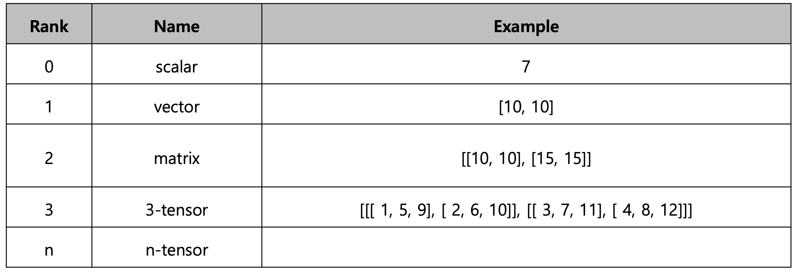
        &nbsp;&nbsp;&nbsp;&nbsp; ‣ &nbsp; ndim : dimension의 개수 -> rank 
        &nbsp;&nbsp;&nbsp;&nbsp; ‣ &nbsp; size는 총 원소의 수를 뜻한다. 
        &nbsp;&nbsp;&nbsp;&nbsp; ‣ &nbsp; ntype : ndarray object의 메모리 크기를 반환한다. 
        &nbsp;&nbsp;&nbsp;&nbsp; ‣ &nbsp; reshape : Array의 shape의 크기를 변경한다. 이때 변경전후의 원소의 갯수는 동일하다. 
        &nbsp;&nbsp;&nbsp;&nbsp; ‣ &nbsp; flatten : 다차원 array를 1차원 array로 변환시킨다. 
         
        * indexing & slicing 
        &nbsp; - &nbsp;indexing  
        &nbsp;&nbsp;&nbsp;&nbsp; ‣ &nbsp; [0,0] 표기법을 지원해준다. 

        &nbsp; - &nbsp; slicing 
        &nbsp;&nbsp;&nbsp;&nbsp; ‣ &nbsp; 행과 열 부분을 나눠서 slicing이 가능하다. 
        &nbsp;&nbsp;&nbsp;&nbsp;&nbsp;&nbsp;&nbsp; * &nbsp; matrix의 부분 집합을 추출할 때 유용하다.  
        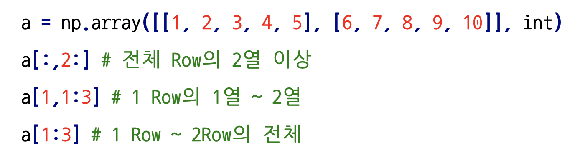  

        * creation function  
        &nbsp; - &nbsp;arrange  
        &nbsp;&nbsp;&nbsp;&nbsp; ‣ &nbsp; array의 범위를 지정하여, 값의 list를 생성하는 명령어 

        &nbsp; - &nbsp; ones, zeros, empty and someting_like 
        &nbsp;&nbsp;&nbsp;&nbsp; ‣ &nbsp; ones : 1로 가득찬 ndarray 생성 
        &nbsp;&nbsp;&nbsp;&nbsp; ‣ &nbsp; zeros : 0로 가득찬 ndarray 생성 
        &nbsp;&nbsp;&nbsp;&nbsp; ‣ &nbsp; empty : shape만 주어지고 비어있는 ndarray 생성 -> ndarray가 초기화 되어 있지 않음 
        &nbsp;&nbsp;&nbsp;&nbsp; ‣ &nbsp; 기존 ndarray의 shape 크기 만큼 1, 0 또는 empty array를 반환 

        &nbsp; - &nbsp; identity : 단위 행렬(i 행렬)을 생성함 
        &nbsp; - &nbsp; eye : 대각선이 1인 행렬, 이때 대각선의 기준을 k로 설정할 수 있다. 
        
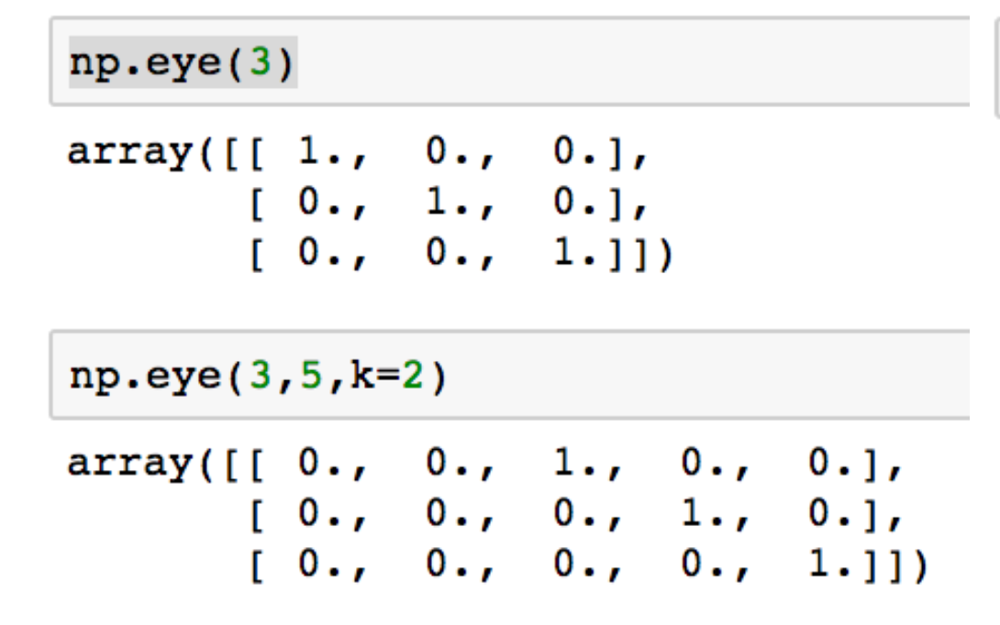

        &nbsp; - &nbsp; diag : 대각 행렬의 값을 추출함. 이때도 위와 같이 시작 행렬을 k로 설정할 수 있다. 

        &nbsp; - &nbsp; random sampling : 데이터 분포에 따른 sampling으로 array를 생성 
        &nbsp;&nbsp;&nbsp;&nbsp; ‣ &nbsp; np.random.uniform : 균등분포로 랜덤 생성 
        &nbsp;&nbsp;&nbsp;&nbsp; ‣ &nbsp; np.random.normal : 정규분포로 랜던 생성 

        * operation function  
        &nbsp; - &nbsp; sum : ndarray의 원소들 간의 합을 구함, list의 sum 기능과 동일 
        &nbsp; - &nbsp; axis : 모든 operation function을 실행할 때 기준이 되는 dimension 축 
        &nbsp;&nbsp;&nbsp;&nbsp; ‣ &nbsp; array의 범위를 지정하여, 값의 list를 생성하는 명령어 
        &nbsp; - &nbsp; mean & std : ndarray의 원소들 간의 평균 또는 표준 편차를 반환 
        &nbsp;&nbsp;&nbsp;&nbsp; * &nbsp; 이 외에도 다양한 수학 연산자를 제공함 
        &nbsp; - &nbsp; concatenate : 2개의 ndarray를 axis에 따라 붙이는 함수 
        &nbsp;&nbsp;&nbsp;&nbsp; ‣ &nbsp; vstack 
        
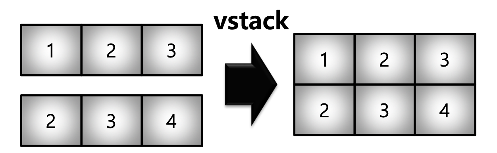
  
        &nbsp;&nbsp;&nbsp;&nbsp; ‣ &nbsp; hstack 
        

  
        &nbsp;&nbsp;&nbsp;&nbsp; ‣ &nbsp; concatenate / axis = 0 
        
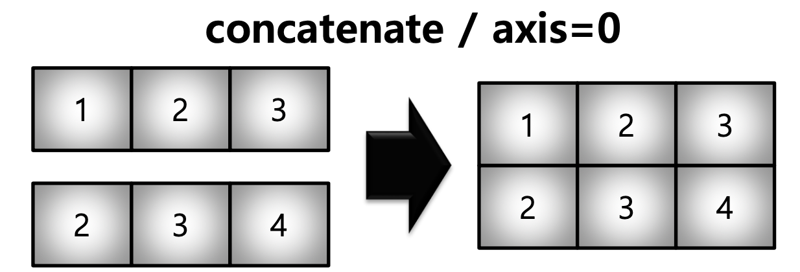
  
        &nbsp;&nbsp;&nbsp;&nbsp; ‣ &nbsp; concatenate / axis = 1 
        
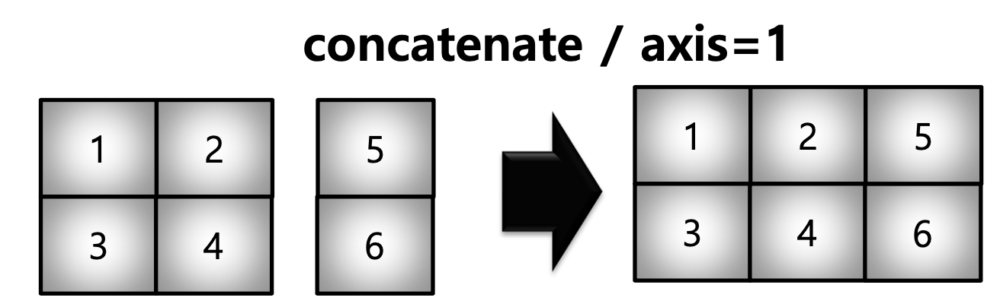
  

        * array operations  
        &nbsp; - &nbsp; Element-wise operations : array간 shape이 같을 때 일어나는 연산 
        &nbsp; - &nbsp; Dot product : Matrix의 기본 연산, dot 함수 사용 
        &nbsp; - &nbsp; transpose : np.transpose 또느 object.T를 사용 
        &nbsp; - &nbsp; broadcastsing : shape이 다른 배열 간 연산을 지원하는 기능 
        
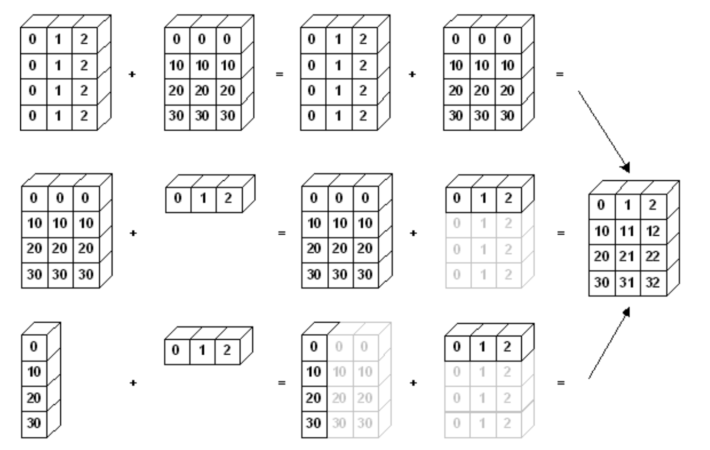
  

        * comparisons  
        &nbsp; - &nbsp; all : 데이터 전부 조건에 만족 여부 반환 
        &nbsp; - &nbsp; any : 데이터 일부 조건에 만족 여부 반환 
        &nbsp; - &nbsp; np.where 
        &nbsp;&nbsp;&nbsp;&nbsp; 1. &nbsp; 조건에 만족 여부 반환 
        &nbsp;&nbsp;&nbsp;&nbsp; 2. &nbsp; 조건에 만족 여부에 따라 지정된 값 반환 
        &nbsp; - &nbsp; argmax : darray내 최댓값 index 반환 
        &nbsp; - &nbsp; argmin : darray내 최솟값 index 반환 

        * boolean & fancy index  
        &nbsp; - &nbsp; boolean index : 특정 조건에 따른 값을 배열 형태로 추출, 이때 comparison operation 함수들도 모두 사용가능하다. 
        &nbsp; - &nbsp; fancy index : darray를 index value로 사용해서 값 추출 -> object.take도 같은 기능 

        * numpy data i/o  
        &nbsp; - &nbsp; loadtxt, savetxt : text type의 데이터를 읽고 저장하는 기능 
        &nbsp; - &nbsp; save, load : .npy(pickle 형태)로 저장, .npy 확장자 파일을 읽어옴 
          

    * 7-1 강 : Pandas 1
        * pandas란? 
        &nbsp; - &nbsp; 구조화된 데이터의 처리를 지원하는 python 라이브러리 
        &nbsp; - &nbsp; 초기에는 panel data를 많이 처리하는데 사용이 되었고 그래서 pan + da + s가 되었다고 한다. 
        &nbsp; - &nbsp; nummpy와 통합하여 강력한 '스프레드시트'처리 기능을 제공 
        &nbsp; - &nbsp; 아래는 데이터프레임에 대한 용어이다. 
        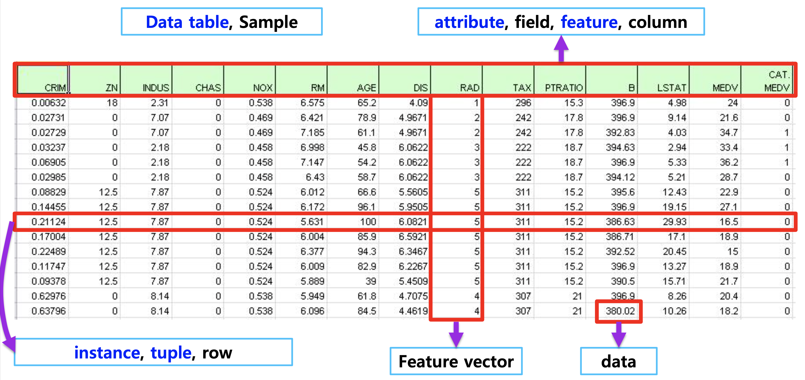
          

            
       * series 
        &nbsp; - &nbsp;column vector를 표현하는 object -> series가 모이면 dataframe이 된다. 
        &nbsp; - &nbsp; Series생성시 index 이름을 지정해 줄 수 있다.  
        &nbsp; - &nbsp; dictionary형태를 Series값으로 주면 key가 index가 되고 value가 값이 된다.      

        * dataframe 
        &nbsp; - &nbsp; series를 모아서 만든 data table  
        &nbsp; - &nbsp; indexing 
        &nbsp;&nbsp;&nbsp;&nbsp; ‣ &nbsp; loc(index location) 방법 : index 이름을 가지고 원하는 index를 찾는 방식 
        &nbsp;&nbsp;&nbsp;&nbsp;&nbsp;&nbsp;&nbsp;&nbsp; * &nbsp; ex) 아래와 같을때 s.loc[:3]하면 처음부터 index 이름이 3인것까지 선택을 한다. 
        
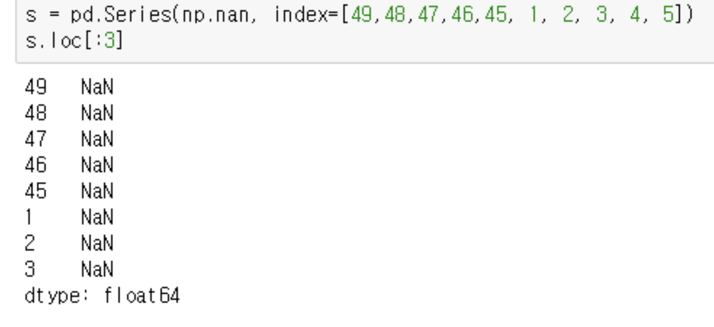

        &nbsp;&nbsp;&nbsp;&nbsp; ‣ &nbsp; iloc(index position) 방법 : index의 번호를 통해서 원하는 원소를 필터링한다. 
        &nbsp;&nbsp;&nbsp;&nbsp;&nbsp;&nbsp;&nbsp;&nbsp; * &nbsp; ex) 위와 같은 Series s에 s.iloc[:3]을 해주면 index 0~2까지인 index name 49 48 47이 선택된다. 
          

        * selection & drop 
        &nbsp; - &nbsp; Boolean index : True or False를 통해서 값을 선택함 
        &nbsp;&nbsp;&nbsp;&nbsp;&nbsp;&nbsp;&nbsp;&nbsp; * &nbsp; ex) account_series라는 series에서 account_serires[account_serires<250000]를 하면 원소 중에서 250000보다 작은 값만 선택된다. 
        &nbsp; - &nbsp; 다음은 column과 index를 선택하는 기본, loc, iloc 방법이다.  
        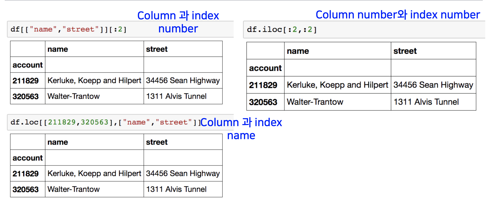
          

        * dataframe operations 
        &nbsp; - &nbsp; series operation 
        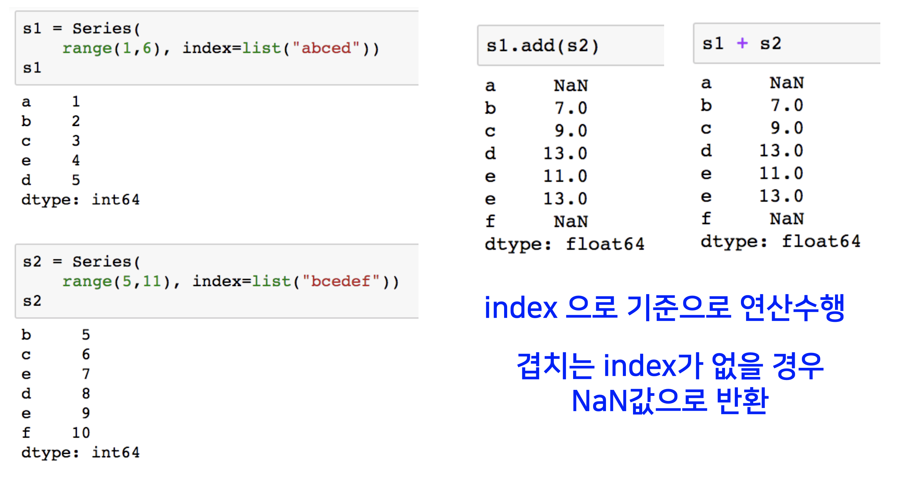
        &nbsp; - &nbsp; dataframe operation 
        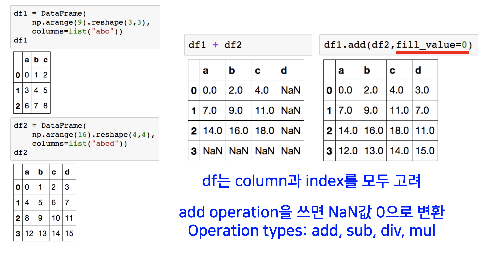
        &nbsp; - &nbsp; series + dataframe 
        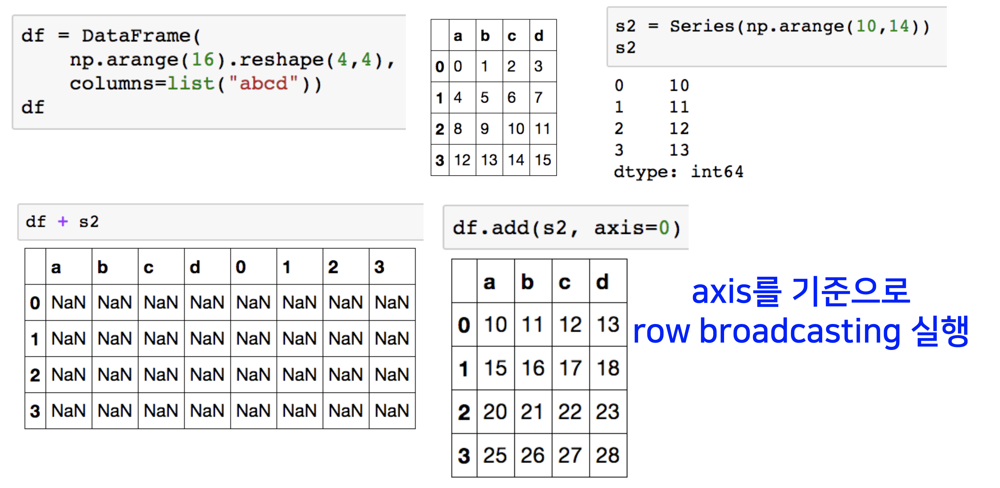
        &nbsp; - &nbsp; 아래는 데이터프레임에 대한 용어이다. 
          

        * lamda, map, apply, replace 
        &nbsp; - &nbsp; map 
        &nbsp;&nbsp;&nbsp;&nbsp; ‣ &nbsp; pandas의 series type의 데이터에서도 map 함수를 사용할 수 있다. -> series object.map() 
        &nbsp;&nbsp;&nbsp;&nbsp; ‣ &nbsp; function 대신 dict, sequence형 자료등으로 대체 가능 
        &nbsp; - &nbsp; replace 
        &nbsp;&nbsp;&nbsp;&nbsp; ‣ &nbsp; map함수의 기능중 데이터 변환 기능만 담당 
        &nbsp;&nbsp;&nbsp;&nbsp; ‣ &nbsp; 데이터 변환시 많이 사용되는 함수 
        &nbsp;&nbsp;&nbsp;&nbsp;&nbsp;&nbsp;&nbsp;&nbsp; * &nbsp; 예시)  
        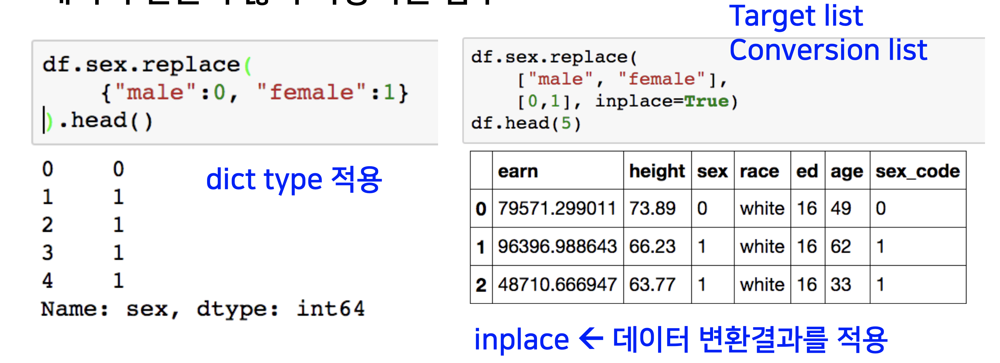
          

        &nbsp; - &nbsp; apply 
        &nbsp;&nbsp;&nbsp;&nbsp; ‣ &nbsp; map과 달리, series 전체에 해당 함수를 적용 
        &nbsp;&nbsp;&nbsp;&nbsp; ‣ &nbsp; 입력 값이 series 데이터로 입력 받아 handling 가능 

       * pandas 내장 함수 
        &nbsp; - &nbsp; describe : Numeric type 데이터의 요약 정보를 보여준다. 
        &nbsp; - &nbsp; unique : series data의 유일한 값을 list를 반환함 
        &nbsp; - &nbsp; sum, mean, min, max, count, median, mad, var 등 : 기본적인 column 또는 row 값의 연산을 지원 
        &nbsp; - &nbsp; isnull : column 또는 row값의 NaN 값의 index를 반환함 
        &nbsp; - &nbsp; sort_values : column값을 기준으로 데이터를 sorting 
        &nbsp; - &nbsp; correlation & covariance 
        &nbsp;&nbsp;&nbsp;&nbsp; ‣ &nbsp; 상관계수와 공분산을 구하는 함수 
        &nbsp;&nbsp;&nbsp;&nbsp; ‣ &nbsp; corr, cov, corrwith 
          

       
    * 7-2 강 : pandas 2
        * groupby1  
        &nbsp; - &nbsp; split -> apply -> combine 과정을 거쳐 연산함 
        &nbsp; - &nbsp; groupby ex)  
        
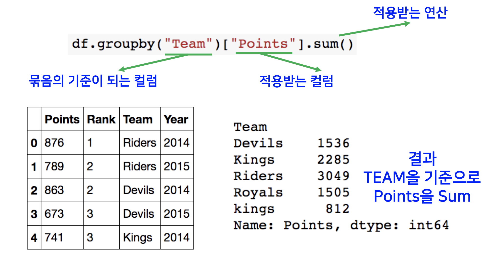

        &nbsp; - &nbsp; 계층적 index 
        &nbsp;&nbsp;&nbsp;&nbsp; ‣ &nbsp; 두 개의 column으로 groupby를 할 경우, index가 두개 생성 
        &nbsp;&nbsp;&nbsp;&nbsp; ‣ &nbsp; unstack() : group으로 묶여진 데이터를 matrix 형태로 전환해준다. 
        &nbsp;&nbsp;&nbsp;&nbsp; ‣ &nbsp; swaplevel() : index level을 변경할 수 있다. 
        &nbsp;&nbsp;&nbsp;&nbsp; ‣ &nbsp; sum, mean, min, max같은 operation : index level을 기준으로 기본 연산을 수행 

        * groupby2  
        &nbsp; - &nbsp; groupby에 의해 split된 상태를 추출 가능함  
        &nbsp; - &nbsp; get_group : 특정 key값을 가진 그룹의 정보만 추출 가능 
        &nbsp; - &nbsp; 추출된 group정보에는 세 가지 유형의 apply가 가능하다. 
        &nbsp;&nbsp;&nbsp;&nbsp; ‣ &nbsp; Aggregation: 요약된 통계정보를 추출해준다. 
        &nbsp;&nbsp;&nbsp;&nbsp; ‣ &nbsp; Transformation : 해당 정보를 변환해준다. 
        &nbsp;&nbsp;&nbsp;&nbsp; ‣ &nbsp; Filtration : 특정 정보를 제거하여 보여주는 필터링 기능 

        * case study 
        &nbsp; - &nbsp; Data  
        &nbsp;&nbsp;&nbsp;&nbsp; * &nbsp; dateutil 모듈을 활용, 시간과 데이터 종류가 정리된 통화량 데이터 
        &nbsp;&nbsp;&nbsp;&nbsp;&nbsp;&nbsp;&nbsp;&nbsp; * &nbsp; 자세한 내용은 ppt참고하기 
          

        * Pivot table Crosstab 
        &nbsp; - &nbsp; 이 부분에 대해서도 ppt보면서 직접 실습하기.  
         

        * Merge & Concat 
        &nbsp; - &nbsp; Merge  
        &nbsp;&nbsp;&nbsp;&nbsp; ‣ &nbsp; SQL에서 많이 사용하는 Merge와 같은 기능 
        &nbsp;&nbsp;&nbsp;&nbsp; ‣ &nbsp; 두 개의 데이터를 하나로 합침 
        &nbsp; - &nbsp; join  
        &nbsp;&nbsp;&nbsp;&nbsp; ‣ &nbsp; right, left, full, inner join DB와 같음 
        &nbsp;&nbsp;&nbsp;&nbsp; ‣ &nbsp; index based join : 같은 index에 column을 (axis=1)쪽으로 추가 
        &nbsp; - &nbsp; concat : 같은 형태의 데이터를 붙이는 연산작업  
        
        * persistence 
        &nbsp; - &nbsp; sqlite3  
        &nbsp;&nbsp;&nbsp;&nbsp; ‣ &nbsp; data loading시 db connection 기능을 제공 
        &nbsp; - &nbsp; XLS  
        &nbsp;&nbsp;&nbsp;&nbsp; ‣ &nbsp; xls엔진으로 dataframe의 엑셀 추출 코드, openpyxls 또는 XlsxWrite 모듈 사용 
        &nbsp; - &nbsp; pickle  
        &nbsp;&nbsp;&nbsp;&nbsp; ‣ &nbsp; 가장 일반적인 python 파일 persistence 
        

  

### 2. 과제 수행 과정 / 결과물 정리
#### pandas 강의 듣고 정리하니까 시간을 다 써서 선택과제 남은것을 하지 못함 ㅠㅠ

  

### 3. 학습 회고

#### 강의 내용을 요약하면서 여러 생각이 들었다. 내가 진도를 빨리 가는것에만 집중하고 있지 않았나? 내가 강의를 통해서 배운게 뭐지? 그 강의 내용에 대해서 내가 설명할 수 있나? 등에 대해서 고민을 해보았고 결국 내 스스로 진도를 빨리 나가는 것에만 생각하고 정작 그 강의를 통해서 무얼 배웠고 알았는지에 대해서는 전혀 발전이 없었다. 오히려 강의를 애매하게 이해해서 원래 알고 있던 개념만 더 흔들릴 뿐이었다. 그래서 다음주부터는 주말에 강의를 듣더라도 강의 내용 정리를 통해서 내가 오늘 들었던 강의 내용을 잘 소화했는지 체크하며 공부할 것이다.
 

#### 오늘 피어세션에서 새로 습득한 정보를 공유하는 시간을 가졌는데 매우 즐거운 시간이었다. 다들 경청하고 모르는 것에 대해서 서로 질문하고 답하는 모습을 보면서 공부에 대한 자극을 계속 받게 되었다. 비록 지금은 실력이 없어서 다른 사람들이 질문을 할 때 나는 항상 대답을 못하고 다른 사람이 답변을 해주는 것만 듣지만 오늘부터 지식을 차곡차곡 쌓아서 질문에 답을 할 수 있는 경지에 올라가고 싶다.😄
 

#### 아무튼 오늘도 포기하지 않고 천천히 잘 따라간 내 자신에게 고맙고 내일도 화이팅~👍
#### 주말에 남은 강의 내용 정리하고~
#### 강의 듣고~
#### 모르는 개념 찾고~
#### 선택 과제 남은 거 하고~
#### 내일의 나, 힘내~ 🤣

