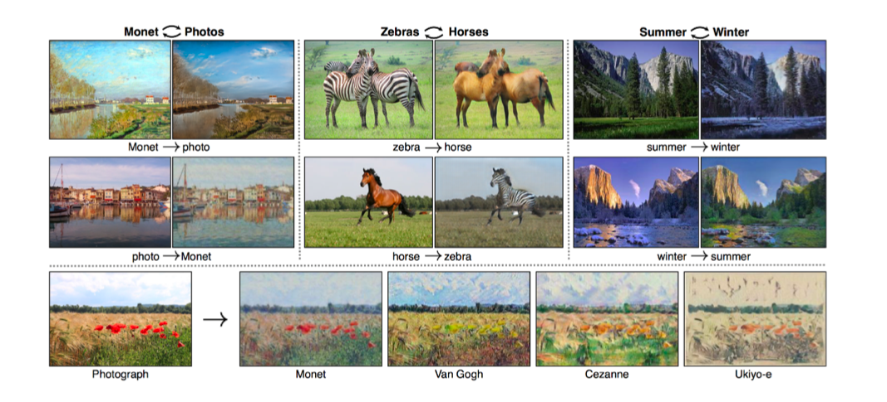

# Day 10 DL basic 9~10강 Data Viz 2강 

## 목차 

1. [강의 내용 정리](#1-강의-내용-정리)

2. [과제 수행 과정 / 결과물 정리](#2-과제-수행-과정--결과물-정리)

3. [피어세션 정리](#3-피어세션-정리)

<!--4. [흥미있던 질문들](#4-흥미있던-질문들)-->

4. [학습 회고](#4-학습-회고)

----

### 1. 강의 내용 정리

* DL basic 9~10강
    * 9강 : Generative Models 1
        * 개요 
        &nbsp; - &nbsp; genreative model을 학습한다-라는 것은 무엇일가(무엇을 의미할까)?  
         &nbsp;&nbsp;&nbsp;&nbsp; ‣ &nbsp; 단순히 이미지나 무언가를 생성하는것이 아니라 그 이상의 일을 할 수 있다. -> generation, density estimation(anomaly detection 등 <- 이것과 값이 어떤 input값이 들어오면 확률을 구할 수 있는게 explicti model이라고 한다. <-> implicit model : 단수히 생성만 하는 모델)  
          &nbsp; - &nbsp; Basic Discrete Distributions 
          &nbsp;&nbsp;&nbsp;&nbsp; ‣ &nbsp; Bernoulli distribution의 분포를 표현하기 위한 숫자는 1개만 필요하다. 
          
          &nbsp;&nbsp;&nbsp;&nbsp; ‣ &nbsp; Categorical distribution은 n-1개의 숫자가 있어야지 분포를 표현할 수 있다. 
            
          &nbsp; ! &nbsp; n개의 사건들이 모두 독립적이라면 어떨까? -> 그러면 학습시킬 파라미티의 수(분포를 표현하기 위한 숫자)가 n이 된다. 
          &nbsp; !! &nbsp; 그러나 현실적으로 독립적일 수 없다. 예를 들어서 이미지에서 하나의 픽셀이 다른 픽셀에 영향을 끼친다. 6이라는 숫자이미지와 같은 경우 6이 그어져 있는 부분의 주변은 흰색일 것이다. 
          &nbsp; !!! &nbsp; 모두 종속적인 사건일 경우는 너무 많은 파라미터가 필요하고 모두 독립적인 사건일 경우는 network가 표현할 수 있는게 제한적이니 이 중간을 찾고 싶은데 어떻게 하지?  
          &nbsp;&nbsp;&nbsp;&nbsp; 1. &nbsp; Chain rule  
          &nbsp;&nbsp;&nbsp;&nbsp; 2. &nbsp; Bayes' rule  
          &nbsp;&nbsp;&nbsp;&nbsp; 3. &nbsp; Conditional independence  
         &nbsp;&nbsp;&nbsp;&nbsp; * &nbsp; Conditional independence에 대한 보충 설명     
           
         &nbsp;&nbsp;&nbsp;&nbsp; 위와 같을때 conditional independence에 대한 설명은 다음과 같다. -> z가 주어졌을때 x와 y가 독립이다라는 가정을 한다면 z라는 변수과 주어졌을때 x와 y가 독립이니까 x라는 변수를 표현할때 z가 주어지면 y는 있어도 없어도 상관없다. => p(x|y, z) = p(x|z)&nbsp; 
        &nbsp;&nbsp;&nbsp;&nbsp; * &nbsp; markov assumption : 시간 t에서는의 상태는 t-1에서의 상태에만 영향을 받는다.  
         
        [좀 더 자세히 알고 싶으면 클릭1](https://sites.google.com/site/machlearnwiki/RBM/markov-chain) 
        [좀 더 자세히 알고 싶으면 클릭2](https://jiminsun.github.io/2018-02-02/markov-chain/) 
        [좀 더 자세히 알고 싶으면 클릭3](https://untitledtblog.tistory.com/139) 
        &nbsp;&nbsp;&nbsp;&nbsp; * &nbsp; 이때의 파라미터의 개수는 2n-1이 된다. 
         
        
        * Auto-regressive model  
        &nbsp; - &nbsp; 위의 markob assumption과 그 이상의(i의 사건은i-1말고도 1에서 i-1까지 모든 경우에서 영향을 받는다) 의미도 포함한다.
        &nbsp; - &nbsp; 이전 n개를 고려하는 model을 AR-n model이라고 한다.  
        &nbsp; - &nbsp; ordering을 고려하는 것도 중요! 
         

        * NADE : Neural Autoregressive Density Estimator 

        &nbsp; - &nbsp; 이 모델은 i번째 상황(이미지에서는 pixel)은 i-1번째에만 영향을 받는 모델이다. 
         
        &nbsp; - &nbsp; 상황이 지남에 따라 weight가 점차 가중된다. 
        &nbsp; - &nbsp; explicit model이다. -> 어떤 input이 주어질때 이것의 확률분포를 구할 수 있기 때문 

        * Pixel RNN  
        &nbsp; - &nbsp; RGB를 가지고 예를 든다면 다음과 같다.  
        
        &nbsp; - &nbsp; i번째 pixel에 R을 만들고 그 후 G를 만든 다음 B를 만든다. 
        &nbsp; - &nbsp; auto-regressvie 모델과 차이점은 auto-regressive모델은 i번째를 고려하기 위해서 1부터 고려하지만 pixel rnn은 자기 순회를 통해서 generation한다.  
        &nbsp; - &nbsp; pixel rnn은 ordering에 따라서 RowLSTM과 Diagonal BiLSTM으로 나눠진다. 
        

         

    * 10강 : Generative Models 2
        * Latent variable models 
        &nbsp; - &nbsp; Variational auto-encoder   
        &nbsp;&nbsp;&nbsp;&nbsp; * &nbsp; 사후분산을 구하는게 목적이다. 
        &nbsp;&nbsp;&nbsp;&nbsp; * &nbsp; Variational distribution이란 posterior distirbution을 직접적으로 구하기 힘듬으로 가장 근사값을 구하기 위한 것이다. 
        &nbsp;&nbsp;&nbsp;&nbsp; * &nbsp; variational distribution에서는 KL-divergence를 이용하여 posterior distribution과 variational distribution의 차이를 줄이려고 한다. 
        &nbsp;&nbsp;&nbsp;&nbsp; ! &nbsp; 그런데 GAN에서는 찾고자하는 posterior distribution에 대해서 제대로 모르는데 variational distribution을 찾을 수가 있나? 
        &nbsp;&nbsp;&nbsp;&nbsp; * &nbsp; 아래의 ELBO 수식을 이용하면 위의 문제를 해결할 수 있다.(밑에는 해당 수식이다.) 
        
        &nbsp;&nbsp;&nbsp;&nbsp; * &nbsp; ELBO를 키우므로써 우리가 원하는 값의 근차치를 구한다고 하셨는데 이 부분에 대해서 잘 이해가 가지 않음 ㅠㅠ. 
        [ELBO에 대한 자세한 내용](https://yonghyuc.wordpress.com/2019/09/26/elbo-evidence-of-lower-bound/) 
        &nbsp;&nbsp;&nbsp;&nbsp; * &nbsp; ELBO에 대해서 자세하게 이해하려면 KL-
        Divergence에 대해서 다시 복습해야 될 것 같다. 
        [KL-Divergence 정리한 내용](../../week1/day3/day3.md) 
        &nbsp;&nbsp;&nbsp;&nbsp; * &nbsp; ELBO를 좀 더 자세하게 들어간다면 아래와 같이 reconstruction term과 prior fitting term으로 나누어진다. 
        
        &nbsp;&nbsp;&nbsp;&nbsp; * &nbsp; variational auto-encoder 주요 한계  
        &nbsp;&nbsp;&nbsp;&nbsp;&nbsp;&nbsp;&nbsp;&nbsp; 1. &nbsp; explicit하지 않다. -> likelihood를 계산하지 못한다.  
        &nbsp;&nbsp;&nbsp;&nbsp;&nbsp;&nbsp;&nbsp;&nbsp; 2. &nbsp; KL-Divergence 자체에 적분이 들어가서 계산을 하는데 다루기 힘들어 isotropic gaussian을 더 많이 이용한다.  
        [isotropic gaussian에 대한 좀 더 자세한 내용](http://norman3.github.io/prml/docs/chapter02/3_1.html) 
        &nbsp;&nbsp;&nbsp;&nbsp; * &nbsp; gaussian을 활용하고 싶지 않을때 사용하는 방식이 adverarial auto-encoder이다.  
        [AAE에 대한 추가 내용](https://greeksharifa.github.io/generative%20model/2020/08/23/AAE/) 

         

        * GAN 
        &nbsp; - &nbsp; 도둑과 경찰로 예시를 들면 도둑은 상용지폐와 똑같이 생긴 위조지페를 만들고 싶어하고 경찰은 위조지폐를 잘 분별하여 그것들을 분별한다. 그러면 도둑은 분별된 지폐들을 통해서 위조지폐에 대해서 업그레이드 하여 더욱 상용화폐와 가까운 위조지폐를 만든다. 
        
        [GAN 보충 유튜브](https://www.youtube.com/watch?v=odpjk7_tGY0&t=69s) 
         

        * GAN의 종류 
         &nbsp; - &nbsp; DCGAN : 이미지 도메인으로 활용  
           
         &nbsp; - &nbsp; info-GAN : generation할때 특정 모듈에 집중할 수 있도록 만들어준 형태.  
           
         &nbsp; - &nbsp; text2image : 문장이 주어질때 이것을 가지고 이미지로 만들어낸다.  
          
         &nbsp; - &nbsp; Puzzle-gan : 이미지 특정 요소를 넣으면 원래 전체 이미지를 알아낼 수 있다.  
         
         &nbsp; - &nbsp; CycleGan : A와 B라는 object를 학습시키면 아래와 같이 어떤 이미지안에 있는 A를 B로 바꿔줄 수 있다. 학습시, A와 B는 같은 자세일 필요가 없다.  
         
         &nbsp; - &nbsp; star-gan : 이미지 사용자 의도로 새롭게 생성할 수 있다  
         
         &nbsp; - &nbsp; Progressvie-GAN : 고차원의 이미지를 잘 만들 수 있는 방법론이다. 저차원에서 고차원 이미지로 점차 늘려가면서 학습시켜 생성하는 방법으로 좋은 이미지를 생성할 수 있는 방법론이다. 
         
       

    

### 2. 과제 수행 과정 / 결과물 정리
 

#### 필수과제 MHA에 대해서 하는데 어려웠다 ㅠㅠ. 분명 강의를 통해서 차근차근 따라갔지만 이해가 잘 안되었다. 그래서 이 부분에 대해서 주말에 다시 한번 정리해야겠다.

 

### 3. 피어세션 정리
 
20210813 피어세션  

모더레이터: 심우창  

회의록작성: 우원진  

🔍[팀 회고록 정리]  

각자 회고록을 작성할수 있는 시간 조금 가지기. 
각자의 회고를 간단하게 발표하기.  
 

📒[스페셜 피어세션]  

다른 팀들은 알고리즘도 많이 푼다. 
우리도 논문을 읽어보자 !! -> 원래 매주 금요일마다 2명이 발표하던것을 빼고 매주 논문을 읽고 목요일마다  이야기 하자 
이번 논문은 “Attention is  all you need”로 결정.   
 

 

🔍[일정변경]  
원래 오늘 있을 2명의 마지막 발표를 다음주 화요일로 옮기자.

  

### 4. 학습 회고

#### ㅎㅎ; GAN강의가 너무 어려웠다.... 그래서 다시보면서 내용 정리를 하려고 한다. ㅠㅠ

 

#### 스페셜 세션을 통해서 다른 조들은 어떤식으로 피어세션을 활용하는지 알 수 있었고 강의에 대해서 나뿐만이 아니라 다른 사람들도 어려워한다는 것을 알았다.
 

#### 피어세션에서는 팀회고록을 통해서 팀원들의 생각을 알 수 있는 좋은 기회였고 우리 조의 공부에 대한 열정이 크다는 것을 다시 느끼게 되었다.

 

#### 오늘도 시간이 빠르게 지나갔지만 생각보다 한 게 별로 없어서 아쉽웠다. 주말에 쉬면서 남은 강의 내용 요약이랑 모르는거 추가로 정리 및 필수과제 pytocrch 따라서 해보기, 논문 읽기 등 할게 아주 많다 ㅠㅠ

#### 주말에 쉬면서 할 일들 하고 월요일을 잘 활용해야겠다~~~😁