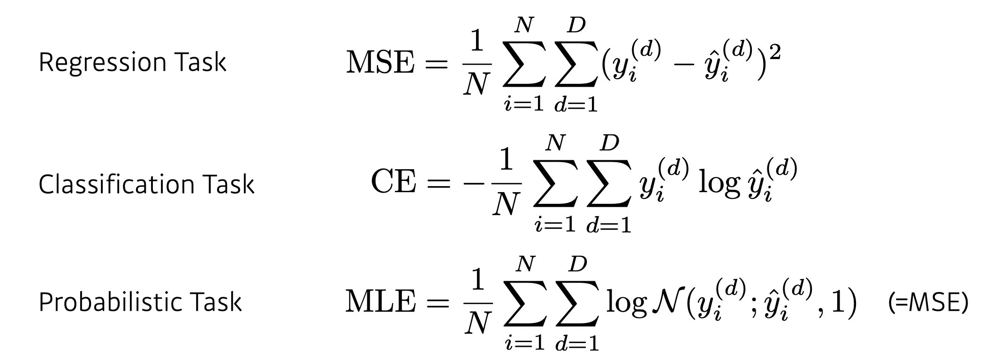
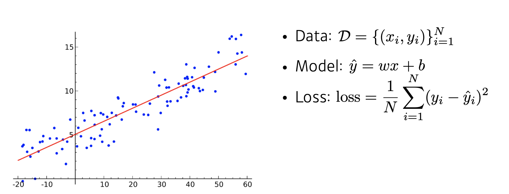
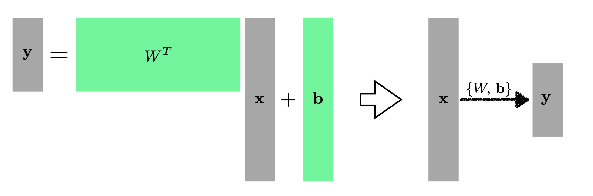
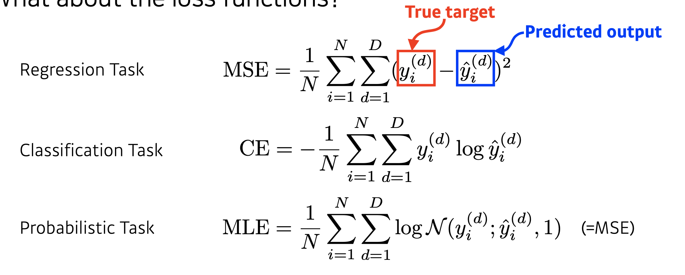

# Day 6 ( DL basic 1 ~ 2강 / Data Viz 1 ~ 2 강)

## 목차 

1. [강의 내용 정리](#1-강의-내용-정리)
2. [과제 수행 과정 / 결과물 정리](#2-과제-수행-과정--결과물-정리)
3. [피어세션 정리](#3-피어세션-정리)
4. [학습 회고](#4-학습-회고)

----

### 1. 강의 내용 정리

* DL basic 1 ~ 2강
    * 1강 : Historical Review
        * 딥러닝의 주요 요소 
        &nbsp; - &nbsp; 모델을 학습시킬 데이터  
        &nbsp; - &nbsp; 데이터를 통해서 학습시키고자 하는 모델  
        &nbsp; - &nbsp; 모델을 학습시키기 위한 loss function  
        &nbsp; - &nbsp; loss function을 최소화시키기 위한 알고리즘  
        &nbsp;&nbsp;&nbsp;&nbsp; => &nbsp; 이러한 4가지 관점을 토대로 논문 혹은 연구를 본다면 이전 논문과 연구에 비해 어떤 장점이 있고 어떤 부분에 기여를 했는지 알 수 있다.  
         
        * Data -> 풀고자 하는 문제에 따라 다르다. 
        &nbsp; - &nbsp; Classification : 분류 문제  
        &nbsp; - &nbsp; sematic segmentation : 이미지 픽셀 별로 구별하는 문제  
        &nbsp; - &nbsp; Detection : 바운딩 박스를 찾을려고 하는 문제 
        &nbsp; - &nbsp; Pose estimation : 이미지에 있는 사람의 3차원, 2차원 스켈레톤 정보  
        &nbsp; - &nbsp; Visual QnA : 이미지와 질문을 주고 답을 구하도록 하는 것  
         

        * Model -> 데이터를 주어졌을때 문제를 해결하기 위한 알고리즘 
         

        * Loss -> 모델과 데이터가 정해져 있을때 어떻게 학습시킬지에 대한(업데이트 할지) 기준 
        
        &nbsp; - &nbsp; MSE <- 회귀문제에서 사용  
        &nbsp; - &nbsp; CE <- 분류문제에서 사용  
        &nbsp; - &nbsp; MLE <- 확률문제에서 사용  
         

        * optimization 알고리즘 -> 데이터와 모델, loss function이 주어져있을때 네트워크를 어떻게 줄일지에 대한 것 
        &nbsp; * &nbsp; optimization 알고리즘 + 아래와 같은 방식을 사용하여 -> 학습되지 않은(test data)를 잘 예측하도록 만들어줌  
        &nbsp; - &nbsp; Dropout, Early stopping, k-fold validation, weight decay, batch normalization, mixup, ensemble, bayesian optimization  
         

        * Historical review 
        &nbsp; - &nbsp; 2012 - AlexNet  
        &nbsp;&nbsp;&nbsp;&nbsp; ‣ &nbsp; 이전 이미지넷 대회는 주로 고전적인 머신러닝들이 1등을 했는데 이때부터 딥러닝기술들이 1등을 차지했다.&nbsp;  
         
        &nbsp; - &nbsp; 2013 - DQN  
        &nbsp;&nbsp;&nbsp;&nbsp; ‣ &nbsp; 딥마인드가 만든 강화학습 논문&nbsp;  
         
        &nbsp; - &nbsp; 2014 - Encoder / Decoder  
        &nbsp;&nbsp;&nbsp;&nbsp; ‣ &nbsp; 단어의 연속이 주어졌을때 다른 언어 단어의 연속으로 변화해주는 방법 -> 이 seq2seq가 transformer에 큰 영향을 주었다.&nbsp;  
         
        &nbsp; - &nbsp; 2014 - Adam Optimizer  
        &nbsp;&nbsp;&nbsp;&nbsp; ‣ &nbsp; 최적화를 위해서 Adam을 사용하는데 왜 사용할까? -> Adam을 적용하지 않고 다른 방식으로 최적화 파라미터를 구하기 위해서는 매우 많은 양의 gpu가 필요하다. So 그만한 자원이 없는 사람은 adam(이것을 사용하면 왠만하면 결과가 잘 나온다.)을 사용하므로써 무난하게 성능을 높이려고 해서 사용한다.&nbsp;   
        &nbsp; - &nbsp; 2015 - Generative Adversarial Network  
        &nbsp;&nbsp;&nbsp;&nbsp; ‣ &nbsp; 이미지를 어떻게 만들 수 있을지에 대해서 설명을 한다. -> 간단하게 말하면 network가 Generator와 Discriminator를 만들어서 학습을 시킨다. 
         
        &nbsp; - &nbsp; 2015 - Residual Networks  
        &nbsp;&nbsp;&nbsp;&nbsp; ‣ &nbsp; 이 연구 덕분에 딥러닝이 딥러닝이 가능해졌다. -> 이전보다 더 깊게 네트워크를 쌓더라도 성능이 괜찮게 나올 수 있는 방법론 제시  
         
        &nbsp; - &nbsp; 2017 - Transformer  
        &nbsp;&nbsp;&nbsp;&nbsp; ‣ &nbsp; nlp뿐만 아니라 CNN에 대해서도 큰 영향을 준 논문이다.  
         
        &nbsp; - &nbsp; 2018 - BERT(fine-tuned NLP models)  
        &nbsp;&nbsp;&nbsp;&nbsp; ‣ &nbsp; 풀고자 하는 문제에 대한 데이터가 별로 없더라도 다양한 말뭉치를 통해서 좋은 결과는 내는 방법에 대한 논문 
         
        &nbsp; - &nbsp; 2019 - BIG Language Models(GPT)  
        &nbsp;&nbsp;&nbsp;&nbsp; ‣ &nbsp; fine-tuning을 통해서 문장, 프로그램, 표 등의 시퀀스 데이터를 만들어 낸다.  
         
        &nbsp; - &nbsp; 2020 - Self Supervised Learning  
        &nbsp;&nbsp;&nbsp;&nbsp; ‣ &nbsp; 학습데이터 외에 label을 모르는 데이터를 가지고 학습을 하여 좋은 결과를 낼 수 있게 만드는 논문  
         

    * 2강 : Multi-Layer Perceptron
        * 딥러닝은 인간의 뇌를 모방한 방법론인가? 
        &nbsp; - &nbsp; 반은 맞고 반을 틀리다. 처음에는 뇌를 모방하였지만 시간이 갈수록 뇌를 모방하는 것보다 다른 방식을 발전 -> backpropagation, 비행기를 예로 들어줌(원래 새나 박쥐를 모방하였지만 나중에 제트기와 비행기처럼 다른 형태를 띔)  
         

        * Linear Neural Networks 
        &nbsp; - &nbsp; 아래와 같이 D가 있고 model을 다음과 같이 선언했을때 회귀문제이므로 loss는 MSE를 사용한다.  
          
        &nbsp; - &nbsp; 위와 같을때 어떻게 w, b를 찾을까? -> 파라미터를 어떻게 바꿨을때 loss값이 줄어들까 -> loss를 미분해서 반대방향으로 업데이트를 시켜주면 loss값이 줄어든다. 이 값을 이용해서 w,b를 업데이트 시켜주면 된다.   
        &nbsp; - &nbsp; 해결하고자 하는 문제와 결과 값이 차원이 다를 수 있다. 그래서 아래와 같이 선형성의 변화를 통해서 차원을 다뤄주면된다. 
        
        &nbsp; - &nbsp; 이와 같은 방식을 중첩해서 쌓으면 neural network가 되는 건가?  
        &nbsp; - &nbsp; => Nop, 이것은 하나의 선형과 다를게 없다. 즉, 중간에 비선형 함수가 필요하다.(네트워크의 표현력 극대화하기 위해서) 
         

        * 왜 딥러닝이 좋은 결과를 만들어 내는가? -> 히든레이어가 하나 있는 레이어는 우리가 원하는 문제를 해결할 수 있다.(이론적으로, 즉 존재성만 나타내고 성능과는 연관이 없다.) <- 그래도 네트워크의 표현력이 좋다는 것을 말함. 
         

        * Multi-Layer Perceptron 
        
        &nbsp; - &nbsp; 왜 해당 loss function을 사용하는지 잘 알고 있어야 한다. 예를 들어서 MSE에서 제곱을 해주는 이유는 실제값과 예측값의 차이가 지수형태로 커지게 되므로 이러한 성질이 문제를 해결하는데 도움이 될때가 있다. 그렇지만 이 성질이 독이 되고 오히려 n1노름이 도움이 될때도 있다. 즉, 어떤 상황에서 어떤 모델에 어떤 loss function을 사용해야 하는지 항상 생각해야 한다. 
         

* Data Viz 1 ~ 2강
    * 1-1강 : Welcome to Visualization
        * 백터 : 공간에서 한 점을 나태내며 이때 원점으로부터 상대적인 위치로 표시한다. 
        &nbsp;    - 벡터끼리 같은 모양을 가져야지 덧셈과 뺄셈등의 연산을 할 수 있다. 
        &nbsp;  - 벡터의 성분곱이란 모양이 같은 벡터끼리 같은 위치의 원소(성분)들을 곱하는 것을 의미한다. 
        &nbsp;  - 벡터의 덧셈과 뺄셈 모두 다른 벡터로부터 상대적 위치이동이다. 

        * 벡터의 노름 : 원점에서부터의 거리를 말한다. 
        &nbsp;  - L1 : 각 성분의 변화량의 절대값을 더한 값 
        &nbsp;  - L2 : 유클리드 거리

        * 두 벡터 사이의 각도 구하기 (L2 노름만 가능하다) 
        &nbsp;  - 벡터 x, y가 있을때 사이의 각도 𝜃를 구하기 위해서 제2 코사인 법칙을 이용하면 된다. 
        &nbsp;  - 제2 코사인 법칙에서 분자는 내적을 통해서 쉽게 구할 수 있다.

    * 1-2강 : 행렬
        * 행렬 : 벡터를 원소로 가지는 2차원 배열을 의미한다.  
        &nbsp;  - 행렬은 행(row)와 열(column)으로 구성이 된다. 
        &nbsp;  - 전치행령은 행과 열의 인덱스를 바꾼 행렬을 의미한다.
        * 행렬 이해하는 방법  
        &nbsp;  1. 공간상의 점들을 모임이라고 생각하기 
        &nbsp;  2. 행렬곱을 통해 벡터를 다른 차원의 공간으로 보내주는 연산자라고 생각하기
        * 행렬 연산
        &nbsp;  - 행렬의 덧셈, 뺄셈, 성분곱 등 벡터와 동일하게 같은 모양을 가지면 할 수 있다. 
        &nbsp;  - 스칼라곱도 벡터와 똑같은 방식으로 된다. 
        &nbsp;  - 행렬 곱셈 : 행렬 X, Y를 XY와 같이 행렬 곱셈을 한다면 X의 i번째 행벡터와 Y의 j번째 열벡터 사이의 내적을 성분으로 가지는 행렬을 계산하면 된다. 이때 행렬 곱셈을 하기 위해서는 X, Y의 크기가 n * m, m * k 와 같이 X의 행벡터의 사이즈와 Y의 열벡터 사이즈가 같아야 한다. 
        &nbsp;  ☆ numpy에서는 행렬곱을 할때 @기호를 이용하여 다음과 같이 사용한다. ex) X @ Y 
        &nbsp;  - 수학에서의 행렬의 내적과 numpy에서의 내적은 다름으로 주의해서 사용해야 한다.
        * 역행렬 : 행렬 X가 있을대 역행렬을 행렬 곰셈을 하게 된다면 항등행렬이 나온다. 이와 같이 역행렬을 나오기 위한 조건은 determinant가 0이 아니여야 한다.
        * 유사역행렬(무어-펜로즈) : 역행렬을 구할 수 없을때 사용하는 방법이다. 이때 행과 열의 크기에 따라 공식이 다름으로 주의하자.

    * 1-3강 : 경사하강법(순한맛)
        * 미분 : 변수의 움직임에 따른 함수값의 변화를 측정하기 위한 도구이다. 접선의 기울기를 구하기 위해서 미분을 사용한다. 
        &nbsp;  - 미분에서 구한 접선의 기울기를 통해서 어떤 방향으로 움직였을때 함수값이 증가/감소하는지 알 수 있다. 
        &nbsp;  ☆ 접선의 기울기가 양수라면 오른쪽으로 이동(x값 증가)하면 함수값 증가(y값 증가), 왼쪽으로 이동시(x값 감소) 함수값 감소(y값 감소). 접선의 기울기가 음수라면 반대.
        * 경사상승법 : 극대값의 위치를 구하는 방법
        * 경사하강법 : 극소값의 위치를 구하는 방법 
        &nbsp;  ☆ 경사상승법, 경사하강법 등은 접선의 기울기를 이용하며 극값에 도달하였을때 멈추게 된다.
        * 편미분 : 입력이 다변수인 경우에 사용하는 미분으로 특정 방향(변수)를 기준으로 미분을 한다. 예를 들어서 F라는 함수가 있고 x,y,z 등의 여러 변수가 있을때 x에 대해서 편미분을 한다면 x만 변수 취급을 해주고 다른 변수들은 상수로 생각하고 미분을 해주면 된다. 
        * 그레디언트(gradient) 벡터란 각 변수 별로 편미분을 계산한 것으로 경사하강법 혹은 경사상승법에 사용할 수 있다.

### 2. 과제 수행 과정 / 결과물 정리
 

#### pytorch에 대해서 잘 모르는 상태에서 강의만 듣고 문제를 따라 풀었다. 음... 뭔가 많이 찝찝했다. 내일부터 pytorch에 대해서 따로 공부를 하는게 좋을 것 같다. 그리고 피어세션때 선택과제 1 Vit에 대해서 해결하기 위해서 여러 고민을 했지만 아직 개념조차 잘 이해가 되지 않았다. 내일 피어세션때 이것에 대해서 다시 같이 풀자고 하였기때문에 이론부터 공부할 생각이다. 

 

### 3. 피어세션 정리

20210809 피어세션

🔍[지난주 질문]

- SVD 특이값 분해

Q. 대각행렬의 갯수를 제한하여 압축하는 방법 : 어떤 기준으로 압축하고 어떻게 적용되는가?
A. (적용흐름은 코드 참조) Sigma-Singular value가 가장 높은 것부터 추출. 즉, 가장 유의미한 정보순으로 나열 후 뒤부터 탈락시키며 압축시킨다.
Q. SVD에서 Simgular value가 원래 크기 순으로 정렬되어 있는가?
A. 더 조사 후 내일 답변.

📔 [이번 주 (금) 발표자 선정]

강진선님, 우원진님

금요일 스페셜 피어세션과 회고로 시간이 부족하다면 다음 피어세션으로 넘김.

📒 [멘토링 시간 변경]

오피스아워 전날 오후 7시(수)로 변경.

📌 [선택과제 1번 스터디]

VIT 실습 코드 스터디. 참조 링크 내부 공유 예정.

### 4. 학습 회고

#### 음... 오늘도 순식간에 하루가 지나갔다. 음... 아침에 비몽사몽한 상태로 강의를 듣고 pytorch 과제때문에 놀라서 잠이 깨고 그러다가 피어세션하고.... 강의 내용 정리하고(아직 시각화쪽 정리는 덜 했지만 ㅎㅎ;)... 요즘 하루하루 공부하는게 즐겁다. 다만, 가끔씩 부족한 내 자신을 남하고 비교하여 내 자신을 너무 갉아먹는 것 같아서 이 부분에 대해서 신경을 써야할 것 같다. 아무튼 오늘도 즐거운 하루였다~~~ ㅎㅎ 내일도 화이팅👍

