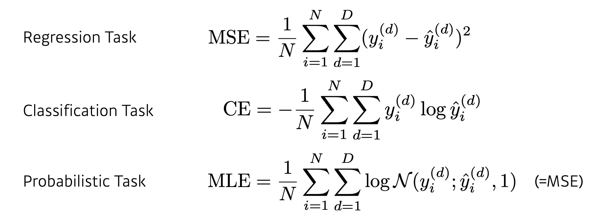

# Day 6 ( DL basic 3강 / Data Viz 2 강)

## 목차 

1. [강의 내용 정리](#1-강의-내용-정리)
2. [과제 수행 과정 / 결과물 정리](#2-과제-수행-과정--결과물-정리)
3. [피어세션 정리](#3-피어세션-정리)
4. [학습 회고](#4-학습-회고)

----

### 1. 강의 내용 정리

* DL basic 3강
    * 3강 : Historical Review
        * 딥러닝의 주요 요소 
        &nbsp; - &nbsp; 모델을 학습시킬 데이터  
        &nbsp; - &nbsp; 데이터를 통해서 학습시키고자 하는 모델  
        &nbsp; - &nbsp; 모델을 학습시키기 위한 loss function  
        &nbsp; - &nbsp; loss function을 최소화시키기 위한 알고리즘  
        &nbsp;&nbsp;&nbsp;&nbsp; => &nbsp; 이러한 4가지 관점을 토대로 논문 혹은 연구를 본다면 이전 논문과 연구에 비해 어떤 장점이 있고 어떤 부분에 기여를 했는지 알 수 있다.  
         
        * Data -> 풀고자 하는 문제에 따라 다르다. 
        &nbsp; - &nbsp; Classification : 분류 문제  
        &nbsp; - &nbsp; sematic segmentation : 이미지 픽셀 별로 구별하는 문제  
        &nbsp; - &nbsp; Detection : 바운딩 박스를 찾을려고 하는 문제 
        &nbsp; - &nbsp; Pose estimation : 이미지에 있는 사람의 3차원, 2차원 스켈레톤 정보  
        &nbsp; - &nbsp; Visual QnA : 이미지와 질문을 주고 답을 구하도록 하는 것  
         

        * Model -> 데이터를 주어졌을때 문제를 해결하기 위한 알고리즘 
         

        * Loss -> 모델과 데이터가 정해져 있을때 어떻게 학습시킬지에 대한(업데이트 할지) 기준 
        
        &nbsp; - &nbsp; MSE <- 회귀문제에서 사용  
        &nbsp; - &nbsp; CE <- 분류문제에서 사용  
        &nbsp; - &nbsp; MLE <- 확률문제에서 사용  
         

        * optimization 알고리즘 -> 데이터와 모델, loss function이 주어져있을때 네트워크를 어떻게 줄일지에 대한 것 
        &nbsp; * &nbsp; optimization 알고리즘 + 아래와 같은 방식을 사용하여 -> 학습되지 않은(test data)를 잘 예측하도록 만들어줌  
        &nbsp; - &nbsp; Dropout, Early stopping, k-fold validation, weight decay, batch normalization, mixup, ensemble, bayesian optimization  
         

        * Historical review 
        &nbsp; - &nbsp; 2012 - AlexNet  
        &nbsp;&nbsp;&nbsp;&nbsp; ‣ &nbsp; 이전 이미지넷 대회는 주로 고전적인 머신러닝들이 1등을 했는데 이때부터 딥러닝기술들이 1등을 차지했다.&nbsp;  
         
        &nbsp; - &nbsp; 2013 - DQN  
        &nbsp;&nbsp;&nbsp;&nbsp; ‣ &nbsp; 딥마인드가 만든 강화학습 논문&nbsp;  
         
        &nbsp; - &nbsp; 2014 - Encoder / Decoder  
        &nbsp;&nbsp;&nbsp;&nbsp; ‣ &nbsp; 단어의 연속이 주어졌을때 다른 언어 단어의 연속으로 변화해주는 방법 -> 이 seq2seq가 transformer에 큰 영향을 주었다.&nbsp;  
         
        &nbsp; - &nbsp; 2014 - Adam Optimizer  
        &nbsp;&nbsp;&nbsp;&nbsp; ‣ &nbsp; 최적화를 위해서 Adam을 사용하는데 왜 사용할까? -> Adam을 적용하지 않고 다른 방식으로 최적화 파라미터를 구하기 위해서는 매우 많은 양의 gpu가 필요하다. So 그만한 자원이 없는 사람은 adam(이것을 사용하면 왠만하면 결과가 잘 나온다.)을 사용하므로써 무난하게 성능을 높이려고 해서 사용한다.&nbsp;   
        &nbsp; - &nbsp; 2015 - Generative Adversarial Network  
        &nbsp;&nbsp;&nbsp;&nbsp; ‣ &nbsp; 이미지를 어떻게 만들 수 있을지에 대해서 설명을 한다. -> 간단하게 말하면 network가 Generator와 Discriminator를 만들어서 학습을 시킨다. 
         
        &nbsp; - &nbsp; 2015 - Residual Networks  
        &nbsp;&nbsp;&nbsp;&nbsp; ‣ &nbsp; 이 연구 덕분에 딥러닝이 딥러닝이 가능해졌다. -> 이전보다 더 깊게 네트워크를 쌓더라도 성능이 괜찮게 나올 수 있는 방법론 제시  
         
        &nbsp; - &nbsp; 2017 - Transformer  
        &nbsp;&nbsp;&nbsp;&nbsp; ‣ &nbsp; nlp뿐만 아니라 CNN에 대해서도 큰 영향을 준 논문이다.  
         
        &nbsp; - &nbsp; 2018 - BERT(fine-tuned NLP models)  
        &nbsp;&nbsp;&nbsp;&nbsp; ‣ &nbsp; 풀고자 하는 문제에 대한 데이터가 별로 없더라도 다양한 말뭉치를 통해서 좋은 결과는 내는 방법에 대한 논문 
         
        &nbsp; - &nbsp; 2019 - BIG Language Models(GPT)  
        &nbsp;&nbsp;&nbsp;&nbsp; ‣ &nbsp; fine-tuning을 통해서 문장, 프로그램, 표 등의 시퀀스 데이터를 만들어 낸다.  
         
        &nbsp; - &nbsp; 2020 - Self Supervised Learning  
        &nbsp;&nbsp;&nbsp;&nbsp; ‣ &nbsp; 학습데이터 외에 label을 모르는 데이터를 가지고 학습을 하여 좋은 결과를 낼 수 있게 만드는 논문  
         

    

### 2. 과제 수행 과정 / 결과물 정리
 

#### 필수 과제는 강의를 보면서 잘 따라갔다. 그러나 중간에 matplotilb을 설치하고 restart를 해줘야 하는데 안 해줘서 생기는 오류 때문에 시간이 조금 걸렸다.

#### 선택 과제같은 경우는 어제 유튜브보고 오늘 블로그를 보면서 해결하려고 하지만 잘 이해가 안된다. 포기하지 말고 반복해서 알때까지 읽어야 겠다 ㅠㅠ

 

### 3. 피어세션 정리

20210809 피어세션

🔍[지난주 질문]

- SVD 특이값 분해

Q. 대각행렬의 갯수를 제한하여 압축하는 방법 : 어떤 기준으로 압축하고 어떻게 적용되는가?
A. (적용흐름은 코드 참조) Sigma-Singular value가 가장 높은 것부터 추출. 즉, 가장 유의미한 정보순으로 나열 후 뒤부터 탈락시키며 압축시킨다.
Q. SVD에서 Simgular value가 원래 크기 순으로 정렬되어 있는가?
A. 더 조사 후 내일 답변.

🔍[지난 질문들]

- SVD 특이값 분해
Q. SVD에서 Singular value가 원래 크기 순으로 정렬되어 있는가?
- 맞습니다.

  
📒 [강의 관련 질문]

Q. Adadelta - 실제로 거의 사용하지 않는 이유는 성능이 낮기 때문인가요?
- 성능이 낮다기 보다 learning rate가 없어 최적화가 관여할 요인이 없다.
- 다른 optimizer가 일반적으로 학습에 관여할 부분이 많아 성능이 더 잘나온다.

📌 [선택과제 1번 ViT 관련 질문]

Q. Transformer encoder 구현할 때 residual 부분이 다른 코드와 비교했을때, class로 구현하지 않더라도 맞나요?
- 맞습니다.

Q. attention visualization에서 error가 납니다.
- slack에서 다른 캠퍼분께서 수정하는 부분을 알려주셨다.
- 수정하지 않고도 attention을 리스트에 append하면서 shape을 맞추었더니 작동했다.

Q. position embedding을 할때 random한 값을 넣는 이유?
- 학습하는 값으로 생각해 랜덤하게 생성한 후 더해주었다.

Q. cls_token과의 concat으로 x의 shape이 어떻게 바뀌는 건가요?
- x의 shape이 (1, 49, 16)에서 concat으로 (1, 50, 16)이 된다.
- 이후 position의 shape이 (50, 16)이므로 x와 position을 더하는 과정에서 broadcasting이 일어난다.

Q. nn.linear mlp와의 차이가 없는건가요?
- nn.linear는 layer 그 자체로 fully connected된 선형변환이라고 생각.
- mlp는 activation function이 들어갔다.

Q. colab과 구글드라이브에서 데이터 저장이 마운트 없이 가능한가요?
- 가능하지만 구글드라이브에 저장하면 다운로드도 가능하다.

해결하지 못한 질문들은 대부분 아직 배우지않은 모델에서 나왔습니다.
이후 멘토님과의 시간에서 질문하기로 했습니다.

Q. attention을 넣을때 list를 만들어 넣어도 잘 작동하는 이유는 무엇인가요?

Q. transformer에 들어가는 latent vector는 각각의 patch를 의미하나요?

Q. self-attention의 shape이 768 -> 64 ->768로 바뀌는데 어떻게 되는건가요?

### 4. 학습 회고

#### 피어세션에서 나온 질문 중에 오늘 강의와 관련된 질문이 있었다. 해당 질문을 통해서 내가 강의를 제대로 이해하지 못했음을 알게 되었고 강의 내용을 정리하면서 수식에서 내가 놓치는 부분이 없는지 다시 확인해 봐야겠다.

 

#### 피어세션때 다른 캠퍼분들은 선택과제 1을 완료하신것 같다. 나는 아직.... ㅎㅎ;;; ㅠㅠ
#### 그래서 선택과제 코드와 관련된 질문이나 대답을 할 수 없었다... 

 

#### 일단 지금은 학습이고 배우기 위한 과정이니까 괜찮지만 나중에 2주뒤에 있을 경진대회 같은 팀단위 활동에서는 오늘과 같이 뒤쳐지면 안 된다. 만약에 뒤쳐지다면 나 때문에 다른 캠퍼님들이 피해를 입게 될 것이다. 그러므로 경진대회전까지 기초를 탄탄히해서 경진대회때 내가 맡은 역할을 잘 수행할 수 있도록 실력을 키워야겠다. 열심히 노력하자~~!!! 화이팅~~~😊

 

#### 아무튼 오늘도 유익한 피어세션이었다 🤩

 

#### 도메인 강의와 마스터 클래스 강의를 들었는데 매우 유익했다. 특히 도메인 같은 경우는 cv와 nlp에 대해서 어떻게 공부하면 좋을지 또 이후 과정에서 어떤 것을 중점적으로 보면 좋을지에 대해서 알게 되었다. 마스터 클래스에서는 시각화의 중요성에 대해서 어느정도 이해하게 되었다. 하지만 시각화를 언제 어떻게 활용하면 좋을지는 잘 모르겠다. 이 부분은 강의를 수강하다보면 알게 되지 않을까 싶다.

 

#### 오늘도 보람찬 하루였다 ㅎㅎ 