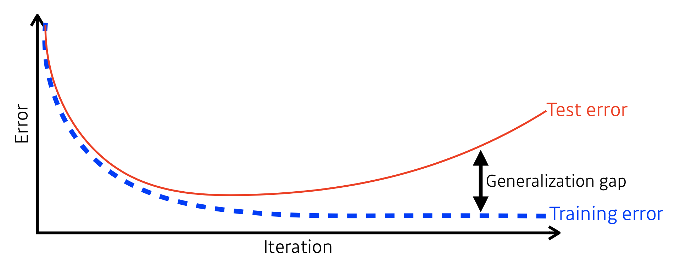
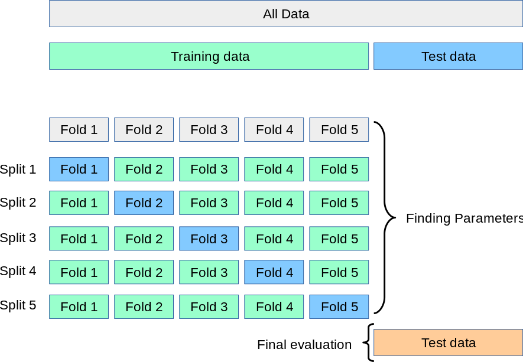
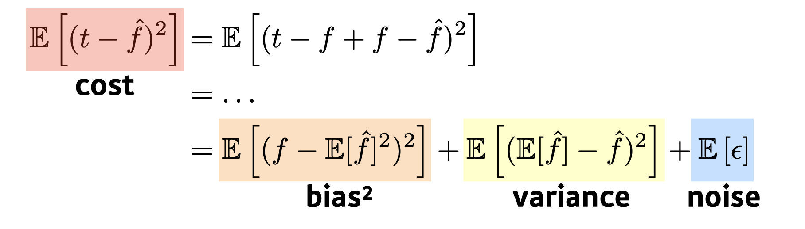
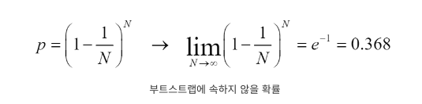
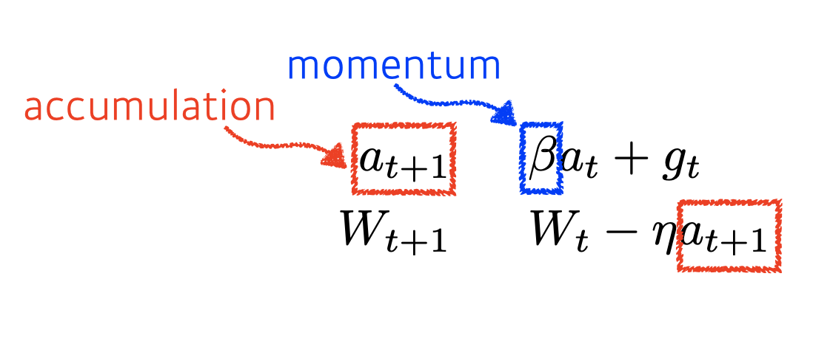
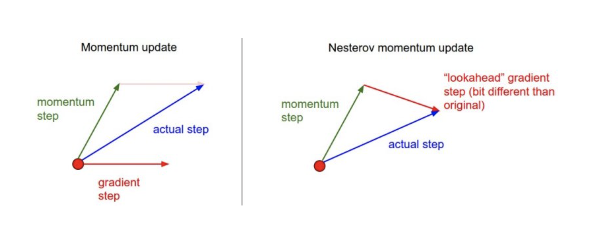
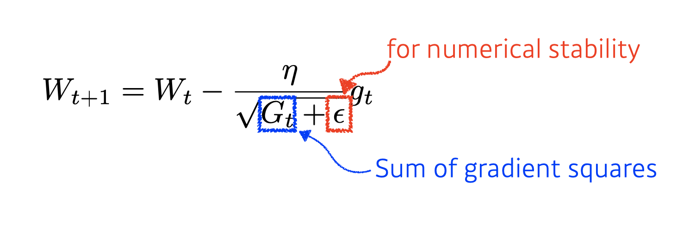
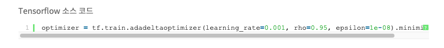
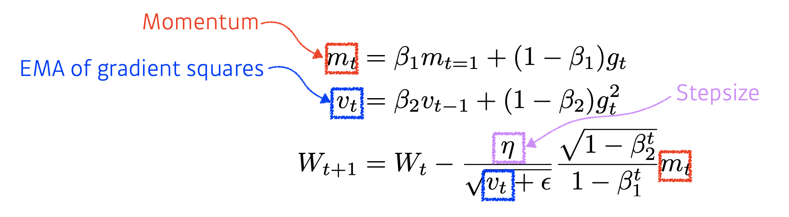

# Day 6 DL basic 3강 

## 목차 

1. [강의 내용 정리](#1-강의-내용-정리)
2. [과제 수행 과정 / 결과물 정리](#2-과제-수행-과정--결과물-정리)
3. [피어세션 정리](#3-피어세션-정리)
4. [학습 회고](#4-학습-회고)

----

### 1. 강의 내용 정리

* DL basic 3강
    * 3강 : Optimization
        * 주요 최적화 용어 
        &nbsp; 1. &nbsp; Generalization  
        
        &nbsp;&nbsp;&nbsp;&nbsp; - &nbsp; 위와 같이 test error와 train error의 차이를 generalization gap이라고 하고 generalization이 모델이 학습하지 않은 자료를 얼마나 잘 예측할 수 있는지를 말한다.  
         

        &nbsp; 2. &nbsp; Under-fitting vs. over-fitting 
        &nbsp;&nbsp; - &nbsp; under-fitiing : 학습이 잘 이루어지지 않는 상태 
        &nbsp;&nbsp; - &nbsp; over-fitting : 학습이 과도하게 이루어진 상태 <- 주로 이 상태일때 train data에 대한 성능은 좋으나 test data에 대해서는 성능이 안 좋다 -> generalization gap이 크다고 말할 수 있따. 
         
        &nbsp; 3. &nbsp; Cross validation  
         &nbsp;&nbsp; - &nbsp; train data에서 일부를 평가하는데 사용하는 방식으로 대부분의 data를 학습시키는데 사용하고 20~30%정도 평가를 위해서 사용 
        &nbsp;&nbsp; - &nbsp; K-fold : train data set을 k개의 뭉치로 나누고 k-1개로 학습을 시키고 남은 한 뭉치고 평가를 해본다. 
        &nbsp;&nbsp;&nbsp;&nbsp; * &nbsp; 조금 더 알아보기 - > k-fold 방식은 k개로 나눕니다. 이렇게 만들어진 뭉치를 fold라고 합니다. 각 fold에 대해서 다시 k개로 분할을 시킵니다. 이때 생긴 뭉치를 split이라고 하겠습니다. fold 1 ~ 5까지 순차적으로 학습을 하는데 이때 validation하는 위치를 바꿔줍니다. 예를 들면 fold 1에서는 split 1이 validation역할을 하고 fold 2에서는 split 2, ... fold 5에서는 split 5가 validation 역할을 수행해 줍니다. 이때 각 fold에서는 validation을 평가하기 위한 모델을 만들고 validation - 예측값을 통해 error를 계산해 줍니다. 이런식으로 반복을 한 후 error들의 평균으로 최적의 모델을 찾습니다.  
        

        &nbsp;&nbsp;&nbsp;&nbsp; -> &nbsp; 이와 같은 방식은 성능은 좋게 나오나 일반적인 학습방법에 비해 시간이 많이 소요됩니다. 

        [조금 더 알아보기 참고 사이트1](https://hanawithdata.tistory.com/entry/Cross-Validation-%EA%B5%90%EC%B0%A8%EA%B2%80%EC%A6%9D-%EC%9D%B4%EB%9E%80) 
        [조금 더 알아보기 참고 사이트2](https://nonmeyet.tistory.com/entry/KFold-Cross-Validation%EA%B5%90%EC%B0%A8%EA%B2%80%EC%A6%9D-%EC%A0%95%EC%9D%98-%EB%B0%8F-%EC%84%A4%EB%AA%85)
         

        &nbsp; 4. &nbsp; Bias-variance tradeoff  
        &nbsp;&nbsp; - &nbsp; variance : 출력이 얼마나 일괄적인가? (낮을수록 일괄적이다.) 
        &nbsp;&nbsp; - &nbsp; bias : 평균적으로 봤을때 원하는 답과 비슷한가? (낮을수록 원하는 답과 비슷하다.) 
        &nbsp;&nbsp; => &nbsp; variance와 bias가 낮은게 좋다. 그 다음 bias는 높더라도 variance가 낮은게 좋다. 왜냐하면 군집되어있는 곳만 잘 학습시켜서 바꿔주면 되기 때문이다(사격으로 예시를 들면 탄착군이 중앙보다 위에 있더라도 다음번에는 좀 더 아래로 쏘면 탄착군이 중앙으로 이동할 확률이 크기 때문). 
        &nbsp;&nbsp;&nbsp;&nbsp; * &nbsp; Bias and variance tradeoff : noise가 있을때 cost를 줄이기 위해서 bias, variance를 낮출때 둘 다 줄어들지는 않는다. 하나가 줄어들면 다른 하나가 커진다.  
        
          

        &nbsp; 5. &nbsp; Bootstrapping  
        &nbsp;&nbsp; - &nbsp; 학습 데이터를 가지고 여러 모델을 만들고 동일한 여러 모델에 동일한 input을 주었을때 결과의 일관성 정도를 확인 
        &nbsp;&nbsp;&nbsp;&nbsp; * &nbsp; 조금 더 알아보기  
            
            The Adventures of Baron Munchausen(바론의 대모험)이라는 책을 보면 주인공 바론이 늪에 빠지게 되는데 이때 자신의 장화 끝 단(bootstrap)을 잡아 올라 스스로 늪에서 빠져나오는 장면이 나온다. 사실 작용 반작용의 법칙에 따라 불가능한 일이지만 논리는 차치하고, 이 일화처럼 스스로를 구해낸다는 뜻으로 bootstrap이라는 단어가 사용되었다.

            Bootstrap sampling 사용하는 이유
            Bootstrap sampling을 하면 애초에 한 개 밖에 없었던 우리들의 sample data set을 n개의 sample data set을 가지고 있는 것과 같은 효과를 누릴 수 있게 한다. 이를 통해 우리는 data의 variance를 상당히 잘 근사 할 수 있는 결과를 볼 수 있다.

             Bootstrap sampling을 하는 방법은 매우 간단하다. N개의 sample data를 가지고 있을 때 1000개의 bootstrap samples를 만들고자 하면, 복원 추출을 N번 실행하여 새로운 sample data set을 만들고 이 작업을 1000번 반복하면 된다.

         [조금 더 알아보기 인용 사이트1](https://modern-manual.tistory.com/31)
         

        &nbsp; 6. &nbsp; Bagging and boosting  
        &nbsp;&nbsp; - &nbsp; bagging : 여러 모델의 output을 이용 
        &nbsp;&nbsp;&nbsp;&nbsp; * &nbsp; 조금 더 알아보기 

            배깅의 풀네임은 Bootstrap aggregating 입니다. 말 그대로 부트스트랩(Bootstrap)을 통해서 다양한 데이터셋을 만들고 이를 학습시킨 모델을 모으는(Aggregating) 방법입니다. 

            bootstrap과 같이 복원추출에 경우 선택되지 않은 data가 존재할 수 있다. 이것을 OOB(Out Of Bag)라고 하며 공식은 다음과 같습니다.

                                        p=(1−1N)N
            N 이 커질수록 아래의 식에 의해서 이 값은 약 37% 정도에 가까워집니다
        

            부트스트랩은 데이터의 분포를 변형하는 효과가 있습니다. 원래 데이터의 노이즈 ϵ 가 특정 분포를 따르고 있다면 이를 통해 만드는 모델은 분포에 종속될 수 밖에 없는데요. 부트스트랩을 통해 분포를 다양하게 만들어 주면 특정 분포에 종속된 모델이 만들어지는 것을 방지함으로써 다양성을 확보할 수 있습니다.

            게다가 OOB 데이터를 검증에 사용하면 모든 샘플을 학습과 검증에 활용하여 높은 검증력을 확보할 수 있다는 효과도 있습니다.  

            learning, result aggreating 등 이후 여러 내용에 대해서는 생략하도록 하겠습니다.

        [조금 더 알아보기 인용 사이트1](https://yngie-c.github.io/machine%20learning/2021/03/19/bagging/) 
        [조금 더 알아보기 인용 사이트2](https://gggggeun.tistory.com/29) 
        [조금 더 알아보기 인용 사이트3](https://m.blog.naver.com/biomath2k/221869229383)
         

        &nbsp;&nbsp; - &nbsp; boosting : 처음 모델이 해결하지 못하는 문제에 대하여 이후 모델을 이용하는 연속적인 방식 
        &nbsp;&nbsp;&nbsp;&nbsp; * &nbsp; 조금 더 알아보기 

            일단 첫 번째 약한 모델이 학습 결과를 내놓으면 이를 바탕으로 오답 노트를 만듭니다. 두 번째 모델은 오답 노트를 바탕으로 공부하게 되며 이런 과정을 계속 반복하게 됩니다. 이와 같이 순차적으로 진행되기 때문에 병렬 처리(Parallel processing)가 불가능하다는 단점을 가지고 있습니다. 다만 Stump tree(결정 경계를 하나만 형성하는 의사 결정 나무)와 같은 약한 모델을 기반으로 하므로 결정 경계가 없어도 복잡도가 높은 모델을 사용하는 배깅보다 빠르게 학습이 진행되곤 합니다.

        [조금 더 알아보기 인용 사이트1](https://yngie-c.github.io/machine%20learning/2021/03/20/adaboost/) 
        [조금 더 알아보기 참고 사이트1](https://tyami.github.io/machine%20learning/ensemble-3-boosting-AdaBoost/)

        &nbsp;&nbsp;&nbsp;&nbsp; => &nbsp; 이러한 4가지 관점을 토대로 논문 혹은 연구를 본다면 이전 논문과 연구에 비해 어떤 장점이 있고 어떤 부분에 기여를 했는지 알 수 있다.  
         
    * Gradient descent 방식 
         &nbsp; 1. &nbsp; Stocahstic gradient descent 
         &nbsp;&nbsp; - &nbsp; 확률적 경사하강법으로 개념적으로는 iter당 1개의 data를 가지고 경사를 구하고 파라미터를 학습시킨다. 
          

         &nbsp; 2. &nbsp; Momentum 
         &nbsp;&nbsp; - &nbsp; b(beta)라는 하이퍼 파라미터(momentum)를 두고 이것과 현재의 gradient, accumulation을 활용하여 가중치를 업데이트를 한다. 
         

          

         &nbsp; 3. &nbsp; Nesterov accelerated gradient 
         &nbsp;&nbsp; - &nbsp; momentum과 비슷하지만 at+1을 구할때 mometum과 다르게 한 번 이동하고 거기서 계산한 gradient를 이용한다. 
         

          

         &nbsp; 4. &nbsp; Adagrad 
         &nbsp;&nbsp; - &nbsp; 적게 변한 파라미터는 많이 변화시켜주고 많이 변한 파라미터는 적게 변화시켜준다. <- 이러한 역할을 하는게 밑에 그림의 G(모든 gradient의 제곱의 합)이다. 그래서 gradient가 작다면 적게 변한 것이고 크다면 많이 변한 것이다. 그리고 이 값을 분모에 넣어주기 때문에 많이 변할수록 적은 변화만 생긴다. 
         &nbsp;&nbsp; - &nbsp; 아래와 같이 Gt는 시간이 지날수록(gradient를 계산하면 할수록) 커지므로 일정 시간이 지나면 분모가 무한대가 되어 변화가 없어진다. 
         

           

         &nbsp; 5. &nbsp; Adadelta 
         &nbsp;&nbsp; - &nbsp; adagrad에서 Gt가 커지는 현상을 막기 위해 만들어진 방법 
         &nbsp;&nbsp; - &nbsp; G를 구할 때 합을 구하는 대신 지수평균을 구한다. 이때 RMSprop과 다르게 step size를 단순하게 η 로 사용하지 않고 대신 step size의 변화값의 제곱을 가지고 지수평균 값을 사용한다. 
         &nbsp;&nbsp; - &nbsp; 이때 Gt를 구할때 r은 learning rate가 아니다. ??? <- 그런데 코드에서는 다음과 같이 learning rate 값을 준다. 뭐징?? 
         
         [Adadelta 추가 정보 사이트1](http://shuuki4.github.io/deep%20learning/2016/05/20/Gradient-Descent-Algorithm-Overview.html) 
         [지수평균식 정보 사이트1](https://wooono.tistory.com/225) 
         [adadelta 코드에 대한 사이트](https://twinw.tistory.com/247) 
         [위의 문제를 해결하는데 도움을 줄 것 같은 사이트](https://dev-jm.tistory.com/10)
           

         &nbsp; 6. &nbsp; RMSprop 
         &nbsp;&nbsp; - &nbsp; adadelta와 비슷하지만 가중치를 업데이트 시켜줄때 stepsize를 이용한다. 
         &nbsp;&nbsp; - &nbsp; 이때 stepsize가 learning rate이다. 
          

         &nbsp; 7. &nbsp; Adam 
         &nbsp;&nbsp; - &nbsp; momentum과 EMA, 에타(stepsize, 𝜂), 입실론(𝜖)등을 이용하여 업데이트를 해준다. 
         
         [추가로 보면 좋을 것 같은 사이트1](https://hiddenbeginner.github.io/deeplearning/2019/09/22/optimization_algorithms_in_deep_learning.html#Adam)
         [추가로 보면 좋을 것 같은 사이트2](https://dalpo0814.tistory.com/29)
           

    

### 2. 과제 수행 과정 / 결과물 정리
 

#### 필수 과제는 강의를 보면서 잘 따라갔다. 그러나 중간에 matplotilb을 설치하고 restart를 해줘야 하는데 안 해줘서 생기는 오류 때문에 시간이 조금 걸렸다.

#### 선택 과제같은 경우는 어제 유튜브보고 오늘 블로그를 보면서 해결하려고 하지만 잘 이해가 안된다. 포기하지 말고 반복해서 알때까지 읽어야 겠다 ㅠㅠ

 

### 3. 피어세션 정리

20210809 피어세션

🔍[지난주 질문]

- SVD 특이값 분해

Q. 대각행렬의 갯수를 제한하여 압축하는 방법 : 어떤 기준으로 압축하고 어떻게 적용되는가?
A. (적용흐름은 코드 참조) Sigma-Singular value가 가장 높은 것부터 추출. 즉, 가장 유의미한 정보순으로 나열 후 뒤부터 탈락시키며 압축시킨다.
Q. SVD에서 Simgular value가 원래 크기 순으로 정렬되어 있는가?
A. 더 조사 후 내일 답변.

🔍[지난 질문들]

- SVD 특이값 분해
Q. SVD에서 Singular value가 원래 크기 순으로 정렬되어 있는가?
- 맞습니다.

  
📒 [강의 관련 질문]

Q. Adadelta - 실제로 거의 사용하지 않는 이유는 성능이 낮기 때문인가요?
- 성능이 낮다기 보다 learning rate가 없어 최적화가 관여할 요인이 없다.
- 다른 optimizer가 일반적으로 학습에 관여할 부분이 많아 성능이 더 잘나온다.

📌 [선택과제 1번 ViT 관련 질문]

Q. Transformer encoder 구현할 때 residual 부분이 다른 코드와 비교했을때, class로 구현하지 않더라도 맞나요?
- 맞습니다.

Q. attention visualization에서 error가 납니다.
- slack에서 다른 캠퍼분께서 수정하는 부분을 알려주셨다.
- 수정하지 않고도 attention을 리스트에 append하면서 shape을 맞추었더니 작동했다.

Q. position embedding을 할때 random한 값을 넣는 이유?
- 학습하는 값으로 생각해 랜덤하게 생성한 후 더해주었다.

Q. cls_token과의 concat으로 x의 shape이 어떻게 바뀌는 건가요?
- x의 shape이 (1, 49, 16)에서 concat으로 (1, 50, 16)이 된다.
- 이후 position의 shape이 (50, 16)이므로 x와 position을 더하는 과정에서 broadcasting이 일어난다.

Q. nn.linear mlp와의 차이가 없는건가요?
- nn.linear는 layer 그 자체로 fully connected된 선형변환이라고 생각.
- mlp는 activation function이 들어갔다.

Q. colab과 구글드라이브에서 데이터 저장이 마운트 없이 가능한가요?
- 가능하지만 구글드라이브에 저장하면 다운로드도 가능하다.

해결하지 못한 질문들은 대부분 아직 배우지않은 모델에서 나왔습니다.
이후 멘토님과의 시간에서 질문하기로 했습니다.

Q. attention을 넣을때 list를 만들어 넣어도 잘 작동하는 이유는 무엇인가요?

Q. transformer에 들어가는 latent vector는 각각의 patch를 의미하나요?

Q. self-attention의 shape이 768 -> 64 ->768로 바뀌는데 어떻게 되는건가요?

### 4. 학습 회고

#### 피어세션에서 나온 질문 중에 오늘 강의와 관련된 질문이 있었다. 해당 질문을 통해서 내가 강의를 제대로 이해하지 못했음을 알게 되었고 강의 내용을 정리하면서 수식에서 내가 놓치는 부분이 없는지 다시 확인해 봐야겠다.

 

#### 피어세션때 다른 캠퍼분들은 선택과제 1을 완료하신것 같다. 나는 아직.... ㅎㅎ;;; ㅠㅠ
#### 그래서 선택과제 코드와 관련된 질문이나 대답을 할 수 없었다... 

 

#### 일단 지금은 학습이고 배우기 위한 과정이니까 괜찮지만 나중에 2주뒤에 있을 경진대회 같은 팀단위 활동에서는 오늘과 같이 뒤쳐지면 안 된다. 만약에 뒤쳐지다면 나 때문에 다른 캠퍼님들이 피해를 입게 될 것이다. 그러므로 경진대회전까지 기초를 탄탄히해서 경진대회때 내가 맡은 역할을 잘 수행할 수 있도록 실력을 키워야겠다. 열심히 노력하자~~!!! 화이팅~~~😊

 

#### 아무튼 오늘도 유익한 피어세션이었다 🤩

 

#### 도메인 강의와 마스터 클래스 강의를 들었는데 매우 유익했다. 특히 도메인 같은 경우는 cv와 nlp에 대해서 어떻게 공부하면 좋을지 또 이후 과정에서 어떤 것을 중점적으로 보면 좋을지에 대해서 알게 되었다. 마스터 클래스에서는 시각화의 중요성에 대해서 어느정도 이해하게 되었다. 하지만 시각화를 언제 어떻게 활용하면 좋을지는 잘 모르겠다. 이 부분은 강의를 수강하다보면 알게 되지 않을까 싶다.

 

#### 오늘도 보람찬 하루였다 ㅎㅎ 