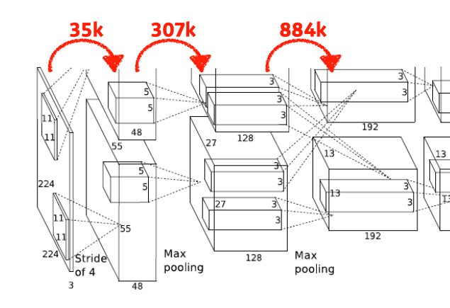

# Day 6 DL basic 4~6강 

## 목차 

1. [강의 내용 정리](#1-강의-내용-정리)
2. [과제 수행 과정 / 결과물 정리](#2-과제-수행-과정--결과물-정리)
3. [피어세션 정리](#3-피어세션-정리)
4. [흥미있던 질문들](#4-흥미있던-질문들)
5. [학습 회고](#5-학습-회고)

----

### 1. 강의 내용 정리

* DL basic 4~6강
    * 4강 : Convolutional Neural Networks
        * convolution 기본 
        &nbsp; - &nbsp; convolution 연산  
        
        &nbsp;&nbsp;&nbsp;&nbsp; - &nbsp; 커널(filter)을 image에 convolution 연산을 통해 output이 만들어 진다. 이때 output의 (i-k+2p)/s + 1이다(p는 padding, s는 stride를 뜻한다).  
        &nbsp;&nbsp;&nbsp;&nbsp; - &nbsp; 연산방법은 커널과 image를 element wise로 각각의 원소끼리 곱하고 결과를 다 더하면 된다. 이런식으로 stride로 지정된 크기만큼 이동하면서 하면 위의 결과에서 output과 같은 size의 결과가 나온다.    
        &nbsp; - &nbsp; RGB image convolution  
        &nbsp;&nbsp;&nbsp;&nbsp; - &nbsp; 아래와 같이 깊이(채널)이 생격다. 하지만 연산방법은 위와 동일하며 이런식의 계산 결과로 나온 값의 깊이는 1이 된다. 
        

         
        &nbsp; - &nbsp; Stack of Convolutions  
        &nbsp;&nbsp;&nbsp;&nbsp; - &nbsp; 아래 그림과 같이 32*32*3의 이미지에서 5*5*3 커널을 이용하면 28*28*1 이미지가 나온다 이때 각 원소에 Relu, 활성화 함수를 적용시켜주면 하나의 feature가 나오게 된다. 이것을 4번 해주면 가운데 모양처럼 깊이가 4인 feature가 나온다.  
        

        &nbsp;&nbsp;&nbsp;&nbsp; Quiz. &nbsp; 위에서 첫번째 이미지에서 kernal(5*5*3)을 가지고 convolution연산을 할때(이때 그림과 맞찬가지로 출력의 채널은 4이다.) 몇개의 파라미터가 필요한가? 
        &nbsp;&nbsp;&nbsp;&nbsp; Answer. &nbsp; 5*5*3*4 이다. 
         
        
        * CNN 
        &nbsp; - &nbsp; 일반적으로 CNN의 구성 요소 : convolution layer, pooling lyaer, fully connected layer  
        &nbsp; - &nbsp; 최근에는 fully connected layer부분 말고 다른 방식을 사용하여 파라미터의 개수를 줄이고자 한다. <- 정확하게는 layer은 deep하지만 파라미터 개수는 적은 방식을 이용  
         
        &nbsp;&nbsp;&nbsp;&nbsp; * &nbsp; Deep learning에서 학습시켜야할 파라미터가 많으면 많을수록 학습이 어렵고 generaliztion performance가 떨어진다.  
        &nbsp; - &nbsp; stride : kernel을 몇칸씩 이동하면서 convolution을 시행하는지에 대한 것  
        

        &nbsp;&nbsp;&nbsp;&nbsp;&nbsp;&nbsp;&nbsp;&nbsp; - &nbsp; padding : 가장자리에 채워주는 것 <-  input과 output의 special dimension을 똑같게 만들어주기 위해 사용(special dimension이란 input의 데이터를 말함.)  

        * Exercise : AlexNet구조에서 파라미터 구하기 연습 

        &nbsp; 1. &nbsp; 가장 오른쪽 화살표는 그 화살표 기준으로 왼쪽에서 convolution을 해서 오른쪽 output이 나온 것이다. 이때 필요한 파라미터의 개수를 구하시오. 대략적인 개수는 화살표 위의 숫자와 같습니다.  
        

        &nbsp; ->  &nbsp; 11 * 11 * 3 * 48 * 2(output이 위, 아래 2개 이므로) 
         

        &nbsp; 2. &nbsp; 문제 내용 동일  
        

        &nbsp; ->  &nbsp; 5 * 5 * 48 * 128 * 2(output이 위, 아래 2개 이므로) 
         

        &nbsp; 3. &nbsp; 문제 내용 동일 
        

        &nbsp; ->  &nbsp; 3 * 3 * 128 * 2(자세히 보면 커널이 위, 아래로 사용됨) * 192 * 2(output이 위, 아래 2개 이므로) 
         

        &nbsp; 4. &nbsp; 문제 내용 동일 
        

        &nbsp; ->  &nbsp; 3 * 3 * 192 * 192 * 2(output이 위, 아래 2개 이므로) 
         

        &nbsp; 5. &nbsp;문제 내용 동일 
        

        &nbsp; ->  &nbsp; 3 * 3 * 192 * 128 * 2(output이 위, 아래 2개 이므로) 
         

        &nbsp; 6. &nbsp; 문제 내용 동일  
        

        &nbsp; ->  &nbsp; 13 * 13 * 128 * 2048(벡터) * 2(output이 위, 아래 2개 이므로) 
        &nbsp; *  &nbsp; dense layer는 MLP이다. -> 파라미터 개수는 input의 파라미터 * out의 개수이다. 
         

        &nbsp; 7. &nbsp; 문제 내용 동일  
        

        &nbsp; ->  &nbsp; 2048 * 2(2개의 벡터가 크로스 되기도 해서 -> 한개당 크로스 + 직선) * 2048 * 2(output이 위, 아래 2개 이므로) 
         

        &nbsp; 8. &nbsp; 문제 내용 동일  
        

        &nbsp; ->  &nbsp; 2048 * 2 * 1000 
         

        * 1 * 1 convolution 
        &nbsp; - &nbsp; special dimension을 유지하되 파라미터를 줄일 수 있다. <- 자세한 것은 5강에서~~  
         

    * 5강 : Modern Convolutional Nerual Networks
        * AlexNet 

         

        * VGGNet 

         

        * GoogleNet 

         

        * ResNet 

         

        * DenseNet 

         

    * 6강 : Computer Vision Applications(Semantic Segmentation and Detection)
        * Segmantic Segmentation 
            &nbsp; - &nbsp; 개요  

             

            &nbsp; - &nbsp; Fully Convolutional Network  

             

            &nbsp; - &nbsp; Deconvolution(conv transpose) 

             

        * Detection
            &nbsp; - &nbsp; R-CNN  

             

            &nbsp; - &nbsp; SPPNet  

             

            &nbsp; - &nbsp; Fast R-CNN  

             

            &nbsp; - &nbsp; Region Proposal Network  

             

            &nbsp; - &nbsp; YOLO  

             

            

    

### 2. 과제 수행 과정 / 결과물 정리
 

#### 오늘 필수 과제 역시 강의를 들으면서 하면 잘 따라갈 수 있었다. 하지만 이런식으로 공부하면 도움이 안 될 것 같아서 오늘부터 과제 내용을 완벽하게 파악하고 그 코드를 따라치면서 추후 안 보고 해당 내용을 작성할 수 있도록 반복학습할 생각이다. 먼저 목표(Level 1)는 MLP이다! 

 

### 3. 피어세션 정리

20210809 피어세션

🔍[지난주 질문]
  
- SVD 특이값 분해
  
Q. 대각행렬의 갯수를 제한하여 압축하는 방법 : 어떤 기준으로 압축하고 어떻게 적용되는가? 
A. (적용흐름은 코드 참조) Sigma-Singular value가 가장 높은 것부터 추출. 즉, 가장 유의미한 정보순으로 나열 후 뒤부터 탈락시키며 압축시킨다.  
Q. SVD에서 Simgular value가 원래 크기 순으로 정렬되어 있는가? 
A. 더 조사 후 내일 답변.  

20210811 피어세션 
 
모더레이터: 김범수  

회의록작성: 박승찬  

🔍[이전 질문 리뷰]  

ViT(Visual Transformer): 금일(21210811) 19시 멘토링 시간에 질문하기로 함. 
각 Patch를 차원이 줄여진 잠재 벡터(latent vector)로 볼 수 있는가? 
MNIST dataset 사용 기준 각 (4,4)의 크기의 Patch 49개가 생성된다.  
📒[금일 질문 목록]:  

CNN 수강 관련 질문  
* Dense layer를 잘 이해하지 못하겠다.  
* Fully Connected Layer과 같은 것.  
* Dense layer의 가중치 또한 학습이 진행되는가?  
-> 에러에 따라 모든 (Conv, FCN)의 가중치들의 학습이 진행된다.  
* Convolution 연산에서 가중치의 차원은 (kernel_W, kernel_H, in_channel, out_channel)과 같다.  그렇다면 in_channel 기준으로 같은 값으로 연산이 진행되는지(Broadcasting) 또는 각 in_channel마다 다른 값을 가지는지 궁금하다. 
-> 강의에서 학습할 가중치의 개수가 “kernel_W * kernel_H * in_channel * out_channel” 이라고 설명한 것으로 미루어 보아, 각각 다른 in_channel 가중치는 각각 다른 값을 가질 것이라고 생각된다.  
e.g. in_channel 기준 각각 다른 가중치의 값은 다음과 같다. (parameter[0,0,:,0])  
📎[선택과제 3번 살펴보기]  

Mixture_density_Network_문제  
* 일대일 대응이 아닌 그래프에 대해 회귀(근사)를 어떻게 할 것인가? 
-> 위 식에서 변수 y의 의미 
-> 가우시안 분포의 변수로 생각됨. 
-> 또한 위의 식은 x, y축이 서로 바뀐 것으로 생각됨.  
* 과제 설명 중 MSELoss(Mean Squared Error Loss)를 사용하지 못한다고 했다. 이에 관한 질문. 
-> 로그 우도(Log Likelihood)를 사용하려고 한 것 같다.  
* Gumbel softmax sampling에 대해 알고싶다.  

📎[ViT 관련 추가 질문]  

* Q, K, V 가 각각 의미하는 것이 무엇일까? 
-> 단어와의 연관성, cosine 유사도 관련 설명 진행함  

#### 내가 질문 했던 내용

#### Q. CNN에서 Dense를 사용하는 이유?
#### A. 마지막에 softmax에서 가장 적합한 것을 찾기 위해서 Dense를 사용한다.
 

#### Q. Dense와 MLP는 같은 것인가?
#### A. 비슷한 것 같다.
 

#### 추가로 알게 된 내용
#### + CNN에서 학습되는 것은 filter의 값과 Dense의 가중치이다.
  

### 4. 흥미있던 질문들

1. [[DL Basic 5강] Convolution에서 2x2 커널이 안쓰이는 이유가 궁금합니다.](https://www.boostcourse.org/boostcampaitech2/forum/96886) 

    
    VGG 에서 5x5 커널은 3x3 두개로 대체할 수 있다고 설명해주셨는데,
    같은 논리로 3x3 커널을 2개의 2x2커널로 대체할 수 있을 것 같습니다. (학습파라미터는 9 -> 8 로 줄어드니깐 더 효과적이지 않을까 생각합니다.)
    당연히 성능이 안좋으니까 안쓸텐데, 이에 대한 이론적인 이유가 있는지 아니면 그냥 해보니 잘 안되네해서 안쓰는지 궁금합니다.

답변 

    홀수 커널을 사용하는 이유는, 그 전 이미지 레이어 픽셀의 정보를 symmetrical (대칭적)으로 뽑을 수 있기 때문입니다. 아래의 이미지처럼 홀수 커널은 중간의 output pixel 주위의 픽셀들을 elementwise multiplication과 sum을 통해 symmetrical하게 뽑아 주변의 픽셀 정보를 그 다음 레이어로 보내줍니다. 
    하지만 짝수의 경우에는 이렇게 주위에 있는 픽셀들을 대칭적으로 뽑을 수 없게 되죠. 그래서 생기게 되는것이 aliasing 같은 distortion이 생기게 되는것이죠. Aliasing의 예시를 아래에 참고해두었습니다. 

  

### 5. 학습 회고

#### 오늘 강의 또한 집중해서 보지 않으면 잘 이해되지 않는 내용들이 많았다. 그래서 강의 정리하면서 강의를 한번 더 듣는다. 이러한 방식때문에 강의를 정리하는데 시간을 많이 소비하고 선택과제에 대해서는 많이 못하지만 어쩔 수 없는 것 같다. 일단, 1~2주 후에 있을 팀프로젝트에 도움이 되려면 기본기가 튼튼해야 될 것 같아서 부스트캠프에 메인부분만 잘 이해하고 따라갈 생각이다.

 

#### git에 대한 특강을 들었는데 github와 vscode에 대한 유익한 내용을 알 수 있어서 매우 좋았다. 이전까지는 terminal로 git clone, push, pull, fetch, merge등을 했는데 vscode의 palette와 git graph를 이용하면 좀 더 쉽게 할 수 있다는 것을 알 수 있어다. 또 github issue에 용도에 대해서는 알고 있었지만 오늘 설명을 통해서 좀 더 알 수 있어서 좋았다.
 

#### 피어세션에서는 선택과제 3에 대해서 많은 이야기를 했다(물론 나는 듣기만 했다 ㅎㅎ;). 이번주는 메인 내용에 대한 완벽한 이해를 목표로 하고 있어서 피어세션에서는 주로 듣거나 궁금한 것에 대해서 가끔 질문정도 할 것 같다.
 

#### 그리고 새로운 캠퍼분이 우리조로 배정이 되셨다. 앞으로 4주간 잘 지내서 팀프로젝트 때 다 같이 좋은 결과를 얻었으면 좋겠다 ㅎㅎㅎㅎ

 

#### 질문게시판에 글을 읽으면서 여러 질문에 대해서 생각해볼 수 있어서 가끔씩 질문게시판에 들어가서 눈팅하려고 한다. 그리고 내가 아는 것에 대해서는 답을 하려고 하지만 대부분 잘 모르는 내용들이었다 ㅎㅎ; 

 

#### 오늘도 즐거운 하루였다~~~~~ㅎㅎㅎㅎㅎㅎㅎㅎ 