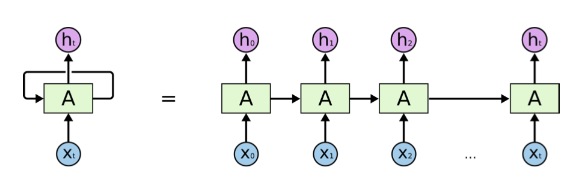
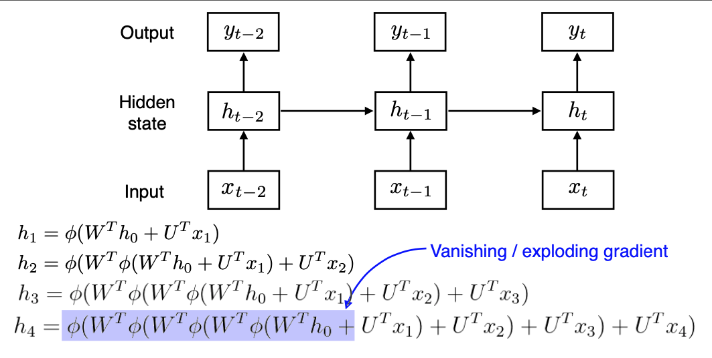
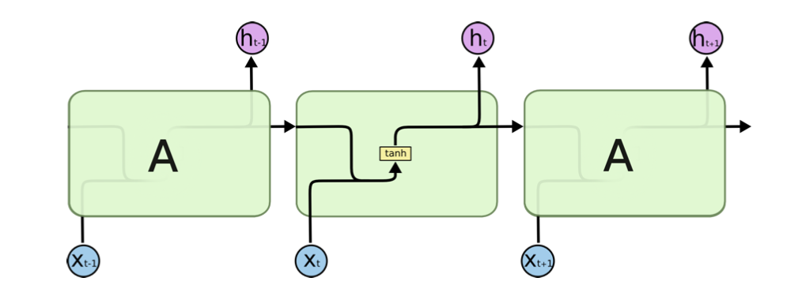
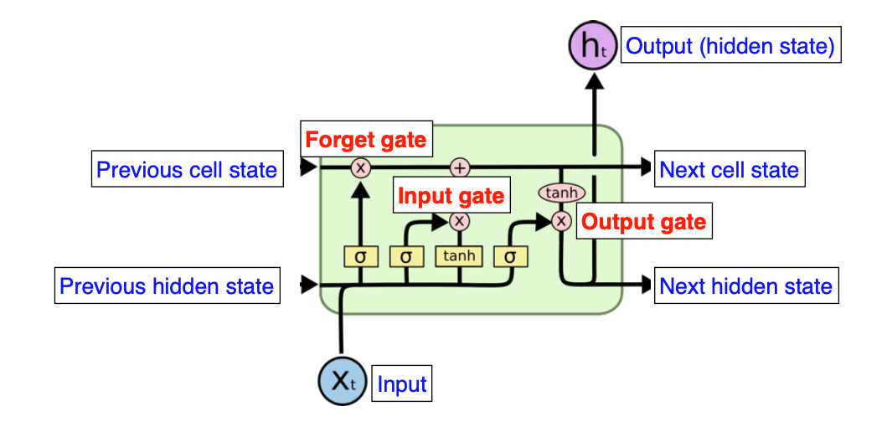
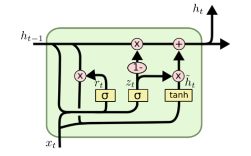

# Day 9 DL basic 7~8강 

## 목차 

1. [강의 내용 정리](#1-강의-내용-정리)

2. [과제 수행 과정 / 결과물 정리](#2-과제-수행-과정--결과물-정리)

3. [피어세션 정리](#3-피어세션-정리)

<!--4. [흥미있던 질문들](#4-흥미있던-질문들)-->

4. [학습 회고](#4-학습-회고)

----

### 1. 강의 내용 정리

* DL basic 7~8강
    * 7강 : Recurrent Neural Networks
        * Sequential Model 
        &nbsp; - &nbsp; 개요  
         &nbsp;&nbsp;&nbsp;&nbsp; ‣ &nbsp; 연속적인 데이터로 음성, 텍스트, 영상 등이 있다. 
         &nbsp;&nbsp;&nbsp;&nbsp; ‣ &nbsp; 이러한 시퀀스 정보에 대한 문제점은 데이터의 마지막이 어디부분인지 알 수 없었서 받아들일 차원이 뭔지 알 수가 없다.  
        &nbsp; - &nbsp; Naive sequence model  
         &nbsp;&nbsp;&nbsp;&nbsp; ‣ &nbsp; 가장 기본적인 시퀀스 모델이다. 
         &nbsp;&nbsp;&nbsp;&nbsp; ‣ &nbsp; 문제점은 개요에서 소개했듯이 받아들일 차원을 제대로 파악할 수 없다는 것이다.  
        &nbsp; - &nbsp; Autoregressive model  
        &nbsp;&nbsp;&nbsp;&nbsp; ‣ &nbsp; 위의 문제를 해결하기 위해서 과저의 몇개의 정보를 이용할지를 정하면 된다.  
        &nbsp; - &nbsp; Markov model  
        &nbsp;&nbsp;&nbsp;&nbsp; ‣ &nbsp; 현재 정보는 바로전 과거정보만을 통해서 형성이 된다.   
        &nbsp; - &nbsp; Latent autoregressive model  
        &nbsp;&nbsp;&nbsp;&nbsp; ‣ &nbsp; 위의 Markov model의 문제점은 현재를 형성하기 위한 정보가 바로 직전 과거뿐만이 아니라 그 이전에부터 영향을 받을 수 있다는 점을 간과한 것이다. 
        &nbsp;&nbsp;&nbsp;&nbsp; ‣ &nbsp; 이러한 문제를 해결해주기 위해서 이전의 정보를 요약하는 것(hidden state)을 만들고 이것과 현재정보(input)를 통해서 결과를 도출한다. 
         
        
        * RNN 
        &nbsp; - &nbsp; MLP와 비슷하지만 rnn은 순환된다는 점에서 다르다.  
        &nbsp; - &nbsp; rnn은 시간 순서으로 푼다고 말한다. <- 이러한 점은 입력이 매우 많은 fully connected layer로 표현될 수 있다. 
          
        &nbsp; - &nbsp; rnn에 문제는 가까운 이전 정보를 잘 담고 있지만(short-term dependencies) 먼 과거 정보에 대해서는 희미해져간다(long-term dependencies). 
        &nbsp; - &nbsp; 아래와 같이 다음으로 전달되는 hidden state는 layer가 깊어짐에 따라 활성함수(시그모이드 혹은 ReLU 등)에 따라서 vanishing되거나 exploding gradient될 수 있다.  
           
          
        &nbsp; - &nbsp; 가장 기본적이 rnn구조는 아래와 같이 vanilla rnn이다.  
          
        &nbsp; - &nbsp; 이전 hidden state와 input*weight을 concatenate를 해주고 tanh를 거쳐 output과 다음 hidden state로 사용이 된다.  
         

        * LSTM(Long Short Term Memory) 

        &nbsp; - &nbsp; vanilla rnn의 가장 큰 문제인 long term dependencies를 해결할 수 있게 설계된 모델 
         
        &nbsp; - &nbsp; 위의 그림을 가지고 forget gate, input gate, update cell, output gate를 설명하면 다음과 같다. 
        &nbsp;&nbsp;&nbsp;&nbsp; ‣ &nbsp; forget gate : 이전의 hidden state와 input * 가중치를 시그모이드 해준 결과이다.  
        &nbsp;&nbsp;&nbsp;&nbsp; ‣ &nbsp; input gate : 전 hidden state와 input * 가중치를 시그모이드 해주고. 전 hidden state와 input * weight를 tanh한 결과를 concatenate를 해주면 된다. 
        &nbsp;&nbsp;&nbsp;&nbsp; ‣ &nbsp; output gate : ot(이전 hidden state값과 input * weight를 시그모이드 거친 값) * (다음 cell state로 전달되는 값에 tanh를 거친값)이다.  
        &nbsp;&nbsp;&nbsp;&nbsp; ‣ &nbsp; update cell : 이전 cell state에서 다음으로 전달할 cell state구하는 방법으로 과거에 잊어버릴것(ft(이전 hidden state와 input * weight을 시그모이드를 거친 값) * Ct-1(이전 cell state))은 잊어버리고 새로 기억할것(it(이전 hidden state와 input * weight을 시그모이드를 거친 값) * Ct(hidden state가 와 input * weight가 tanh를 거친 값))은 기억하자  
         

        * GRU(Gated Recurrent Unit) 
         
        &nbsp; - &nbsp; gate가 2개(reset/update gate)밖에 없지만 LSTM과 같은 동작을 수행할 수 있어서 LSTM보다 GRU를 활용할 때 좋은 성능을 내는 경우가 많다.   
         

    * 8강 : Transformer
        * Sequential model의 문제 
        &nbsp; - &nbsp; 8강 정리는 내일~~~  

         

        * Transformer 
        &nbsp; - &nbsp;   
        
          
      

    

### 2. 과제 수행 과정 / 결과물 정리
 

#### 필수과제 MHA에 대해서 하는데 어려웠다 ㅠㅠ. 분명 강의를 통해서 차근차근 따라갔지만 이해가 잘 안되었다. 그래서 이 부분에 대해서 주말에 다시 한번 정리해야겠다.

 

### 3. 피어세션 정리
 
20210812 피어세션  

모더레이터: 박승찬  

회의록작성: 심우창  

📎[새로운 캠퍼님에게 그라운드룰 소개]  

모더레이터 순서에 대해서 소개(강진선 -> 김범수 -> 박승찬 -> 심우창 - 우원진 -> 최성욱 -> 배민환) 
코드리뷰를 위한 github 초대  
 

🔍[이전 질문 리뷰]  

이전 시간에 대한 질문은 당일날 해결해서 생략  
 

 

📒[금일 질문 목록]:  

* 선택과제 3번(승찬님이 하시다가 막히거나 잘 이해되지 않았던 부분) 
    * Gaussian mixture를 왜 사용하는지 그리고 어떻게 사용해야 하는지에 대해서 궁금하다.
    * 주어진 MDN class를 참고하여 과제를 수행했다. <- 이상한 값이 섞여서 나왔다.
        * 이유 : gaussian을 제대로 이용하지 못해서 그런 것 같다.
* 선택과제 3번 추가 질문
    * foward부분에서 shape를 어떻게 맞춰줬는지?
        * hidden layer로 들어가서 n_gaussians으로 나오기 때문에 이 부분을 통해서 shape를 맞춰줬다(코드상에 맞춰져 있었다).
    * 코드상에 x.mm이 무엇을 의미하는지? 
        * 행렬곱인것 같다.
* 선택과제 3번 참고 자료
    * 진선님이 참고하신 블로그(https://mikedusenberry.com/mixture-density-networks)
* 필수과제(MHA)에서 Q,K,V의 개수에서 K와 V는 같아야 되지만 Q는 달라도 된다 - 라고 하셨는데 이 부분이 잘 이해가 되지 않는다.
* 선택 과제에 대해서 해설 듣고 거기서도 이해가 안 되면 주말에 찾아보고 그것으로도 해결이 안되면 멘토님에게 물어보기 
* LSTM에서 update cell이랑 output gate가 이해가 잘 안되었습니다. 
    * forget gate : 이전의 hidden state와 가중치를 시그모이드 해준 결과이다.
    * input gate : 전 hidden state와 가중치를 시그모이드 해주고. hidden state에서 
    * update cell : 이전 cell state에서 다음으로 전달할 cell state구하는 방법으로 과거에 잊어버릴것(ft(이전 hidden state 시그모이드를 거친 값) * Ct-1(이전 cell state))은 잊어버리고 새로 기억할것(it(이전 hidden state 시그모이드를 거친 값) * Ct(hidden state가 tanh를 거친 값))은 기억하자
    * output gate : ot(이전 hidden state에서 시그모이드 거친 값) * (다음 cell state에서 tanh를 거친값)이다.
   

* 📎[선택과제 정답 살펴보기]  

* 선택과제 3 - softmax함수 인자로 dim을 주는게 어떤 의미인가? 
    * softmax연산을 해당 dim을 기준으로 한다.
* 선택과제 1 - residual부분 -> 통합적인 구조를 만들고 싶을때 사용
* 선택과제 1 - attention list부분
* 선택과제 1 - encoder부분에서 MHA 후 norm하기 전 원래값 더해주는 부분

#### 내가 질문 했던 내용

#### Q. LSTM에서 update cell이랑 output gate가 이해가 잘 안되었습니다. 
#### A.     
    * forget gate : 이전의 hidden state와 가중치를 시그모이드 해준 결과이다.
    * input gate : 전 hidden state와 가중치를 시그모이드 해주고. hidden state에서 
    * update cell : 이전 cell state에서 다음으로 전달할 cell state구하는 방법으로 과거에 잊어버릴것(ft(이전 hidden state 시그모이드를 거친 값) * Ct-1(이전 cell state))은 잊어버리고 새로 기억할것(it(이전 hidden state 시그모이드를 거친 값) * Ct(hidden state가 tanh를 거친 값))은 기억하자
    * output gate : ot(이전 hidden state에서 시그모이드 거친 값) * (다음 cell state에서 tanh를 거친값)이다.

#### Q. 필수과제(MHA)에서 Q,K,V의 개수에서 K와 V는 같아야 되지만 Q는 달라도 된다 - 라고 하셨는데 이 부분이 잘 이해가 되지 않는다.
#### A. 해결 못 함.

  

### 4. 학습 회고

#### 오늘도 강의가 어려워서 잘 이해되지 않는 부분이 많았지만 대부분이 피어세션때 해결이 되서 좋았다. 역시 피어세션 짱~~!👍

 

#### 오늘 git특강은 remote repogitory와 충돌에 대해서 설명해주셨는데 이해가 쏙쏙 되었다. 그리고 알게 된 점은 같은 파일에 대해서 추가/삭제/수정 등의 action이 있었고 이것을 2명이상이 commit하게 된다면 최소 1명은 충돌이 무조건 일어난다. 충돌이 안 일어나게 하려면 서로 사전에 코딩 컨벤션을 맞추고 pull(fetch + merge)를 해줘서 잘 해결해야 된다.
 

#### 피어세션에서는 오늘 강의와 선택 문제에 대해서 여러 질문들이 오갔다. 그 속에서 많은 것을 배울 수 있어서 매우 좋았다 ㅎㅎ
 

#### 어제와 그제랑은 다르게 더이상 내 자신을 남들과 비교하지 않고 내 능력에 대해서 객관적으로 생각할 수 있어서 정신적으로 스트레스 받지 않아서 좋았다. 그리고 학업량도 내 수준에서 핵심이 되는 기본기(강의 내용 + 필수과제)위주로 공부하고 있어서 이전보다 덜 부담스럽다.

 

#### 오늘도 시간이 빠르게 지나갔지만 기분 좋은 하루였다 ㅎㅎ 