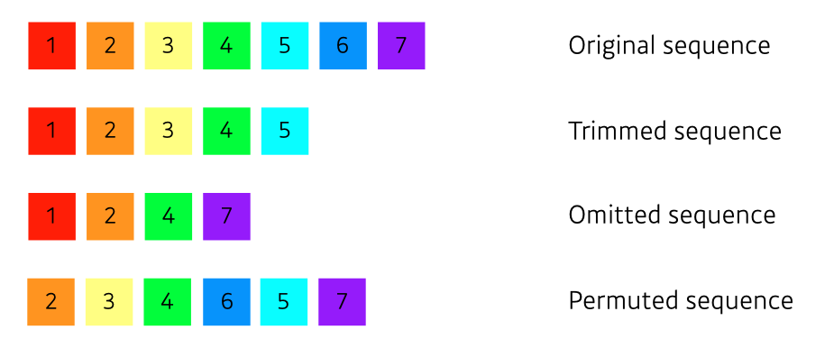
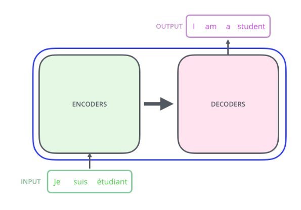
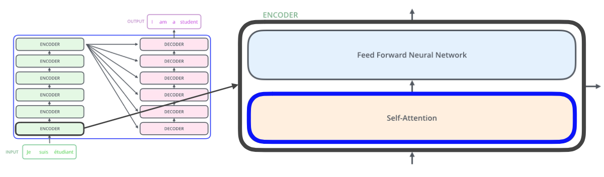
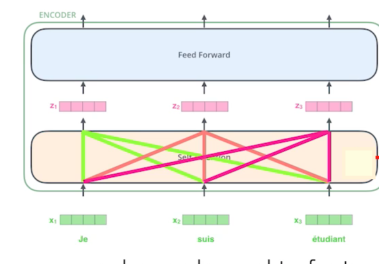
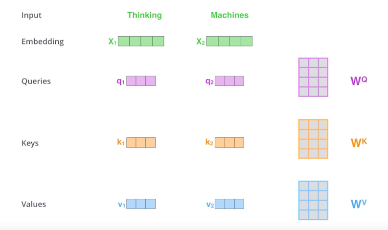
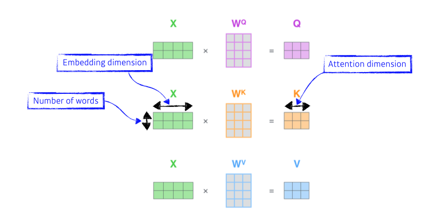
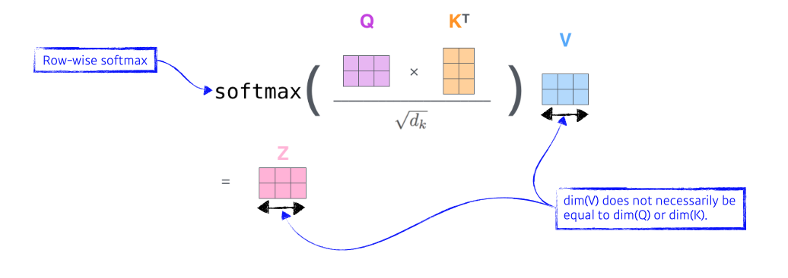
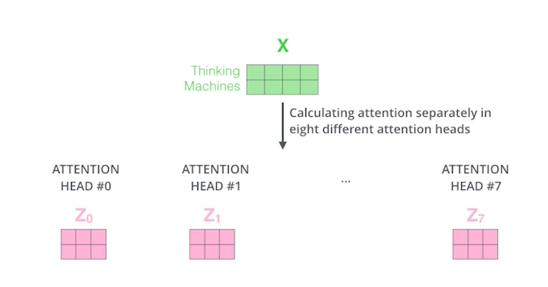
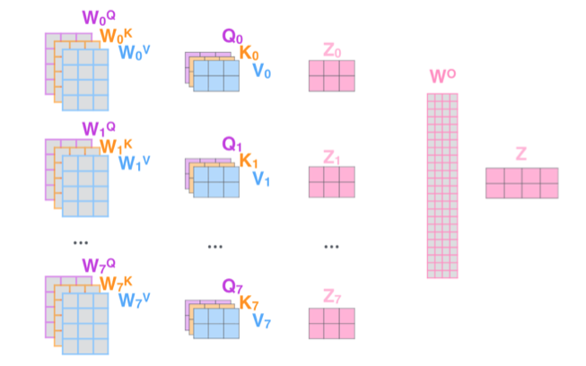
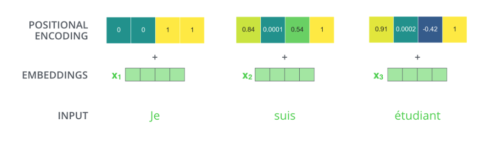

# Day 9 DL basic 7~8강 

## 목차 

1. [강의 내용 정리](#1-강의-내용-정리)

2. [과제 수행 과정 / 결과물 정리](#2-과제-수행-과정--결과물-정리)

3. [피어세션 정리](#3-피어세션-정리)

<!--4. [흥미있던 질문들](#4-흥미있던-질문들)-->

4. [학습 회고](#4-학습-회고)

----

### 1. 강의 내용 정리

* DL basic 7~8강
    * 7강 : Recurrent Neural Networks
        * Sequential Model 
        &nbsp; - &nbsp; 개요  
         &nbsp;&nbsp;&nbsp;&nbsp; ‣ &nbsp; 연속적인 데이터로 음성, 텍스트, 영상 등이 있다. 
         &nbsp;&nbsp;&nbsp;&nbsp; ‣ &nbsp; 이러한 시퀀스 정보에 대한 문제점은 데이터의 마지막이 어디부분인지 알 수 없었서 받아들일 차원이 뭔지 알 수가 없다.  
        &nbsp; - &nbsp; Naive sequence model  
         &nbsp;&nbsp;&nbsp;&nbsp; ‣ &nbsp; 가장 기본적인 시퀀스 모델이다. 
         &nbsp;&nbsp;&nbsp;&nbsp; ‣ &nbsp; 문제점은 개요에서 소개했듯이 받아들일 차원을 제대로 파악할 수 없다는 것이다.  
        &nbsp; - &nbsp; Autoregressive model  
        &nbsp;&nbsp;&nbsp;&nbsp; ‣ &nbsp; 위의 문제를 해결하기 위해서 과저의 몇개의 정보를 이용할지를 정하면 된다.  
        &nbsp; - &nbsp; Markov model  
        &nbsp;&nbsp;&nbsp;&nbsp; ‣ &nbsp; 현재 정보는 바로전 과거정보만을 통해서 형성이 된다.   
        &nbsp; - &nbsp; Latent autoregressive model  
        &nbsp;&nbsp;&nbsp;&nbsp; ‣ &nbsp; 위의 Markov model의 문제점은 현재를 형성하기 위한 정보가 바로 직전 과거뿐만이 아니라 그 이전에부터 영향을 받을 수 있다는 점을 간과한 것이다. 
        &nbsp;&nbsp;&nbsp;&nbsp; ‣ &nbsp; 이러한 문제를 해결해주기 위해서 이전의 정보를 요약하는 것(hidden state)을 만들고 이것과 현재정보(input)를 통해서 결과를 도출한다. 
         
        
        * RNN 
        &nbsp; - &nbsp; MLP와 비슷하지만 rnn은 순환된다는 점에서 다르다.  
        &nbsp; - &nbsp; rnn은 시간 순서으로 푼다고 말한다. <- 이러한 점은 입력이 매우 많은 fully connected layer로 표현될 수 있다. 
          
        &nbsp; - &nbsp; rnn에 문제는 가까운 이전 정보를 잘 담고 있지만(short-term dependencies) 먼 과거 정보에 대해서는 희미해져간다(long-term dependencies). 
        &nbsp; - &nbsp; 아래와 같이 다음으로 전달되는 hidden state는 layer가 깊어짐에 따라 활성함수(시그모이드 혹은 ReLU 등)에 따라서 vanishing되거나 exploding gradient될 수 있다.  
           
          
        &nbsp; - &nbsp; 가장 기본적이 rnn구조는 아래와 같이 vanilla rnn이다.  
          
        &nbsp; - &nbsp; 이전 hidden state와 input*weight을 concatenate를 해주고 tanh를 거쳐 output과 다음 hidden state로 사용이 된다.  
         

        * LSTM(Long Short Term Memory) 

        &nbsp; - &nbsp; vanilla rnn의 가장 큰 문제인 long term dependencies를 해결할 수 있게 설계된 모델 
         
        &nbsp; - &nbsp; 위의 그림을 가지고 forget gate, input gate, update cell, output gate를 설명하면 다음과 같다. 
        &nbsp;&nbsp;&nbsp;&nbsp; ‣ &nbsp; forget gate : 이전의 hidden state와 input * 가중치를 시그모이드 해준 결과이다.  
        &nbsp;&nbsp;&nbsp;&nbsp; ‣ &nbsp; input gate : 전 hidden state와 input * 가중치를 시그모이드 해주고. 전 hidden state와 input * weight를 tanh한 결과를 concatenate를 해주면 된다. 
        &nbsp;&nbsp;&nbsp;&nbsp; ‣ &nbsp; output gate : ot(이전 hidden state값과 input * weight를 시그모이드 거친 값) * (다음 cell state로 전달되는 값에 tanh를 거친값)이다.  
        &nbsp;&nbsp;&nbsp;&nbsp; ‣ &nbsp; update cell : 이전 cell state에서 다음으로 전달할 cell state구하는 방법으로 과거에 잊어버릴것(ft(이전 hidden state와 input * weight을 시그모이드를 거친 값) * Ct-1(이전 cell state))은 잊어버리고 새로 기억할것(it(이전 hidden state와 input * weight을 시그모이드를 거친 값) * Ct(hidden state가 와 input * weight가 tanh를 거친 값))은 기억하자  
         

        * GRU(Gated Recurrent Unit) 
         
        &nbsp; - &nbsp; gate가 2개(reset/update gate)밖에 없지만 LSTM과 같은 동작을 수행할 수 있어서 LSTM보다 GRU를 활용할 때 좋은 성능을 내는 경우가 많다.   
         

    * 8강 : Transformer
        * Sequential model의 문제 
        &nbsp; - &nbsp; sequential model이 갖는 한계  
        
        &nbsp; - &nbsp; 위의 사진처럼 sequential model은 문장의 어순의 생략, 마지막 단어들의 생략, 도치 등에서 모델링 하기는데 어려움이 있다.  
         

        * Transformer 
        &nbsp; - &nbsp; 위의 sequential model의 한계를 해결하기 위해서 seq2seq라는 것이 나왔다. => encoder와 decoder로 구성된다.  
        &nbsp; - &nbsp; [seq2seq 논문 리뷰 유튜브](https://www.youtube.com/watch?v=4DzKM0vgG1Y&t=1132s)  
        &nbsp; - &nbsp; seq2seq가 발전한게 transformer이다. -> 이러한 transformer는 nlp쪽에서만 많이 사용되는게 아니라 여러 도메인에서 사용이 된다.  
         
        &nbsp; - &nbsp; 위의 그림에서 알 수 있는 것들  
        &nbsp;&nbsp;&nbsp;&nbsp; 1. &nbsp; 입력 도메인(독일어)과 출력 도메인(영어)가 달라도 된다.  
        &nbsp;&nbsp;&nbsp;&nbsp; 2. &nbsp; 입력 단어의 개수와 출력 단어의 개수가 달라도 된다.   
        &nbsp; - &nbsp; transformer에서 우리가 주의 깊게 봐야 할 부분  
        &nbsp;&nbsp;&nbsp;&nbsp; ‣ &nbsp; n개의 단어가 encoder의 input으로 들어갈때 어떻게 한 번에 처리가 되는지  
        &nbsp;&nbsp;&nbsp;&nbsp; ‣ &nbsp; encoder와 decoder 사이에 어떤 정보를 주고 받는지에 대해서  
        &nbsp;&nbsp;&nbsp;&nbsp; ‣ &nbsp; decoder가 어떻게 generation할 수 있는지  
         
        &nbsp; - &nbsp; 아래의 그림과 같이 encoder는 self-attention과 feed forward neural network로 이루어져 있다.  
        
        &nbsp;&nbsp;&nbsp;&nbsp; ‣ &nbsp; self attention에서는 각 input 단어들을 가지고 input 단어의 개수와 동일한 vector를 만든다. 이때 vector들은 아래와 같이 서로 영향을 주면서 생성된다. 이렇게 생성된 vector들은 foward를 거치는데 이때에는 다른 vector들에 영향을 주지 않고 진행된다.   
          
        &nbsp; - &nbsp; input으로 'Thinking', 'Machines'이 들어간다면 다음과 같이 하나의 단어당 Query weight, Key weight, Value weight을 통해서 query vector, key vetor, value vetor들이 만들어 진다. 
          

        &nbsp; - &nbsp; 위에서 구한 query vector, key vector, value vector들을 통해서 embedding vector를 새로운 vector로 바꿔줄 것이다.   
        &nbsp;&nbsp;&nbsp;&nbsp; ‣ &nbsp; 이것을 위해서는 score vector를 구해줘야 한다.  
        &nbsp;&nbsp;&nbsp;&nbsp; ‣ &nbsp; score vector를 구해주기 위해서는 내가 encoding을 해주고자 하는 query vector와 전체 key vector를 각각 내적을 해준다. -> encoding 하려는 단어와 나머지 단어들간에 유사도를 측정하기 위함이다. 
        &nbsp;&nbsp;&nbsp;&nbsp; ‣ &nbsp; 각각 내적을 해줘서 구한 score vector들을 normalize를 해주고 normalize score vector의 합이 1이 되도록 softmax를 취해준다. 그리고 여기서 각 단어에 대한 value의 weight을 곱한 것을 더해주면 attention value 구하기 끝~~~! 
        &nbsp;&nbsp;&nbsp;&nbsp; ‣ &nbsp; 이때 query vector와 key vector의 차원은 항상 같아야 한다. <- 내적을 해야하기 때문 
        &nbsp;&nbsp;&nbsp;&nbsp; ‣ &nbsp; value vector는 차원이 달라도 된다. 
         

        &nbsp; - &nbsp; 위에서 구한 attention value를 행렬식으로 구하는 방식으로 설명을 한다면 다음과 같이 된다. 이때 X의 행의 수는 단어의 개수이다. 열은 embedding dimension, 그리고 이렇게 해서 나온 key vectordml 열은 attention dimenstion이 된다.  
          
        &nbsp; - &nbsp; 위에서 구해진 query/key/value vector들은 아래와 같이 softmax를 취해주고 그것을 key vector의 사이즈의 제곱근 취해준 값으로 나눈후 value vector로 곱해주고 이러한 방식대로 query vector에 대해서 다른 단어의 key/value vector를 사용해서 나온 weighted value를 더해주면 된다. 
          
        &nbsp; * &nbsp; 이미지가 하나가 주어져있을때 CNN이나 MLP으로 dimension을 받으면 input이 고정되어 있을경우 출력도 고정된다. 왜냐하면 convolution filter나 weight가 고정되어있기 때문이다. 그러나 transformer는 하나의 input이 고정되어 있다고 하더라도 그리고 network가 fix되어 있다고 하더라도 내가 encoding 하려는 단어와 옆 에 있는 단어에 따라서 내가 encoding하는 값이 달라지게 된다. <- 강의 19분쯤에 설명해주신 내용, 뭔가 이해될 듯 말듯, 그런데 CNN과 MLP에서도 하나의 input만 고정되고 다른 x2,x3.. 등이 달라지면 출력이 바뀌지 않나? 아! positional encoding에 대해서 말하려는 건가? 아니면 query vector에 대한 각 key vector를 곱한 출력을 말하고 싶으신 건가? 음... 강의를 반복해서 들어보니 일단 여기서 input값은 전체 X를 뜻하는게 아니라 X에 포함된 원소 1개를 뜻하는 것 같다. 그래서 transformeer의 input이면 '나는 밥을 먹었다'에서 '나는' 혹은 '밥을' 혹은 '먹었다'에 해당하는 것 같다. 문장 전체 X. 그러므로 CNN, MLP에서 input값이 fix되어다는 말은 convolution filter와 계산되는 사이즈를 말하는 것이겠지? 음....! CNN과 MLP의 output이 각 convolution 연산 1번, weight * x인 연산이면 다른 x2,x3,x4 등이 바뀐다고해서 x1의 값이 달라지지 않는다. 그러나 transformer같은 경우는 '나는 공부를 한다.'에서 '나는'이 self-attension 계산을 할때 이때 '공부를', '한다'의 key/value vector를 활용하므로 값이 달라질 수 있다. 아하! 이것을 말할려고 하신것 같다.  
        &nbsp; => &nbsp; 위의 내용 결론 transformer가 MLP, CNN보다 표현력이 높아 유연한 모델이다.'  
        &nbsp; - &nbsp; 이러한 self-attention을 여러번 반복하는 것을 multi-head attention이라고 한다. 
        
        &nbsp; - &nbsp; encoder의 입력 차원과 출력 차원이 같아야 하므로 multi-head attention의 결과를 concatenate를 하고 이것을 weight와 곱해줘서 차원을 맞춰준다. 
          
        &nbsp; - &nbsp; 실제로는 위와 같이 구현하지 않는다. <- !?!?!(충격)  
        &nbsp; -> &nbsp; 이 부분에 대해서는 코드와 같이 설명해주신다고 함.   
        &nbsp; - &nbsp; transformer의 input에 순서를 표현하기 위해서 positional encoding을 더해준다. 
          
        &nbsp; - &nbsp; multi-head attention을 거친 결과는 layer normalization을 거치고 feed forward를 한 후 add & normalization을 하면 encoder의 1cycle을 돈것이다. 이러한 cycle을 반복해주면 된다.  
        &nbsp; - &nbsp; 마지막 encoder를 통해서 만들어진 key/value vector는 decoder에 전달이 되서 decoder의 query vector와 함꼐 사용되어 최종적으로 다른 도메인의 문장이 된다.(이때 decoder의 multi-head attention은 key와 value값을 이용하여 query를 도출한다?)   
        &nbsp; * &nbsp; 이때 deconding 단계에서는 'end of sentence'가 나올때까지 decoding을 반복적으로 한다.(이때 input을 하나씩 넣어준다 <- key/value vecoter를 하나씩 넣어주는 건가?)  <- 그런데 3단어 이루어진 문장을 encoder에 넣으면 key/value가 vecoter가 3개만 나와지 않나? 그런데 여기서는 4개가 될 수도 있고 2개가 될 수 도 있고 그런 것 같은데... 뭐징? 왜 그럴까???   
        &nbsp; => &nbsp; [좀 더 자세한 내용은 이것을 참고하자](https://nlpinkorean.github.io/illustrated-transformer/) 
        &nbsp; => &nbsp; [좀 더 자세한 내용은 이 동영상을 보자](https://www.youtube.com/watch?v=AA621UofTUA&t=3s) 
        &nbsp; => &nbsp; [여기에서 decoder부분을 보면 좀 더 이해할 것 같음](https://wikidocs.net/31379)  

    

### 2. 과제 수행 과정 / 결과물 정리
 

#### 필수과제 MHA에 대해서 하는데 어려웠다 ㅠㅠ. 분명 강의를 통해서 차근차근 따라갔지만 이해가 잘 안되었다. 그래서 이 부분에 대해서 주말에 다시 한번 정리해야겠다.

 

### 3. 피어세션 정리
 
20210812 피어세션  

모더레이터: 박승찬  

회의록작성: 심우창  

📎[새로운 캠퍼님에게 그라운드룰 소개]  

모더레이터 순서에 대해서 소개(강진선 -> 김범수 -> 박승찬 -> 심우창 - 우원진 -> 최성욱 -> 배민환) 
코드리뷰를 위한 github 초대  
 

🔍[이전 질문 리뷰]  

이전 시간에 대한 질문은 당일날 해결해서 생략  
 

 

📒[금일 질문 목록]:  

* 선택과제 3번(승찬님이 하시다가 막히거나 잘 이해되지 않았던 부분) 
    * Gaussian mixture를 왜 사용하는지 그리고 어떻게 사용해야 하는지에 대해서 궁금하다.
    * 주어진 MDN class를 참고하여 과제를 수행했다. <- 이상한 값이 섞여서 나왔다.
        * 이유 : gaussian을 제대로 이용하지 못해서 그런 것 같다.
* 선택과제 3번 추가 질문
    * foward부분에서 shape를 어떻게 맞춰줬는지?
        * hidden layer로 들어가서 n_gaussians으로 나오기 때문에 이 부분을 통해서 shape를 맞춰줬다(코드상에 맞춰져 있었다).
    * 코드상에 x.mm이 무엇을 의미하는지? 
        * 행렬곱인것 같다.
* 선택과제 3번 참고 자료
    * 진선님이 참고하신 블로그(https://mikedusenberry.com/mixture-density-networks)
* 필수과제(MHA)에서 Q,K,V의 개수에서 K와 V는 같아야 되지만 Q는 달라도 된다 - 라고 하셨는데 이 부분이 잘 이해가 되지 않는다.
* 선택 과제에 대해서 해설 듣고 거기서도 이해가 안 되면 주말에 찾아보고 그것으로도 해결이 안되면 멘토님에게 물어보기 
* LSTM에서 update cell이랑 output gate가 이해가 잘 안되었습니다. 
    * forget gate : 이전의 hidden state와 가중치를 시그모이드 해준 결과이다.
    * input gate : 전 hidden state와 가중치를 시그모이드 해주고. hidden state에서 
    * update cell : 이전 cell state에서 다음으로 전달할 cell state구하는 방법으로 과거에 잊어버릴것(ft(이전 hidden state 시그모이드를 거친 값) * Ct-1(이전 cell state))은 잊어버리고 새로 기억할것(it(이전 hidden state 시그모이드를 거친 값) * Ct(hidden state가 tanh를 거친 값))은 기억하자
    * output gate : ot(이전 hidden state에서 시그모이드 거친 값) * (다음 cell state에서 tanh를 거친값)이다.
   

* 📎[선택과제 정답 살펴보기]  

* 선택과제 3 - softmax함수 인자로 dim을 주는게 어떤 의미인가? 
    * softmax연산을 해당 dim을 기준으로 한다.
* 선택과제 1 - residual부분 -> 통합적인 구조를 만들고 싶을때 사용
* 선택과제 1 - attention list부분
* 선택과제 1 - encoder부분에서 MHA 후 norm하기 전 원래값 더해주는 부분

#### 내가 질문 했던 내용

#### Q. LSTM에서 update cell이랑 output gate가 이해가 잘 안되었습니다. 
#### A.     
    * forget gate : 이전의 hidden state와 가중치를 시그모이드 해준 결과이다.
    * input gate : 전 hidden state와 가중치를 시그모이드 해주고. hidden state에서 
    * update cell : 이전 cell state에서 다음으로 전달할 cell state구하는 방법으로 과거에 잊어버릴것(ft(이전 hidden state 시그모이드를 거친 값) * Ct-1(이전 cell state))은 잊어버리고 새로 기억할것(it(이전 hidden state 시그모이드를 거친 값) * Ct(hidden state가 tanh를 거친 값))은 기억하자
    * output gate : ot(이전 hidden state에서 시그모이드 거친 값) * (다음 cell state에서 tanh를 거친값)이다.

#### Q. 필수과제(MHA)에서 Q,K,V의 개수에서 K와 V는 같아야 되지만 Q는 달라도 된다 - 라고 하셨는데 이 부분이 잘 이해가 되지 않는다.
#### A. 해결 못 함.

  

### 4. 학습 회고

#### 오늘도 강의가 어려워서 잘 이해되지 않는 부분이 많았지만 대부분이 피어세션때 해결이 되서 좋았다. 역시 피어세션 짱~~!👍

 

#### 오늘 git특강은 remote repogitory와 충돌에 대해서 설명해주셨는데 이해가 쏙쏙 되었다. 그리고 알게 된 점은 같은 파일에 대해서 추가/삭제/수정 등의 action이 있었고 이것을 2명이상이 commit하게 된다면 최소 1명은 충돌이 무조건 일어난다. 충돌이 안 일어나게 하려면 서로 사전에 코딩 컨벤션을 맞추고 pull(fetch + merge)를 해줘서 잘 해결해야 된다.
 

#### 피어세션에서는 오늘 강의와 선택 문제에 대해서 여러 질문들이 오갔다. 그 속에서 많은 것을 배울 수 있어서 매우 좋았다 ㅎㅎ
 

#### 어제와 그제랑은 다르게 더이상 내 자신을 남들과 비교하지 않고 내 능력에 대해서 객관적으로 생각할 수 있어서 정신적으로 스트레스 받지 않아서 좋았다. 그리고 학업량도 내 수준에서 핵심이 되는 기본기(강의 내용 + 필수과제)위주로 공부하고 있어서 이전보다 덜 부담스럽다.

 

#### 오늘도 시간이 빠르게 지나갔지만 기분 좋은 하루였다 ㅎㅎ 