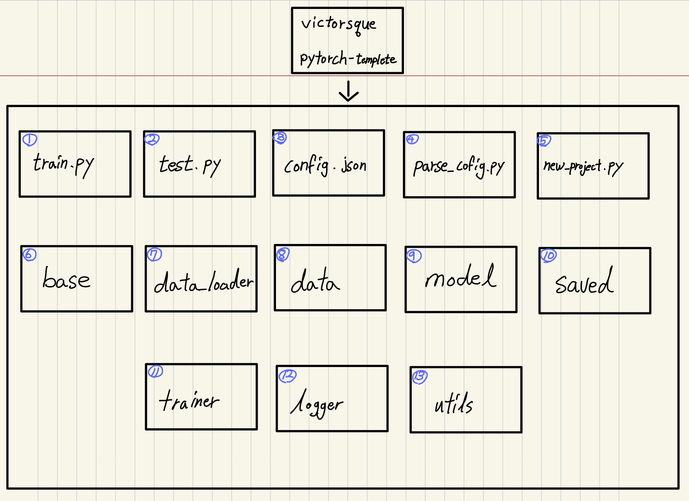

# Day 11 Pytorch 1~3 강

## 목차 

1. [강의 내용 정리](#1-강의-내용-정리)

2. [과제 수행 과정 / 결과물 정리](#2-과제-수행-과정--결과물-정리)

3. [피어세션 정리](#3-피어세션-정리)

<!--4. [흥미있던 질문들](#4-흥미있던-질문들)-->

4. [학습 회고](#4-학습-회고)

----

### 1. 강의 내용 정리

* Pytorch 1~3강
    * 1강 : Introduction to PyTorch
        * pytorch와 tensorflow 
        &nbsp; - &nbsp; 초기에는 tensorflow가 더 많이 사용되었지만 점차(2019이후 논문기준) pytorch가 많이 사용되어 졌다.  
        &nbsp; - &nbsp; tensorflow는 define & run형식이고 pytorch는 define by run(dynamic computation graph)이다. 
        &nbsp;&nbsp;&nbsp;&nbsp; ‣ &nbsp; define & run : 그래프를 정의하고 실행시점에 데이터를 feed한다. 
        &nbsp;&nbsp;&nbsp;&nbsp; ‣ &nbsp; define by run : 실행을 하면서 그래프를 생성하는 방식이다. 
        &nbsp; * &nbsp; tensorflow와 pytorch는 사용하려는 목적에 따라서 다르게 사용하면 좋다. tensorflow와 같은 경우는 production, cloud, multi-GPU등을 사용할때 편하고 pytorch는 논문과 같은 연구분야에서 사용하기 좋다. 
        
         
    * 2강 : PyTorch Bascis
        * Tensor 
        &nbsp; - &nbsp; 다차원 Arrays를 표현하는 PyTorch 클래스   
        &nbsp; - &nbsp; 사실상 numpy의 ndarray와 동일(=> tensorflow의 Tensor와도 동일)   
        &nbsp; - &nbsp; Tensor를 생성하는 함수도 겅의 동일   
        &nbsp; - &nbsp; 생성방법   
        &nbsp;&nbsp;&nbsp;&nbsp; 1. &nbsp; list변수 a생성 -> torch.tensor(a) 
        &nbsp;&nbsp;&nbsp;&nbsp; 2. &nbsp; ndarray a생성 -> torch.from_numpy(a) 
         
        * Tensor와 numpy data type의 차이 : GPU를 사용할 수 있냐 없냐의 차이  
        * numpy like operations 
        &nbsp; - &nbsp; index slicing, flatten(), ones_like(), numpy(), shape, dtype 등   
        &nbsp; - &nbsp; view와 reshape 메소드의 차이   
        &nbsp;&nbsp;&nbsp;&nbsp; * &nbsp; view : data를 reference하여 사용  
        &nbsp;&nbsp;&nbsp;&nbsp; * &nbsp; reshape : data를 copy하여 사용  
        &nbsp; - &nbsp; 행렬곱셈 연산을 위한 함수로 dot이 아닌 mm을 사용한다. 이때 matmul이라는 함수도 mm과 비슷한 연산을 수행하지만 matmul은 broadcasting이 된다는 점에서 mm과 다르다. (dot과 같은 경우는 scalar나 vetor의 내적을 구할때만 사용할 수 있다.)   
        * nn.functional 모듈을 통해 다양한 수식 변환을 지원한다. 
         

        * AutoGrad 
        &nbsp; - &nbsp; pytorch의 핵심인 기능. backward함수를 이용하여 자동 미분 
         
       
    * 3강 : PyTorch 프로젝트 구조 이해하기
        * colab을 ssh로 연결하여 작업하기 
        &nbsp; 0. &nbsp; 작업할 파일 및 디렉토리 구글드라이브에 upload   
        &nbsp; 1. &nbsp; ngrok 토큰 생성(ngrok사이트 회원가입 후 토큰 생성, authtoken을 이용)   
        &nbsp; 2. &nbsp; 패스워드 설정  
        &nbsp; 3. &nbsp; colab-ssh를 설치(!pip install colab-ssh)   
        &nbsp; 4. &nbsp; 사용방법

                from colab impoert colab-ssh
                launch_ssh(토큰, 패스워드)
        &nbsp;&nbsp;&nbsp;&nbsp;&nbsp;&nbsp;&nbsp;&nbsp;를 해주면 된다. 
        &nbsp;&nbsp;&nbsp;&nbsp;&nbsp;&nbsp;&nbsp;&nbsp;&nbsp;&nbsp;&nbsp; 5. &nbsp; vscode에서 ssh plug를 다운 받고 4번의 결과의 정보를 토대로 User@HostName으로 연결해주고 해당 패스워드를 입력해주면 된다.  
         

        * 프로젝트 구조 분석해보기 
        
        &nbsp; 1. &nbsp; train.py : training을 위한 main script이다. 
        &nbsp; 2. &nbsp; test.py : 학습된 모델을 평가하기 위한 script 
        &nbsp; 3. &nbsp; config.json : training을 위한 config정보들이 있는 json파일이다. 
        &nbsp; 4. &nbsp; parse_config.py : config 파일과 cli에서 옵션 handling을 위한 script  
        &nbsp; 5. &nbsp; new_project.py : 템플릿 파일로 새로운 프로젝트를 초기화하는 스크립트  
        &nbsp; 6. &nbsp; base : 추상 클래스들 
        &nbsp;&nbsp;&nbsp;&nbsp; 6-1. &nbsp; base_data_loader.py : data_loader에 대한 추상 클래스 
        &nbsp;&nbsp;&nbsp;&nbsp; 6-2. &nbsp; base_model.py : model에 대한 추상클래스 
        &nbsp;&nbsp;&nbsp;&nbsp; 6-3. &nbsp; base_trainer.py : trainer에 대한 추상 클래스 
        &nbsp; 7. &nbsp; data_loader 
        &nbsp;&nbsp;&nbsp;&nbsp; 7-1. &nbsp; data_loaders.py : data를 loader하귀 위한 파이썬 파일 
        &nbsp; 8. &nbsp; data : data들을 넣을 디렉토리 
        &nbsp; 9. &nbsp; model : 모델, loss, metrics가 있는 디렉토리 
        &nbsp;&nbsp;&nbsp;&nbsp; 9-1. &nbsp; model.py : 딥러닝 모델 
        &nbsp;&nbsp;&nbsp;&nbsp; 9-2. &nbsp; metric.py : 메트릭 
        &nbsp;&nbsp;&nbsp;&nbsp; 9-3. &nbsp; loss.py : loss 측정 
        &nbsp; 10. &nbsp; saved 
        &nbsp;&nbsp;&nbsp;&nbsp; 10-1. &nbsp; models : 중간중간에 model 저장하기 위한 디렉토리 
        &nbsp;&nbsp;&nbsp;&nbsp; 10-2. &nbsp; log : 증간중간 log정보 저장하기 위한 디렉토리 
        &nbsp; 11. &nbsp; trainer 
        &nbsp;&nbsp;&nbsp;&nbsp; 11-1. &nbsp; trainer.py : 학습을 수행하는 script <- 여러가지 설정, 모델, 데이터 저장소 및 로깅 방법등을 연결하여 실행 
        &nbsp; 12. &nbsp; logger : logging을 위한 script들이 있는 디렉토리 
        &nbsp;&nbsp;&nbsp;&nbsp; 12-1. &nbsp; visualiztion.py 
        &nbsp;&nbsp;&nbsp;&nbsp; 12-2. &nbsp; logger.py 
        &nbsp;&nbsp;&nbsp;&nbsp; 12-3. &nbsp; logger_config.json 
        &nbsp; 13. &nbsp; utils : 여러가지 utility가 있는 디렉토리 
        &nbsp;&nbsp;&nbsp;&nbsp; 13-1. &nbsp; util.py  
        &nbsp;&nbsp;&nbsp;&nbsp; 13-... . &nbsp; 그외 ...  
        [참고 사이트](https://github.com/victoresque/pytorch-template)
          

    

### 2. 과제 수행 과정 / 결과물 정리
 

#### 필수과제 부덕이~~~!!!!! ㅠㅠ 과제는 분명 1개인데 양이.... 그리고 optional 문제... 안해도 되는데... 왜 이렇게 풀고 싶지....  pytorch와 영어 공부 두 마리 토끼를 잡게 해준 부덕이 덕분에 늦게 잘 예정이다. 

 

### 3. 피어세션 정리
 
📒[금일 질문 목록]:  

* torch.gather에서의 dim의 의미는?
    * input과 index의 dimension을 동일해야 한다. 만약, input이 4x10x15이고, dim = 0이면, index는 Nx10x15여야 한다. 즉, dim으로 입력한 차원을 제외한 나머지 차원은 동일해야한다.
* chunk의 2차원 배열에서의 변환은 어떻게 이루어지는가?
* nn.Linear에서의 크기 변환을 어떻게 해야하는가?
    * 과제에서 nn.Linear(2,5)를 입력해주게되면, 열의 개수가 2개에서 5개로 변한다.
    * 이렇게 되는 원리에 대해서는 정확히 알지 못했다.
* 3차원에서 대각행렬이면 정육면체에서 전체에 대한 대각인줄 알았는데 아닌가?
    * 본 과제에서 3차원에 대한 대각행렬을 각 2차원을 뱃치로 보고, 각 2차원 행렬에 대한 대각원소를 의미한 것이다.
* expand는 어떻게 활용하는 것인가?
    * 여러 배치가 있다고 했을 때, 각 배치마다 동일한 값을 반복하여 나타내어준다.

📎[주별 발표]

* 진선님
    * 다양한 이미지 Dataset별로 분류 모델을 직접 돌려본 것에 대한 설명을 진행
* 원진님
    * Git-Flow에 대하여 다시 한 번 상기시켜주었으며, git 사용법에 대한 발표 진행.

  

### 4. 학습 회고

#### 강의 내용은 pytorch의 개요를 알려주는 부분이라서 어렵지는 않았다.

 

#### BUT!!!!! 과제가....😭
 

#### 피어세션을 통해서 gather에 대해서 좀 더 이해가 잘 되었고 git에 대한 여러 배경지식이 추가된 좋은 시간이었다. 

 

#### 특강도 실무자의 경험에 대해서 들을 수 있는 좋은 기회여서 매우 좋았다 ㅎㅎㅎㅎ

#### 시각화.... 들어야 하는데.... 자꾸만 밀어지는 것 같다 ㅠㅠ😵‍💫