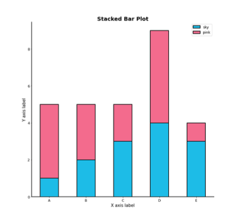
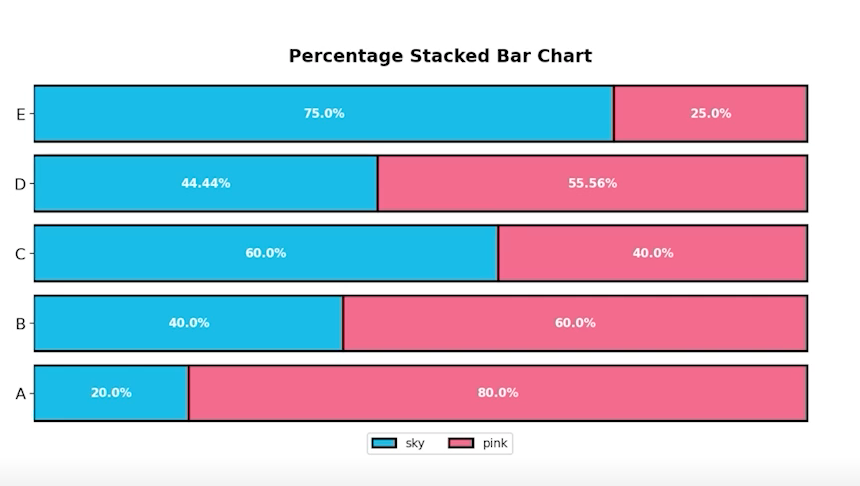
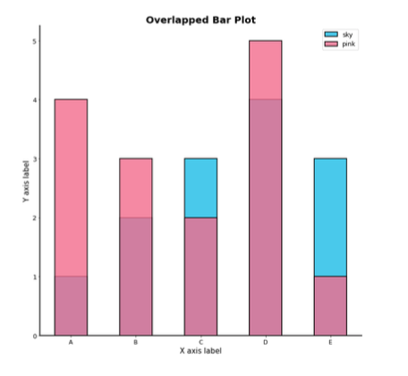
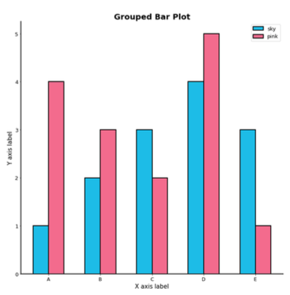
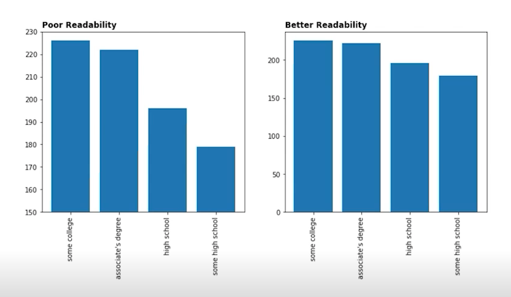
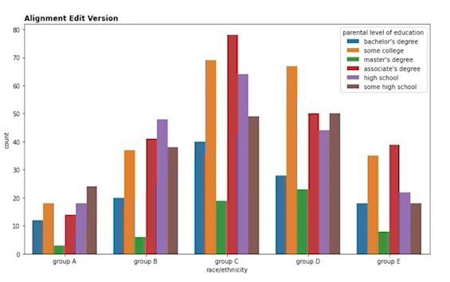
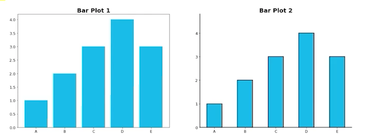
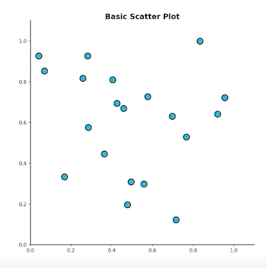
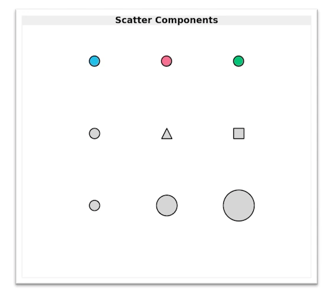

<!--
구조
*
    *
        *  
            &nbsp; - &nbsp;   
                &nbsp;&nbsp;&nbsp;&nbsp; ‣ &nbsp;   
                    &nbsp;&nbsp;&nbsp;&nbsp;&nbsp;&nbsp;&nbsp;&nbsp; * &nbsp;  
-->

# week3-1 Data Viz 2강

## 목차 

1. [강의 내용 정리](#1-강의-내용-정리)

<!--4. [흥미있던 질문들](#4-흥미있던-질문들)-->

2. [학습 회고](#2-학습-회고)

----

### 1. 강의 내용 정리

* Data Viz 2강
    * 2-1 강 : Bar Plot 사용하기 
        * 기본 Bar plot 
        &nbsp; - &nbsp; Bar plot이란?  
        &nbsp;&nbsp;&nbsp;&nbsp; ‣ &nbsp; Bar plot이란 직사각형 막대를 사용하여 데이터의 값을 표현하는 차트/그래프 이다.  
        &nbsp;&nbsp;&nbsp;&nbsp; ‣ &nbsp; 막대 그래프, bar chart, bar graph 등의 이름으로 사용된다.  
        &nbsp;&nbsp;&nbsp;&nbsp; ‣ &nbsp; 범주(category)에 따른 수치 값을 비교하기에 적합한 방법이다. <- 개별 비교, 그룹 비교 모두 적합하다.   
        &nbsp; - &nbsp; 막대 그래프 형태 
        &nbsp;&nbsp;&nbsp;&nbsp; ‣ &nbsp; 수직 : x축에 범주, y축에 값을 표기(default) <- .bar() 사용 
        &nbsp;&nbsp;&nbsp;&nbsp; ‣ &nbsp; 수평 : y축에 범주, x축에 값을 표기(범주가 많을 때 적합) <- .barh() 사용   

         

        * 다양한 Bar plot  

                임의의 그룹 데이터를 시각화 해보자!
                    
                2개의 그룹이 존재하고 각 데이터를 A, B, C, D, E 라고 하자.

                Group Sky [1, 2, 3, 4, 5]
                Group Pink [4, 3, 2, 5, 1]

                이때 두 데이터를 비교하기 위해서 어떤 방법을 쓸 수 있을까?

        &nbsp; 1. &nbsp; 플롯을 여러 개 그리는 muliple한 방법  
        &nbsp; 2. &nbsp; 한 개의 플롯에 동싱에 나타내는 방법  
        &nbsp;&nbsp;&nbsp;&nbsp; ‣ &nbsp; Stacked Bar Plot : 쌓아서 표현하는 방법  
        &nbsp;&nbsp;&nbsp;&nbsp;&nbsp;&nbsp;&nbsp;&nbsp; * &nbsp; 각 bar에서 나타나는 그룹의 순서는 항상 유지되어야 한다.  
        &nbsp;&nbsp;&nbsp;&nbsp;&nbsp;&nbsp;&nbsp;&nbsp; * &nbsp; 맨 밑의 bar의 분포는 파악하기 쉽지만 그 외의 분포들은 파악하기 어렵다. <- 2개의 그룹이 positive/negative라면 축 조정이 가능하다.  
        &nbsp;&nbsp;&nbsp;&nbsp;&nbsp;&nbsp;&nbsp;&nbsp; * &nbsp; .bar()에서는 bottom 파라미터를 이용  
        &nbsp;&nbsp;&nbsp;&nbsp;&nbsp;&nbsp;&nbsp;&nbsp; * &nbsp; .barh()에서는 left 파라미터를 이용 
        
 

        &nbsp;&nbsp;&nbsp;&nbsp;&nbsp;&nbsp;&nbsp;&nbsp; * &nbsp; 위의 bar chart를 조금만 변형시키만 아래와 같이 percentage stacked bar chart가 될 수 있다. 
        
 

        &nbsp;&nbsp;&nbsp;&nbsp;&nbsp;&nbsp;&nbsp;&nbsp; => &nbsp; 위와 같은 chart는 전체에 대해서 각 feature의 비율을 비교할 때 사용될 수 있다.  
        &nbsp;&nbsp;&nbsp;&nbsp; ‣ &nbsp; Overlapped bar plot : 겹쳐서 표현하는 방법  
        
 

        &nbsp;&nbsp;&nbsp;&nbsp;&nbsp;&nbsp;&nbsp;&nbsp; * &nbsp; 2개 그룹만 비교한다면 겹쳐서 만드는 것도 하나의 방법이 될 수 있다. <- 3개 이상에서는 정보를 파악하기 어려운 방법이다. 
        &nbsp;&nbsp;&nbsp;&nbsp;&nbsp;&nbsp;&nbsp;&nbsp; * &nbsp; 같은 축을 사용하기 때문에 비교가 쉽다. -> 투명도를 조정하여 겹치는 부분을 파악할 수 있다. <- alpha값으로 조정 
        &nbsp;&nbsp;&nbsp;&nbsp;&nbsp;&nbsp;&nbsp;&nbsp; * &nbsp; 투명도 이외에도 비교하려는 bar의 색상과 명도에 따라서 눈에 보기 쉬운 차트가 되거나 반대가 될 수도 있다. 
        &nbsp;&nbsp;&nbsp;&nbsp;&nbsp;&nbsp;&nbsp;&nbsp; * &nbsp; Bar plot보다는 area plot에서 더 횩과적이다.  
        &nbsp;&nbsp;&nbsp;&nbsp; ‣ &nbsp; Grouped bar plot :이웃에 배치하여 표현하는 방법 <- 가장 추천하는 방식 
        
 

        &nbsp;&nbsp;&nbsp;&nbsp;&nbsp;&nbsp;&nbsp;&nbsp; * &nbsp; stacked 방식보다 분포를 보는데 용이하고 overlapped에 비해서 가독성이 높다. 
        &nbsp;&nbsp;&nbsp;&nbsp;&nbsp;&nbsp;&nbsp;&nbsp; * &nbsp; 아쉬운점은 matplotlib은 범주형보다 수치형 자료에 대해서 구현하기 쉬워 비교적 앞에 소개된 방법보다 구현하기 어렵다. <- seaborn에서는 좀 더 편하다. 
        &nbsp;&nbsp;&nbsp;&nbsp;&nbsp;&nbsp;&nbsp;&nbsp; * &nbsp; 그룹이 너무 많아지면 비효율적이 된다. 이상적인 그룹의 개수는 5~7개 이하일 때 좋다. -> 8개이상일때는 2개이상의 그룹을 etc로 만들어줘서 1개의 그룹으로 표시해주는 방식을 이용하면 좋다. 

         

        * 더 정확한 Bar plot  
        &nbsp; - &nbsp; 잉크 비례 원칙  
        &nbsp;&nbsp;&nbsp;&nbsp; ‣ &nbsp; 실제 값과 그에 표현되는 그래픽으로 표현되는 잉크 양은 비례해야 한다. -> 1이라는 값과 5라는 값을 표현해야 할때 이때 1은 잉크양이 1만큼 5는 5만큼 사용되어야 한다. -> 항상 x축의 시작은 0이어야 한다. 
        &nbsp;&nbsp;&nbsp;&nbsp; ‣ &nbsp; 이 원칙이 중요한 이유는 잘못된 시각적인 정보(관점)를 제공할 수 있기 때문이다. 아래의 예시는 한쪽은 시작점이 150이고 다른 한족은 0이다. 이에 따른 시각적인 정보가 다르다는 느낌을 받을 수 있다. 
          
        &nbsp; - &nbsp; 데이터 정렬하기  
        &nbsp;&nbsp;&nbsp;&nbsp; ‣ &nbsp; 더 정확한 정보를 전달하기 위해서는 정렬이 필수이다. <- pandas에서는 sort_values(), sort_index()를 사용하여 정렬한다. 
        &nbsp;&nbsp;&nbsp;&nbsp; ‣ &nbsp; 데이터의 종류에 따라 다음 기준으로 정렬한다. 
        &nbsp;&nbsp;&nbsp;&nbsp;&nbsp;&nbsp;&nbsp;&nbsp; * &nbsp; 시계열 - 시간순으로 
        &nbsp;&nbsp;&nbsp;&nbsp;&nbsp;&nbsp;&nbsp;&nbsp; * &nbsp; 수치형 - 크기순으로 
        &nbsp;&nbsp;&nbsp;&nbsp;&nbsp;&nbsp;&nbsp;&nbsp; * &nbsp; 순서형 - 범주의 순서대로 
        &nbsp;&nbsp;&nbsp;&nbsp;&nbsp;&nbsp;&nbsp;&nbsp; * &nbsp; 명목형 - 범주의 값에 따라 정렬  
          
        &nbsp; - &nbsp; 적절한 공간 활용  
        &nbsp;&nbsp;&nbsp;&nbsp; ‣ &nbsp; 여백과 공간만 조정을 해도 가독성이 높아진다.  
        &nbsp;&nbsp;&nbsp;&nbsp; ‣ &nbsp; matplotlib의 bar plot은 ax에 꽉 차서 살짝 답답한 느낌을 줄 수 있다. 
          
        &nbsp; - &nbsp; 복잡함과 단순함  
        &nbsp;&nbsp;&nbsp;&nbsp; ‣ &nbsp; 쓸데없이 복잡하면 안된다! <- 의미없이 화려한 것은 별로다.  
        &nbsp; - &nbsp; etc  
        &nbsp;&nbsp;&nbsp;&nbsp; ‣ &nbsp; 오차 막대를 추가하여 uncertainty 정보를 추가 가능(errorbar) 
        &nbsp;&nbsp;&nbsp;&nbsp; ‣ &nbsp; bar사이 gap이 0이라면 -> 히스토그램 <- 연속된 느낌을 줄 수 있다. 
        &nbsp;&nbsp;&nbsp;&nbsp; ‣ &nbsp; 다양한 text정보 활용하기 <- 제목, 라벨 등 
         

    * 2-2강 : Line plot 사용하기
        * Line plot이란? 
        &nbsp; - &nbsp; Line plot은 연속적으로 변화하는 값을 순서대로 점으로 나타내고 이를 선으로 연결하는 그래프 -> 꺾은선 그래프, 선 그래프, line chart, line graph 등의 이름으로 사용된다.  
        &nbsp; - &nbsp; 시간/순서에 대한 변화에 적합하여 추세를 살피기 위해 사용 -> 시계열 분석에 특화되어 있다.  
         

        * Line plot의 요소 
        &nbsp; - &nbsp; 색상, 마커(점을 표시하는 모양), 선의 종류등으로 구성된다.  
        &nbsp; - &nbsp; 보통 5개 이하의 선을 사용하는 것이 좋다. -> 많은 선이 중첩되면 그로 인한 가독성이 떨어진다.  
        &nbsp; - &nbsp; Hyperparameter tuning 방식  
        &nbsp;&nbsp;&nbsp;&nbsp; 1. &nbsp; Grid : hyperparameter의 값의 범위를 일정범위 기준으로 나눠서 찾는 방법. 
        &nbsp;&nbsp;&nbsp;&nbsp; 2. &nbsp; Random : hyperparmeter의 값을 무작위로 선택해서 찾는 방법. 
        &nbsp;&nbsp;&nbsp;&nbsp; => &nbsp; 예전에는 Random 방식을 이용해서 성능이 잘 나오는 구간의 hyperparameter 범위를 찾아주고 그 구간에서 grid를 이용해서 찾아주는 방식을 많이 사용했다고 한다. <- 지금은 베이지안 기법들을 주로 많이 사용한다고 함(<- 논문 이름 : BOHB)  
         

        * Line plot을 위한 전처리 
        &nbsp; - &nbsp; 시시각각 변동하는 데이터는 Noise로 인해 패턴 및 추세 파악이 어렵다.  
        &nbsp; - &nbsp; Noise의 인지적인 방해를 줄이기 위해 smoothing을 사용한다.  

        * Line plot은 추세에 집중한다. 
        &nbsp; - &nbsp; bar plot과 다르게 꼭 축을 0에 초점을 둘 필요는 없다. <- 왜냐하면 추세를 보기 위한 목적이기 때문 
        &nbsp; - &nbsp; 너무 구체적인 line plot보다는 생략된 line plot이 더 나을 수 있다. -> grid, annootate 등 모두 제거, 디테일한 정보는 표로 제공  
        &nbsp; - &nbsp; 생략되지 않는 선에서 범위를 조정하여 변화율을 관찰   
        
        * Line plot의 간격 
        &nbsp; - &nbsp; 규칙적인 간격이 아니라면 오해를 줄 수 있다.  
        &nbsp; - &nbsp; 규칙적인 간격의 데이터가 아니라면 각 관측 값에 점으로 표시하여 오해를 유발시킬 수 있는 요소를 차단하자.  
         

        * 보간  
        &nbsp; - &nbsp; line은 점을 이어 만드는 요소 -> 점과 점 사이에 데이터가 없기에 이를 잇는 방법을 보간이라고 한다. 
        &nbsp; - &nbsp; 데이터의 error나 noise가 포함되어 있는 경우, 데이터의 이해를 돕는 방법 
        &nbsp; - &nbsp; presentation에는 좋은 방법일 수 있으나 없는 데이터를 있다고 오해를 유발할 수 있고 작은 차이를 무시해버릴 수 있다. 따라서 일반적인 분석에서는 보간을 지양하는게 좋다. 
         

        * 이중 축 사용 
        &nbsp; - &nbsp; 한 plot에 대해 2개의 축을 사용하는 방식을 이중 축이라고 한다.  
        &nbsp; - &nbsp; 같은 시간 축에 대해 서로 다른 종류의 데이터를 표현하기 위해서는 축이 2개가 필요하다.  
        &nbsp; - &nbsp; 한 데이터에 대해 다른 단위 
        &nbsp; - &nbsp; 2개의 plot을 그리는 것 
        &nbsp; - &nbsp; 이중 축보다는 2개의 plot을 그리는것이 더 좋기 때문에 지양하는 것이 좋다.<- 상관관계가 없는데 있는 것처럼 착각을 줄 수 있기 때문 
         
        
        * etc 
        &nbsp; - &nbsp; 범례를 사용하는 것보다 라인 끝 단에 레이블을 추가하는게 식별할때 더 도움이 된다. 
        &nbsp; - &nbsp; 추세를 나타내기 위해서 Min/Max 정보를 추가해주면 도움이 될 수 있다. 
        &nbsp; - &nbsp; 보다 연한 색 혹은 대비가 가능한 색을 사용하여 uncertainty 표현 가능(신뢰구간, 분산, min/max 값) 
         

    * 2-3강 : Scatter plot
        * Scatter plot이란? 
        &nbsp; - &nbsp; 점을 사용하여 두 feature간의 관게를 알기 위해 사용하는 그래프이다. 
        &nbsp; - &nbsp; 산점도 등의 이름으로 사용된다. 
        &nbsp; - &nbsp; 직교 좌표계에서 x축/y축에 feature값을 매핑해서 사용 
          
        
        * scatter plot의 요소 : 색, 모양, 크기 
          

        * scatter plot의 목적 
        &nbsp; - &nbsp; 상관 관계 확인(양의 상관관계/음의 상관관계/없음) 
        &nbsp; - &nbsp; 데이터의 특성을 확인하기 위해서 : 군집, 값 사이의 차이, 이상치 
         

        * overplotting 
        &nbsp; - &nbsp; 점이 많아질수록 점의 분포를 파악하기 힘들다. -> 투명도 조정, 지터링(점의 위치를 약간씩 변경), 2차원 히스토그램(히트맵을 사용하여 깔끔한 시각화), contour plot(분포를 등고선을 사용하여 표현)을 이용해 보자! 
         

        * 점의 요소와 인지 
        &nbsp; - &nbsp; 색 : 연속적인 값 : gradient, 이산적인 값 : 개별 색상 
        &nbsp; - &nbsp; 마커 : 값을 표현하는 모양 <- 마커만 사용한다면 구별이 힘드므로 다른 요소들과 함께 사용하는 것이 좋다. 또한 다른 모양의 마커이지만 동일한 크기여도 사람이 인지하기에는 크기가 다르다고 느껴질 수 있는데 이로 인해서 잘못된 정보를 전달할 수도 있다.  
        &nbsp; - &nbsp; 크기 : 버블 차트라고 부른다.  
        &nbsp;&nbsp;&nbsp;&nbsp; ‣ &nbsp; 구별하기는 쉽지만 오용하기 쉽다. 
        &nbsp;&nbsp;&nbsp;&nbsp; ‣ &nbsp; 관계보다는 각 점간 비율에 초점을 둔다면 좋다. 
        &nbsp;&nbsp;&nbsp;&nbsp; ‣ &nbsp; SWOT 분석 등에 활용이 가능하다. 
         

        * 인과관계와 상관관계 
        &nbsp; - &nbsp; 인과 관계와 상관 관계는 다르다. -> 분석 과정에서 꼭 고민해볼 것 
        &nbsp; - &nbsp; 인과 관계는 항상 사전 정보와 함께 가정으로 제시할 것 
        &nbsp; - &nbsp; 상관관계는 추후 heatmap에서 다시 다룰 예정 

        * 추세선 
        &nbsp; - &nbsp; 추세선을 사용하면 scatter의 패턴을 유추할 수 있다. 
        &nbsp; - &nbsp; 단, 추세선이 2개 이상이 되면 가독성이 떨어지므로 이점은 주의해서 사용하자. 

        * ETC 
        &nbsp; - &nbsp; scatter plot과 grid를 함께 사용하면 가독성이 떨어지므로 지양하는게 좋다. 
        &nbsp; - &nbsp; 범주형이 포함된 관계에서는 heatmap 또는 bubble chart를 사용하는 것이 좋다. 

        
    

### 2. 학습 회고

