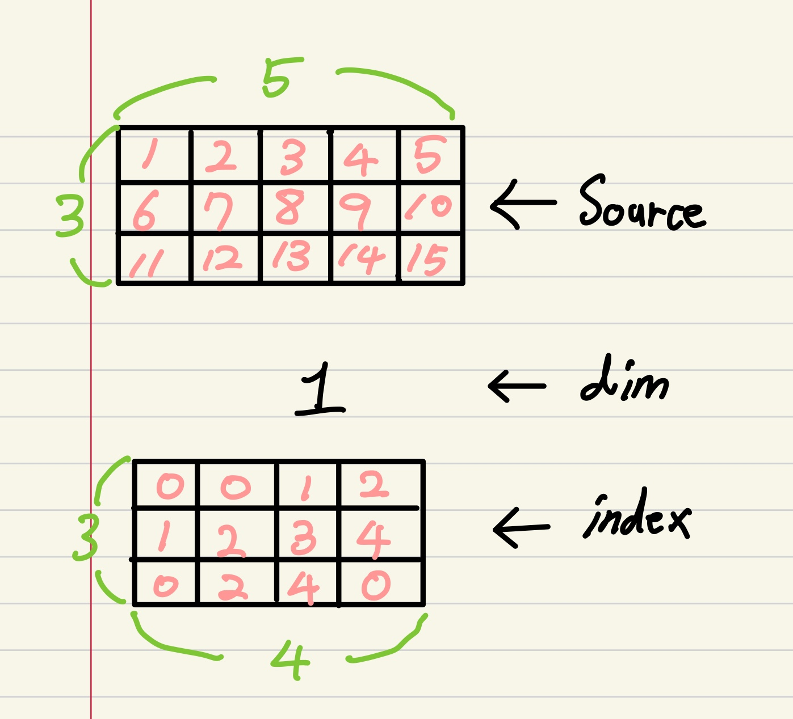

<!--
구조
*
    *
        *  
            &nbsp; - &nbsp;  
                &nbsp;&nbsp;&nbsp;&nbsp; ‣ &nbsp;  
                    &nbsp;&nbsp;&nbsp;&nbsp;&nbsp;&nbsp;&nbsp;&nbsp; * &nbsp;  
-->

# week3-1 필수과제 1~2

## 목차 

1. [과제 내용 정리](#1-과제-내용-정리)

<!--4. [흥미있던 질문들](#4-흥미있던-질문들)-->

2. [학습 회고](#2-학습-회고)

----

### 1. 과제 내용 정리

* 필수 과제 1
    * view 
        * tensor의 모양을 바꾸고 싶을때 사용한다. 
        * view와 reshape의 차이점은??? -> [예전에 정리했는데... 까먹었으면 클릭하라구!](../day11/day11.md)

    * gather
        * 중점적으로 봐야할 인자 
            &nbsp; - &nbsp; input : source tensor 값 
            &nbsp; - &nbsp; dim : 기준이 되는 축(차원) 
            &nbsp; - &nbsp; index : gather함수를 적용시킬 indices의 elements  
        * 내가 이해한 gather 사용법 
            &nbsp; - &nbsp; index의 사이즈가 input에 대해서 dim을 제외한 모든 차원이 같다면 해당 dim을 기준으로 index의 indices를 통해서 element를 추출한다. 
            &nbsp; * &nbsp; 이때 dim은 0~n이라고 할 때, n이 작을수록 input에서 높은 차원을 뜻한다. -> input이 3차원이면 0 : 3차원, 1 : 2차원, 2 : 1차원 을 뜻한다.  
             
            &nbsp; * &nbsp; Source와 index의 size는 각각 (3, 5), (3, 4)로 axis=1이 다르지만 gather의 dim을 1로 줄 것이기 때문에 문제가 없다. 
            &nbsp; * &nbsp; 그래서 index의 원소들을 해당 Source의 index로 생각하여 각 Source의 index의 값을 가져와 result에 저장을 한다. 이때 gather의 dim이 1이므로 1차원 즉 열을 기준으로 적용이 되므로 각 열 뭉치(행)에서 index에 해당하는 원소 값을 가져온다. -> index[1][2]의 경우 3이므로 해당 Source에서 [1][3]의 9라는 값을 가져올 것이다.  
             
            &nbsp; * &nbsp; 위의 실행 결과 result와 같은 값이 나오게 된다.  
        * 3D에서 gather을 이용하여 대각행렬을 가져오기 위한 방법
            &nbsp; - &nbsp; dim을 기준으로 나머지 size를 일치시킨다. 
            &nbsp; - &nbsp; 이때 2D기준으로 행과 열의 사이즈 중에서 작은 것을 기준으로 indice사이즈를 정하면 된다. -> 그러므로 행과 열(== dim이 1 또는 2)중 하나가 사이즈가 안 맞게 되므로 gather에서 이 정보를 이용하여 dim으로 사용하면 된다. 
            &nbsp; * &nbsp; 실제 코드 작성시 크기 부분을 맞춰주는게 매우 중요하므로 unsqueeze와 squuze, repeat, extend를 통해서 잘 맞춰주도록 하자. 
            &nbsp; * &nbsp;  3D에서 대각 행렬은 2D에서의 대각행렬을 중접하는 거라고 이해하면 된다. 
        
         
    

    * nn.Module
        * torch.nn.Linear : linear layer instance를 생성하는 class 
        * torch.nn.Identity : input과 output이 동일하게 나오도록 만듬 -> 사용 이유 : 아래의 참고 사이트에서 글을 읽어 봤는데 잘 모르겠음;;; [참고 사이트1](https://discuss.pytorch.org/t/what-is-the-use-of-nn-identity/51781/4), [참고 사이트2](https://stackoverflow.com/questions/64229717/what-is-the-idea-behind-using-nn-identity-for-residual-learning) 
        * torch.nn.Sequential : 모듈들을 하나로 묶어 순차적으로 실행시키고 싶을때 사용한다. -> 예를 들어서 torch.nn.Sequential 인자로 Linear, Parameter 등이 들어 갈 수 있고 순차적으로 forward를 시켜준다.  
        * torch.nn.ModuleList : 모듈을 list형태로 관리하여 원하는 모듈을 해당 index로 접근하여 사용하는 방식 
        * torch.nn.ModuleDict : 모듈을 dict형태로 관리하여 해당 key값을 이용하여 원하는 모듈에 접근하여 사용하는 방식 
        * torch.nn.parameter.Parameter : 위의 Linear에서는 Y = WX + b와 같은 형식으로 저장이 되는데 이때 W와 b와 같은 tensor들은 Parameter라는 class로 만들어 진다. 즉, 모듈안에서 사용되는 tensor라고 생각하면 될 것 같다. 
        * buffer : tensor값을 Parameter와 비슷하게 모델을 저장할 때 유지한다. 다만, gradient를 계산하지 않으며 업데이트도 수행되지 않는다. 
        &nbsp; - &nbsp; Tensor, Buffer, Parameter의 각 특징 정리하기 
        &nbsp;&nbsp;&nbsp;&nbsp; ‣ &nbsp; Tensor 
        &nbsp;&nbsp;&nbsp;&nbsp;&nbsp;&nbsp;&nbsp;&nbsp; * &nbsp; gradient 계산을 __수행하지 않음.__ 
        &nbsp;&nbsp;&nbsp;&nbsp;&nbsp;&nbsp;&nbsp;&nbsp; * &nbsp; 값 업데이트를 __하지 않음__ 
        &nbsp;&nbsp;&nbsp;&nbsp;&nbsp;&nbsp;&nbsp;&nbsp; * &nbsp; 모델 저장시 값이 __저장되지 않음__ 
        &nbsp;&nbsp;&nbsp;&nbsp; ‣ &nbsp; Buffer 
        &nbsp;&nbsp;&nbsp;&nbsp;&nbsp;&nbsp;&nbsp;&nbsp; * &nbsp; gradient 계산을 __수행하지 않음.__ 
        &nbsp;&nbsp;&nbsp;&nbsp;&nbsp;&nbsp;&nbsp;&nbsp; * &nbsp; 값 업데이트를 __하지 않음__ 
        &nbsp;&nbsp;&nbsp;&nbsp;&nbsp;&nbsp;&nbsp;&nbsp; * &nbsp; 모델 저장시 __값이 저장된다.__ 
        &nbsp;&nbsp;&nbsp;&nbsp; ‣ &nbsp; Parameter 
        &nbsp;&nbsp;&nbsp;&nbsp;&nbsp;&nbsp;&nbsp;&nbsp; * &nbsp; gradient 계산을 __수행한다.__ 
        &nbsp;&nbsp;&nbsp;&nbsp;&nbsp;&nbsp;&nbsp;&nbsp; * &nbsp; 값 __업데이트 한다.__ 
        &nbsp;&nbsp;&nbsp;&nbsp;&nbsp;&nbsp;&nbsp;&nbsp; * &nbsp; 모델 저장시 값이 __저장된다.__ 
        * torch.nn.Module.named_children : 해당 모듈을 기준으로 바로 아래 자식 모듈(submodule)까지만 표시해준다. 
        * torch.nn.Module.named_modules : 자신에게 속하는 모든 자식 모듈(submodule)을 표시해 준다. 
        * torch.nn.Module.get_submodule : 해당 모듈에거 자신이 원하는 모듈(인자로 준 name에 해당하는 모듈)을 표시해 준다. 
        * torch.nn.Module.named_parameters : 해당 모듈에 파라미터 정보를 보여준다. 
        * torch.nn.Module.named_buffers : 해당 모듈의 버퍼 정보를 보여준다. 
        * 위의 .named_~()들은 전부 iter로 이용해야 정보를 볼 수 있다. 
                
                ex)
                for name, parameter in model.named_parameters():
                    print(name,parameter)

        * torch.nn.Module.register_buffer : 해당 모듈에 buffer를 등록한다. 
        * torch.nn.Module.extra_repr : __ repr __ 매직 매소드를 재정의 해준다. 
         

    * hook
        * hook 이란? : 해당 모듈 혹은 패키지로부터 어떤 함수 혹은 동작을 수행할때 중간중간에 실행되는 함수라고 생각하면 된다.  
         
        * tensor hook 
            &nbsp; - &nbsp; torch.Tensor.register_hook : backward hook으로 Tensor의 연산/동작 등을 수행한 후에 작동하는 hook이다. 
         
        * Module hook 
            &nbsp; - &nbsp; torch.Module.register_forward_pre_hook : forward전에 수행되는 hook이다. 
            &nbsp; - &nbsp; torch.Module.register_foward_hook : forward후에 동작하는 hook이다. 
            &nbsp; - &nbsp; torch.Module.register_full_backward_hook : backward후에 동작하는 hook이다. 

        * hook 함수 
            &nbsp; - &nbsp; 위의 함수들로 hook을 등록하기 전에 등록할 hook함수를 만들어야 한다. 이때 등록하는 위치(pre_forward, forward, backward)마다 hook함수에 들어갈 인자들이 달라지고 변경할 수 있는 정보들도 달라진다. 아래에서 input, grad_input정보는 module에 들어오는 정보를 말하며 output은 forward을 수행하고 나온 결과 값이고 grad_output은 forward를 수행하고 나온 값이다. 그러므로 forward_pre에서는 output이 인자로 들어가지 않는다. <- 왜냐하면 forward_pre는 forward하기 전에 들어가는 hook이기 때문이다. 
            &nbsp; - &nbsp; forward_pre : module과 input정보가 인자로 들어가게 되고 이때 인자로 들어온 input정보를 수정할 수 있다. 
            &nbsp; - &nbsp; forward : module, input, output 정보를 인자로 받으며 이때 output정보를 수정할 수 있다. 
            &nbsp; - &nbsp; backward : module, grad_input, grad_output정보를 인자로 받으며 이때 output정보를 수정할 수는 없지만 새로운 grad_input, grad_output을 return해줄 수 있다. 이때 return 타입은 Tuple(Tensor)형태로 해줘야 한다. 
         

    * apply
        * 사용 이유 : module안에 있는 여러 container에 함수를 적용시키고 싶을때 사용한다. 
    
    * fuctools에 있는 partial 함수 
        * 기존의 함수에서 파라메터만 미리 정해준 또 다른 함수를 생성하는 것이다. 

                ex)
                from functools import partial

                def power(base, exponent):
                    return base ** exponent

                def square(arm):
                    return arm ** 2

                위의 square를 정의해주는 대신 아래와 같은 방식으로 함수를 정의할 수 있다. 
                그리고 이때 이용하는 함수가 partial이다.

                square = partial(power, exponent=2)
        * [참고사이트](https://khongchi.github.io/python/python-functools-partial-function/)
        * [나중에 보면 좋을 것 같은 사이트](http://www.incodom.kr/%ED%8C%8C%EC%9D%B4%EC%8D%AC/%ED%95%A8%EC%88%98)

 

* 필수 과제 2
    * DataSet class
        * __ init __  
        * __ len __  
        * __ getitem __  
         

    * DataLoader class
        * batch_size 
        * shuffle 
        * sampler 
        * batch_sampler 
        * num_worker 
        * collate_fn 
        * pin_memory 
        * drop_last 
        * timeout 
        * worker_init_fn 
         

    * torchvision
        * transform을 하는 이유 
        * torchvision에서 제공하는 tranform함수들 
            &nbsp; - &nbsp; torchvision.transforms.Resize 
            &nbsp; - &nbsp; torchvision.transforms.RandomCrop 
            &nbsp; - &nbsp; torchvision.transforms.RandomRotation 
            &nbsp; - &nbsp; torchvision.transforms.ToTensor 
            &nbsp; - &nbsp; torchvision.transforms.Compose 

    * torchtext
        * 사용목적 
        * torchtext.vacob 
            &nbsp; - &nbsp; torchtext.vocab.vocab 
            &nbsp; - &nbsp; torchtext.vacab.get_itos() 
            &nbsp; - &nbsp; torchtext.vacab.get_stoi() 

        * torchtext.data.utils 
            &nbsp; - &nbsp; torchtext.data.utils.get_tokenizer 

    * tqdm
        * 사용목적 
        * tqdm.pandas 
        

    
 

### 2. 학습 회고

