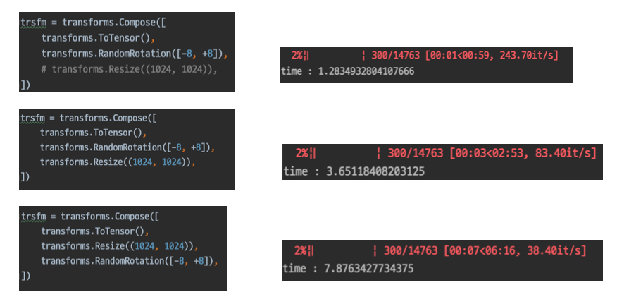

<!--
구조
*
    *
        *  
            &nbsp; - &nbsp;  
                &nbsp;&nbsp;&nbsp;&nbsp; ‣ &nbsp;  
                    &nbsp;&nbsp;&nbsp;&nbsp;&nbsp;&nbsp;&nbsp;&nbsp; * &nbsp;  
-->

# Day 16 이미지 분류 3~4강

## 목차 

1. [강의 내용 정리](#1-강의-내용-정리)

2. [Competition](#2-Competition)

3. [피어세션 정리](#3-피어세션-정리)

<!--4. [흥미있던 질문들](#4-흥미있던-질문들)-->

4. [학습 회고](#4-학습-회고)

----

### 1. 강의 내용 정리

* 이미지 분류 3~4강
    * 3강 : Dataset
        * Pre_processing 
        &nbsp; - &nbsp; data science에서 가장 많은 시간을 투자하는 단계이다. 그만큼 힐들고 어렵다. 
        &nbsp; - &nbsp; Bounding Box : 이미지의 특정 범위를 표시하기 위해서 사용. -> 박스로 범위를 표시한다. 
        &nbsp; - &nbsp; Resize : 계산의 효율을 위해 적당한 크기로 사이즈 변경. 
         

        * Genreralization  
        &nbsp; - &nbsp;  train set -> train, validation으로 만들어 검증을 하자! -> overfitting, underfitting을 주시하자! 
        &nbsp; - &nbsp; data augmentation : 주어진 데이터가 가질 수 있는 경우와 상태의 다양성  
        &nbsp; - &nbsp; torchvision.transforms : Image에 적용할 수 있는 다양한 함수들. -> 여러 경우 수의 이미지를 생성할 수 있다. 
        &nbsp; - &nbsp; 다른 여러 library를 참고하여 사용하자! 
        &nbsp; - &nbsp; '무조건'이라는 것을 조심하자 -> 모든 데이터는 모든 경우/상황에 따라 다르므로 '무조건 이것은 사용해야 된다'라는 것은 없다. 
         

    * 4강 : Data Generation
        * Data Feeding 
        &nbsp; - &nbsp; Feed의 의미는 '먹이를 주다'이다. -> 그냥 주는 것이 아닌 대상의 상태를 고려해서 적정한 양을 준다.   
        &nbsp; - &nbsp; 또 다른 예시 : 어떤 제품을 만드는 공정이 있다고 가정할때 설계 -> 제작 -> 포장 단계를 거친다고 하자. 이때 상품의 개수를 늘리기 위해서 제작 공정만 늘린다면 과연 상품의 개수가 많아질까? -> 제작 공정을 늘리면 포장 공정 또한 늘려야 제품의 개수를 많이 만들 수 있다. 만약 포장 공정은 그대로 놔두면 제작은 많이 되더라도 포장할 수 있는 개수가 이전과 같으므로 제품의 개수가 늘어나지 않는다. 
        &nbsp;&nbsp;&nbsp;&nbsp; => &nbsp; 이것을 data feed와 연관지어서 생각해 보면 데이터를 많이 feed한다고 해도 model이 처리할 수 있는 양을 초과할 수 없다. 
        &nbsp;&nbsp;&nbsp;&nbsp; => &nbsp; 모델의 벤치마크 성능을 테스트해보자 -> 효율성을 늘리기 위해서 확인해야 하는 작업  
        &nbsp; - &nbsp; 데이터 생성 능력 비교 
        
        &nbsp;&nbsp;&nbsp;&nbsp; * &nbsp; 데이터의 전처리 순서에 따라 연산에 대한 걸리는 시간도 다를 수 있다. 

         

        * torch.utils.data 
        &nbsp; - &nbsp; Dataset -> inint, len, getitem으로 구성이 되며 학습시킬 데이터를 전처리 및 반환해주는 역할. 
        &nbsp; - &nbsp; DataLoader -> Dataset을 효율적으로 사용할 수 있도록 관련 기능을 추가 해주는 class  
        &nbsp; - &nbsp; Dataset과 Dataloader는 엄연히 하는 일이 다르다. Dataset이 달라지더라도 DataLoader는 재사용 할 수도 있다. 

         
    

### 2. Competition
 

#### pretrained model을 사용해보려고 했으나 잘 되지 않았다;;;
#### 생각해보니까 아마도 마지막 출력부분이 1000이라서 그런 것 같다. 이 부분을 18로 바꿔줘야 하는데 어떻게 해야 될 지 모르겠다 ㅠㅠ 분명 수업때 배웠던 것 같은데....
#### 일단 오늘은 여기까지 하고 내일 수업을 다시 들으면서 pretrained model을 커스텀마이징 하는 법을 찾아봐야겠다.
 

#### epoch 수가 많다고 좋은 것은 아닌것 같다. 반복해서 돌려본 결과 3~5정도가 적당하지 않나 싶다(시간대비 결과물로 생각했을때). 

 

#### 오늘 최고 기록은 전날과 같다 ㅠㅠ

 

### 3. 피어세션 정리
 
20210824 피어세션

🔍[마스크 데이터 분류 대회]

* 어느 부분에 집중하고 있는지?
    * 모델
    * 전처리
* batsize에 대한 custom data 처리 방식
    * collate_fn 사용해줬다. 질문: collate_fn은 필수인가? <- DataLoader를 사용하면 colalte_fn은 필수가 아니다.
    * x와 label를 따로 따로 해주었다.
    * Label 새로 생성
    * glob 사용
    * 규칙을 발견해서 코드 작성
* DataLoader
    * 이미지 폴더 모듈 관련 :torchvision안에 있는 ImageForder 
        * 장점 : labeling이 어느정도 되어 있어서 전처리시 편리
        * 단점 : 복사로 인한 메모리 차지 
    * tranforms 함수 중에서-  getitem관련 문제 
* 모델 관련
    * VGG  + 2 layer추가 = 높은 validation 값
    * wide-resnet : train set 에서 90%까지 나옴 but overfiting 조심해야 된다.
    * 정확도가 터무니없게 나올때 어디부분이 잘못된 것인지 확인할 수 있는 방법?
* 학습 관련
    * train, validation split 
    * transform에서 normalization해주는 이유
        * 불균형을 해결할 수 있다.
        * 속도가 빨라진다. 
        * 예를 들어서 MNIST에서 반전시킬 경우255값에 치우쳐있게 된다. 이럴때 분산에 정도를 줄여줄 수 있다.
* EDA 활용에 대해서
    * 마스크별 RGB histogram,  마스크 착용여부 RGM histogram 
    * open cv의 casecadeclassifcation 이용 -> BUT 예전에 만들어진 거라서 성능이 좋지 않다.
    * open cv의 detect_face, detect_gender 이용하면 좋다. <- 모든 이미지에 대해서 bounding box를 찾아서 활용하면 좋지 않을까 싶다. 잘못된 라벨링에 대한 문제를 해결할 수 있다.
    * PCA를 활용해보자
    * 공개 코드 -> range(len())부분 오타 : 지워주면 될 것 같다.
* 기타
    * CrossEntropy함수 안에서 자동으로 softmax를 취해준다.

  

### 4. 학습 회고

#### pretrained 모델에 관련해서 아직 사용해보지 못했지만 내일 좀 더 삽질하면서 사용해볼 예정이다.
#### 오늘도 수고 많았고 내일도 화이팅~~~!
