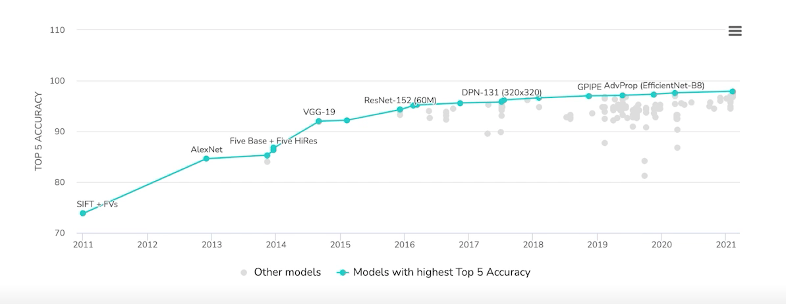
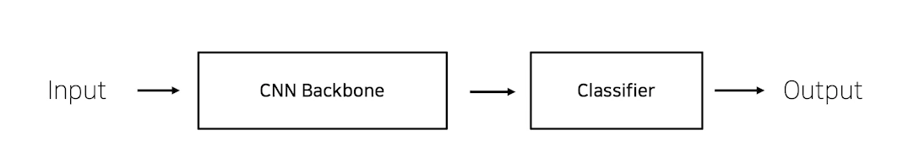

<!--
구조
*
    *
        *  
            &nbsp; - &nbsp;  
                &nbsp;&nbsp;&nbsp;&nbsp; ‣ &nbsp;  
                    &nbsp;&nbsp;&nbsp;&nbsp;&nbsp;&nbsp;&nbsp;&nbsp; * &nbsp;  
-->

# Day 17 이미지 분류 5~6 강

## 목차 

1. [강의 내용 정리](#1-강의-내용-정리)

2. [Competition](#2-Competition)

3. [피어세션 정리](#3-피어세션-정리)

<!--4. [흥미있던 질문들](#4-흥미있던-질문들)-->

4. [학습 회고](#4-학습-회고)

----

### 1. 강의 내용 정리

* 이미지 분류 5~6강
    * 5강 : Model 1
        * pytorch 
       &nbsp; - &nbsp; low-level, pythonic, flexibility -> 커스텀마이징이 쉽다. 자유도👍 
       * nn.Module 
       &nbsp; - &nbsp; 기본적으로 init, forward를 구현해야 한다. init은 모델의 layer를 forward는 순전파 순서및 넘기는 값들에 대한 정의이다. 
       &nbsp; - &nbsp; init에서 또 다른 nn.Module을 이용하여 모델을 만든다. -> 모듈을 정의하고 그 모듈을 다른 모듈을 만들때 사용할 수 있다. 
       &nbsp; - &nbsp; 모델은 파라미터를 가지고 있다. WX+b와 같이, 이때 W와 b가 파라미터이다.  
       &nbsp; - &nbsp; forward는 모듈이 호출되었을때 실행이 된다. forward함수를 호출해도 실행이 된다. -> 호출시 역할은 순전파한다. 
       * nn.Module.Family 
       &nbsp; - &nbsp; 모든 nn.Module은 child modules를 가질 수 있다. -> 내 모델의 정의하는 순간, 그 모델에 연결된 모든 module을 확인할 수 있다. 
       &nbsp; - &nbsp; forward 함수의 경우 해당 모듈의 forward가 한 번만 실행되도 그 모듈의 child modules의 forward가 전부 실행된다.
       * Parameters  
       &nbsp; - &nbsp; 모델의 정의되어 있는 modules가 가지고 있는 계산에 쓰일 Parameter 
       &nbsp; - &nbsp; state_dict(), parameters()를 통해서 모듈의 파라미터의 tensor값들을 볼 수 있다. 이 둘의 차이는 state_dict는 dictionary형태이고 parameters는 list형태이다. -> 이러한 형식과 구조를 미리 알고 있다면 여러 방면으로 응용이 가능하다! <- pythonic하다는 것의 장점 
       &nbsp; - &nbsp; 각 모델 파라미터들은 data, grad, requires_grad 변수 등을 가지고 있습니다. 

        

    * 6강 : Model 2 - Pretrained Model
        * Computer Vision의 발전 
        &nbsp; - &nbsp; ImageNet 대회의 질 좋은 데이터가 computer vision에서 획기적인 알고리즘 개발을 위한 토대가 되었다.  
        
          

        * pretrained model 
        &nbsp; - &nbsp; 모델의 일반화를 위해 매번 수 많은 이미지를 학습시키는 것은 어렵고 비효율적이다. -> 그렇기 때문에 좋은 품질의 데이터로 대량으로 학습된 모델을 이용하자! -> 이 모델을 우리의 목적에 맞게 잘 다듬자. 
        &nbsp; - &nbsp; torchvision.models를 이용해서 손쉽게 pretrained 모델과 weight를 가져올 수 있다. 

         

        * transfer learning : 우리 목적에 맞게 pretrained model 사용하기 
        &nbsp; - &nbsp; ex) CNN pretrained model을 가지고 설명 
        
        &nbsp; - &nbsp; 위와 같이 pretrained model이 backbone + classifier로 구성이 되어 있다고 가정하자 
        &nbsp; - &nbsp; 그리고 위의 모델은 어떤 문제를 해결하기 위해 classifier에서 어떤 카테고리를 output해주는지 내가 해결하기 위한 카테고리가 이 모델이 해결하고자 하는 문제에 겹치는 부분이 많은지 등을 생각해야 한다. -> pretraining할 때 설정했던 문제와 현재 문제와의 유사성을 생각해봐야 한다. 
        &nbsp; - &nbsp; 이때 아래와 같이 case별로 전략을 짜면 좋다.  
        &nbsp;&nbsp;&nbsp;&nbsp; 1. &nbsp; 문제를 해결하기 위한 데이터가 충분하다. 
        &nbsp;&nbsp;&nbsp;&nbsp;&nbsp;&nbsp;&nbsp;&nbsp; 1-1. &nbsp; 해결하고자 하는 문제가 pretrained model과 유사하다. -> backbone은 freeze해주고 classifer만 학습시켜주면 된다. 
        &nbsp;&nbsp;&nbsp;&nbsp;&nbsp;&nbsp;&nbsp;&nbsp; 1-2. &nbsp; 해결하고자 하는 문제가 pretrained model과 유사하지 않다. -> backbone ~ classfier를 학습시켜줘야한다.  
        &nbsp;&nbsp;&nbsp;&nbsp; 2. &nbsp; 문제를 해결하기 위한 데이터가 충분하지 않을 경우. 
        &nbsp;&nbsp;&nbsp;&nbsp;&nbsp;&nbsp;&nbsp;&nbsp; 2-1. &nbsp; 해결하고자 하는 문제가 pretrained model과 유사하다. -> backbone은 freeze해주고 classifer만 학습시켜주면 된다. 
        &nbsp;&nbsp;&nbsp;&nbsp;&nbsp;&nbsp;&nbsp;&nbsp; 2-2. &nbsp; 해결하고자 하는 문제가 pretrained model과 유사하지 않다. -> pretrained model을 사용하지 않는게 좋다. -> 새로운 모델을 만들어서 사용하거나 다른 pretrained model을 찾아야 한다. 
        
        

         
    

### 2. Competition
 

####  Pretrained Model에서 DenseNet161, Inception_v3, VGG19 등을 적용해봤다. DenseNet16과 Inception_v3는 batch size를 너무 크게 잡아서 메모리 부족으로 
#### 제대로 학습을 시키지 못하였으나 다른 캠퍼님의 도움으로 batch size만 바꾸면 된다는 것을 알게 되어 저녁에 적용을 시켜보았다. 이때 denseNet같은 경우는 k fold와 같이 적용시켜서 학습된 모델을 테스트 하는데
#### 사용했는데 성능이 매우 안 좋았다. 어떤 부분에서 내가 실수를 한 것 같다. 이 부분에 대해서는 추후 찾아 볼 생각이다. inception같은 경우는 "AttributeError: 'InceptionOutputs' object has no attribute 'dim'"
#### 이와 같은 오류가 발생해서 사용해보지 못했다.

 

#### k-fold와 같은 경우에는 스스로 직접 구현한 것이 아니라 다른 사람이 작성한 코드를 사용해서 변수명과 기타 부분 등을 바꿔서 돌렸다. 그래서 이 부분에 대해서 따로 공부할 예정이다.

 

#### 오늘 최고 정확도는 61.191, f1 점수는 0.482이다. 

 

### 3. 피어세션 정리
 
20210825 피어세션
 
🔍[마스크 데이터 분류 대회]

* out of memory 문제 -> batch size를 조정하니까 해결이 되었다.
* Hidden file 은 삭제해도 되는가 ? -> 보안때문에 해놓은것으로 올라왔다.
* Training Acc와 Val Acc는 잘 나오는데 Test에서는 잘 안나온다 ? -> 오버 피팅 가능성, 우리 Competition에 Transfer Learning의 사용이 맞는지 잘 모르겠다.
* *이터 불균형 해소 방법으로 적은 데이터의 갯수에 맞춰서 학습을 시키면 되지않나? -> 이걸 under sampling이라고 하는데 이것은 데이터의 손실이 많아서 이보다는 Over Sampling이나 다른 기법들을 사용하는것이 좋을것 같다.
* Pretrained 모델의 Back bone에서 앞부분의 freeze를 풀고 학습 하면 안되나? -> 원래는 층이 깊어질수록 고차원의 피쳐를 인식할수 있는데 Wide resnet의 경우 깊이를 반을 줄여서, 깊어질수록 좋지는 않다.
* 데이터에서 label이 잘못 된게 있는데 이걸 확인해보고 있다. -> 아예 다 제외하고 학습 할 것인가, 아니면 고칠것인가 ??
* EDA Example을 사용해 전처리를 해보았다. -> CV 라이브러리로 얼굴을 찾아주는 기능을 사용해서 바운딩박스를 찾아보도록 해봤다. -> 이를 통해 데이터 대부분의 얼굴들이 가운데 있었던것 같다. -> 마스크를 쓰고있는 데이터의 경우 이 라이브러리에는 학습이 되어있지 않아서 잘 찾지 못했다.
* 이미지를 흑백으로 바꿔서 학습을 하면 잘 안되는가?? -> 아마 배경의 노이즈에 영향을 많이 받을것 같다.
* 데이터 셋의 Transform은 매 epoch마다 적용된다.

  

### 4. 학습 회고

#### 피어세션때 EDA관련, 데이터 관련, 모델 관련 등 여러 이야기를 했고 나는 그 중에서 normal과 incorrrect mask 부분의 데이터가 상대적으로 적음으로 이 부분에 대해서 해결해보고 싶다는 생각이 들었다.
#### train당 7장의 데이터(5장의 wear mask, 1장의 normal, 1장의 incorrect mask)가 있는데 이 중에서 3장을 가져와서 좌우로 10도 정도 회전시켜서 데이터를 augmentation 시키고 새로운 label을 만들어서 train시킬 생각이다.

 

#### 첫날에 생각했던 아래의 것들을 잊지 말고 P_Stage를 참여하면 좋겠다.

    내가 P_Stage에서 얻고자 하는 것 생각해보기 

        1. 등수가 목적이 아닌 배움이 목적인 것을 잊지 말자!!!!
        2. 데이터 전처리부터 ~ 데이터 학습 및 평가까지 코드 스스로 작성 해보기
        3.위에서 작성하는 각 부분마다 어떤점을 주의해야 하고 어떤 부분에서 내가 실수를 많이 하는지   파악하기
        4. pre_trained 모델도 사용해 보고 augmentation도 해보고 parameter tuning도 해보고 이것저것 해보면서 경험쌓기

    이번 competition에서 내 스스로 주의할 점

        1. 남과 비교하지 않기 -> 차리리 잘하는 사람보고 '나도 저렇게 잘 하고 싶디.... 그러니까 기초부터 차근차근 쌓아서 지금보다 더 발전해야지'라는 생각으로 동기부여 받는 정도로만 생각하기, 결코 못난 내 자신 비하하지 않기!
        2. 피어세션때 다른 사람이 말하는 내용 중에 모르는 내용이나 competition 코드 어렵거나 해결이 잘 안되는 문제에 대해서 적극적으로 질문하기! -> 절대로 아는척 가만히 있지 않기! 모르는 건 꼭 질문! 
        3. 다음 날 지장이 갈 만큼 무리하지 말기! -> 저번에 약속한 취침시간 꼭 지키기!

 

#### Burn-out 되지 않게 남들보다 뒤쳐지더라도 내 속도로 꾸준히 노력하자!!!
#### 오늘도 수고했고 내일도 화이팅~~~!👍

