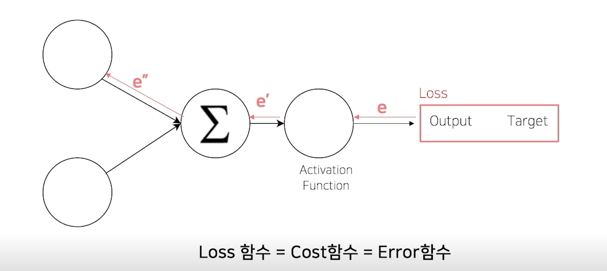
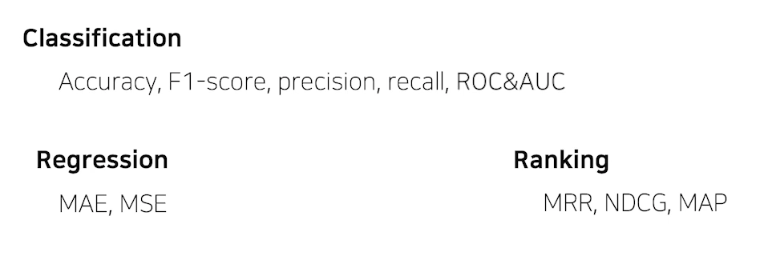

<!--
구조
*
    *
        *  
            &nbsp; - &nbsp;  
                &nbsp;&nbsp;&nbsp;&nbsp; ‣ &nbsp;  
                    &nbsp;&nbsp;&nbsp;&nbsp;&nbsp;&nbsp;&nbsp;&nbsp; * &nbsp;  
-->

# Day 18 이미지 분류 7~8 강

## 목차 

1. [강의 내용 정리](#1-강의-내용-정리)

2. [Competition](#2-Competition)

3. [피어세션 정리](#3-피어세션-정리)

<!--4. [흥미있던 질문들](#4-흥미있던-질문들)-->

4. [학습 회고](#4-학습-회고)

----

### 1. 강의 내용 정리

* 이미지 분류 7~8강
    * 7강 : Training
        * Loss 
       &nbsp; - &nbsp; 복습 : error backpropagation 
       <bt>
       &nbsp; - &nbsp; loss에 대한 것도 nn.패키지에 구현이 되어있다. 
       &nbsp; - &nbsp; 관용적으로 criterion에 loss 함수를 정의해 주고 input값에 forward 결과와 실제값을 넣어줘서 loss를 구해주고 loss.backward()를 해주면 backpropagation이 진행된다. -> 이것이 가능한 이유는 pytorch의 경우 forward를 해주면 input부터 시작해서 각 모듈들을 지나 output가지 체인이 형성이 되는데 이것을 criterion에 input으로 줘서 만들어진 loss또한 같은 체인을 갖고 있게 되고 이 체인을 이용했기 때문에 backpropagation이 가능한 것이다. 
       &nbsp; - &nbsp; 특별한 loss들 
       &nbsp;&nbsp;&nbsp;&nbsp; ‣ &nbsp; Focal Loss : Class Imabalance문제가 있는 경우, 맞출 확률이 높은 class는 조금의 loss를 맞추기 어려운 classsms loss를 높게 부여한다. -> 즉 class의 분포정도에 따라 loss에 가중치를 두자는 것! 
       &nbsp;&nbsp;&nbsp;&nbsp; ‣ &nbsp; Label smoothing loss : class target label을 onehot ㅠㅛ현으로 사용하기 보다는 조금 soft하게 표현해서 일반화 성능을 높이기 위함. -> [0, 1, 0, 0, ...] -> [0.025, 0.025, 0.9, 0.025, ...] 
        

       * optimizer 
       &nbsp; - &nbsp; loss가 0인 부분을 찾기 위해서 어느 방향으로 얼마나 움직일지를 정한다. 
       &nbsp; - &nbsp; StepLR : 특정 step마다 LR감소 
       &nbsp; - &nbsp; CosineAnnealingLR : Cosine 함수 형태처럼 LR을 급격히 변경한다. 
       &nbsp; - &nbsp; ReduceLROnPlateau : 더 이상 성능 향상이 없을때 LR 감소 
         

        * metric : 모델이 일반적으로 봤을때 성능이 어느정도인지 정의하기 위해서 사용한다.  
        &nbsp; - &nbsp; 모델의 평가 - 학습에 직접적으로 사용되는 것은 아니지만 학습된 모델을 객관적으로 평가할 수 있는 지표가 필요하다. 
        
        &nbsp; - &nbsp; 모델의 정확도를 평가할때 해당 target의 class 분포에 따라서 적용하는 방식을 달리해야 할때가 있다. 이때는 단순히 맞은 개수를 전체 개수로 나누는게 아니라 적은 각 class별로 어느 정도 맞췄는지, 그것을 평균내면 전체적으로 어느정도 맞췄는지를 평가하는 지표를 사용해야 한다. 

        

    * 8강 : Inference
        * Training Process 
        &nbsp; - &nbsp; model.train() : dropout, batchnormalization에 대해서 train에 맞게 작동시킨다. <-> model.eval()은 eval에 맞게끔 dropout, batchnormalization을 동작시킨다.  
        &nbsp; - &nbsp; train process 
        &nbsp;&nbsp;&nbsp;&nbsp; 0. &nbsp; 1 epoch마다 1번의 학습이 진해된다. 
        &nbsp;&nbsp;&nbsp;&nbsp; 1. &nbsp; optimzer.zero_grad()를 수행해준다.(이 부분은 맨 처음에 해도 되고 optimizer.step()이후에 해도 된다.) -> 이전 gradient가 이번 학습에 영향을 주지 못하도록 하기 위해서 초기화 시켜준다.-> 이것은 다시 말해서 만약 이전 gradient를 이번에 활용한다면 이것을 해줄 필요가 없다. 
        &nbsp;&nbsp;&nbsp;&nbsp; 2. &nbsp; loss = criterion(outputs, labels) -> criterion은 이 단계이전에 사용자가 할당해줘야 하는 loss를 측정해주는 방식으로 MSE, BE, CE등이 있다. -> criterion을 통해서 loss가 나오면 이 loss값은 input ~ output까지 chain으로 연결이 되어있다. -> 그 이유는 forward시 input ~ output이 chain으로 연결이 되어있는데 loss는 chain으로 연결되어 있는 output을 사용하기 때문이다. 
        &nbsp;&nbsp;&nbsp;&nbsp; 3. &nbsp; 이렇게 생성된 loss에 backward를 해주면 backpropagation을 해준다. 
        &nbsp;&nbsp;&nbsp;&nbsp; 4. &nbsp; optimizer.step() : loss의 backward 후 optimizer를 step을 하여 weight, bias를 업데이트 해준다. 
        
         

        * Inference Process 
        &nbsp; - &nbsp; train과 비슷하게 여기서는 model.eval()를 호출해줘야 한다. 
        &nbsp; - &nbsp; evaluation에서는 gradient를 업데이트를 해주지 않게 하기 위해서 with torch.no_grad() 내부에서 평가를 실행해준다. -> torch.no_grad()는 내부적으로 torch.set_grad_enable(False)를 해준다. 
        &nbsp; - &nbsp; validation을 통해서 성능을 확인하거나 checkpoint를 통해서 모델을 저장할 수 있다. 
        &nbsp; - &nbsp; 최종 submission을 csv파일로 생성한다. -> 그 후 제출 

         

        * Appendix : pytorch lightning 
        &nbsp; - &nbsp; 대부분의 train 절차(model, training, evalution 등의 과정)를 keras와 같이 쉽게 코딩할수 있도록 변환해주는 패키지 
        &nbsp; - &nbsp; lightning을 사용하기 전!!! 꼭! 이전의 train process ~ evalution까지의 과정을 잘 숙지 및 이해하고 있어야 한다. 
        
        

         
    

### 2. Competition
 

####  어제는 VGG19를 사용했지만 오늘은 DenseNet161만 사용해서 제출했다. 그리고 k-fold를 사용했고 epoch은 각 2, 3, 4 정도를 주었으며 제출 시 최고 성적은 Acc : 74.2698%, F1 : 0.6831이었다. 아무래도 모델을 바꿔서 그런지 성능이 잘 나온것 같다. 

 

#### 어제와 마찬가지로 k-fold 코드에 대해서 이해하는 중이다. 아직 완벽하게 이해하지 못했지만 전체적인 흐름은 이해했다. 그러나 내가 생각했던 k-fold랑 달랐던 점이 1가지 정도 있다. 첫번째는 이전의 fold의 가중치를 그대로 가져다 적용한다는 이었다.

 

#### wear mask 3장, normal 1장, incorrect_mask 1장으로 구성된 undersampling을 해줘서 새로운 label.csv파일을 생성했다. 그리고 해당 데이터로 학습시킨 후에 한 번 제출해볼 생각이다. 그리고 undersampling의 이미지 파일들을 좌우 10도 정도 범위로 랜던 로테이션을 시켜서 data augmentation을 해볼 생각이다. 

 

#### 내일부터는 팀 단위로 제출에 제한이 있는데 코드 상에서 acc와 f1점수를 볼 수 있도록 구현한 후에 신중하게 제출해야겠다.

### 3. 피어세션 정리
 
20210826 피어세션

🔍[마스크 데이터 분류 대회]

* 다양한 시도

    * VGG → DenseNet활용하여 성능 증가
    * Crop만 진행 → 성능 증가 x
    * ResNet50활용 (Parameter의 수를 봤을 때, 적절한 것 같다)
    * Crop진행 → Shape의 문제 발생 → Shape이 같아야 Batch를 뽑아올 수 있는 것으로 보이나 어떻게 Shape을 맞춰줘야 하는지에 대해서는 미지수.
    * ResNext50_32x4d 활용
    * 얼굴 위치에 대한 분포도를 바탕으로 평균, 분산을 활용하여 적당한 Crop 진행 → 얼굴이 해당 위치에 있었으면 했지만 잘 나오지는 않음
    * 전처리를 활용하여 주름을 구분해낼 수 있다.(Contrast, Sharpness, Brightness, Color)

* 해 볼 시도

    * OverSampling
    * SMOTE → 직접 적용하기에 어려움이 있지만 시도 해볼 것이다.
    * Label이 작은 것을 랜덤 복제하여 Sampling 시도

* 질답

KFold는 Data 수가 너무 적을 때, Validation Set의 Robustness를 주기 위해서 활용하는 방안인데 코드에 직접 입력할 때 성능의 개선이 이루어졌다. 왜 그럴까?
  
→ 이전 Fold에서의 개선된 Parameter가 다음 Fold로 이어짐으로서 성능 향상을 나타낸다.
  
Gradient Accumulation에서 Num_Accum으로 loss를 나누어주게 되는데, 왜 이렇게 하는가?
  
→ 이유 모색 후 토의
  
Brightness & Contrast를 활용하여 배경을 아예 흰색으로 만들 수 있지 않을까?
  
→ 일정 임계값 이하일 경우, 배경이 검은색이라면 얼굴이 날아갈 위험이 있다.
  
Focal Loss 직접 활용해 보았는가?
  
→ Weight를 직접 조정할 수 있는데 이것이 Focal Loss의 방법과 유사한 것 같다.
  
서버에서 깃헙으로 바로 업로드하는 방법이 있는가?
  
→ 기존의 방식에서 조금 변화가 있어, 이제는 token을 입력해주면 서버에서 깃헙으로 업로드 할 수 있다.
  
코드 리뷰
  
원진님, 우창님, 성욱님, 승찬님, 범수님

  

### 4. 학습 회고

#### 피어세션때 EDA관련, 데이터 관련, 모델 관련 등 여러 이야기를 했고 나는 그 중에서 normal과 incorrrect mask 부분의 데이터가 상대적으로 적음으로 이 부분에 대해서 해결해보고 싶다는 생각이 들었다.
#### train당 7장의 데이터(5장의 wear mask, 1장의 normal, 1장의 incorrect mask)가 있는데 이 중에서 3장을 가져와서 좌우로 10도 정도 회전시켜서 데이터를 augmentation 시키고 새로운 label을 만들어서 train시킬 생각이다.

 

#### 피어세션때 성능을 올리기 위한 팀원들의 여러 접근방식에 대해서 볼 수 있었다. 대부분이 내가 생각하지도 못한 그런 접근법이었다. 그래서 생각을 확장하는데 많은 도움이 되었고 특히 한 캠퍼님이 접근한 방식은 구현하기에는 매우 어려워 보였지만 성능은 분명 좋을 것 같았다. 그 캠퍼님을 보면서 '나도 언젠가 저런식의 접근법과 그걸 구현할 수 있는 능력을 갖췄으면 좋겠다'라는 생각을 하였다. 
#### 월요일부터 느꼈던 거지만 만약 피어세션이 없었다면 정말 답답하고 힘들었을 것 같다. 피어세션때 다른 캠퍼님들이 하는 것을 모방하고 따라하다 보니 점차 이번 P_stage level1기간을 어떤식으로 보내고 이번 대회 성능을 올리려면 어떤식으로 접근해야 하는지 감이 잡히기 시작했다. 원래 오늘 멘토링 시간때 다른 캠퍼님들께 고맙습니다.-라는 말을 전하고 싶었으나 너무 부끄럽고 시간이 늦어서 하지 못했다 ㅎㅎ;;; 그래도 다음주 툐요일전에(이번 팀과 헤어지기전에) 그동안 너무 고맙고 항상 많은 도움 받았다고 이야기 해야겠다. 

 

#### 오늘 마스터 특강에서 마스터님이 등수도 중요하지만 여기서 무엇을 얻고 무엇을 배워갈지 등 내가 첫날에 생각했던 것과 비슷한 내용의 이야기를 하셨고 이것이 중요하다고 하셨다. 그래서 다시 한번 상기시킬겸 아래와 같이 다시 작성해 보았다. 다음주까지 지치지 않고 꾸준하게 화이팅하자!

    내가 P_Stage에서 얻고자 하는 것 생각해보기 

        1. 등수가 목적이 아닌 배움이 목적인 것을 잊지 말자!!!!
        2. 데이터 전처리부터 ~ 데이터 학습 및 평가까지 코드 스스로 작성 해보기
        3.위에서 작성하는 각 부분마다 어떤점을 주의해야 하고 어떤 부분에서 내가 실수를 많이 하는지   파악하기
        4. pre_trained 모델도 사용해 보고 augmentation도 해보고 parameter tuning도 해보고 이것저것 해보면서 경험쌓기

    이번 competition에서 내 스스로 주의할 점

        1. 남과 비교하지 않기 -> 차리리 잘하는 사람보고 '나도 저렇게 잘 하고 싶디.... 그러니까 기초부터 차근차근 쌓아서 지금보다 더 발전해야지'라는 생각으로 동기부여 받는 정도로만 생각하기, 결코 못난 내 자신 비하하지 않기!
        2. 피어세션때 다른 사람이 말하는 내용 중에 모르는 내용이나 competition 코드 어렵거나 해결이 잘 안되는 문제에 대해서 적극적으로 질문하기! -> 절대로 아는척 가만히 있지 않기! 모르는 건 꼭 질문! 
        3. 다음 날 지장이 갈 만큼 무리하지 말기! -> 저번에 약속한 취침시간 꼭 지키기!

 

#### 오늘도 수고했고 내일도 화이팅~~~!👍

