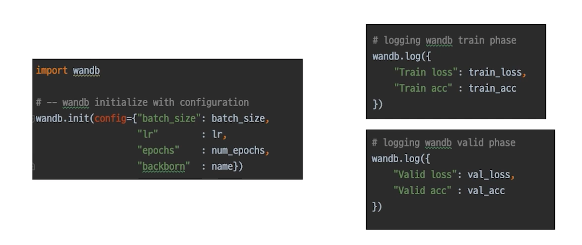

<!--
구조
*
    *
        *  
            &nbsp; - &nbsp;  
                &nbsp;&nbsp;&nbsp;&nbsp; ‣ &nbsp;  
                    &nbsp;&nbsp;&nbsp;&nbsp;&nbsp;&nbsp;&nbsp;&nbsp; * &nbsp;  
-->

# Day 19 이미지 분류 9~10 강

## 목차 

1. [강의 내용 정리](#1-강의-내용-정리)

2. [Competition](#2-Competition)

3. [피어세션 정리](#3-피어세션-정리)

<!--4. [흥미있던 질문들](#4-흥미있던-질문들)-->

4. [학습 회고](#4-학습-회고)

----

### 1. 강의 내용 정리

* 이미지 분류 9~10강
    * 9강 : Ensemble 
        &nbsp; - &nbsp; 이전에 정리한 내용[week2 day7](../../week2/day7/day7.md) 
        &nbsp; overview : &nbsp; 여러 실험을 통해 얻은 결과물로 또 다른 2차 결과물을 만드는 방법에 대해서 소개 
        * Ensemble 과정 
       &nbsp; - &nbsp; high bias는 boosting해준다.(underfitting) -> 이러한 알고리즘이 GB, XGB, LGBM 
       &nbsp; - &nbsp; high variance는 vaggin방식을 사용해준다.(overfitting) -> data sample을 학습시키고 각 오차나 값의 평균을 사용한다. -> randomforest 
       &nbsp; - &nbsp; voting의 종류 
       &nbsp;&nbsp;&nbsp;&nbsp; 1. &nbsp; hard voting : 다수결 느낌, 각 모델에서 나온 값중에 가장 많이 나온 값을 사용한다. 
       &nbsp;&nbsp;&nbsp;&nbsp; 2. &nbsp; soft voting : 각각의 모델이 값을 추론할때 각 class가 갖는 확률을 다 표시해준다. -> 각 모델에서 예측한 class에 대한 평균을 계산하여 해당 class를 선택한다. <-> hard voting과 다른점은 hard은 one-hot encoding을 통해서 하기 때문에 soft voting처럼 class에 대한 확률값을 다 표시하지 않는다. 
       &nbsp; - &nbsp; Cross Validation 
       &nbsp;&nbsp;&nbsp;&nbsp; ‣ &nbsp; 사용하는 목적은 train dataset을 train, validation으로 나눠서 학습에 대한 검증을 하기에는 데이터가 너무 아깝기 때문에 validation을 고정시키지 않고 돌아가면서 사용하여 학습시키는 방식이다. -> 이러면 이전의 validation을 학습해서 학습의 검증에 대한 정확도가 줄어들겠지만 데이터를 버리지 않고 아낄 수 있다는 장점이 있다. 
       &nbsp;&nbsp;&nbsp;&nbsp; ‣ &nbsp; 이때 가능한 모든 class의 분포를 고려해서 train, validation을 나누는 방식을 stratified K-fold cross validataion이라고 한다. 
       &nbsp; - &nbsp; TTA(Test Time Augmentation) 
       &nbsp;&nbsp;&nbsp;&nbsp; ‣ &nbsp; test set에 어느정도의 noise를 추가하더라도 일반화된 성능을 낼 수 있는지 평가하기 위해서 사용한다. 
       &nbsp;&nbsp;&nbsp;&nbsp; ‣ &nbsp; [TTA 참고해보면 좋은 것 같은 사이트](https://shinminyong.tistory.com/43) 
       &nbsp; - &nbsp; 앙상블 효과는 확실히 있지만 그 만큼 학습, 추론 시간이 배로 소모됨으로 효율성은 떨어진다. 그러므로 상황에 따라서 앙상블을 할지 말지를 잘 판단해서 사용하는 것이 좋다. 
        

       * Hyperparameter optimization 
       &nbsp; - &nbsp; Hyperparameter : 시스템의 매커니즘에 영향을 주는 주요한 파라미터이자 학습으로 결정되는 파라미터가 아닌 사용자가 지정해줘야 하는 파라미터이다. 
       &nbsp; - &nbsp; 이때 파라미터를 optimization을 해주기 위해서 해당 범위의 경우의 수를 모두 따져보기 때문에 시간이 매우 걸린다. 그렇다고 해서 성능이 많이 상승하는게 아니므로 마지막까지 최선을 다하기 위해서 사용하는 방식이다. 
       &nbsp; - &nbsp; 이러한 hyperparameter optimization을 위한 모듈은 optuna, ray 등이 있고 이 부분에 대해서는 예전에 정리를 해두었다. 
       &nbsp;&nbsp;&nbsp;&nbsp; ‣ &nbsp; [week3 day14 optimizer](../../week3/day14/day14.md) 
         

        

    * 10강 : Experiment Toolkits & tips
        * Training Visualization 
        &nbsp; - &nbsp; Tensorboard : 학습과정을 기록하고 트래킹할때 사용하는 visualization tool이다.  
        &nbsp;&nbsp;&nbsp;&nbsp; ‣ &nbsp; 사용법 
        &nbsp;&nbsp;&nbsp;&nbsp;&nbsp;&nbsp;&nbsp;&nbsp; * &nbsp; --logdir PATH : log가 저장된 경로 
        &nbsp;&nbsp;&nbsp;&nbsp;&nbsp;&nbsp;&nbsp;&nbsp; * &nbsp; --host ADDR : 원격 서버에서 사용시 0.0.0.0(default : localhost) 
        &nbsp;&nbsp;&nbsp;&nbsp;&nbsp;&nbsp;&nbsp;&nbsp; * &nbsp; --port PORT : 포트 번호 
        &nbsp; - &nbsp; weight and bias(wandb) : tensorboard와 비슷하게 학습과정을 기록하고 트래킹하기 위한 visualization tool이다.  
        &nbsp;&nbsp;&nbsp;&nbsp; ‣ &nbsp; 사용법 
        &nbsp;&nbsp;&nbsp;&nbsp;&nbsp;&nbsp;&nbsp;&nbsp; * &nbsp; 회원가입 
        &nbsp;&nbsp;&nbsp;&nbsp;&nbsp;&nbsp;&nbsp;&nbsp; * &nbsp; wandb login 
        &nbsp;&nbsp;&nbsp;&nbsp;&nbsp;&nbsp;&nbsp;&nbsp; * &nbsp; wandb.init과 wandb.log 설정해주기 
         
         

        * Machine Learning Project 
        &nbsp; - &nbsp; Jupyter Noetbook : EDA할 때 매우 편리하다. 하지만 프로세스가 진행되는 과정에서 브라우저 창이 꺼지면 실행이 주지된다. 이러한 점은 원격접속에서 큰 단점으로 적용이 된다. 
        &nbsp; - &nbsp; python idles : 한번만 구현한다면 다른 파일에서 재사용이 가능하다. naviagtion과 depuggin등 강력한 기능이 있다. 또 argmentparser를 통해서 자유로운 실험 핸들링을 할 수 있다. 

         

### 2. Competition
 

####  어제 undersampling과 그것을 바탕으로 좌우 30도 범위 내에서 회전 시킨 이미지를 추가한 data를 가지고 학습을 시켜보았다. 학습시킨 모델을 가지고 평가한 후 csv파일을 만들어서 가장 좋은 성능이 나왔던 csv랑 비교를 해 보았다. 주로 나이와 성별부분에서 차이가 있었다. 예를 들어서 60이상인 것처럼 보이는데 나의 모델은 30이상 60이하로 평가하였고 여성인데 남성으로 평가하는 등 이런 부분에서 차이가 있었고 생각보다 마스크에 관련된 부분에서는 큰 차이를 보이지 않았다. 
#### *TMI이지만 이때 차이가 나는 부분에 대해서 어떻게 비교를 해냤면 해당 파일명의 이미지를 직접보고 내 생각에 어떤 카테고리에 들어갈지 평가를 하면서 내 모델의 예측과 성능이 좋았던 모델의 예측에 어떤 차이가 있는지 비교해 보았다.

 

#### 그리고 매우 신기했던게 undersampling한 후 data augmentation을 적용한 것보다 undersampling한게 더 효과적인 것 같았다.

#### 우선 마지막으로 내 모델에 undersampling한 데이터를 적용해서 5-fold에서 epoch 4정도 적용하여 생성한 model이 예측한 값만 본 후에 괜찮은 것 같으면 제출하고 아니면 바로 다른 캠퍼님의 모델을 가지고 undersampling data를 활용하여 학습시킬 예정이다.
 

#### 추가적으로 가장 높은 점수 받은 csv파일과 자신의 모델이 예측한 값이 어떤 부분이 다른지 보여주는 코드를 작성해볼 생각이다.

### 3. 피어세션 정리
 
20210827 피어세션

🔍 질의응답

* K-fold
* Boosting & Bagging
    * boosting : 직렬적
        * 모델의 성능에 따라 가중치를 줘서 결과를 내는 것
        * 하나의 모델을 통과하고 다음 모델을 통과할 때 부족한 부분을 개선
        * Bias가 높을 때 사용
    * bagging : 병렬적
        * 각 모델을 통과해서 나온 결과값들을 다수결 또는 가중치를 이용하여 Output 출력
        * Varience 가 높을 때 사용
📒 코드리뷰

* 성욱 캠퍼님 : Agumentation 추가
    * EDA를 통해 확인한 Age, Gender 별 데이터 불균형 해소 시도
    * HorizontalFlip, GausianNoise 등 다양한 transform 이용하여 agumentation 수행
    * 데이터 회전 시 발생하는 빈 공간 처리는 shift scale rotate 를 사용했다.
* 진선 캠퍼님 : Age 부분 Classification acc 문제 해결 시도, Data agumentation 수행
* 원진 캠퍼님: ResNext를 이용하여 acc 개선 시도, Data agumentation 수행
* 범수 캠퍼님: Bbox 를 이용하여 Data agumentation 계획 및 구상
* 승찬 캠퍼님: Data agumentation 수행 및 모델 개선 시도
* 우창 캠퍼님: Underfitting 시도 및 모델, 데이터 갯수, agumentation 여부 등 분석
📎 향후 팀프로젝트 계획

* 팀 단위 제출로 인한 제출횟수를 고려하여,
* 가장 성능이 좋은 모델을 basecode로 하여 각각 다양한 시도를 하는 방향 고려
📎 팀 회고지 피드백

  

### 4. 학습 회고

#### 오늘 피어세션때는 다양한 data augmentation에 대해서 적용한 코드와 강의에 관련된 질문, 팀 회고록등을 했었다. 
 

#### 강의와 관련된 질문에서는 복습의 중요성에 대해서 깨달게 되었다. 오늘부터 복습을 실천해야 하지만 음... 하하;;; 노... 노력해봐야겠다!

 

#### 코드 리뷰에서 이미지를 ratete할때 짤리는?채워 넣어야 하는 영역을 최대한 원본의 이미지와 비슷하게 만들어주는 함수를 알게 되었다. 또 data augmentation을 할 때 회전 말고도 어떤식으로 할지에 대한 생각들을 공유받을 수 있어서 매우 유익한 시간이었다.

 

#### 팀회고록때에는 나만 힘든게 아니였구나 - 를 느낄 수 있었고 그러면서 다른 캠퍼님들의 열정도 함께 느낄 수 있어서 나에게 새로운 자극을 준 것 같다. 

 

#### 이번 주 정말 수고 많았고 주말에 쉬면서 파이썬 프로젝트 및 팀 회고록때 계획했던 도전들을 시도해 보자~!!! 화이팅~~~!!!

