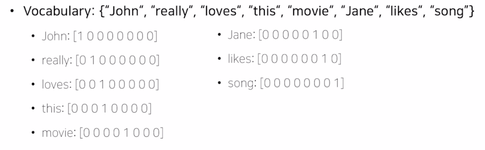
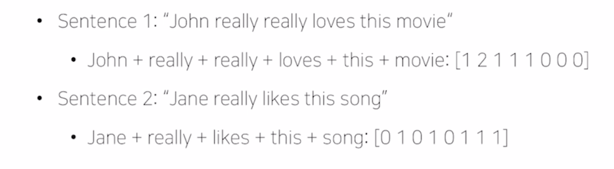
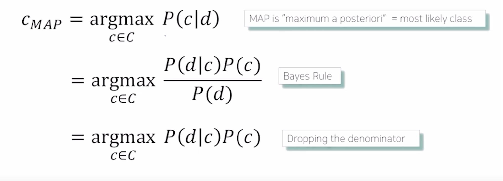
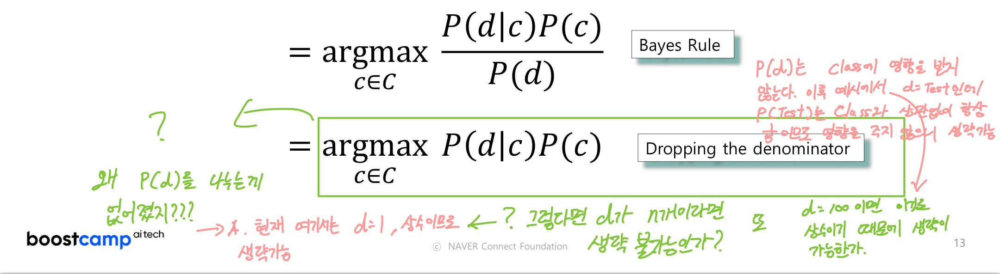
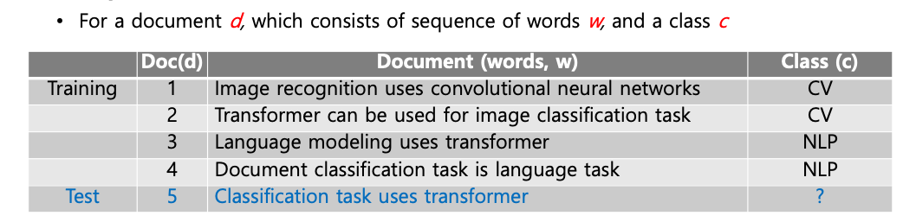
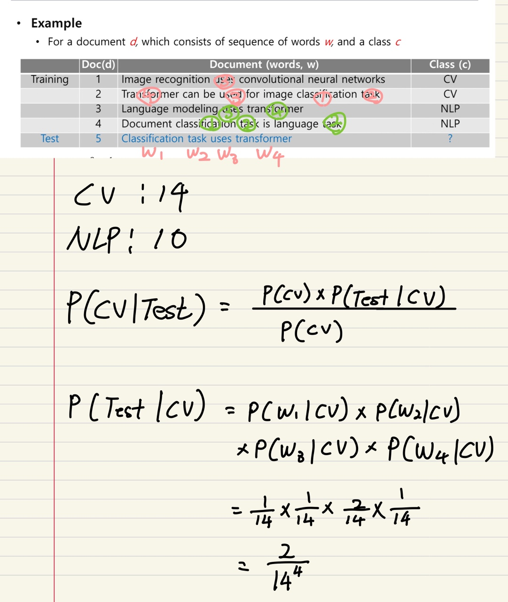
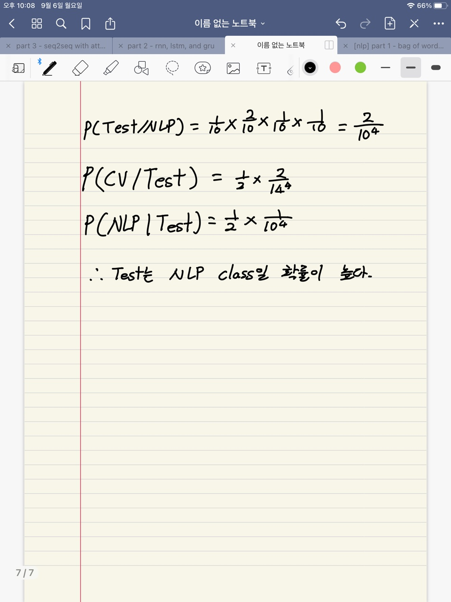
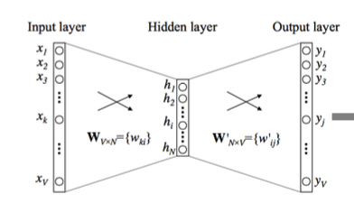
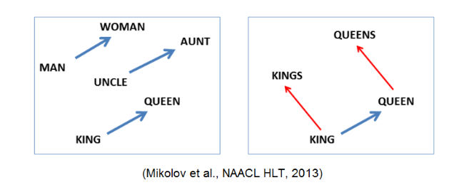
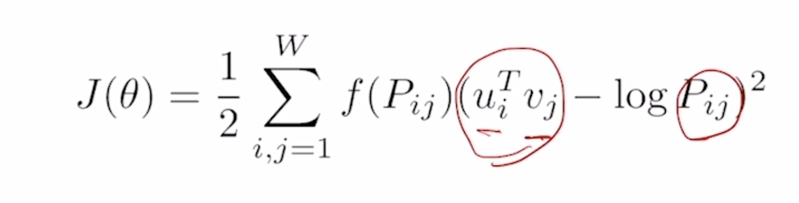

<!--
구조
*
    *
        *  
            &nbsp; - &nbsp;  
                &nbsp;&nbsp;&nbsp;&nbsp; ‣ &nbsp;  
                    &nbsp;&nbsp;&nbsp;&nbsp;&nbsp;&nbsp;&nbsp;&nbsp; * &nbsp;  
-->

# Day 25 NLP 1~2강

## 목차 

1. [강의 내용 정리](#1-강의-내용-정리)

2. [과제 정리](#2-과제-정리)

3. [피어세션 정리](#3-피어세션-정리)

4. [학습 회고](#4-학습-회고)

## 1. 강의내용 정리

* NLP 1강 :  Intro to NLP, Bag-of-Words
    * 이번 과정의 목적
        * NLP -> NLU(Natural Language Understanding), NUG(Natural Language Gernerating)로 구성이 된다.
        * NLP에서 deep learning과 관련되 부분과 language modeling, machine translation, question answering, document classification, dialog systems등을 다룰 예정
     
    * 학문적으로 나눴을때의 NLP
        * Natural Language Processing -> conferences : ACL, EMNLP, NAACL
        * 다루는 task 
        &nbsp; - &nbsp; Low-level parsing  
        &nbsp;&nbsp;&nbsp;&nbsp; ‣ &nbsp; Tokenization : 주어진 문장을 이루는 단어를 token이라고 하며 문장을 단어로 쪼개는 과정을 tockenization이라고 한다. 
        &nbsp;&nbsp;&nbsp;&nbsp; ‣ &nbsp; stemming : 먹고 있는, 먹었다. 먹을 것이다 등 과 같이 핵심 의미인 '먹다'는 같지만 단어의 형태가 다른 이러한 것들을 단어의 어미 변화를 없애고 어근(핵심)만을 추출해내는 과정을 stemming이라고 한다. 
        &nbsp; - &nbsp; Word and phrase level 
        &nbsp;&nbsp;&nbsp;&nbsp; ‣ &nbsp; NER(Named Entity Recognition) : 단일 단어 혹은 고유 명사를 인식하는 task, 예를 들어서 '뉴욕 타임즈' -> 이것을 '뉴욕', '타임즈'라고 인식하면 안되고 '뉴욕 타임즈'라는 하나의 단어로 인식하도록 하는 것 
        &nbsp;&nbsp;&nbsp;&nbsp; ‣ &nbsp; POS(part of speech) tagging : 단어들이 문장내에서 어떤 품사를 갖는지 인식하는 task 
        &nbsp;&nbsp;&nbsp;&nbsp; ‣ &nbsp; noun-prahse chunking :  
        &nbsp;&nbsp;&nbsp;&nbsp; ‣ &nbsp; dependency parsing :  
        &nbsp;&nbsp;&nbsp;&nbsp; ‣ &nbsp; conreference resolution :  
        &nbsp; - &nbsp; Sentence level 
        &nbsp;&nbsp;&nbsp;&nbsp; ‣ &nbsp; Sentiment analysis : 감성 분석으로 문장 내에서 감정이 어떤지를 인식하는 task 
        &nbsp;&nbsp;&nbsp;&nbsp; ‣ &nbsp; Machine translation : 기계번역 -> 영어를 한글로 번역 등 
        &nbsp; - &nbsp; Multi-sentence and paragraph level 
        &nbsp;&nbsp;&nbsp;&nbsp; ‣ &nbsp; Entailment prediction : 두 문장간의 모순 내포 등을 인지하는 task 
        &nbsp;&nbsp;&nbsp;&nbsp; ‣ &nbsp; question answering : 문장(question)을 이해하는 하고 답을 나타내는 task 
        &nbsp;&nbsp;&nbsp;&nbsp; ‣ &nbsp; dialog systems : 챗봇과 같은 task 
        &nbsp;&nbsp;&nbsp;&nbsp; ‣ &nbsp; summarization : 주어진 문서를 요약하는 task  
        
        * Text mining -> conferences : KDD, The WebConf, WSDM, CIKM, ICWSM
        * 다루는 task 
        &nbsp; - &nbsp; 문장이나 문서에서 유용한 정보 추출 
        &nbsp; - &nbsp; Document clustering 
        &nbsp; - &nbsp; 사회현상을 파악하는 일 
         

        * Information retrieval -> conferences : SIGIR, WSDM, CIKM, RecSys
        * 다루는 task
        &nbsp; - &nbsp; 검색 기술을 연구하는 분야 
        &nbsp; - &nbsp; 여기에 포함되는 세부분야 중 추천시스템이 있다. 
     
    * Trends of NLP
        * 단어의 관계를 컴퓨터가 이해할 수 있도록 하기 위해서 vector로 바꿔준다. 이것을 word embedding이라고 하며 Word2Vec와 GloVe가 대표적인 기술이다.
        * vector의 sequence를 처리하기 위한 모델로 LSTM와 GRUs이 대표적이다.
        * 2017년도에 나온 혁신적인 모델인 Transformer model이 높은 성능으로 현재 NLP에서 대표적인 모델로 자리잡게 되었다.
        * 언어의 의미론적인 부분을 학습에 이용(자가지도학습 기법) -> BERT, GPT-3 -> 범용인공지능 기술
        * 하지만 위와 같은 범용인공지능 기술은 많은 전기량과 GPU가 필요하다. 이러한 부분 때문에 대기업과 같은 자본/자원이 많은 곳에서만 기술 발전이 이루어진다.
     

    * Bag-of-Words Representation 
        1. 주어진 문장을 하나의 단어 집합인 사전을 만든다.
        2. 사전을 통해서 각 단어들을 카테고리 변수로 생각할 수 있다. 예를 들어서 아래와 같이 사전이 만들어져 있을 경우 'jonh'이라는 단어는 카테고리의 1번째 단어이므로 아래와 같이 표시할 수 있다(one-hot vector이용).
         
        * 이러한 방식으로 문장이나 문서를 나타내면 아래와 같은 방식으로 나타내게 된다. 이러한 방식을 bag-of-words 방식이라고 부릅니다.
         
        * NaiveBayes Classifier for Document Clasffication 
        &nbsp; - &nbsp; 주어진 document를 d, 분류하고자 하는 class를 c라고 가정하자. 그러면 naives bayes 분류를 통해서 확률을 구하면 아래와 같다. 
         
        &nbsp; - &nbsp; 이때 P(d|c)*P(c)는 P(w1,w2,...,wn|c)P(c)로 생각할 수 있다.이것은 class의 확률과 각 class가 주어졌을때 해당 단어가 등장할 확률을 곱해준것을 더한것과 같다.  
        &nbsp; * &nbsp; 위의 공식에서 bayes's rule에서 분모 P(d)를 생략할 수 있는 이유 
        
        &nbsp; -> &nbsp; P(d)는 class(c)에 영향을 받지 않고 항상 값이 같기 때문이다. 밑의 예제에서 d는 test인데 P(test)는 class인 CV와 NLP에 영향을 받지 않고 항상 확률이 같으므로 생략할 수 있다. 이때 P(test)는 d가 5개 있으므로 1/5이다. 
        &nbsp; - &nbsp; 아래의 문제를 풀어보자. train document와 class가 주어졌을때 이때 test document는 어떤 class에 속하는지 NaiveBayes 이용해서 알아내시오. 
        
        
        
         

 

* NLP 2강 : Word Embedding
    * word embedding이란? - 각 단어들을 특정한 차원으로 이루어진 공간상의 점으로 바꿔주는 방법이다.
        * 예를 들어서 cat과 kitty를 word embedding을 한다면 유사도가 높을 것이며 cat과 hamburger는 유사도가 낮을 것이다. 
        * 유사도가 높으면 두 벡터간의 거리는 가깝고 유사도가 낮으면 거리가 멀다.

    * Word2Vec - 같은 문장에서 나온 단어들은 유사도가 높을것이라는 가정을 한다.
        * 예를 들어서 The cat pures와 This cat hunts mice에서 cat과 pures, cat과 hunts, cat과 mice가 서로 유사한 관계가 있을거라고 가정한다.
        * 즉, 한 문장에서 각 단어들끼리 유사할 것이라고 생각하고 이것을 이용하여 한 문장에서 특정 단어를 숨기고 이 단어를 예측하는 방식으로 학습이 진행된다.
        * 동작 과정  
        &nbsp; 1. &nbsp; 주어진 학습 데이터(sentence)를 tokenization해준다. 
        &nbsp; 2. &nbsp; 유니크한 단어들의 집합을 만들어주고 단어를 표현할때 one-hot vector로 표시해 준다. 
        &nbsp; 3. &nbsp; 하나의 단어를 기준으로 삼아 그 단어의 주변에 있는 단어들을 입출력 쌍으로 표현해 준다. 
        &nbsp;&nbsp;&nbsp;&nbsp; ‣ &nbsp; 예를 들어서 I study math라는 문장이 있을때 이것을 tockenization 해줘서 사전을 만들고 이것의 window size가 3(기준을 포함한 앞뒤 단어가 3개인것을 의미)이라고 하자. 이때 기준 단어가 I라면 입출력 쌍은 (I, study) 1개가 된다. 만약 기준이 study라면 입출력 쌍은 (study, I), (study, math)가 된다. 
        &nbsp; 4 &nbsp; 이렇게 만들어진 입출력 쌍에 대해서 2-layer  neural network를 만들어 주고 이것을 통해서 predict하여 학습시킨다.  
        &nbsp;&nbsp;&nbsp;&nbsp; ‣ &nbsp; 이때 layer의 입출력 layer의 size는 2번에서 만들어진 vocabulary의 size와 동일하고 hidden layer의 size(node 수)는 사용자가 지정할 수 있다(hyperparameter이다). 
         
        &nbsp;&nbsp;&nbsp;&nbsp; ‣ &nbsp; 2-layer에서 나온 output을 가지고 softmax를 해준다. 
        &nbsp;&nbsp;&nbsp;&nbsp; ‣ &nbsp; 이렇게 나온 결과와 one-hot vector인 predict를 통해서 loss를 구해주고 ... <- __이 부분에 대해서 좀 더 공부해 보기 - word2vec loss__ 
        * 이렇게 학습된 word2vec간의 관계는 단어들간의 관계를 잘 표현해준다.
        
        * word2vec을 사용하는 task 
        &nbsp; - &nbsp; 단어 유사도 
        &nbsp; - &nbsp; 기계번역 
        &nbsp; - &nbsp; POS(Part of speech) tagging 
        &nbsp; - &nbsp; Named entity recognition(NER) 
        &nbsp; - &nbsp; Sentiment analysis 
        &nbsp; - &nbsp; Clustering 
        &nbsp; - &nbsp; Semantic lexicon building 
        &nbsp;&nbsp;&nbsp;&nbsp; => &nbsp; 이러한 task에서 word2vec는 단어 간의 관계를 이용하여 성능을 향상시킨다. 
     

    * GloVe
        * word2vec과의 차이점 : 사전에 두 단어가 한 window에서 동시에 몇 번 등장했는지를 사전에 계산을 하고 아래와 같이 Pij로 사용하고 이것을 log를 취해준 다음 입력 word ui의 transpose와 출력 word의 vj를 내적해준 것에 빼주고 제곱을 한 다음 f(Pij)를 곱해주면 된다. 그리고 이것을 각 word마다 반복해주고 각 결과를 더해준 후 2로 나눠주면 된다.
        
     

 

## 2. 과제 정리

 

## 3. 피어세션 정리

 

## 4. 학습 회고

 