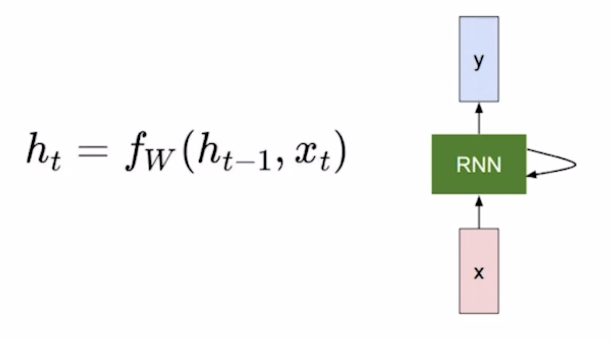
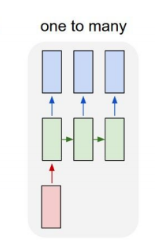
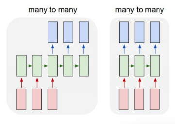

<!--
구조
*
    *
        *  
            &nbsp; - &nbsp;  
                &nbsp;&nbsp;&nbsp;&nbsp; ‣ &nbsp;  
                    &nbsp;&nbsp;&nbsp;&nbsp;&nbsp;&nbsp;&nbsp;&nbsp; * &nbsp;  
-->

# Day26 NLP 3~4강

## 목차 

1. [강의 내용 정리](#1-강의-내용-정리)

2. [과제 정리](#2-과제-정리)

3. [피어세션 정리](#3-피어세션-정리)

4. [학습 회고](#4-학습-회고)

## 1. 강의내용 정리

* NLP 3강 : Recurrent Neural Network and Language Modeling
    * RNN은 sequence data를 time step으로 입력을 받고 이것을 hidden state와 같이 연산을 수행해서 output을 생성해내는 순환 네트워크입니다.
    
    * RNN의 구성 요소 
     
        * ht-1 : t-1의 hidden state vector
        * xt : t번째 time step의 input vector
        * ht : t번째의 hidden state vector
        * fW : W 가중치를 가지고 있는 RNN 함수
        * yt : t번째 time stemp의 input과 ht-1의 연산 결과로 나온 ht에서 Why과 연산을 진행하면 yt가 나오게 된다. 만약 해당 task의 label이 binary classification이거나 multi-label이라면 sigmoid나 softmax를 추가로 취해줘야 한다.
        * fW는 ht-1과 xt를 인자로 받고 이 값들에 각 Whh, Wxh를 곱한후 tanh 함수를 적용시켜준다. 이와 같은 연산을 통해서 나온 값이 ht이다.  
     
    &nbsp; * &nbsp; tanh를 사용하는 이유 : ReLU를 쓰게되면 이전 값이 커짐에 따라 전체적인 출력이 발산하는 문제가 생길 수 있다. 따라서 과거의 값들을 재귀적으로 사용하는 RNN 모델에서는 이를 normalizing 하는 것이 필요하며 이를 위해 sigmoid보다 기울기의 역전파가 더 잘되는 tanh를 사용하는 것이다. [인용한 블로그 사이트](https://cvml.tistory.com/27) 
    &nbsp; * &nbsp; tanh와 sigmoid의 차이를 보여주는 그래프(왼쪽 : sigmoid, 오른쪽 : tanh). sigmoid의 미분의 최댓값 : 0.2~0.4 사이, tanh의 미분의 최댓값 : 1   [이미지 출처 사이트](https://medium.com/analytics-vidhya/activation-functions-why-tanh-outperforms-logistic-sigmoid-3f26469ac0d1) 
     
     

    * Types of RNNs
        * one to one : standard neural network 
         
        * one to many : Image Captioning에 주로 사용된다. 
        &nbsp; - &nbsp; Image Captioning이란 이미지를 설명하는 문구를 생성하는 것이다. 
         
        * many to one : Sentiment Classification에 주로 사용된다. 
         
        * many to many  
        &nbsp; - &nbsp; 왼쪽 그림은 주로 기계번역에서 사용되는 방식이다. 
        &nbsp; - &nbsp; 오른쪽 그림은 video classification on frame level에 사용이 된다. 
         
     

    * Character-level Language Model
        * 동작과정 
        &nbsp; 0. &nbsp; 주어진 training sequence가 'hello'이고 many-to-many RNN을 사용한다고 가정하자. 
        &nbsp; 1. &nbsp; 이것을 BOW에서 수행한 것과 같이 unique한 vocabulary를 생성해준다. 
        &nbsp; 2. &nbsp; 위에서 생성한 vocabulary를 통해서 단어들을 one-hot vector로 만들어 주고 이 값을 Wxh, ht-1, Whh와 함께 tanh를 수행해주는 ht가 생성이 된다. 
        &nbsp; 3. &nbsp; 이렇게 생성된 ht는 Wyh과의 연산을 통해서 output이 생성이 된다. 
        &nbsp; 4. &nbsp; 이렇게 생성된 값에 대해서 다음 입력에 재사용하게 된다. 
        &nbsp; 5. &nbsp; output과 실제 값을 비교하면서 다르다면 output이 실제 값이 나오도록 해당 label의 확률을 높일수 있도록 weight들을 조절해준다. <- 학습되는 과정 
        &nbsp; * &nbsp; BPTT(Back Propagation Through Time) : loss계산은 forward가 다 끝난후에 시작이 되는데 이때 forward할 양이 많다면 그만큼 backward도 많아지므로 자원의 한계로 인해서 한번에 다 할 수 없는 그런 경우들이 있다. -> 이러한 문제점을 해결하기 위해서 짤라서(Truncation) 해당 부분에서만 loss를 구하고 W를 업데이트 시켜준다. 
        * Character-level language model도 문단을 대상으로 학습시킬 수 도 있다.
        * Latex와 같은 논문 작성을 위한 프로그래밍도 작성할 수 있다.
        * C언어도 가능하다.
        * hidden state vector의 dimension을 고정시켜놓고 해당 값이 어떻게 변하는지를 관찰하면 유용한 정보를 얻을 수 있다.  
        &nbsp; - &nbsp; 아래의 그림에서 빨간색은 양수, 파란색은 음수를 의미한다. 
        
        &nbsp; - &nbsp; 위의 그림에서는 quote(구분자)를 기준으로 구분자 안에 범위는 음수, 밖에 범위는 양수인 것을 알 수 있었다. 
        
        &nbsp; - &nbsp;  위의 그림에서는 if문의 조건문과 조건문 밖의 범위를 구분하는 정보를 알 수 있다. 
    
    * origin RNN(vanilla RNN)의 문제점
        * gradient vanishing or exploding 문제 발생 <- __좀 더 찾아보기__

 

* NLP 4강 : Long Short-Term Memory (LSTM) & Gated Recurrent Unit (GRU)

    * LSTM
        * vanilla RNN이 가지고 있던 gradient vanishing 문제를 개선하였다.
        * Cell state vector가 추가 되었다. <- hidden state vector보다 더 완성된(압축된) 정보
        * hidden state vector <- 
        * 여러 gate 존재 -> input gate, forget gate, output gate, gate gate 
        &nbsp; - &nbsp; Input gate : 현재 정보를 저장할지를 결정 
        &nbsp; - &nbsp; Forget gate : 과거 정보를 버릴지 말지를 결정 
        &nbsp; - &nbsp; Output gate : 어떤 출력값을 출력할지를 결정 
        &nbsp; - &nbsp; Gate gate : 과거 cell state를 새로운 cell state로 업데이트하는 과정 <- 과거에 유지할 정보 + 현재 상태에서 유지할 정보 등을 고려해서 업데이트 
     

    * GRU
        * LSTM에서 존재했던 cell state와 hidden state를 일원화시켜 hidden state만 가지고 LSTM과 유사하게 동작한다.
        * LSTM에서의 forget gate는 GRU에서는 1에서 input gate와 유사한 연산을 한 것을 빼준 것을 연산에 사용한다.

     

    * LSTM과 GRU에서의 backpropagation은 더하는 연산으로 인해서 vanilla RNN의 long term dependency 문제를 해결할 수 있다.

     

* [이전에 정리했던 LTSM과 GRU를 참조하자!](../../week2/day9/day9.md)
    

 

## 2. 과제 정리

#### 필수과제 3,4를 끝내려고 했지만 3에서 막혀서 3~4시간정도를 3을 해결하는데 사용했고 결국 오픈카톡의 힌트를 보고 문제를 해결하게 되었다. 
#### 내가 해결하고 싶은 문제의 해결법이지만 왜 방식으로 인해서 해결이 되는지는 아직도 잘 모르겠다. 나는 처음에 이 문제를 해결하기 위한 시도로 dictionary의 크기만큼 tensor의 배열을 만들고 해당 target의 index에 1, 나머지에는 0을 주고 loss를 구하고 backward를 하려고 했는데 잘 안 되었다ㅠㅠ 이 부분에 대해서는 내일 다시 확인하고 고민해봐야겠다.

 

## 3. 피어세션 정리
# 1강 Intro to NLP, Bag-of-Words

---

발표자: `오동규`

- 발표 내용

    [Part 1.  Bag-of-Words & Word Embedding](https://www.notion.so/Part-1-Bag-of-Words-Word-Embedding-6764e2f7ab9a445099b57f379ed996da) 

- Discussions

# 2강 Word Embedding

---

발표자: `전준영`

- 발표 내용

    여기에 작성 Markdown Text 혹은 정리 link를 남겨주세요!

- Discussions

    제우님 질문 : w2v에서 Vocabulary로 자른 값들이 계산 과정에 어떤식으로 사용되나요?  (윈도우 내에서 자른 중심, 주변 단어 쌍)

    답변 : 중심 단어에 해당하는 원핫 벡터는 w2v 모델의 입력으로, 주변 단어는 w2v 모델의 출력으로 이용됩니다!

    중심 단어의 원핫 벡터가 모델의 입력으로 들어가면 첫번째 가중치 매트릭스 $W_1$에서 중심 단어의 인덱스에 해당하는 column 벡터가 룩업(Lookup)되어 나오고, 이 컬럼 벡터가 두번째 가중치 매트릭스인 $W_2$와 곱해져서 다시 전체 단어 vocab 크기 만큼의 벡터가 나오면 그 중 주변 단어의 인덱스에 해당하는 값이 가장 큰 값이 될 수 있도록 학습이 진행되는 것입니다!

    대웅님 질문: embedding dimension을 정하는 적절한 기준이 있을까요?

    답변: magic number?

## Further Question

Q) Word2Vec과 GloVe 알고리즘이 가지고 있는 단점은 무엇일까요?

A)

- 문맥에 따라 다른 의미, 동음이의어의 서로 다른 의미를 반영하지 못함
    - e.g. play, 배
- 기존 단어 임베딩의 얕은 신경망 한계 극복 → "Deep contextualized word representations(ELMO)"

## Paper 선정

`Basic`

멘토링 (9/10) 전까지 읽고 정리해오고 나서

멘토님께 읽으며 궁금한 부분들, 이해안가는 부분 질문드리는 형식!

- `Transformer` Attention is all you need
    - 김제우, 전진, 전준영
    - [https://papers.nips.cc/paper/2017/file/3f5ee243547dee91fbd053c1c4a845aa-Paper.pdf](https://papers.nips.cc/paper/2017/file/3f5ee243547dee91fbd053c1c4a845aa-Paper.pdf)
- `BERT` Pre-training of Deep Bidirectional Transformers for Language Understanding
    - 심우창, 오동규
    - [https://arxiv.org/abs/1810.04805](https://arxiv.org/abs/1810.04805)
- `MT-DNN` Multi-Task Deep Neural Networks for Natural Language Understanding
    - 김대웅, 진명훈
    - [https://arxiv.org/abs/1901.11504](https://arxiv.org/abs/1901.11504)

`Advanced`

- `BART` Denoising Sequence-to-Sequence Pre-training for Natural Language Generation, Translation, and Comprehension
    - [https://arxiv.org/abs/1910.13461](https://arxiv.org/abs/1910.13461)
- `XLNet` Generalized Autoregressive Pretraining for Language Understanding
    - [https://arxiv.org/abs/1906.08237](https://arxiv.org/abs/1906.08237)
- `ELECTRA` Pre-training Text Encoders as Discriminators Rather Than Generators
    - [https://arxiv.org/abs/2003.10555](https://arxiv.org/abs/2003.10555)

## Reference

`cs224n`

- [https://web.stanford.edu/class/cs224n/readings/cs224n-2019-notes01-wordvecs1.pdf](https://web.stanford.edu/class/cs224n/readings/cs224n-2019-notes01-wordvecs1.pdf)

`동규님 negative sampling 정리`

- [https://www.notion.so/Chapter-10-Word-Embedding-9447ae3c6e2441138d39a4b8a049d29c](https://www.notion.so/Chapter-10-Word-Embedding-9447ae3c6e2441138d39a4b8a049d29c)

`Easy Explanation Word2Vec`

- [https://israelg99.github.io/2017-03-23-Word2Vec-Explained/](https://israelg99.github.io/2017-03-23-Word2Vec-Explained/)

 

## 4. 학습 회고

#### 오늘 피어세션때 어제 강의에 대한 2명의 팀원들의 발표를 들었고 매우 유익하였다. 특히 내가 잘 이해가 안 되었던 부분부터 시작해서 깊은 내용까지 다둬주셔서 매우 좋은 시간이었다. 또 이야기를 하다보면 이것 이외에도 NLP에 관한 배경지식을 넓힐 수 있는 여러 이야기를 듣게 되었고 조금씩 성장하고 있는 것 같은 느낌이 들었다. 물론 해당 이야기에서 절반도 안되는 내용만 소화했지만 ㅠㅠ

 

#### 이번주 금요일까지 bert에 대해서 논문을 읽어고 멘토링 시간때 질문을 하기로 했다. 먼저 블로그나 유튜브를 통해서 전체적인 숲을 보고 논문을 읽을 생각이다.

 

#### 내일은 vanilla RNN에 대해서 내가 발표를 할 차례이다. 이 부분에 대해서는 오늘 강의와 2주차때 들었던 강의 내용 + 내가 이해가 안되서 좀 더 찾아봤던 부분을 종합적으로 정리해서 PPT를 만들어서 발표를 할 생각이다. 원래 계획상 이것을 오늘 만들려고 했지만 필수과제 3번 ㅠㅠㅠㅠㅠㅠ
 

#### 아무튼 오늘도 수고 많았고 내일도 화이팅하자~~~!!!
 