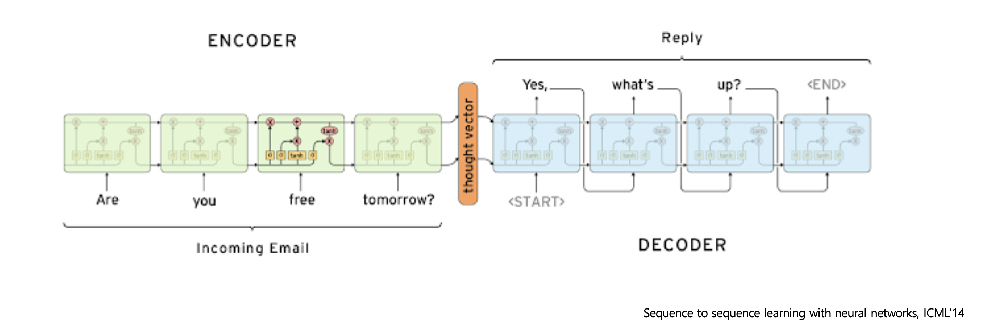

<!--
구조
*
    *
        *  
            &nbsp; - &nbsp;  
                &nbsp;&nbsp;&nbsp;&nbsp; ‣ &nbsp;  
                    &nbsp;&nbsp;&nbsp;&nbsp;&nbsp;&nbsp;&nbsp;&nbsp; * &nbsp;  
-->

# Day27 NLP 5~6강 

## 목차 

1. [강의 내용 정리](#1-강의-내용-정리)

2. [과제 정리](#2-과제-정리)

3. [피어세션 정리](#3-피어세션-정리)

4. [학습 회고](#4-학습-회고)

## 1. 강의내용 정리

* NLP 5강 : Seq2Seq with attention Encoder-decoder architecture Attention mechanism
    * Seq2Seq
        * Many to Many의 형태이다. 아래와 같이 입력 sequence를 다 처리한 후 출력 sequence를 내뱉는다.
         
        * 아래는 seq2seq 구조이다.
       
        * 위와 같이 encoder, decoder로 나눠져있으며 이 둘은 하나의 모델을 공유하는 것이 아닌 각자의 모델을 만들어서 사용한다. 
        * 위의 모델은 RNN모델로 LSTM을 사용한 것이다. 그렇기 때문에 encoder 마지막에 생성된 hidden state vector와 cell state vecotr정보가 decoder의 초기 h0, c0로 사용이 된다.
        * 위에서 언급한 것처럼 decoder도 하나의 LSTM이기 때문에 input값이 필요하고 이 값은 우리가 예측해야 하는 값을 input으로 주게 된다. 그리고 예측한 값을 다음 구조의 input으로 사용하는 순환구조이다.
        &nbsp; => &nbsp; 잘못된 예측으로 인해 학습시 방해가 될 수 있기 때문에 이때에는 teacher forcing이라는 기법, 즉 예측이 틀렸더라도 train인 중이니까 실제 예측값을 넣어서 학습시키는 기법을 사용합니다. 이것을 통해서 학습시간을 단축한다는 이점이 있다. 
        &nbsp; => &nbsp; 또 초반에는 teacher forcing으로 학습을 시키고 어느정도 잘 맞춘다면 예측값을 input으로 사용하는 방식도 있습니다. 
        * Decoder의 시작 input은 SOS라는 special token을 사용하고 output으로 END라는 special tokend이 나오면 decoder가 끝나는 시점이다.
     

    * Seq2Seq with attention
        * Seq2Seq도 core model이 LSTM이기 때문에 초반에 input data에 대한 정보가 time step이 지남에 따라서 정보의 정도가 희미해진다. 이러한 한계를 극복하는 방법이 attention mechanism이다.
        * attention mechanism은 LSTM과 같이 hidden state를 계속해서 업데이트를 하는 방식이 rhk 각 hidden state를 쌓고 decoder시 필요한 부분에 중점을 두어서 사용하는 방식을 이용한다.
        
    * Seq2Seq with attention 동작 방식
        
        * 기본적으로 LSTM와 같이 hidden state를 업데이트 시키면서 마지막에 생성된 hidden state vector를 decoder의 hidden state vector로 넘겨주고 decoder는 이 값과 start token을 이용해서 hidden state vector를 만든다.
        * 위에서 생성된 decoder의 hidden state vectordhk encoder의 hidden state vector를 내적해서 attention score를 계산한다. 
        * attention score를 softmax에 넣어줘서 확률값으로 변환시켜준다. <- 이러한 값은 encoder hidden state vector의 가중치로 사용이 된다. -> 이러한 가중치와 encoder hidden state vector의 가중평균 값이 attention output(context vector)을 만들어 낸다.
        * decoder hidden state vector와 context vector가 concat되어 다음에 나올 값을 예측하게 된다.
        
        * 그 다음에는 이전 decoder에서 구한 hidden state vector와 input을 통해서 hidden state vector를 구하고 이후부터는 이전과 똑같이 attention score, attention distribution을 통한 context vector를 구하고 predict값을 구해주면 된다.
        * 이 과정을 EOS token이 나올때까지 반복해주면 된다.

    * 이 부분에서 주목해야 할 점이 attention output(context vector)를 구해주는 부분인 attention distribution이지 않을까 싶다.
     

    * Seq2Seq with attention의 backpropagation
        
        * 위의 보라색선과 같이 backpropagation이 진행되고 이때 attention을 위한 가중치 hidden state vector를 생성하는 가중치 등이 업데이트가 된다.
     

    * attention score를 구하는 여러 방식
        
        *  dot : 위와 같이 encoder의 hidden state를 transpose해주고 decoder의 hidden state vector를 내적해준다.
        *  general은 중간에 가중치를 주어서 score점수를 계산하는 부분도 학습이 가능하게 만들어 준다.
        *  concat : encoder와 decoder의 hidden state vector를 입력값으로 하고 이것을 concat하여 fully connect layer와 같이 활성화 함수 tanh를 사용한 후 새로운 가중치 V를 적용시켜 마치 2개의 layer인 nueral network처럼 만들어 준다. 결과적으로 scalar값이 나온다.

 

* NLP 6강 : Beam Search and BLEU score
    * Greedy decoding
        * 자연어 생성 모델에서 일반적으로 다음 단어를 생성하는 것을 예측한다. 그렇기 때문에 매우 직관적인 접근법은 greedy decoding이 있다. 이것은 현재 time step에서 가장 좋아보이는 다음 단어를 선택하는 방식이다. 이 방식의 단점은 예측한 단어가 틀렸음을 나중에 알게 되더라도 이전의 예측 단어를 고칠 수 없다는 것이다.
    * Exhaustive search
        * 동작 방식은 아래와 같다.
            
        * 시간의 복잡도가 고려해야 하는 단어의 time step 승이기 때문에 시간이 오래걸린다.

    * Beam search
        * Greedy decoding과 Exhaustive search의 중간단계이다.
        * decoder의 매 time step마다 미리 정해놓은 k가지의 경우의 수만 생각해서 최종적인 k개 중 하나를 선택하는 방식이다.
        * k를 beam size라고 하면 보통 5~10 이내로 값을 가진다.
        * 수식은 아래와 같다.
         
        &nbsp; - &nbsp; log를 붙여주므로써 곱셈이 아닌 덧셈의 단조로운 증가로 바꿔준다. 

    * Beam search의 동작 원리
        * beam size = 2라고 가정
        * 먼저 start token에서부터 시작하게 된다. 그리고 예측된 값은 정의된 vocabulary에서 확률값이 가장 높은 2개의 단어가 선택이 될 것이다.
        * 이때 beam size는 2이기 때문에 he, I가 선택이 될 것이다. 
        * 또 log이고 확률값이 0~1사이에 분포하기 때문에 결과값들은 음수만 나올 것이다.
        
        * 다음으로 현재 가지고 있는 값을 가지고 그 다음 값을 예측할 것이다. 이때에도 k개의 사이즈 만큼 고려할 것이다. 다시 말해서 he일때 예측 단어 2개, I일때 예측 단어 2개를 뽑은 후 이 중에서 값이 가장 높은 2개의 단어를 선택하면 된다. -> hit과 was를 선택할 것이다.
        
        * 이와 같은 과정을 EOS가 k만큼 나올때까지 반복해주면 된다. 이때 하나의 예측값에서 EOS가 나오면 그 case에 대해서는 더이상 예측을 진행하지 않고 해당 값은 따로 저장해서 관리한다.
        
        * beam search는 미리 정해놓은 time step이 있을때 그 값이 되면 중단하거나 따로 저장한 값들의 개수가 미리 저장한 n이상일때 해당 작업을 중단한다.
        * beam search가 중단되면 작업중 얻었던 list에서 하나의 값을 추출해야 하는데 이때 log버전의 joint probability중에서 가장 큰 값을 선택한다.
        * 이때 위와 같이 값을 구한다면 time step이 긴 값은 joint probability시 작은 값을 가질 확률이 높으므로 log joint probability에서 1/t를 해준다.
     

    * BLEU score : 생성모델의 품질이나 척도를 측정하는 점수이다.
        * 그전에 알아야 할 개념인 precision과 recall, 평균을 구하는 방법
        
        * precision(정밀도) : 예측한 값 중에서 몇 개를 맞추었는가? 
        * recall(재현율) : 정답 단어들 중에서 몇 개를 맞추었는가?
        * 평균 구하는 방식 
        &nbsp; - &nbsp; 산술 평균 : (a+b)/2  
        &nbsp; - &nbsp; 기하 평균 : (a*b)^1/2 
        &nbsp; - &nbsp; 조화 평균 : 1 /((1/a + 1/b) / 2) -> F-measure로 사용돰 
        &nbsp; - &nbsp; 대소 비교 : 산술평균 > 기하 평균 > 조화 평균  
         

        * BLEU score가 나오게 된 배경
        &nbsp; - &nbsp; precision, recalㅣ, F-measure 등의 한계점 
        
        &nbsp; - &nbsp; 위와 같이 model2와 실제 값reference)는 단어의 정렬이 다르지만 이러한 penalty를 precision, recall, F-measure등에서는 부여하지 않기 때문에 model2는 100%라는 값이 나오게 된다. 
         

        * BLEU score에서는 n-gram overlap을 계산하여 최종 평가에 반영한다.
        * BLEU score에서 precision을 더 중요하게 반영하고 recall은 무시한다.
        * 아래의 식은 4-gram일때의 경우이다. 이때 기하 평균(아래 식에서 오른쪽 부분)을 이용한다. <- 조화 평균을 사용하지 않는 이유는 크기가 작은 값에 지나치게 가중치를 두는 특징이 있기 때문이다. <- 뭔 소리인지 이해 못함 ㅠㅠ
        * brevity penalty(아래 식에서 min부분)를 줘서 reference보다 짧은 길이에 대해서 penalty를 주는 방식이다.
        
        * 만약에 아래와 같이 n이 4라면 1~4 gram에 대한 precision을 구해주고 이것의 기하평균과 brevity penalty를 곱해주면 된다.
        

 

 

## 2. 과제 정리

필수과제 3번을 해결했고 torkenizer에 대한 간단한 사용법과 필수 과제 2번의 내용이 겹쳐서 쉽게 해결한 것 같다. 다만, 내용이 좋아서 한 번더 훑어보고 내용정리를 하면 좋을 것 같다.

 

## 3. 피어세션 정리

#### 3강.  Recurrent Neural Network and Language Modeling

---

발표자:  `심우창` 

- 발표 내용

    [NLP3강.pdf](https://s3-us-west-2.amazonaws.com/secure.notion-static.com/c08bf727-6ec5-4543-96bd-98cb3561d6d0/NLP3강.pdf)

- Discussions

    **RNN에서  활성화함수로 Tanh를 사용하는 이유** : RNN에서는 이전 값을 중첩으로 사용하기 때문에 normalizing을 효과를 줄 수 있는 활성화함수가 필요. ReLU를 사용할 경우 이전 값이 커짐에 따라 전체적인 출력이 발산하는 문제가 생길 수 있다! Normalize 효과를 줄 수 있는 비선형 함수로 Sigmoid와 Tanh가 있는데 sigmoid는 중심값이 0이 아닌 점과 gradient vanishing이 더 잘 일어난다는 문제 때문에 tanh 함수가 더 좋은 성능을 보임. (하지만 tanh도 gradient vanishing 문제를 완전히 벗어나지는 못함.) 

    1. centre value가 0이냐 0.5냐
    --> hidden state를 time step별로 공유하기 때문에 open boundary가 단방향으로 shift됨
    2. BackProp시 sigmoid나 tanh나 문제가 되긴 함 ;; 이건 ReLU로도 해결 불가능
    때문에 Residual Learning이나 Clipping 기법이 RNN에서 해결책으로 제시되어 옴
    그러나 90년대 연구에선 그나마 tanh가 1번의 이유 + BackProp시 계산 효율이 좋았다는 결과가 있음 (LeCun의 Efficient Backprop)
    [https://arxiv.org/pdf/1211.5063.pdf](https://arxiv.org/pdf/1211.5063.pdf) (clipping)
    [https://arxiv.org/pdf/1607.03474.pdf](https://arxiv.org/pdf/1607.03474.pdf) (residual connection)
    [http://yann.lecun.com/exdb/publis/pdf/lecun-98b.pdf](http://yann.lecun.com/exdb/publis/pdf/lecun-98b.pdf) (tanh가 그나마 나음)
    - lstm에서 sigmoid는 analog swiching!

    **RNN BPTT의 문제점** : 자원의 한계, Gradient Exploding/Vanishing  ⇒  보완: truncated backprop (하지만 여전히 뒤쪽의 정보까지 반영해 업데이트하지 못하는 문제 존재)  ⇒  LSTM, GRU 등의 모델로 발전

    질문 :  이 부분의 $W_{hy}$ 파라미터의 역할이 무엇인지 잘 이해가 되지 않습니다!

    답변 : 아마 출력을 위해 하나의 레이어를 더해준 것 같습니다!

질문 : Sigmoid 함수의 중심값이 0이 아닌것이 왜 학습을 느리게 하는 이유인지 잘 모르겠습니다!

답변 : (블로그 다시 보고 정리)  ⇒  Sigmoid를 활성화 함수로 사용하게 되면 시퀀스로부터 전달되는 모든 입력값(x, h)들이 양의 부호를 갖게 되고, 가중치 파라미터의 미분값이 $\frac{\partial L}{\partial a}$ 의 부호에 따라 결정된다. 따라서 가중치 파라미터가 업데이트 되는 패턴이 지그재그 형태로 움직이고 학습이 원활하게 진행되지 못 하는 것이라고 한다.  (자세한 내용은 블로그 참조.)

- Sigmoid 함수의 중심값이 0이 아닌 것의 단점. (직관적인 이해에 좋음.)

[딥러닝에서 사용하는 활성화함수](https://reniew.github.io/12/)

- Why are non zero-centered activation functions a problem in backpropagation?

    [Why are non zero-centered activation functions a problem in backpropagation?](https://stats.stackexchange.com/questions/237169/why-are-non-zero-centered-activation-functions-a-problem-in-backpropagation)

    [Downsides of the sigmiod activation and why you should center your inputs](https://rohanvarma.me/inputnormalization/)

    

    [8. activation function - saturation현상 / zigzag현상 / ReLU의 등장](https://nittaku.tistory.com/267)

#### 4강.  LSTM and GRU

---

발표자:  `김제우` 

- 발표 내용

    [https://smilingface.notion.site/LSTM-GRU-31a25ac6805d4e8e909cb285844e53b1](https://www.notion.so/LSTM-GRU-31a25ac6805d4e8e909cb285844e53b1)

- Discussions

    질문 : LSTM의 forget gate, input gate 에서 얼마나 이전의 정보를 덜어주고 얼마나 현재 입력의 정보를 더해줄 것인지 정하는 것이 학습되는건지? 아니면 하이퍼 파라미터처럼 정해지는건지?

    답변 : $W_{ih}$ , $W_{hh}$ 에 따라서 학습되는 파라미터입니다!

    우창님 의견 : 값이 소실된다는 것이 입력값이 사라진다고도 볼 수 있을까요?

    답변 : 네! 정확히는 희석된다는 표현이 느낌상 잘 맞는거 같지만, Cell state를 업데이트할 때 계속해서 이전의 값들은 얼마나 덜어줄 것인지를 결정하고, 현재의 입력값을 얼마나 더해줄 것인지를 결정해주면서 값을 업데이트 해가다 보면 시퀀스가 길어졌을 때 앞부분의 입력값 또한 희석된다고 볼 수 있을것 같습니다!

    그리고 Gradient 소실과 입력값이 희석되는 문제 때문에 공유되는 가중치 $W_{hh}$ , $W_{ih}$ 를 업데이트할 때 시퀀스 앞부분의 입력이 Loss에 미치는 영향이 적어지면서 앞부분의 정보가 잘 반영되도록 가중치 학습이 이루어지는 것이 어렵다는 문제도 있는것 같구요!

### Further Question

---

Q )  BPTT 이외에 RNN/LSTM/GRU의 구조를 유지하면서 gradient vanishing/exploding 문제를 완화할 수 있는 방법이 있을까요?

A )  [https://proceedings.mlr.press/v28/pascanu13.pdf](https://proceedings.mlr.press/v28/pascanu13.pdf)

- Gradient Clipping
- `Regularization` L1 or L2 Penalty on $W_{hh}$
- `Teacher Forcing`
- Use Hessian-Free Optimizer in conjunction with structural damping
    - [https://icml.cc/Conferences/2011/papers/532_icmlpaper.pdf](https://icml.cc/Conferences/2011/papers/532_icmlpaper.pdf)
- $W_{hh}$의 diagonal term을 1로, off-diagonal term은 small random value로 초기화
    - A Simple Way to Initialize Recurrent Networks of Rectified Linear Units
- Leaky Integration units or Recurrent Highway Network
    - a * x + (1-a) * f(x)

⇒  정리  :  **구조적인 변화** (lstm, gru) / **가중치에 직접 변화를 가하는 형식** (regularization, clipping, diagonal term)  / **학습 방식에서의 차이** (teacher forcing , *hessian-free optimizer* , leaky integration ...)

Q )  RNN/LSTM/GRU 기반의 Language Model에서 초반 time step의 정보를 전달하기 어려운 점을 완화할 수 있는 방법이 있을까요?

A )

Attention 모듈을 이용하면 출력 시퀀스가 입력 문장에서 참조하는 주요 부분에 가중치 파라미터를 두고 Loss 역전파가 추가로 이루어질 수 있도록 만들어서 초반 time step의 정보 전달 문제를 완화하는 방법이 될 수 있을것 같습니다.

5강에서 교수님께서 살짝 언급해주셨던게 앞부분의 정보를 잘 전달할 수 없으니까 아예 입력문장을 뒤집어서 뒤쪽부터 넣어주고 앞부분의 정보가 더 많이 포함되어 있도록 하는 방법도 사용할 수 있다고 하셨는데, Bidirectional 네트워크를 사용해서 순방향의 입력으로 만들어진 Context vector 와 역방향의 입력으로 만들어진 Context vector를 모두 이용하여 다음 Layer의 입력 또는 마지막 출력값으로 이용하면 역시 앞부분의 정보 전달 문제를 보완할 수 있을것 같습니다!

### 회의록

---

-  내일 모더레이터: 준영님 ,  5강: 대웅님 , 6강: 전진님

-  특이사항: 맡은 논문 차근차근 읽고 있기 , 필수과제 RNN-based Language Model 오늘까지 제출.

다들 정리 어떻게 하세요?

명훈님 : 이번주 내용은 교수님께서 굉장히 스텝 별로 자세히 알려주셔서 내용정리에 집중하기보다는 코드 수준에서 한단계씩 살펴보고 구현하는 방식으로 공부를 하고 있습니다!

대웅님 : 기존에는 전부 쓰는 식으로 정리를 했는데 너무 시간이 오래 걸리다보니 그냥 제 방식대로 간편하게 정리합니다!

나 (동규) : 그냥 냅다 씁니다..

제우님 : 냅다 듣는데로 전부 notion에 작성하고 다시 읽으면서 중요 keyword들이랑 summary를 github에 정리하려고 하고 있습니다!

질문과 답변이 아주 활발하게 이루어짐. 굳굳.

 

## 4. 학습 회고

#### 아침에 강의를 듣고 오후에는 3시간정도 PPT만들고 피어세션하고 밥먹고 쉬고 과제를 하다보니 벌써 새벽 1시30분이 되려고 한다 ㅎㅎ;;;;

#### 아직 강의 내용정리는 못했지만 오늘 무리해서 한다면 분명 내일 큰 악영향을 줄 것 같아서 오늘은 여기까지만 하고 내일 8시30~9시 정도에 일어나서 공부하려고 한다.

 

#### 오늘은 NLP 3강 내용에 대해서 발표를 하게 되었고 내가 이해한 내용과 궁금했던 내용등에 관해서 발표를 했다. 다행히 열심히 준비한 만큼 팀원들과 여러 내용을 공유할 수 있어서 좋았고 다른 캠퍼님의 발표와 여러 질문들 그리고 further question에 대한 서로의 생각을 공유해서 정말 알찬 피어세션이었다.
#### 하루하루 팀원들 덕분에 많은 것을 배우고 느끼는 하루인것 같다. 
 

#### 내일 강의 정리 잘 하고~ BERT 꼭 읽어야 되~!!! I can do it!!!
#### 아무튼 수고 많았어~~~ ㅎㅎ
 