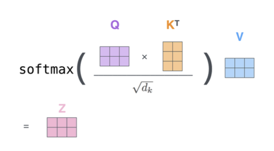
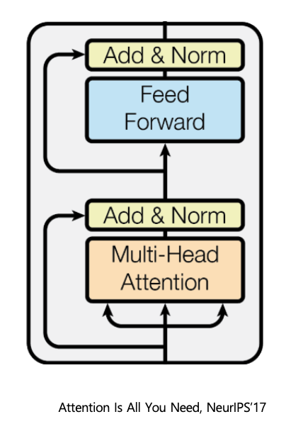
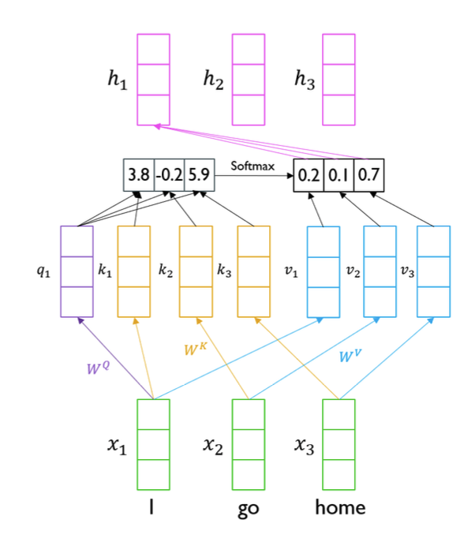
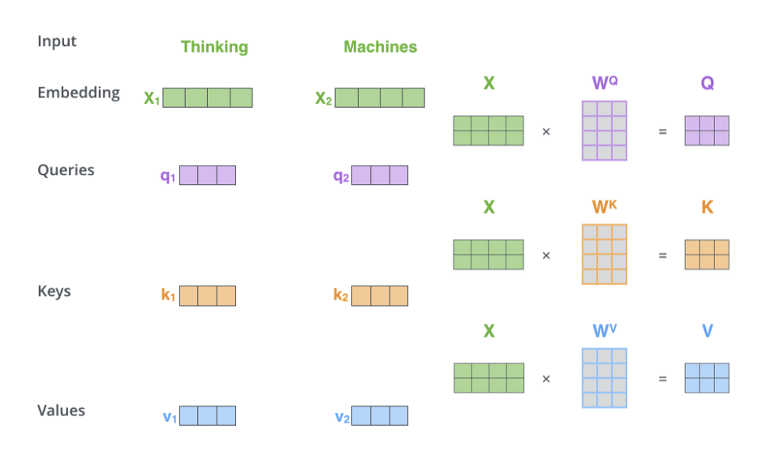

<!--
구조
*
    *
        *  
            &nbsp; - &nbsp;  
                &nbsp;&nbsp;&nbsp;&nbsp; ‣ &nbsp;  
                    &nbsp;&nbsp;&nbsp;&nbsp;&nbsp;&nbsp;&nbsp;&nbsp; * &nbsp;  
-->

# Day30 Transformer

## 목차 

1. [강의 내용 정리](#1-강의-내용-정리)

2. [과제 정리](#2-과제-정리)

3. [피어세션 정리](#3-피어세션-정리)

4. [학습 회고](#4-학습-회고)

## 1. 강의내용 정리

* transformer

    * 무엇을 해결하고자 하는가?
        * Long term dependency를 완전히 해결하고자
        * 이전 RNN에 비해서 학습이 빠르다. <- 병렬화가 가능하기 때문이다.

     

    * 이전 seq2seq with attention과의 달라진 점 
        * query, key, value를 통해서 attention을 구한다.
    
     

    * 특징
        * query, key, value vector를 구하기 위한 weight들이 존재한다.
        * 여기서는 Dot-product attention방식으로 attention을 구한다. 아래의 그림과 같다.
         
        * multi-head attention : self attention을 여러개 가지고 있는 구조
        * multi-head attention이 필요한 이유 : 동일한 sequence가 주어질때 같은 vector에 대해서 여러 측면으로 볼 수 있기 때문.
        * 기본적으로 attention을 구할때 input에 순서는 의미가 없다. 즉, a,b,c나 b,c,a나 attention은 같다. 이러한 점을 sequence data를 마치 set data로 보게 된다는 문제가 있다. 즉, 순서의 의미를 무시하기 때문에 맨 처음에 positional encoding을 해주어야 한다.
        * masked self-attention : decoder에서는 이전에 나온 단어에 대해서만 접근을 할 수 있다(예를 들어서 '나는 공부하러 독서실에 간다'에서 SOS token, '나는', '공부하러'를 통해서 '독서실에'를 예측해야 되고 이때 이후 값을 '독서실에'와 '간다'를 참조하면 안되다). 이것을 위해서 output sequence에 대한 행렬을 만들어주고 위의 부분와 같이 이후 값만 참조할 수 있도록 1, 0으로 행렬을 채워서 decoder의 최종 결과로 나온 값에 내적해준다(이때 살아남은 값은 합이 1이 되도록 값을 바꿔준다). 
     

    * 핵심 구조
        * 아래와 같이 input이 multi-head attention을 거치고 residual과 같이 multi-head전 값과 add를 해주고 layer normalization을 해준다. 그 후 feed forward후 해당 값이 feed forward 이전의 값을 resicual connect해준다. <- residual connection을 해주는 이유는 깊게 쌓아도 학습이 잘 되게끔 하기 위해서이다. 이때 residual connection시 shape를 잘 맞춰줘야한다.
        

     

    * 동작과정
         
        * self attention의 동작과정 
        &nbsp; 1. &nbsp; input vecor에 대한 query, key, value값을 만든다. 이때 $W_q$, $W_k$, $W_v$ 등의 가중치를 이용하여 만든다.  
        &nbsp; 2. &nbsp; 해당 query에 대해서 key값들을 내적해서 값을 구한다.  
        &nbsp; 3. &nbsp; 2단계에서 생성한 값에 softmax를 취해준다. 
        &nbsp; 4. &nbsp; 3단계에서 나온 값에 v값들을 내적해준다. 그러면 해당 query에 대한 attention값이 만들어진 것이다. 
        * 코드로 구현시 이러한 과정 input마다 해주는 것이 아닌 concat하여 한번에 처리해 준다.
         
         

        * transformer forward propagation 동작과정
         
        * Encoder
        &nbsp; 1. &nbsp; input sequence에 대해서 positional encoding하여 vector 생성 
        &nbsp; 2. &nbsp; 위의 핵심 구조와 같은 순서로 진행되면 이 과정을 n번 반복한다(n은 block(핵심구조)의 개수). -> input sequence와 동일한 개수의 encoding vector가 나오게 된다. 

        * Decoder
        &nbsp; 1. &nbsp; output vocabulary에 대한 positional encoding을 수행하고 multi-head atteion과 residual & layer normalization을 수행해준다. 
        &nbsp; 2. &nbsp; encoder에서 나온 vector(value, key)와 decoder의 vector(query)를 multi-head attention을 해주고 이것을 resiual connection + layer normalization -> feed forward + residual connection + layer normalization을 해준다.  
        &nbsp; 3. &nbsp;이러한 과정(1번의 multi-head attention ~ 2번까지)을 n번 해주고 나온 vector를 linear layer에 넣어줘서 output의 vocabulary size와 같은 vector로 만들어주고 이것을 softmax를 취해줘서 확률값을 구한다.  

    * 아직 이해 덜 된 부분
        * attention 구해줄 때 $\sqrt{d_k}$를 나눠주는 이유 -> 간단한 이유만 이해했음 -> 차원에 따라 한쪽에 몰리는 것을 방지해주기 위해 사용. BUT 수식을 보면서 좀 더 자세하게 이해하지 못함.
        * batch/layer/instance/group normalization
     

    * Question!
        * exp(), 기댓값이란?
        * positional embedding은 없는가? 있다면 positional encoding과 차이점은?
        &nbsp; encoding &nbsp; : 고정된 규치
        &nbsp; embedding &nbsp; : 학습할 수 있는 규칙 
        * positional encoding에서 cos, sin 등의 주기함수를 사용해서 값을 주는 이유는?
        * a,b,c 라는 input이 있고 여기서 a에 대한 query를 통해서 attetion 값을 구할때 이때는 softmax를 거치고 value를 내적한 값은 항상 a key, a value에 대한 vector값이 크지 않나 싶다. -> 항상 자기 자신에 대한 attention 값이 높지 않을까 싶은데 이것을 어떻게 해결했는가?
        * 실제 test일때는 decoder의 input을 알지 못할텐데 이때 input에 어떤식으로 들어가는지 궁금하다. <-> 만약 train일 경우에는 teacher forcing처럼 decoder의 input을 알려주면 되지만 test의 경우에는 그럴 수가 없으므로
        * transformer의 back propagation은 어떤 식으로 진행이 될까? 

 

## 2. 과제 정리

#### 필수과제 4를 했는데 난이도가 높지 않아서 푸는데 어려움은 없었다. 
#### 음... 그런데 생각을 해보니 공부를 위한 과제가 아닌 빈칸을 채우기만 너무 급급한게 아닌가 싶다;;;
#### 시간이 되면 필수과제 처음부터 다시 한 번 보면서 전체적인 이해와 과제의 의도를 잘 파악해 보자.

 

## 3. 피어세션 정리

#### 오늘은 지난주에 대한 회고 및 이번 주 피어세션은 어떻게 활용할지에 대해서 이야기를 했다.
#### 결과적으로 이번주는 지난주와 같이 강의 내용 발표 + 논문 리뷰를 하고 추가적으로 과제 코드에 대해서 리뷰해보기로 했다.

 

## 4. 학습 회고

#### 오늘 오후 1시쯤에 있었던 논문 리뷰가 있었는데 상당히 재미있었다. 물론 해당 논문에 대한 완벽한 이해는 할 수 없었지만 전반적인 느낌(무엇을 해결하고싶은 것인지, 이전과의 차이점 등)은 알 수 있어서 좋았고 추후에 이 논문도 볼 생각이다. <- 그렇기에는... 아직 LSTM 삽질 정리와 BERT 정리 + BART 논문 읽어야 되는데...
 

#### 피어세션에서 지난 주 팀원들의 회고를 했었는데 다들 '팀 구하는 일'에 대해서 스트레스를 받았던 것 같다. 저번 주에는 나만 스트레스 받는 건가 싶었지만 사실 다들 불안했었던 것 같다. 한 캠퍼님이 자신의 경험에 대해서 이야기를 해주었고 거기서 많은 것을 느낄 수 있었다. 
#### 다들 저마다의 스트레스와 불안감에 노출이 되어있지만 항상 노력하고 열심히하는 모습이 대단해 보인다. 나도 다른 캠퍼님들처럼 분발해야겟다 ㅎㅎ 
 

#### LSTM 삽질은 수요일부터 할 수 있을 것 같다. 내일은 강의 듣고 수요일 발표를 위한 정리 및 ppt를 만들 생각이기 때문이다.
#### bert 정리 또한 LSTM 삽질 정리 끝나고 할 예정이기 때문에 이것도....
#### 잠자기 전에 잠깐 bart에 대해서 블로그 및 유튜브 영상을 보고... 멘토님이 이러지 말라고 했는데... ㅠㅠ
#### 음..... 그러면.... 음.... bart 논문 abstract와 overview만 읽고 나의 생각(이 논문이 해결하고자 하는 문제, 어떤 방식으로 해결할 것 같은지, 중요한 포인트 등)을 정리해 봐야겠다.
#### 아! 그리고 내일이랑 모래 멘토님에게 질문할 내용을 정리하고 목요일쯤에 질문하도록 하자~!
 

#### 오늘도 정말정말 수고 많았고 항상 꾸준히 열심히 하도록~!!!
#### 화이팅~~~🤗
 
