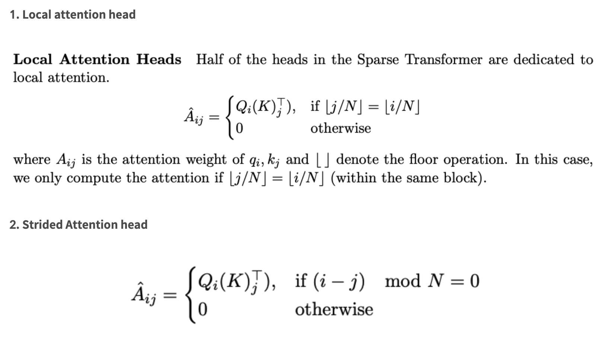

<!--
구조
*
    *
        *  
            &nbsp; - &nbsp;  
                &nbsp;&nbsp;&nbsp;&nbsp; ‣ &nbsp;  
                    &nbsp;&nbsp;&nbsp;&nbsp;&nbsp;&nbsp;&nbsp;&nbsp; * &nbsp;  
-->

# Day31 Self-supervised Pre-training Models

## 목차 

1. [강의 내용 정리](#1-강의-내용-정리)

2. [과제 정리](#2-과제-정리)

3. [피어세션 정리](#3-피어세션-정리)

4. [학습 회고](#4-학습-회고)

## 1. 강의내용 정리

### Self-supervised Pre-training Models -> GPT1, BERT

#### GPT-1

* 무엇을 해결하고자 하는가?

 

* 이전과 transformer과 다른 점은?
    * transformer에서 decoder구조만 사용.
 

* 특징
    * 다양한 토큰 사용 -> 심플한 task + 다양한 NLP에서의 많은 task를 처리할 수 있다. => 통합된 모델
    * 아래의 그림과 같이 task에 따라서 input의 구조와 들어가는 special token이 다르다. + task에 따른 마지막 layer는 다르게 사용하지만 transformer block은 그대로 사용한다.
    
    
 

* 핵심구조
     
    * input text를 positional enbedding을 더한다.
    * 이전에 배웠던 transformer의 block과 같은 multi-head attention -> residual connection -> layer normalization -> feed forward -> residual connection -> layer normalization로 구성된 block을 12번 정도 거친 후 task에 따라서 마지막 linear layer가 달라진다. 

 

* 동작과정

 

* 아직 이해가 덜 된 부분 / 좀 더 공부할 내용
    * [좀 더]self-supervised learning
 

* Question!

 
 

#### BERT

* 무엇을 해결하고자 하는가?
    * GPT-1과 ElMo에서는 단어의 관계, 문맥적인 정보를 잘 학습시키지 못하는 것 같다. -> GPT-1은 unidirection이고 ElMo는 bidirection이지만 중간에 있는 단어들을 똑같이 문맥을 잘 학습 못하기 때문 -> transformer encoder부분을 이용하자(bidirection이고 모든 word에 대해서 fully connection이기 때문)
 

* 이전과 GPT-1과 다른 점은?
    * transformer에서 encoder만 사용. -> 앞 뒤 문맥을 고려할 수 있다.
    * NSP(Next Sentence Prediction) : 문장관의 관계 등을 추론할 때 사용되는 방식이다. 이때 GPT-1에서는 마지막에 extract token을 사용하였지만 BERT는 input의 맨 처음에 CLS token을 넣어서 사용한다.
    * 학습을 위해 사용한 data corpus의 개수 : BERT > GPT-1
    * 학습시 사용한 batch size : BERT > GPT-1
    * GPT-1은 task가 다르더라도 같은 learning rate 사용하였지만 BERT는 각기 다른 learning rate을 사용한다.

 

* 특징
    * MLM(Masked Language Model) : input의 특정 부분을 mask로 치환한다. Mask의 비율은 hyperparameter이다.
    * MLM은 전체 input의 15%만 masking을 하고 이때 mask는 80%만 실제 mask로 치환, 10% random word로 치환, 10%는 이전과 같은 mask(mask를 안 해주는 것과 같음)로 치환해주는 것이 가장 성능이 좋았다고 한다.
    * input word에 WordPiece + segmentation + positional 등의 embedding을 해준다.

 

* 핵심구조
    * BERT는 transformer의 encoder부분을 그대로 사용했으며 아래와 같이 Base와 Large에 따라 구조가 다르다.
    

 

* 동작과정
    * step1 : 3가지의 embedding을 통해서 input word를 만들어준다.
    * step2 : transformer의 encoding과 동일한 구조로 된 block을 각 bert architecture에 맞게끔 수행해준다.
    * step3 : 이렇게 나온 값에 대해서 task에 따라 마지막 linear layer를 다르게 해준다.
 

* 아직 이해가 덜 된 부분 / 좀 더 공부할 내용
    * [아직]QuA를 BERT로 푸는 부분에 대해서

 

* Question!

 
 

#### GPT-2

* 무엇을 해결하고자 하는가?
    * The Natural Language Decathlon : Multitask Learning as Question Answering에 착안(자연어의 모든 task들이 질의응답 형태로 통합할 수 있다. 예를 들어서, 주어진 문장에서 감정의 판단할때 '해당 문장의 감정은 어떤한 것 같나?' 등의 질문을 통해서 질의응당 task로 만들 수 있고 또 요약의 경우는 '주어진 문단에서의 주제는 무엇인가?'등으로 만들 수 있다.)
    * down-stream tasks in a zero-shot setting <- fine tuning 하지 않음

 

* 이전과 GPT-1과 다른 점은?
    * transformer layer를 더 쌓았다.
    * 학습을 위한 데이터 40GB이고 질이 좋은 데이터 사용
 

* 특징
    * Datasets : redit + 답글 중 좋아요 3개 이상 의 글을 사용
    * preprocessing - byte pair encoding : 데이터 압축 알고리즘 중에 하나이며 빈도수에 따라 문자를 병합하여 서브워드를 구성한다. 단어를 문자 단위로 쪼갠 뒤 가장 높은 쌍을 하나로 통합하는 과정을 반복하여 token dictionary를 만든다. 
        * [byte pair encoding에 대한 자세한 내용](https://wikidocs.net/22592)
    * [접근법 - 논문에 나온 내용 번역한 글](https://greeksharifa.github.io/nlp(natural%20language%20processing)%20/%20rnns/2019/08/28/OpenAI-GPT-2-Language-Models-are-Unsupervised-Multitask-Learners/)

 

* 핵심구조
    * GPT-1과 유사하다.

 

* 동작과정
    * GPT-1과 대부분이 비슷하지만 token에 대해서 BPE을 해준다는 차이가 있다.
    * task에 대한 fine tuning을 해주지 않는다.

 

* 아직 이해가 덜 된 부분 / 좀 더 공부할 내용
    * [아직/좀 더] self-supervised learning

 

* Question!
    * task에 대한 fine tuning 없이 사용했는데 어떻게 결과가 괜찮게 나온 것일까? 

 
 

#### GPT-3

* 무엇을 해결하고자 하는가?
    * 내 뇌피셜 : 이전 GPT-2의 한계를 극복하려고 했을 것 같다.
        
        * [GPT-2 discussion에 대한 블로그](https://greeksharifa.github.io/nlp(natural%20language%20processing)%20/%20rnns/2019/08/28/OpenAI-GPT-2-Language-Models-are-Unsupervised-Multitask-Learners/)
        

 

* 이전과 GPT-2와 다른 점은?
    * 기존 모델의 파라미터 수보다 훨씬 많은 파라미터를 가지도록 설계되었다.
 

* 특징
    
    * zero-shot : 위의 그림 처럼 task를 주면 해당 target에 대해서 task를 수행한다. <- 학습 데이터 사용 하지 않는 방식
    * one-shot : task를 주고 example을 주고 해당 target에 대해서 task를 수행하도록 한다. <- 학습 데이터를 1쌍만 주었음. But 이전까지의 모델에서는 output layer를 추가하고 이것을 이용하는 방식이었지만 GPT-3는 그러한 변형없이 원본 그대로 사용한다. 마치 주어진 example이 task와 동일한 text인 것처럼
    * few-shot : one-shot과 비슷하면 다만 차이점이 있다면 그것은 example의 수가 늘어났다는 점이다.
    * 성능 : few-shot > one-shot > zero-shot
    
        * 출처 : https://velog.io/@nawnoes/GPT-3%EC%9D%98-%EB%AA%A8%EB%8D%B8
    

 

* 핵심구조
    * GPT-2와 유사
    * 약간의 수정된 점
        * initialization, pre-normalization, reversible tokenization
        * Transformer layer <- SparseTrnsformer(기존의 transformer layer 당 복잡도를 줄이기 위한 방식, O(Nlogn))와 유사한 alternationg dense와 locally banded sparse attention
         
        
        * [자료 출처](https://velog.io/@nawnoes/GPT-3%EC%9D%98-%EB%AA%A8%EB%8D%B8)
        * [두 번째 이미지 블로그](https://judy-son.tistory.com/5)
        * [두 번째 이미지 출처 논문](https://arxiv.org/pdf/2009.06732.pdf)
        * [Sparse Attention에 대한 유튜브 - 고려대학교 DSBA 연구실](https://www.youtube.com/watch?v=m8rWN2-VkcU)

 

* 동작과정
    * GPT-2와 유사할 것 같다. 다만 zero-shot말고도 one-shot, few-shot등이 있다.
 

* 아직 이해가 덜 된 부분 / 좀 더 공부할 내용
    * [아직/좀 더] 수정된 부분에 대한 자세한 내용
     

 

* Question!
    * [좀 더]one/few shot에서 example을 주지만 output layer를 추가해 주지 않는다(기존의 GPT-1에서는 task에 따른 output layer를 추가해주었다.). 그렇다면 추가해줄 때와 추가하지 않을 때는 어떤 차이들이 있나?(성능, data의 shape, 장단점은?, 이 부분이 학습에 영향을 주는가?)
 
 

#### ALBERT

* 무엇을 해결하고자 하는가?
    * pre-trained language representation model은 대규모의 학습데이터 + 시간 + 많은 GPU가 필요했다. -> 그래서 모델의 size는 줄이고 성능을 높이고자 함.

 

* 이전과 BERT과 다른 점은?
    
    * transformer block에 값을 주기 전에 먼저 word embedding에 대한 size를 줄여준다. 이때 이용하는 방식이 low rank matrix factorization vectorization이다. <- [2주차 DL때 GoogleNet에서 1*1 convolution을 사용하는 이유와 비슷한 것 같다.](https://github.com/whatchang/Naver-Boost-Camp---AI-Tech/blob/master/week2/day8/day8.md)
    * transformer layer간의 파라미터를 공유한다. -> cross-layer parameter sharing
        * [이러한 아이디어는 이전 universal transformer에서 나왔다고 합다.](https://arxiv.org/abs/1807.03819)
    * BERT에서는 NSP(Next Sentence Prediction)이라는 task를 수행하였는데 이후 논문들에서 이러한 것이 실효성이 없다고 지적(이유 : 실제 임의로 뽑은 문장들 간의 topic이 다를 확률이 높기 때문, 즉 순서를 맞추는 문제가 아닌 topic을 맞추는 것이 됨)을 하여 ALBERT에서는 연속적으로 등장하는 문장 2개를 순서대로 concat을 하거나 혹은 순서를 바꿔서 concat을 한 후 이것이 올바른 순서인지 아닌지에 대해서 판단하도록 task가 바꿔줬다. 
    * [좀 더 자세한 설명](https://y-rok.github.io/nlp/2019/10/23/albert.html)

 

* 특징
    
    * bert보다 parameter의 개수는 많이 줄였지만 성능에서는 많은 차이가 나지않고 최대한 유지되는 모습을 보였다.
    * Factorized embedding parameterization
    * Cross-layer parameter sharing
    * Sentence order prediction
    
    
    

 

* 핵심구조
    * 구조는 BERT와 동일한 것 같다. 

 

* 동작과정
    * BERT와 비슷하지만 중간중간에 Factorized embedding parameterization, Cross-layer parameter sharing, Sentence order prediction 를 적용시킨다는 점에서 다를 것 같다.

 

* 아직 이해가 덜 된 부분 / 좀 더 공부할 내용
    * [아직/좀 더] 현재 겉핥기 식으로 공부한 것 같다. -> 좀 더 자세하게 보면 좋을 것 같다.

 

* Question!
    * 파라미터를 공유했는데 성능이 많이 떨어지지 않는 이유? -> layer간의 파라미터를 공유하면 layer를 그만큼 적게 쌓는거랑 같은거 아닌가?

 
 

#### ELECTRA : Efficiently Learning an Encoder that Classifies Token Replacements Accurately

* 무엇을 해결하고자 하는가?
    * 기존의 MLM(Masked Lanuage Modeling)방식은 pre-trained을 통해서 좋은 결과를 내기까지 대량의 계산이 필요하다. -> 이러한 부분을 해결하고자.
 

* 이전과 모델들과 어떤점이 다른가?
    * 학습시 masking을 하고 생성된 문장에 대해서 어떤 단어가 origin이고 replaced된 단어인지 예측하는 task로 학습을 한다는 점. -> 주된 학습 방식이 MLM(생성)이 아닌 판별이라는 점

 

* 특징
    
    * 위에서 generator model과 discriminator 모델은 서로 적대적인 관계이다. <- GAN model의 아이디어를 착안했다.
    
    * XLNet을 제외한 이전 모델들보다 적은 step으로 좋은 성능을 낸다. -> 좋은 성능을 내기 위한 계산량을 줄일 수 있다(학습 시간을 줄일 수 있다.).
 

* 핵심구조
    * GAN과 유사한 생성 모델과 판별 모델 2개의 네트워크로 이루어져있다.

 

* 동작과정
    * 개인적인 생각 : 구조가 GAN과 비슷하므로 동작과정 또한 유사하지 않을까 싶다. 

 

* 아직 이해가 덜 된 부분 / 좀 더 공부할 내용
    * [전체적인 내용에 대한 좀 더 이해 필요 - 참고 사이트(논문 리뷰 블로그)](https://littlefoxdiary.tistory.com/41)
    * [멘토님이 추천해주신 블로그](https://blog.pingpong.us/electra-review/)

 

* Question!
    * backpropagation이 어떤 식으로 진행되는지 궁금하다. -> backpropagation에 대한 자세한 내용 찾아보기.
 
 

* Light-weight model(경량화 모델)
    * 나오게 된 배경 : 최근 모델의 트렌드는 모델의 파라미터와 학습 데이터가 너무 크기 때문에 더이상 개인 혹은 일반적인 기업에서 연구 및 사용하기 힘들다. 그래서 경량화를 시도하게 되었다.
    * 여러 경량화 기법이 존재한다.
    * DistillBERT - 학습시 teacher model의 vocabulary에 대한 확률 분포를 student 모델(경량화 모델)이 사용한다. -> teacher 모델에 대해서 최대한 모사하기 위해서
    * TinyBERT - teacher model의 확률 분포뿐만이 아니라 $W_q$, $W_k$, $W_v$, $W_0$ 등 최대한 모든 부분의 정보를 모사하려고 한다.

* Fusing Knowledge Graph into Language Model <- 외부적인 자료(배경지식, 상식)를 잘 결합하는 지에 대한 graph
    * 주어진 문장에서 추자적인 정보가 필요할때 이것을 잘 활용하는지? - BERT의 경우는 잘 활용하지 못함
        * 예를 들어서 '꽃을 심기 위해 땅을 팠다', '집을 짓기 위해서 땅을 팠다.' 가 주어졌을때 '무슨 도구로 땅을 팠는가?' 라는 질문에 대해서 잘 대답하지 못한다. But 사람의 경우 이러한 질문에 대해서 대답할 수 있다(꽃을 심기 위해서 작은 도구 호미, 삽 등을 사용했을 거라고 예측하고 집을 짓기 위해서는 포크레인과 같은 큰 도구를 사용했을거라고 생각함). 즉 배경지식, 상식 등에 대해서는 잘 활용하지 못 함.
    - ERINE, KagNet 등이 있다.
 

## 2. 과제 정리

#### 아직 선택과제에 대해서는 하지 못했다 ㅠㅠㅠㅠ

 

## 3. 피어세션 정리
# 7, 8강.  Transformer

---

발표자:  진명훈

- 발표 내용
    - 논문에 충실한 강의 내용

    - RNN의 Long-term dependency 문제 해결 위해 제안됨
    - forward, backward 연산 path가 너무 길어 장기 의존성 포착이 어렵다.
    - 또한 Recurrent 연산은 차원에 대해 Quardratic 연산이라 hidden unit 늘리기는 부담

    ## Transformer: Long-Term Dependency

    - 서로 간의 상관성을 Globaly 하게 엮어줌
    - 노드 별로 모두 연결되어있기 때문에 RNN 방식처럼 참조하는 토큰에 대해 seq length 만큼 연산을 수행할 필요 없음. 그러나 이 부분 때문에 Seqeunce 길이에 Quadratic하게 연산 및 메모리 사용
    - Convolution을 이용한 경우 receptive filed 만큼은 한 번에 볼 수 있지만 전체를 한 번에 보진 못함

    [How Transformers work in deep learning and NLP: an intuitive introduction | AI Summer](https://theaisummer.com/transformer/)

    ## Transformer: Scaled Dot-Product Attention

    - MHSA의 경우 연산 복잡도에 영향을 미치는 연산이 크게 2가지가 있음
    - BS = 1, Seq_Len = 4, Hidden_dim = 3 이라 가정
    - Query와 Key에 대한 MatMul : (4, 3) x (3, 4) → O(4^2 * 3)
    - [참고] MatMul의 시간 복잡도 : (a, b) x (b, c) → O(a * b * c)
    - Attention Score와 Value에 대한 MatMul : (4, 4) x (4, 3)  → O(

    ## Scaling

    - 3.2 Scaled Dot-Product Attention
        - Attention 종류로 Additive attention( Bahdanau Attention)와 Dot-product attention이 있다.
        - 이론적인 복잡도는 동일하지만, Dot-product attention이 빠르고 메모리 효율적
        - Additive Attention은 Query Key를 concat하므로 한 번에 올리는 양이 많아 메모리 비효율적 Matmul 코드에 최적화 되어 짤 수 있기 때문에 훨씬 빠르다
        - scaling을 안해줬을 때는 Additive가 성능이 더 높다(이에 대한 분석은 하지 않고, 주석으로 추측을 추가함)
        - HF에서도 scaling 구현 여부를 보자
            - BART

        - Multi-Head로 나눌 때 전체 dim을 나눠주는 전략을 취함 (1, 10, 512) → (1, 10, 32, 16)
        - [참고]Attention 종류
            - Additive
            - Dot-Product
            - Location-based (conv와 비슷, locally하게 봄)

    ## Positional Encoding

    - 위치 정보를 반영시키기 위해 각 위치별 Positional encoding 벡터값을 만들어두고 해당 위치의 임베딩 벡터에 더한다
    - RNN은 순차적으로 토큰을 넣어주기 때문에 순서 관계가 반영됨
    - Encoding : 고정된 규칙
    - Embedding : 학습 가능한 벡터
        - BERT에서는 이걸 사용함

    - 이후 등장하는 논문에서는 Attention map에 직접 주입해주는 논문도 있음

    ## MHA(Multi-Head Attention)

    - 여기선 source와 target 이 모두 동일
    - Q, K, V까지는 동일하나 프로젝션을 하는 순간 다른 값의 텐서가 됨 → symetric matrix가 아님

        $QW_i^Q(KW_i^K)^T$

# Masking

- Encoder에서도 Padding에 Masking을 해줌
- Pad에 -inf 후 exp 취하면 0에 가까운 값이 됨
- softmax의 연산에서 차이가 있는 부분에 대해서만 연산을 하게됨, 불필요한 패딩 연산을 줄임

## Multi-Head View

- head의 개수 만큼 다른 부분을 참조한다고 직관적으로 설명하는 글들이 많으나 실제로 그렇지 않다고 주장하는 논문들이 있다.
- 이에 대해 궁금하다면
    - Why multi-head self-attention works

        [Why multi-head self attention works: math, intuitions and 10+1 hidden insights | AI Summer](https://theaisummer.com/self-attention/)

# Multi-Head를 합친 이후의 Matrix는 Low-Rank

- 각각의 head 출력을 concat 후 linear해 출력하는 게 MHA 모듈인데,
- 중간 중간 생기는 attention map이 low-rank
- 독립인 Rank가 많을 수록 더 많은 정보를 담고 있다고 이해

- 10개의 head가 있다고 할 때, Low-rank 가 발생했다는 건, 서로를 다른 head로 표현 가능하다는 것. 즉비효율적인 학습

- linformer에서는 eigen value, vector 중에서 상위 ???
- 이 부분은 다시 살펴봄
- Linformer의 경우 이론적 복잡도 O(n * d)

# Residual Connection

# Layer Normalizatoin

# FFN

- Attetnion 결과 끝나고 넘겨주는 부분인데 중간에 4배를 키워줌

- 이유
    - Attention 만으로는 안된다. FFN, Skip-Connection이 없으면 빠르게 1-rank matrix로 수렴 모든 token 이 종속적인 값을 갖게 됨
    - FFN이 중요한 이유 (수식 정리 결과) → 4배 키워 주는 부분과 관련
    - 실험적 증명이므로 주장에 가깝지만, 4배 키워주는 것과 Skip-Connection이 없으면 성능 저하

- Layer-Normalization 에 대해선 아직 논란이 있는 듯
- Encoder는 마지막 hidden state가 Decoder의 모든 레이어에 들어감

- Decoder
- 코드

- 크로스엔트로피 ignore index 값이 기본 -100이라 계산에서 제외하여 효율적으로 연산됨

- Optiimizer Part에서

- PostLN: LN(x + F(x)
- PreLN( x + F(LN(x))
- Pre-LN으로 구조를 바꾸면 학습이 안정적으로 되었다.

- Discussion

# Further Question

---

- Attention은 이름 그대로 어떤 단어의 정보를 얼마나 가져올 지 알려주는 직관적인 방법처럼 보입니다. Attention을 모델의 Output을 설명하는 데에 활용할 수 있을까요?

# 실습 코드 리뷰

---

발표자: 김제우

- 8강 코드는 아직 준비되지 않아 내일 다시 리뷰
- 발표 내용

    ## 7강 코드리뷰, MHA

    - 100개의 단어가 있다고 가정하고 인코딩된 입력 데이터가 있다 가정함
    - 제일 긴 문장을 중심으로 패딩

    - Hyperparameter setting & embedding

    - 임베딩에 대한 개념 정리: 각 단어(토큰)에 512 차원을 부여

    - Linear Transformation & Head로 나누기

    - 512개의 차원을 8개로 쪼갬 → 각각의 head의 dim = 64, 이후 concat해 linear로 나옴

- 최종적 Attention Score 구함

- head 별 concat

- 질문 : contiguous()를 언제 쓰느냐?
    - BartAttention 객체

    - 쿼리에 _shape, 키 밸류에도 처리

    - 텐서 뷰를 먼저 해주고, 트랜스포스를 하면 (B, num_head, seq_len, ...) 순서가 되는데 메모리 순서가 뒤섞이므로 contiguos() 처리

- 텐서의 모양을 바꿔줄 때 Reshpae,  Transpose, Permute, View(모양도 바꾸면서 메모리 위치까지 바꿔주고 - contiguous를 안써도 됨)

- View와 Reshape은 Contiguous 가 True, Permute와 Transpose는 False이므로 무조건 contiguous() 붙여줄 것

    [Difference between view, reshape, transpose and permute in PyTorch](https://jdhao.github.io/2019/07/10/pytorch_view_reshape_transpose_permute/)

- Matrix 연산 시 데이터들이 연속적으로 배열되어있어야 한 번에 cache로 옮길 수 있고, vector 연산을 효율적으로 하는 모듈이 cpu에 있음, 연속적으로 배열되어 있어야 빠르게 연산 가능하다(numpy가 빠른 이유와 관련)
- transpose 후 view 하면 contiguous가 깨져있어 에러가 발생, view는 원래 메모리 위치 안에서 텐서의 시작점을 기억해 변환함, 메모리 상에선, view는 contiguous 가 보장된 것에 쓸 수 있지 그렇지 않은 것에 적용할 경우 깨짐.

 

## 4. 학습 회고

#### 오늘 오전에는 9강 강의를 듣고 내용을 정리하였다. 다 정리하지는 못했지만 금방 시간이 지나가서 점심을 먹었고 1~2시는 논문 리뷰를 듣고 2~3시30분까지는 BART 논문을 읽었다. 시간이 별로 없어서 전체를 다 읽지는 못하였고 abstract, introuction, conclusion 부분만 읽었다. 대신 저번에 멘토님께서 조언해 주신 방법대로 요약집이나 유튜브 영상을 보지 않고 논문을 읽고 이전 모델에서 어떤 부분이 달라졌고 무엇을 해결하고 싶은지, key point, 논문 진행 흐름 등을 생각해서 정리하였다. 이런 부분은 신경쓰면서 읽으니까 확실히 더 집중이 되고 재미?있었던 것 같다 ㅎㅎ
 

#### level3 팀에서는 알고리즘 문제를 풀었는데 오랜만에 풀어서 어색하고 어려운 점도 있었지만 해결했을때의 성취감이 매우 좋았다 ㅎㅎ
 

#### 원래는 오늘 강의 듣고 정리를 한 후 내일 발표할 ppt를 만들어야 하지만 오늘 무리하면 내일 오전시간이 아예 없어질 것 같아서 이만 잠 자려고 한다.
 

#### 오늘도 수고했지만 내일 강의 꼭 듣고 ppt 잘 만들도록 ~!!!