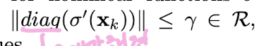
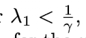

<!--
구조
*
    *
        *  
            &nbsp; - &nbsp;  
                &nbsp;&nbsp;&nbsp;&nbsp; ‣ &nbsp;  
                    &nbsp;&nbsp;&nbsp;&nbsp;&nbsp;&nbsp;&nbsp;&nbsp; * &nbsp;  
-->

# Day 

## 목차 

1. [공부한 내용 정리](#1-공부한-내용-정리)

2. [학습 회고](#2-학습-회고)

## 1. 공부한 내용 정리

[논문읽기] - Pascanu, Razvan, Tomas Mikolov, and Yoshua Bengio. "On the difficulty of training recurrent neural networks." ICML (3) 28 (2013): 1310-1318.

* Abstract
    * RNN계열에서 문제가 되는 gradient exploding/vanishing에 대해서 geometric & dynamical systems perspective를 통해서 좀 더 이해하는 것.
    * gradient exploding/vanishing을 gradient norm clipping strategy를 이용해서 다루는 법 제시
 

* Introduction
    * vanilla RNN 구조 설명 및 BPTT 

 

* 내 생각(Abstract와 Introduction만 읽고 생각해보기)
    * 무엇을 해결하고 싶은 것인가? RNN 구조에서 발생하는 gradient exploding/vanishing문제를 이해하고 해결하고 싶어하는 것 같다.
    * 핵심 키워드 - gradient exploding/vanishing, norm clipping
    * 논문 진행 방향(흐름) - 여러 관점에서 gradient exploding/vanishing을 분석하고 이를 해결하기 위한 전략을 소개하는 방식일 것 같다.
    * 내가 이 논문을 읽고 얻어가려는 것 - 여기서 소개한 방식을 토대로 exploding과 vanishing을 이해해보고 LSTM이 gradient exploding/vanishing을 어떻게 해결하려고 했는지를 생각해보면서 LSTM의 한계를 파악해 볼 생각이다.

 

* Exploding and vanishing gradients
    * Bengio et al. (1994)에서 설명된 gradient exploding과 vanishing에 대해서 이야기 해줌
    * RNN에서 hidden state에 대한 가중치가 1보다 크면 exploding 작으면 vanishing이 현상이 나타난다.
     
    * 위의 식에서 아래를 만족할때 𝜆1의 값이 커질수록(최댓값이 될 때) gradient vanishing이 발생한다. 
     
    * 위의 증명에 대한 수식은 논문 6,7번을 보면 된다.
    * gradient vanishing은 반대로 𝜆1이 1/𝛾보다 크다면 exploding된다.
 

* Dealing with the exploding and vanishing gradient 
    * dynamical systems 이론에 대해서 자세한 내용과 공식을 알기 위해서  
     'Nonlinear Dynamics And Chaos: With Applications To Physics, Biology, Chemistry, And Engineering (Studies in Nonlinearity). Studies in nonlinearity. Perseus Books Group, 1 edition.'를 읽어보는 것을 추천함  
    * teacher forcing이 gradient exploding을 줄이는 기회를 제공하였다.   
    -> teacher forcing이 어떻게 gradient exploding을 줄였는지에 대한 내용은 'Doya, K. (1993). Bifurcations of recurrent neural net- works in gradient descent learning. IEEE Transac- tions on Neural Networks, 1, 75–80.과 'Doya, K. and Yoshizawa, S. (1991). Adaptive synchro- nization of neural and physical oscillators. In J. E. Moody, S. J. Hanson, and R. Lippmann, editors, NIPS, pages 109–116. Morgan Kaufmann' 을 참고하면 될 것 같다.    
    * LSTM에서는 특별한 구조(cell state unit)를 통해서 gradient vanishing에 대해서 다루었다고 한다. 하지만 여기서는 gradient exploding의 해결법에 대해서는 설명이 없다고 한다.  
    * structural damping이 exploding문제에 도움을 준다고 한다. structural damping에 대한 자세한 내용은  
    'Martens, J. and Sutskever, I. (2011). Learning recur- rent neural networks with Hessian-free optimization. In Proc. ICML’2011. ACM'을 참고하면 될 것 같다.  
    * Echo state network는 hiddent state와 해당 time stemp의 input의 가중치를 사용하지 않으므로써 gradient exploding/vanishing 문제를 회피하였다고 한다.   해당 내용에 대해서는 'aeger, H. and Haas, H. (2004). Harnessing nonlinear- ity: predicting chaotic systems and saving energy in wireless telecommunication. Science, 304(5667), 78–80' 살펴보면 된다.  
    * 위의 모델의 확장된 버전이 leaky integration unit이다.   좀 더 자세한 내용은 'Jaeger, H., Lukosevicius, M., Popovici, D., and Siew- ert, U. (2007). Optimization and applications of echo state networks with leaky- integrator neurons. Neural Networks, 20(3), 335–352.'을 읽어보자.  
    * clipping the gradient's temporal components를 이용하여 gradient exploding/vanishing을 해결하려는 접근 방식도 있다.   'Mikolov, T., Deoras, A., Kombrink, S., Burget, L., and Cernocky, J. (2011). Empirical evaluation and combination of advanced language modeling tech- niques. In Proc. 12th annual conference of the in- ternational speech communication association (IN- TERSPEECH 2011)'과 'Mikolov, T. (2012). Statistical Language Models based on Neural Networks. Ph.D. thesis, Brno University of Technology'을 참고해보면 좋을 것 같다.  
    * Scaling down the gradients -> gradient exploding을 해결하는데 도움
     
    * Regularization - Backpropagation때 사용되는 파라미터 값에 대한 정규화 -> gradient vanishing을 해결하는데 도움을 준다.    => 해결할 수 있는 요인에 대한 설명은 수식과 영어를 잘 이해하지 못해서 설명 불가능 ㅠㅠ(해당 논문 7page 3.3 vanishing gradient regularization을 읽어보면 된다.)

 

* Experiments and results
    * Temporal order problem 
        * 아래는 MSGD, MSGD-C, MSGD-CR에 대한 sequence길이에 따른 temporal order problem을 해결 비율이다.
        
        * 위의 그림에서 MSGD-C는 batch stochastic gradient descent에서 clipping strategy를 사용한 것이며 여기에 R이 추가된 MSGD-CR은 MSGD-C에서 regularization term이 추가된 것이다.
        * CR방식을 사용한다면 sigmoid, tanh, smart-tanh등의 활성화 함수에서 rate of success가 좋게 나오는 것을 알 수 있다. 
        * ! __여기서 큰 문제__ rate of success가 무엇인지 제대로 이해하지 못함 ㅠㅠ
     

    * Other pathological tasks
        * SGD-CR은 addition problem, multiplication problem, 3-bit temporal order problem, random permutation problem 등을 해결하였다.
 

* Summary and conclusions
    * gradient exploding - clipping
    * gradient vanishing - regularization <- backpropagation때 gradient가 사라지지 않도록 정규화를 해준다. jacobian matrices이 norm을 관련된 방향으로 보존하도록 해준다. <- 이 부분에 대해서 해석을 잘 못하겠다 ㅠㅠ, 원본은 아래 문장이다.
        * 

 

* 논문을 읽으면서 모르는 혹은 좀 더 알아야 할 것 같은 개념
    * [모르는] jacobian matrices
    * [모르는] basin of attraction

 

## 2. 학습 회고

* 논문에 대한 블로그 요약이나 유튜브 영상을 보지 않고 논문 원본만 읽고 정리한 것은 이번이 처음이라서 어렵고 이해가 안 되는 부분이 많았다. 투자한 시간에 비해서 이해한 것은 많지 않았지만 좋은 경험이 된 것 같다. 앞으로는 이런식으로 논문 읽는 것에 도전해 볼 생각이다 ㅎㅎ

 
